# 00-so-do-luong-tong — master flow map (TestLib, web)
> Bản đồ tổng của 19 màn + mục lục 7 flow. Nguồn sự thật của điều hướng là bảng cạnh §2.2 của từng màn (`NAV-…`) và graph sinh ở `docs/base-ui/SYS-NAV.md` §7; sơ đồ dưới đây chỉ minh hoạ và cite lại các cạnh đó.
**Changelog** (mới nhất trước)
- 2026-09-27 · v1 · claude (subagent) · khởi tạo từ blueprint.

## 1. Sơ đồ tổng

Quy ước: node = `SCR-ID · tên` (tên theo `00-overview §3`). Hình lục giác hồng = bề mặt paywall / checkout (SCR-PUB-04 · SCR-PAY-01 · SCR-PAY-02 là ranh giới). Xanh = sau checkout (SCR-APP-03 · SCR-PAY-03 · SCR-PAY-04). Node viền đứt = trang bên ngoài (provider, Google, nguồn hỗ trợ, file PDF); checkout của provider là bước **chỉ human làm** (nhập thẻ, trả tiền). Cạnh liền = luôn đi được; cạnh đứt = có điều kiện (quyền, trạng thái thanh toán, bài `sensitive`, có bài dở) hoặc bước human. Nhãn cạnh = nhãn verbatim + kiểu. Cạnh `inline` / `overlay` không vẽ (không đổi trang). Hai cạnh cùng nguồn, cùng đích, cùng kiểu được gộp một mũi tên.

```mermaid
flowchart TD
    subgraph PUB ["Public"]
        SCR_PUB_01["SCR-PUB-01 · Trang chủ"]
        SCR_PUB_02["SCR-PUB-02 · Thư viện bài test"]
        SCR_PUB_03["SCR-PUB-03 · Trang bài test"]
        SCR_PUB_05["SCR-PUB-05 · Văn bản pháp lý"]
        SCR_PUB_06["SCR-PUB-06 · Trợ giúp"]
        SCR_PUB_07["SCR-PUB-07 · Cài đặt cookie"]
    end
    subgraph FUN ["Funnel"]
        SCR_TEST_01["SCR-TEST-01 · Làm bài"]
        SCR_TEST_02["SCR-TEST-02 · Kết quả"]
    end
    subgraph MON ["Money"]
        SCR_PUB_04{{"SCR-PUB-04 · Bảng giá"}}
        SCR_PAY_01{{"SCR-PAY-01 · Mở khoá report"}}
        SCR_PAY_02{{"SCR-PAY-02 · Xác nhận thanh toán"}}
        SCR_PAY_03["SCR-PAY-03 · Gói & thanh toán"]
        SCR_PAY_04["SCR-PAY-04 · Huỷ gia hạn"]
    end
    subgraph APPACC ["App / Account"]
        SCR_AUTH_01["SCR-AUTH-01 · Đăng nhập"]
        SCR_APP_01["SCR-APP-01 · Trang chủ member"]
        SCR_APP_02["SCR-APP-02 · Report của tôi"]
        SCR_APP_03["SCR-APP-03 · Report chi tiết"]
        SCR_ACC_01["SCR-ACC-01 · Tài khoản & quyền riêng tư"]
        SCR_ACC_02["SCR-ACC-02 · Xoá tài khoản"]
    end
    EXT_CHECKOUT{{"external · Checkout của provider — human trả tiền"}}
    EXT_PORTAL(["external · Cổng khách hàng của provider"])
    EXT_GOOGLE(["external · Đăng nhập Google"])
    EXT_SUPPORT(["external · Nguồn hỗ trợ khủng hoảng"])
    EXT_PDF(["external · Tải file PDF"])

    SCR_PUB_01 -->|"“Start test” · push"| SCR_PUB_03
    SCR_PUB_01 -->|"“Take a free test” · push"| SCR_PUB_02
    SCR_PUB_01 -->|"“See pricing” · push"| SCR_PUB_04
    SCR_PUB_01 -->|"“How we score” · push"| SCR_PUB_06
    SCR_PUB_02 -->|"“Start test” · push"| SCR_PUB_03
    SCR_PUB_03 -->|"“Start test” · push"| SCR_TEST_01
    SCR_PUB_03 -.->|"có bài dở: “Continue where you left off” · push"| SCR_TEST_01
    SCR_PUB_03 -.->|"có kết quả: “See your latest result” · push"| SCR_TEST_02
    SCR_PUB_03 -->|"“See pricing” · push"| SCR_PUB_04
    SCR_PUB_03 -.->|"sensitive: “Get support now” · external"| EXT_SUPPORT
    SCR_PUB_04 -->|"“Take a free test” / “Take a test to unlock” · push"| SCR_PUB_02
    SCR_PUB_04 -.->|"đã tick consent: “Continue to secure checkout” · external"| EXT_CHECKOUT
    SCR_PUB_04 -.->|"đã có Plus: “Manage plan” · push"| SCR_PAY_03
    SCR_PUB_04 -->|"“Subscription & refund terms” · push"| SCR_PUB_05
    SCR_PUB_05 -->|"doc cookies: “Cookie settings” · push"| SCR_PUB_07
    SCR_PUB_06 -->|"“Manage or cancel your plan” · push"| SCR_PAY_03
    SCR_PUB_06 -->|"“Refund policy” · push"| SCR_PUB_05
    SCR_PUB_07 -->|"“Cookie policy” · push"| SCR_PUB_05
    SCR_TEST_01 -->|"hệ thống: nộp bài OK · replace"| SCR_TEST_02
    SCR_TEST_01 -->|"“Exit” · push"| SCR_PUB_03
    SCR_TEST_01 -.->|"sensitive: “Not now” · push"| SCR_PUB_03
    SCR_TEST_01 -.->|"sensitive: “Privacy policy” · push"| SCR_PUB_05
    SCR_TEST_01 -.->|"sensitive: “Get support now” · external"| EXT_SUPPORT
    SCR_TEST_02 -.->|"chưa có quyền: “Unlock full report” · push"| SCR_PAY_01
    SCR_TEST_02 -.->|"đã có quyền: “Read full report” · push"| SCR_APP_03
    SCR_TEST_02 -->|"“Retake test” · push"| SCR_TEST_01
    SCR_TEST_02 -->|"“Take another test” · push"| SCR_PUB_02
    SCR_TEST_02 -->|"“How scoring works” · push"| SCR_PUB_06
    SCR_TEST_02 -.->|"sensitive: “Get support now” · external"| EXT_SUPPORT
    SCR_PAY_01 -.->|"“Continue to secure checkout” · external"| EXT_CHECKOUT
    SCR_PAY_01 -->|"“Back to your result” · push"| SCR_TEST_02
    SCR_PAY_01 -->|"“Subscription & refund terms” · push"| SCR_PUB_05
    SCR_PAY_01 -.->|"hệ thống: đã có quyền · replace"| SCR_APP_03
    EXT_CHECKOUT -.->|"return URL · deep link, không phải NAV"| SCR_PAY_02
    SCR_PAY_02 -.->|"paid, mua lẻ: “Read your report” · replace"| SCR_APP_03
    SCR_PAY_02 -.->|"paid, Plus: “Go to your dashboard” · replace"| SCR_APP_01
    SCR_PAY_02 -.->|"failed hoặc canceled: “Try again” · push"| SCR_PAY_01
    SCR_PAY_02 -.->|"failed hoặc canceled: “Back to pricing” · push"| SCR_PUB_04
    SCR_PAY_03 -.->|"Plus active: “Cancel renewal” · push"| SCR_PAY_04
    SCR_PAY_03 -.->|"Free: “Upgrade to Plus” · push"| SCR_PUB_04
    SCR_PAY_03 -.->|"“Update payment method” / “View invoices” · external"| EXT_PORTAL
    SCR_PAY_03 -->|"“Read” · push"| SCR_APP_03
    SCR_PAY_04 -->|"hệ thống: huỷ OK · replace"| SCR_PAY_03
    SCR_PAY_04 -->|"“Keep my plan” · push"| SCR_PAY_03
    SCR_AUTH_01 -.->|"“Continue with Google” · external"| EXT_GOOGLE
    SCR_AUTH_01 -.->|"hệ thống: callback OK, không có next · replace"| SCR_APP_01
    SCR_AUTH_01 -->|"“Terms” · push"| SCR_PUB_05
    SCR_APP_01 -->|"“Start test” · push"| SCR_PUB_03
    SCR_APP_01 -.->|"có quyền: “Read report” · push"| SCR_APP_03
    SCR_APP_01 -.->|"chưa có quyền: “Unlock report” · push"| SCR_PAY_01
    SCR_APP_01 -.->|"Free: “Unlock with Plus” · push"| SCR_PUB_04
    SCR_APP_02 -.->|"có quyền: “Read” · push"| SCR_APP_03
    SCR_APP_02 -->|"“View summary” · push"| SCR_TEST_02
    SCR_APP_02 -.->|"danh sách rỗng: “Take your first test” · push"| SCR_PUB_02
    SCR_APP_03 -.->|"có quyền: “Download PDF” · external"| EXT_PDF
    SCR_APP_03 -.->|"Locked: “Unlock full report” · push"| SCR_PAY_01
    SCR_APP_03 -->|"“Back to My reports” · push"| SCR_APP_02
    SCR_APP_03 -.->|"sensitive: “Get support now” · external"| EXT_SUPPORT
    SCR_ACC_01 -->|"“Delete account” · push"| SCR_ACC_02
    SCR_ACC_01 -->|"“Plan & billing” · push"| SCR_PAY_03
    SCR_ACC_01 -->|"“Cookie settings” · push"| SCR_PUB_07
    SCR_ACC_01 -->|"“Sign out” · replace"| SCR_PUB_01
    SCR_ACC_02 -->|"hệ thống: xoá OK · replace"| SCR_PUB_01
    SCR_ACC_02 -->|"“Cancel” / “Download my data first” · push"| SCR_ACC_01

    classDef pay fill:#ffe6e6,stroke:#cc0000,stroke-width:2px,color:#000;
    classDef paid fill:#e6f7e6,stroke:#2e7d32,stroke-width:2px,color:#000;
    classDef park fill:#fff3cd,stroke:#b8860b,stroke-width:1px,color:#000;
    classDef ext fill:#ffffff,stroke:#666666,stroke-width:1px,stroke-dasharray:5 5,color:#000;
    classDef payext fill:#ffe6e6,stroke:#cc0000,stroke-width:2px,stroke-dasharray:5 5,color:#000;
    class SCR_PUB_04,SCR_PAY_01,SCR_PAY_02 pay;
    class SCR_APP_03,SCR_PAY_03,SCR_PAY_04 paid;
    class EXT_CHECKOUT payext;
    class EXT_PORTAL,EXT_GOOGLE,EXT_SUPPORT,EXT_PDF ext;
```

Nhóm màn theo subgraph và cạnh đã vẽ:

| Subgraph | Màn | Cạnh ra đã vẽ (NAV) |
|---|---|---|
| Public | SCR-PUB-01 · SCR-PUB-02 · SCR-PUB-03 · SCR-PUB-05 · SCR-PUB-06 · SCR-PUB-07 | NAV-PUB-01-1 · NAV-PUB-01-2 · NAV-PUB-01-3 · NAV-PUB-01-4 · NAV-PUB-02-1 · NAV-PUB-03-1 · NAV-PUB-03-2 · NAV-PUB-03-3 · NAV-PUB-03-4 · NAV-PUB-03-5 · NAV-PUB-05-1 · NAV-PUB-06-1 · NAV-PUB-06-2 · NAV-PUB-07-1 |
| Funnel | SCR-TEST-01 · SCR-TEST-02 | NAV-TEST-01-1 · NAV-TEST-01-2 · NAV-TEST-01-5 · NAV-TEST-01-6 · NAV-TEST-01-7 · NAV-TEST-02-1 · NAV-TEST-02-2 · NAV-TEST-02-3 · NAV-TEST-02-4 · NAV-TEST-02-6 · NAV-TEST-02-7 |
| Money | SCR-PUB-04 · SCR-PAY-01 · SCR-PAY-02 · SCR-PAY-03 · SCR-PAY-04 | NAV-PUB-04-1 · NAV-PUB-04-2 · NAV-PUB-04-3 · NAV-PUB-04-4 · NAV-PUB-04-5 · NAV-PAY-01-1 · NAV-PAY-01-2 · NAV-PAY-01-3 · NAV-PAY-01-4 · NAV-PAY-01-5 · NAV-PAY-02-1 · NAV-PAY-02-2 · NAV-PAY-02-3 · NAV-PAY-02-4 · NAV-PAY-03-1 · NAV-PAY-03-3 · NAV-PAY-03-4 · NAV-PAY-03-5 · NAV-PAY-04-1 · NAV-PAY-04-2 |
| App / Account | SCR-AUTH-01 · SCR-APP-01 · SCR-APP-02 · SCR-APP-03 · SCR-ACC-01 · SCR-ACC-02 | NAV-AUTH-01-2 · NAV-AUTH-01-3 · NAV-AUTH-01-4 · NAV-APP-01-1 · NAV-APP-01-2 · NAV-APP-01-3 · NAV-APP-01-4 · NAV-APP-02-1 · NAV-APP-02-2 · NAV-APP-02-3 · NAV-APP-03-1 · NAV-APP-03-2 · NAV-APP-03-3 · NAV-APP-03-5 · NAV-ACC-01-1 · NAV-ACC-01-2 · NAV-ACC-01-3 · NAV-ACC-01-4 · NAV-ACC-02-1 · NAV-ACC-02-2 · NAV-ACC-02-3 |

## 2. Flow index

| FLOW-ID | Tên | Role | Screens spanned | File |
|---|---|---|---|---|
| FLOW-lam-bai-mien-phi | Làm bài miễn phí → kết quả tóm tắt chấm thật (có nhánh consent bài `sensitive`) | activation | SCR-PUB-01 · SCR-PUB-02 · SCR-PUB-03 · SCR-TEST-01 · SCR-TEST-02 (nhánh phụ SCR-PUB-05 · SCR-PUB-06; lối ra SCR-PAY-01) | [FLOW-lam-bai-mien-phi.md](FLOW-lam-bai-mien-phi.md) |
| FLOW-luu-ket-qua-dang-nhap | Lưu kết quả bằng email → magic link → đăng nhập, quay lại đúng trang | activation | SCR-TEST-02 · SCR-AUTH-01 · SCR-APP-01 · SCR-APP-02 (nhánh phụ SCR-APP-03 · SCR-PUB-05) | [FLOW-luu-ket-qua-dang-nhap.md](FLOW-luu-ket-qua-dang-nhap.md) |
| FLOW-mo-khoa-report | Mở khoá report đầy đủ của một kết quả (mua lẻ hoặc Plus) | money | SCR-TEST-02 · SCR-PAY-01 · checkout provider · SCR-PAY-02 · SCR-APP-03 · SCR-APP-01 (nhánh phụ SCR-PUB-05) | [FLOW-mo-khoa-report.md](FLOW-mo-khoa-report.md) |
| FLOW-dang-ky-plus | Đăng ký Plus từ bảng giá | money | SCR-PUB-01 · SCR-PUB-03 · SCR-APP-01 · SCR-PAY-03 · SCR-PUB-04 · checkout provider · SCR-PAY-02 (nhánh phụ SCR-PAY-01 · SCR-PUB-02 · SCR-PUB-05) | [FLOW-dang-ky-plus.md](FLOW-dang-ky-plus.md) |
| FLOW-quan-ly-huy-gia-han | Nhắc gia hạn → huỷ một bước · tiếp tục gia hạn · cập nhật thẻ | money · retention | SCR-PAY-03 · SCR-PAY-04 · SCR-AUTH-01 · SCR-PUB-06 · SCR-ACC-01 · SCR-PUB-04 (nhánh phụ SCR-APP-03 · SCR-PUB-05) | [FLOW-quan-ly-huy-gia-han.md](FLOW-quan-ly-huy-gia-han.md) |
| FLOW-thoi-quen-hang-ngay | Check-in hằng ngày + streak · thử thách 30 ngày (Free thấy thẻ khoá) | retention | SCR-APP-01 · SCR-PUB-04 · SCR-PAY-02 (nhánh phụ SCR-PUB-03 · SCR-APP-03 · SCR-PAY-01 · SCR-ACC-01) | [FLOW-thoi-quen-hang-ngay.md](FLOW-thoi-quen-hang-ngay.md) |
| FLOW-quyen-rieng-tu | Consent cookie · export dữ liệu · xoá tài khoản (khôi phục trong 30 ngày) | trust | SCR-PUB-07 · SCR-PUB-05 · SCR-ACC-01 · SCR-ACC-02 · SCR-PUB-01 (nhánh phụ SCR-AUTH-01 · SCR-APP-01) | [FLOW-quyen-rieng-tu.md](FLOW-quyen-rieng-tu.md) |

## 3. AI Notices
- Sơ đồ §1 vẽ tay từ các hàng NAV của blueprint (kiểu push / replace / external; không có cạnh `tab` nào mang NAV-ID — mục header/drawer/footer là khung SYS-NAV §1, không vẽ). Khi `navmap.py . write` sinh SYS-NAV §7, phải so lại: lệch thì bảng §2.2 của màn là đúng, sửa sơ đồ này.
- Cạnh `EXT_CHECKOUT → SCR-PAY-02` KHÔNG phải NAV: đó là return URL của provider (deep link, SYS-NAV §4). Vẽ để ranh giới tiền không bị đứt; SCR-PAY-02 không có NAV nào tới.
- Không vẽ 13 cạnh `inline` / `overlay`: NAV-PUB-02-2 · NAV-PUB-06-3 · NAV-PUB-07-2 · NAV-TEST-01-3 · NAV-TEST-01-4 · NAV-TEST-02-5 · NAV-PAY-03-2 · NAV-AUTH-01-1 · NAV-APP-01-5 · NAV-APP-01-6 · NAV-APP-03-4 · NAV-ACC-01-5 · NAV-ACC-01-6. Các FLOW vẽ chúng dạng vòng tự thân khi cần.
- Gộp mũi tên: NAV-PUB-04-1 + NAV-PUB-04-5 · NAV-PAY-01-1 + NAV-PAY-01-2 · NAV-ACC-02-2 + NAV-ACC-02-3 (cùng nguồn, cùng đích, cùng kiểu).
- SCR-AUTH-01 đặt trong nhóm App / Account vì là cổng vào khu tài khoản, dù route `/login` là public. Màn này không có NAV nào tới: vào qua shell "Sign in", guard `/login?next=` và email magic link (API-MAIL-01). Chỉ vẽ cạnh ra mặc định (không có `next`); các cạnh có `next` nằm ở từng FLOW.
- Cả 19 SCR đều thuộc ít nhất một FLOW ở §2. Role `trust` của FLOW-quyen-rieng-tu nằm ngoài bộ role của template (acquisition / activation / money / retention), dùng theo yêu cầu blueprint.
