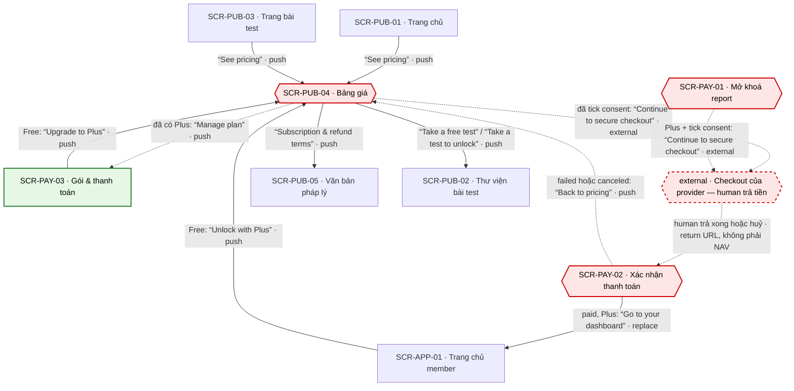

# [FLOW-dang-ky-plus] — Đăng ký Plus từ bảng giá
> Flow tiền thứ hai: user (khách hoặc tài khoản Free) đăng ký Plus (tháng hoặc năm, tự gia hạn) với giá gia hạn, chu kỳ và cách huỷ hiện rõ, consent bằng checkbox không tick sẵn, trả tiền ở checkout của provider và vào dashboard với thử thách 30 ngày đã mở. Màn chính: [SCR-PUB-04](../screens/SCR-PUB-04-bang-gia.md) · [SCR-PAY-02](../screens/SCR-PAY-02-xac-nhan-thanh-toan.md) · [SCR-APP-01](../screens/SCR-APP-01-trang-chu-member.md). Mục lục: [00-so-do-luong-tong](00-so-do-luong-tong.md).
**Changelog** (mới nhất trước)
- 2026-09-27 · v1 · claude (subagent) · khởi tạo từ blueprint.

## 0. Meta

| code | role | screens spanned (SCR-IDs + route) | status | measured-by (funnel §5) | basis (RS path) |
|---|---|---|---|---|---|
| FLOW-dang-ky-plus | money | SCR-PUB-01 `/` · SCR-PUB-03 `/tests/:slug` · SCR-APP-01 `/app` · SCR-PAY-03 `/account/billing` · SCR-PUB-04 `/pricing` · checkout của provider (external) · SCR-PAY-02 `/checkout/return?session=<id>` (nhánh phụ SCR-PAY-01 `/unlock/:resultId` · SCR-PUB-05 `/legal/subscriptions` · SCR-PUB-02 `/tests`) | Draft | ft_unlock · start (`surface` = pricing / app_home) → ft_unlock · checkout_open → ft_unlock · purchase (§5) | `research/apps/testlibrary-web/teardown.md` §4.5 · F-05 · F-08 · F-17 · F-18 · F-29 · `research/research-synthesis.md` §K (K2) · P-02 · CS-09 · CS-10 · CS-21 · Q-02 · Q-03 |

## 1. Flow diagram

SCR-PUB-04 là paywall **soft**: luôn có lối ra free liền nét ("Take a free test" / "Take a test to unlock" → SCR-PUB-02). Checkout của provider là bước chỉ human làm (viền đứt). SCR-PAY-01 là bề mặt Plus thứ hai (chi tiết ở FLOW-mo-khoa-report KB-2). Cạnh `return URL` là deep link (SYS-NAV §4), không phải NAV.

| SCR-ID | Route | NAV-ID đi qua | Vai trò trong flow |
|---|---|---|---|
| SCR-PUB-01 | `/` | NAV-PUB-01-3 | điểm vào của khách (khối giá tóm tắt) |
| SCR-PUB-03 | `/tests/:slug` | NAV-PUB-03-4 | điểm vào từ trang bài |
| SCR-APP-01 | `/app` | NAV-APP-01-4 · NAV-PAY-02-2 (vào) | điểm vào: Free thấy thẻ thử thách khoá; đích sau khi mua |
| SCR-PAY-03 | `/account/billing` | NAV-PAY-03-3 · NAV-PUB-04-3 (vào) | điểm vào của Free (hoặc hết kỳ sau huỷ); nơi quản lý khi đã có Plus |
| SCR-PUB-04 | `/pricing` | NAV-PUB-01-3 · NAV-PUB-03-4 · NAV-APP-01-4 · NAV-PAY-03-3 · NAV-PAY-02-4 (vào) · NAV-PUB-04-1 · NAV-PUB-04-2 · NAV-PUB-04-3 · NAV-PUB-04-4 · NAV-PUB-04-5 | paywall chính của Plus: toggle "Monthly" / "Annual", GC-RenewalDisclosure, checkbox consent |
| SCR-PAY-01 | `/unlock/:resultId` | NAV-PAY-01-2 | bề mặt Plus thứ hai (từ một kết quả) |
| — (external · checkout provider) | domain của provider (Q-04) | NAV-PUB-04-2 · NAV-PAY-01-2 | human nhập email + thẻ, 3-D Secure nếu có |
| SCR-PAY-02 | `/checkout/return?session=<id>` | NAV-PAY-02-2 · NAV-PAY-02-4 | chờ webhook, báo kết quả, công bố ngày gia hạn |
| SCR-PUB-05 | `/legal/subscriptions` | NAV-PUB-04-4 | điều khoản gia hạn + hoàn tiền |
| SCR-PUB-02 | `/tests` | NAV-PUB-04-1 · NAV-PUB-04-5 | lối ra free của paywall soft |

## 2. User scenarios

**KB-1 · Happy — tài khoản Free mở thử thách bằng Plus (K2).**
1. SCR-APP-01 → thẻ thử thách 30 ngày khoá, có mô tả thật, không popup (BR-DASH-03) → "Unlock with Plus" → SCR-PUB-04 · NAV-APP-01-4.
2. SCR-PUB-04 → ba thẻ GC-PlanCard theo thứ tự "Free" → "One report" → "Plus"; toggle mặc định "Monthly" (BR-PUB-09) → chọn "Annual"; giá và chu kỳ từ API-PAY-01, giá = placeholder — Q-03 (BR-PUB-07); GC-RenewalDisclosure dưới thẻ Plus; không đồng hồ, không giá gạch (BR-PUB-08).
3. Tick "I understand Plus renews automatically at [price] per [period] until I cancel. I can cancel anytime in Account → Plan & billing." (mặc định không tick) → "Continue to secure checkout" bật (BR-PUB-10) → API-PAY-02 kèm `consent_version` → trang provider · NAV-PUB-04-2 (external, cùng tab).
4. Provider (human): trả tiền → return → SCR-PAY-02 "Confirming your payment…" → webhook API-HOOK-01 đã verify → quyền `plus` (BR-APP-01) → "You're all set" + ngày gia hạn kế tiếp + giá gia hạn + cách huỷ (BR-PAY-09).
5. SCR-PAY-02 → "Go to your dashboard" → SCR-APP-01 · NAV-PAY-02-2 (replace, BR-PAY-10) → thẻ thử thách thành "Day 1 · [action title]" + "Mark as done" (tiếp ở FLOW-thoi-quen-hang-ngay).

**KB-2 · Khách từ landing.**
1. SCR-PUB-01 → khối giá tóm tắt "See pricing" → SCR-PUB-04 · NAV-PUB-01-3.
2. Như KB-1 bước 2–4 (NAV-PUB-04-2); provider thu email, webhook tạo tài khoản với email đó (SYS-AUTH).
3. SCR-PAY-02 → "Go to your dashboard" · NAV-PAY-02-2 → `/app` cần phiên → guard `/login?next=/app` → magic link tới email checkout → SCR-APP-01 (NAV-AUTH-01-3). Xem gap ở AI Notices.

**KB-3 · Đã có Plus mà mở trang giá.**
1. SCR-PUB-04 (đã đăng nhập, có `plus`) → nút CMP-07 thành "Manage plan" → SCR-PAY-03 · NAV-PUB-04-3. Không có đường mua Plus lần hai.

**KB-4 · Thanh toán thất bại.**
1. Provider từ chối → return → SCR-PAY-02 "Your payment didn't go through. You haven't been charged." → "Back to pricing" → SCR-PUB-04 · NAV-PAY-02-4; checkbox consent về trạng thái không tick.

**KB-5 · Tài khoản Free từ trang gói.**
1. SCR-PAY-03 state Empty "You're on Free. Test summaries are always free." → "Upgrade to Plus" → SCR-PUB-04 · NAV-PAY-03-3 → KB-1 bước 2–5.

**KB-6 · Chưa muốn trả / vùng chưa hỗ trợ.**
1. SCR-PUB-04 → "Take a free test" (thẻ Free) → SCR-PUB-02 · NAV-PUB-04-1; hoặc "Take a test to unlock" (thẻ One report — report lẻ luôn gắn với một kết quả, Q-02) → SCR-PUB-02 · NAV-PUB-04-5 → FLOW-lam-bai-mien-phi.
2. Quốc gia provider không hỗ trợ → SCR-PUB-04 state Locked "Purchases aren't available in your country yet." (thẻ vẫn hiện giá, nút disable) → vẫn đi được bước 1.

## 3. Cover-case grid (web)

| Case | Handling / N/A vì |
|---|---|
| Happy path | KB-1: NAV-APP-01-4 → NAV-PUB-04-2 → (provider, human) → return → NAV-PAY-02-2. Giá gia hạn, chu kỳ, "tự gia hạn", cách huỷ hiện ở pricing, xác nhận và email (BR-APP-02); consent tường minh (BR-APP-03). Khác đối thủ: chu kỳ tháng hoặc năm thay vì 4 tuần (F-05), consent ở mọi checkout thay vì chỉ một biến thể (F-08 · F-18) |
| Hết quota / hết credits / free limit | Free: thử thách khoá (BR-DASH-03; quyền `challenge` = `plus`, SYS-ENTITLEMENT), report khoá theo từng kết quả. Plus mở mọi report + thử thách (00-overview §2). Đã có Plus → "Manage plan" (NAV-PUB-04-3), không mua trùng; CTA mua lẻ ẩn khi có Plus (SYS-ENTITLEMENT) |
| Guest (chưa đăng nhập) chạm feature cần tài khoản | Trang giá public; khách checkout được (Q-11), webhook tạo tài khoản từ email provider (SYS-AUTH). "Manage plan" (NAV-PUB-04-3) và `/app` là route `account` → guard `/login?next=`. Khách vừa mua Plus bấm "Go to your dashboard" sẽ gặp guard → magic link (KB-2, gap ở AI Notices) |
| Rớt mạng giữa chừng | Theo `cong-nghe-loi §3`: API-PAY-01 lỗi → SCR-PUB-04 Error "We couldn't load prices. Please refresh." (nút disable); API-PAY-02 lỗi → ở lại trang, bấm lại được; mất mạng ở SCR-PAY-02 → giữ "Confirming your payment…", poll tiếp khi có mạng; quá 30 s → "still processing" + email biên nhận API-MAIL-02 khi webhook về. Không webhook thì không có subscription (BR-APP-01) |
| User huỷ giữa chừng (Esc / đóng / rời trang) | Huỷ ở provider → return "Checkout canceled. You haven't been charged." → "Back to pricing" (NAV-PAY-02-4). Back trình duyệt từ provider → SCR-PUB-04 (NAV-PUB-04-2). Đóng tab ở provider → không thu tiền, không `plus`. Rời SCR-PUB-04 lúc nào cũng được, không popup giữ chân (BR-PUB-08) |
| Double-submit / retry (idempotent) | API-PAY-02 nhận `Idempotency-Key` UUID mỗi lần bấm → bấm đúp ra cùng một phiên checkout (00-quy-uoc-api §5); webhook idempotent theo `event.id` (API-HOOK-01). Sau khi có `plus` nút thành "Manage plan". Tab thứ hai vẫn bấm checkout được khi đã có `plus` → API-PAY-02 cần từ chối (gap, AI Notices) |
| Reload / đóng tab rồi mở lại (state còn không?) | Theo `cong-nghe-loi §3`: reload SCR-PUB-04 → toggle về "Monthly", checkbox không tick (BR-PUB-09 · BR-APP-03) — consent phải tick lại, cố ý. Reload SCR-PAY-02 → poll lại API-PAY-03 theo `session`, trạng thái từ server (BR-PAY-07). Đóng tab lúc pending → email khi xong (BR-PAY-08) |
| Mở thẳng URL / link chia sẻ / back-forward vào giữa flow | `/pricing` indexable, vào thẳng từ SEO bình thường. `/checkout/return` thiếu `session` → `/`; phiên của trình duyệt / tài khoản khác → Locked "This checkout isn't linked to this browser. Check your email for your receipt.". Back sau "Go to your dashboard" không về màn chờ (NAV-PAY-02-2 replace · BR-PAY-10). Tham số URL không mở `plus` (BR-PAY-07) |
| Hai tab / hai thiết bị cùng lúc | Mua ở tab A → tab B (SCR-PUB-04) vẫn hiện nút checkout tới khi tải lại, sau đó thành "Manage plan". Thiết bị khác đăng nhập cùng tài khoản thấy `plus` ngay vì quyền ở server (SYS-ENTITLEMENT). Hai phiên checkout Plus song song → có thể thu hai lần (gap, AI Notices) |
| Timezone / đổi giờ | "Next charge" và ngày gia hạn ở SCR-PAY-02 / SCR-PAY-03 hiện theo timezone tài khoản (BR-APP-09 · tieu-chuan-chung §4). Email nhắc (API-JOB-01) tính theo timezone tài khoản, mốc 7 ngày trước kỳ năm và 3 ngày trước kỳ tháng (Q-16, đề xuất). Tài khoản sinh từ webhook không có timezone trình duyệt (gap, FLOW-mo-khoa-report AI Notices) |
| Config / giá đổi giữa phiên | Giá = placeholder — Q-03, luôn từ API-PAY-01, không hard-code (BR-PUB-07); số tiết kiệm của "Annual" tính từ 00-overview §2 (BR-PUB-09). Provider thu theo giá cấu hình tại checkout và SCR-PAY-02 hiện đúng số đã thu. Câu consent chứa [price] + [period] và gửi `consent_version` (BR-PUB-10); giá đổi giữa lúc tick và lúc bấm → chưa có rule kiểm ở API-PAY-02 (gap) |
| Pending / held (webhook chưa về, 3-D Secure) | 3-D Secure xảy ra ở trang provider trước return. Webhook chưa về → quyền `pending`, thử thách chưa mở (SYS-ENTITLEMENT); SCR-PAY-02 poll 2 s trong tối đa 30 s rồi báo đang xử lý + email (`cong-nghe-loi §3` · BR-PAY-08). Copy "still processing" hiện nói "your report is unlocked" → sai với Plus, cần biến thể (AI Notices) |

## 4. BR references

| BR | Tóm tắt | Định nghĩa tại |
|---|---|---|
| BR-PUB-07 | Giá / chu kỳ trên thẻ lấy từ API-PAY-01, không hard-code; placeholder tới Q-03 | SCR-PUB-04 §7 |
| BR-PUB-08 | Không đồng hồ, không "X just bought", không giá gạch, không logo "featured in" | SCR-PUB-04 §7 |
| BR-PUB-09 | Toggle mặc định Monthly; số tiết kiệm của Annual tính từ 00-overview §2 | SCR-PUB-04 §7 |
| BR-PUB-10 | Nút checkout Plus disable tới khi tick consent; gửi `consent_version` | SCR-PUB-04 §7 |
| BR-PAY-02 | Plus trên trang mở khoá: consent verbatim + `consent_version` | SCR-PAY-01 §7 |
| BR-PAY-07 | Chỉ hiện "paid" khi webhook xác nhận; URL không mở quyền | SCR-PAY-02 §7 |
| BR-PAY-08 | Poll mỗi 2 s tối đa 30 s; quá hạn → "still processing" + email | SCR-PAY-02 §7 |
| BR-PAY-09 | Plus: hiện ngày gia hạn kế tiếp + giá gia hạn + cách huỷ | SCR-PAY-02 §7 |
| BR-PAY-10 | Rời màn xác nhận bằng replace | SCR-PAY-02 §7 |
| BR-PAY-12 | "Resume renewal" chỉ khi còn trong kỳ; hết kỳ phải mua lại qua trang giá | SCR-PAY-03 §7 |
| BR-DASH-03 | Free thấy thẻ thử thách khoá kèm mô tả thật, không popup | SCR-APP-01 §7 |
| BR-APP-01 | Entitlement do server quyết qua webhook | 00-overview §5 |
| BR-APP-02 | Công bố gia hạn ở mọi bề mặt tiền | 00-overview §5 |
| BR-APP-03 | Consent gia hạn tường minh; email nhắc trước kỳ thu (Q-16) | 00-overview §5 |
| BR-APP-04 | Huỷ một bước, dùng tới hết kỳ (được hứa trong câu consent) | 00-overview §5 |
| BR-APP-12 | Giá theo currency của planKey; thuế tính ở checkout | 00-overview §5 |

## 5. Funnel

| Bước funnel | Event |
|---|---|
| Xem trang giá | `screen_active` · `pricing` · ft_unlock · start (`surface` = pricing) |
| Free thấy thẻ Plus trên dashboard | ft_unlock · start (`surface` = app_home) |
| Mở checkout | ft_unlock · checkout_open (`plan_key` = plan.plus.monthly hoặc plan.plus.annual) |
| Trạng thái cuối (goal) | ft_unlock · purchase (success / fail / pending) · `screen_active` · `checkout_return` |
| Dùng Plus lần đầu | `screen_active` · `app_home` · ft_challenge · start (`day`) |

Tỉ lệ theo dõi: `pricing` → ft_unlock · checkout_open theo `plan_key` (tỉ trọng annual) · checkout_open → purchase success · tỉ lệ `pending` · purchase success → ft_challenge · start trong 24 giờ. Mọi event chỉ bắn sau consent analytics (tieu-chuan-chung §10); conversion quảng cáo phía server chưa có (Q-12).

## 6. AI Notices
- **Gap — copy pending cho Plus:** `cong-nghe-loi §3` chỉ có "Your payment is still processing. We'll email you as soon as your report is unlocked." Cần biến thể cho Plus (ví dụ nói "your Plus plan is active") ở cong-nghe-loi §3 + SCR-PAY-02 CMP-02.
- **Gap — chặn Plus trùng:** chưa có rule API-PAY-02 từ chối tạo phiên Plus khi tài khoản đã có `plus` (tab thứ hai, hoặc khách mua lại bằng cùng email). Đề xuất 422 + chuyển "Manage plan".
- **Gap — khách mua Plus vào `/app`:** như FLOW-mo-khoa-report — NAV-PAY-02-2 tới route `account` khi khách chưa có phiên. Cần chốt cơ chế tạo phiên sau checkout khách.
- Thông báo đổi giá cho subscriber đang có chưa được định nghĩa (BR-PUB-11 chỉ nói văn bản pháp lý). Xem FLOW-quan-ly-huy-gia-han.
- Mốc email nhắc (Q-16) và giá (Q-03) còn Mở; flow viết theo option đề xuất.
