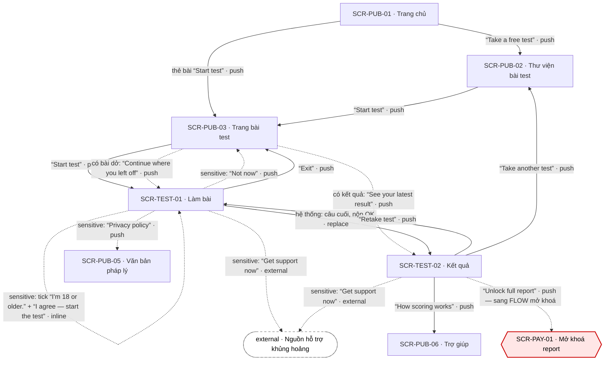

# [FLOW-lam-bai-mien-phi] — Làm bài miễn phí tới kết quả tóm tắt chấm thật
> Flow kích hoạt: khách lạ (SEO, landing, thư viện) làm một bài không cần tài khoản và thấy ngay kết quả tóm tắt chấm thật, kể cả bài `sensitive` (có bước consent riêng). Màn chính: [SCR-PUB-03](../screens/SCR-PUB-03-trang-bai-test.md) · [SCR-TEST-01](../screens/SCR-TEST-01-lam-bai.md) · [SCR-TEST-02](../screens/SCR-TEST-02-ket-qua.md). Mục lục: [00-so-do-luong-tong](00-so-do-luong-tong.md).
**Changelog** (mới nhất trước)
- 2026-09-28 · v1.1 · claude-opus-5-5 · quyết định 2026-09-28 (AI · uỷ quyền human): nhánh bài `sensitive` (KB-3) thêm ô "I'm 18 or older." + nhánh dưới 18 (Q-21 · BR-TEST-11); trích Q-05 (kết quả khách 30 ngày) · Q-10 (chấm ở server) đã chốt; AI Notice về attempt rỗng đã giải quyết (API-TEST-01 trả 422, không tạo attempt).
- 2026-09-27 · v1 · claude (subagent) · khởi tạo từ blueprint.

## 0. Meta

| code | role | screens spanned (SCR-IDs + route) | status | measured-by (funnel §5) | basis (RS path) |
|---|---|---|---|---|---|
| FLOW-lam-bai-mien-phi | activation | SCR-PUB-01 `/` · SCR-PUB-02 `/tests` · SCR-PUB-03 `/tests/:slug` · SCR-TEST-01 `/tests/:slug/take` · SCR-TEST-02 `/results/:resultId` (nhánh phụ SCR-PUB-05 `/legal/:doc` · SCR-PUB-06 `/help`; lối ra SCR-PAY-01 `/unlock/:resultId`) | Draft | ft_test · start → ft_test · submit → ft_result · start (§5) | `research/apps/testlibrary-web/teardown.md` §4.4 · F-03 · F-04 · F-13 · F-14 · F-16 · F-19 · `research/research-synthesis.md` §K (K1 · K3 · K5) · P-04 · P-05 · CS-03 · CS-04 · CS-07 |

## 1. Flow diagram

Cạnh liền = đường chính; cạnh đứt = nhánh có điều kiện (bài `sensitive`, có bài dở, có kết quả) hoặc lối ra sang flow khác. Vòng tự thân trên SCR-TEST-01 là cạnh `inline` NAV-TEST-01-4 (bước consent → câu 1, không đổi URL; chỉ đi được khi đã tick ô 18+, BR-TEST-11).

| SCR-ID | Route | NAV-ID đi qua | Vai trò trong flow |
|---|---|---|---|
| SCR-PUB-01 | `/` | NAV-PUB-01-1 · NAV-PUB-01-2 | điểm vào từ landing; CTA chính dẫn tới làm bài, không tới trang giá (BR-PUB-01) |
| SCR-PUB-02 | `/tests` · `/tests?topic=<topic>` | NAV-PUB-01-2 (vào) · NAV-PUB-02-2 (lọc, inline) · NAV-PUB-02-1 · NAV-TEST-02-4 (vào) | chọn bài theo chủ đề |
| SCR-PUB-03 | `/tests/:slug` | NAV-PUB-01-1 · NAV-PUB-02-1 · NAV-TEST-01-2 · NAV-TEST-01-5 (vào) · NAV-PUB-03-1 · NAV-PUB-03-2 · NAV-PUB-03-3 | trang đích SEO; cổng bắt đầu, tiếp tục bài dở, xem kết quả gần nhất |
| SCR-TEST-01 | `/tests/:slug/take` | NAV-PUB-03-1 · NAV-PUB-03-2 · NAV-TEST-02-3 (vào) · NAV-TEST-01-4 · NAV-TEST-01-3 · NAV-TEST-01-1 · NAV-TEST-01-2 · NAV-TEST-01-5 · NAV-TEST-01-6 · NAV-TEST-01-7 | core: consent (bài `sensitive`) → trả lời từng câu → nộp bài, server chấm (TD-01) |
| SCR-TEST-02 | `/results/:resultId` | NAV-TEST-01-1 · NAV-PUB-03-3 (vào) · NAV-TEST-02-3 · NAV-TEST-02-4 · NAV-TEST-02-6 · NAV-TEST-02-7 · NAV-TEST-02-1 (lối ra) | giá trị đầu tiên = goal của flow: điểm mọi thang + type + "Why you got this result" |
| SCR-PUB-05 | `/legal/privacy` | NAV-TEST-01-7 | nhánh phụ: đọc privacy trước khi consent bài `sensitive` |
| SCR-PUB-06 | `/help#scoring` | NAV-TEST-02-6 | nhánh phụ: "How scoring works" |
| SCR-PAY-01 | `/unlock/:resultId` | NAV-TEST-02-1 | lối ra sang FLOW-mo-khoa-report (không thuộc flow này) |

## 2. User scenarios

**KB-1 · Happy — khách từ SEO làm bài tính cách (K1).** Khách chưa có cookie, bài không `sensitive`.
1. SCR-PUB-03 (vào từ tìm kiếm) → đọc chip "[n] questions" · "About [m] min" · "Free summary" (số từ API-CAT-02, BR-PUB-05) → bấm "Start test" → SCR-TEST-01 mở câu 1, tạo attempt (API-TEST-01) · NAV-PUB-03-1.
2. SCR-TEST-01 → chọn một mức GC-ScaleInput (vd "Agree") → lưu localStorage, sau 150 ms sang câu kế · NAV-TEST-01-3 (inline, BR-TEST-01 · BR-TEST-02). Lặp tới câu cuối; "Back" sửa được câu trước.
3. SCR-TEST-01 → chọn đáp án câu cuối → API-TEST-03 nộp; panel "Submitting your answers…" chỉ hiện khi > 300 ms (BR-TEST-05) → server chấm (TD-01 · Q-10), trả `resultId` → SCR-TEST-02 thay chỗ runner · NAV-TEST-01-1 (replace).
4. SCR-TEST-02 → thấy "Your result: [Type]" + GC-ScoreBars đủ mọi thang + "Why you got this result" (BR-TEST-07) + khối report với danh sách chương thật và "About [N] pages" (BR-TEST-08) + "Saved on this device until [date]" (BR-TEST-10). Kết thúc flow.

**KB-2 · Từ landing qua thư viện.**
1. SCR-PUB-01 → "Take a free test" → SCR-PUB-02 · NAV-PUB-01-2.
2. SCR-PUB-02 → chip "Relationships" → lưới lọc, URL `?topic=` (replace) · NAV-PUB-02-2 (inline, BR-PUB-04) → thẻ bài "Start test" → SCR-PUB-03 · NAV-PUB-02-1.
3. Tiếp như KB-1 bước 1–4 (NAV-PUB-03-1 → NAV-TEST-01-1).

**KB-3 · Bài `sensitive` — nhánh consent (K5).** Bài có cờ `sensitive`; route không tải analytics (BR-APP-06). Chỉ người 18+ làm bài này (Q-21); bài thường không có cổng tuổi.
1. SCR-PUB-03 → GC-SensitiveNotice hiện trước nút (BR-PUB-06) → "Start test" → SCR-TEST-01 mở ở bước "Before you start", chưa có câu nào · NAV-PUB-03-1 (BR-TEST-04).
2. SCR-TEST-01 → (tuỳ chọn) "Privacy policy" → SCR-PUB-05 `doc=privacy` · NAV-TEST-01-7 → back trình duyệt về đúng bước consent.
3. SCR-TEST-01 → tick ô "I'm 18 or older." (bắt buộc, không tick sẵn; chưa tick thì nút khoá, bấm vào chỉ hiện "Tick the box to confirm you're 18 or older.") → "I agree — start the test" → câu 1 hiện; `sensitive_consent_version` + thời điểm + `ageConfirmed` = true gửi trong API-TEST-01 và lưu vào attempt · NAV-TEST-01-4 (inline, BR-TEST-04 · BR-TEST-11).
4. Trả lời, nộp như KB-1 → SCR-TEST-02 có GC-SensitiveNotice + "Get support now" · NAV-TEST-01-1. Không event analytics nào bắn trên cả ba route (BR-APP-06).
5. Nhánh từ chối: ở bước 3 bấm "Not now" → về SCR-PUB-03, không tạo attempt, không câu trả lời nào được lưu · NAV-TEST-01-5. Nhánh dưới 18: không tick được nên không bắt đầu; dòng phụ "This test is for adults. If you're under 18 and finding things hard, you can get support now." → "get support now" mở nguồn hỗ trợ ở tab mới · NAV-TEST-01-6 (SCR-TEST-01 EC-08). Nhánh hỗ trợ: "Get support now" mở tab mới · NAV-TEST-01-6 (hoặc NAV-TEST-02-7 ở kết quả).

**KB-4 · Rớt mạng giữa bài (K3).**
1. SCR-TEST-01 đang ở câu 12 → mất mạng → banner "You're offline. Keep going — we'll save your answers and submit when you're back online." (cong-nghe-loi §3); vẫn trả lời tiếp · NAV-TEST-01-3.
2. Câu cuối khi vẫn offline → panel "We couldn't submit your answers yet. We'll retry automatically — your answers are safe on this device." + "Retry now"; bài vào hàng đợi (BR-TEST-03).
3. Có mạng lại → tự gửi lại với cùng `attemptId` → SCR-TEST-02 · NAV-TEST-01-1.

**KB-5 · Đóng tab rồi quay lại làm tiếp.**
1. SCR-TEST-01 ở câu 7 → đóng tab (tiến độ đã ở localStorage, BR-TEST-02).
2. Hôm sau mở SCR-PUB-03 → khối CMP-08 "Continue where you left off · Question 7 of [n]" → bấm → SCR-TEST-01 đúng câu 7, đáp án cũ còn · NAV-PUB-03-2 (BR-TEST-06).
3. Nộp như KB-1 → SCR-TEST-02 · NAV-TEST-01-1.

**KB-6 · Làm lại và làm bài khác.**
1. SCR-TEST-02 → "Retake test" → SCR-TEST-01 với attempt MỚI · NAV-TEST-02-3; nộp → kết quả mới là một dòng riêng, không ghi đè (BR-REP-01 · BR-APP-07) · NAV-TEST-01-1.
2. SCR-TEST-02 → "Take another test" → SCR-PUB-02 · NAV-TEST-02-4 → lặp KB-2.

## 3. Cover-case grid (web)

| Case | Handling / N/A vì |
|---|---|
| Happy path | KB-1: SCR-PUB-03 → SCR-TEST-01 → SCR-TEST-02 qua NAV-PUB-03-1 → NAV-TEST-01-1 (replace). Server chấm thật, cùng câu trả lời + cùng `scoring_version` thì cùng kết quả (BR-APP-07 · TD-01) — khác đối thủ có kết quả không phụ thuộc câu trả lời (F-14). Không loader giả (BR-TEST-05, tránh F-16) |
| Hết quota / hết credits / free limit | N/A vì làm bài và xem kết quả tóm tắt miễn phí không giới hạn (`plan.free`, 00-overview §2 · Q-02); không có credits. Giới hạn duy nhất là rate limit kỹ thuật 429 → "Too many requests. Please wait a moment and try again." (cong-nghe-loi §3). Report đầy đủ là phần khoá → lối ra NAV-TEST-02-1 sang FLOW-mo-khoa-report |
| Guest (chưa đăng nhập) chạm feature cần tài khoản | Cả flow chạy không cần tài khoản: token `tl_guest` tạo ở lần bắt đầu bài đầu tiên (SYS-AUTH · BR-APP-08). Lưu kết quả bằng email là tuỳ chọn, không chặn việc xem (BR-TEST-09) → FLOW-luu-ket-qua-dang-nhap. Khách chưa lưu thì kết quả hết hạn sau 30 ngày, ngày hết hạn hiện cạnh form (BR-TEST-10 · Q-05) |
| Rớt mạng giữa chừng | Theo `cong-nghe-loi §3`: đang trả lời → banner offline, vẫn làm tiếp, tiến độ lưu local; nộp bài lỗi mạng / timeout 10 s / 5xx → vào hàng đợi, tự gửi lại với cùng `attemptId`, tối đa 5 lần backoff 2–4–8–16–32 s, có "Retry now" (BR-TEST-03). Ở SCR-PUB-02 / SCR-PUB-03 (GET lỗi) → giữ nội dung + banner "You're offline. Check your connection and try again." (tieu-chuan-chung §2). KB-4 |
| User huỷ giữa chừng (Esc / đóng / rời trang) | "Exit" hoặc back trình duyệt rời bài không hỏi xác nhận vì tiến độ đã lưu (NAV-TEST-01-2 · BR-TEST-02); quay lại bằng "Continue where you left off" (NAV-PUB-03-2). Bài `sensitive` bấm "Not now" ở bước consent → về SCR-PUB-03, chưa câu nào hiện và không câu trả lời nào được lưu (NAV-TEST-01-5 · BR-TEST-04); chưa tick "I'm 18 or older." thì không bắt đầu được (BR-TEST-11) |
| Double-submit / retry (idempotent) | Nộp bài idempotent theo `attemptId`: gửi lặp → 409 → dùng `resultId` gốc (BR-TEST-03 · 00-quy-uoc-api §4–§5). Bấm đáp án liên tiếp rất nhanh → mỗi câu chỉ nhận 1 lựa chọn trong 150 ms chuyển câu (SCR-TEST-01 EC-07). Mở lại cùng attempt không tạo bản mới (API-TEST-01 theo `attemptId`) |
| Reload / đóng tab rồi mở lại (state còn không?) | Còn. Reload giữa bài → resume đúng câu, đáp án cũ còn (localStorage theo `attemptId`, BR-TEST-02 · SCR-TEST-01 EC-02); private mode chặn localStorage → chạy trong bộ nhớ + cảnh báo "Private browsing is on, so your progress won't be saved if you close this tab." (`cong-nghe-loi §3`). Reload SCR-TEST-02 → kết quả đọc lại từ server theo token khách (API-RES-01), còn tới hạn 30 ngày (BR-TEST-10). Đã đăng nhập: autosave server gom ≤ 10 câu / 5 s (API-TEST-02) |
| Mở thẳng URL / link chia sẻ / back-forward vào giữa flow | `/tests/:slug/take` mở thẳng → resume attempt dở hoặc tạo attempt mới; attempt đã nộp → chuyển kết quả bằng replace (BR-TEST-06). Back sau khi có kết quả → về SCR-PUB-03, không về runner đã nộp (NAV-TEST-01-1 replace; tránh bẫy back F-19). `/results/:resultId` mở ở trình duyệt khác / link bị chia sẻ → state Locked "This result isn't available on this device. Sign in if you saved it, or take the test again." (`cong-nghe-loi §3` · BR-APP-08); link chia sẻ trang bài SCR-PUB-03 là trang public bình thường, không lộ kết quả của người khác |
| Hai tab / hai thiết bị cùng lúc | Hai tab cùng một attempt: cả hai ghi localStorage; tab nộp sau nhận 409 → dùng `resultId` trả về, chuyển kết quả (SCR-TEST-01 EC-01). Đổi thiết bị giữa bài: đã đăng nhập → resume từ autosave server; khách → bắt đầu lại vì tiến độ chỉ ở máy cũ (SCR-TEST-01 EC-05) |
| Timezone / đổi giờ | Không có logic theo ngày trong lúc làm bài. Chỉ có mốc hết hạn kết quả khách (30 ngày, BR-APP-08) tính ở server theo UTC (00-quy-uoc-api §8), hiện "Saved on this device until [date]" theo kiểu ngày của tieu-chuan-chung §4 — khách chưa có timezone tài khoản nên dùng timezone trình duyệt (xem AI Notices) |
| Config / giá đổi giữa phiên | Thang đo hoặc nội dung bài đổi version khi user đang làm → attempt giữ `scoringVersion` + `contentVersion` lúc bắt đầu (BR-APP-07 · SCR-TEST-01 EC-06). Bài bị gỡ (`unpublished`) → SCR-PUB-03 state Empty "This test is being updated. Try another test."; bài tắt theo vùng → state Locked (SCR-PUB-03 §4). Flow không hiển thị giá (chỉ link "See pricing" NAV-PUB-03-4) nên đổi giá không ảnh hưởng |
| Pending / held (webhook chưa về, 3-D Secure) | N/A vì flow không có thanh toán, không webhook. Trạng thái "chờ" duy nhất là bài nộp nằm trong hàng đợi khi offline: panel "We couldn't submit your answers yet…" + "Retry now", câu trả lời an toàn trên máy (BR-TEST-03 · `cong-nghe-loi §3`) |

## 4. BR references

| BR | Tóm tắt | Định nghĩa tại |
|---|---|---|
| BR-PUB-01 | CTA chính của landing dẫn tới làm bài, không tới trang giá | SCR-PUB-01 §7 |
| BR-PUB-02 | Card bài hiện số câu + thời gian ước tính thật | SCR-PUB-01 §7 |
| BR-PUB-03 | Card bài `sensitive` có nhãn "Wellbeing · Not a diagnosis" | SCR-PUB-02 §7 |
| BR-PUB-04 | Bộ lọc chủ đề giữ trên URL `?topic=` | SCR-PUB-02 §7 |
| BR-PUB-05 | Số câu + thời gian lấy từ dữ liệu bài, không làm tròn xuống | SCR-PUB-03 §7 |
| BR-PUB-06 | Bài `sensitive`: không analytics, GC-SensitiveNotice trước "Start test", tên bài trung thực | SCR-PUB-03 §7 |
| BR-TEST-01 | Chọn đáp án = lưu + sang câu kế sau 150 ms; "Back" sửa được | SCR-TEST-01 §7 |
| BR-TEST-02 | Tiến độ lưu localStorage sau mỗi câu; đăng nhập thì autosave server | SCR-TEST-01 §7 |
| BR-TEST-03 | Nộp idempotent theo `attemptId`; hàng đợi + backoff khi lỗi | SCR-TEST-01 §7 |
| BR-TEST-04 | Bài `sensitive`: không câu nào trước "I agree — start the test"; lưu consent version | SCR-TEST-01 §7 |
| BR-TEST-11 | Bài `sensitive`: ô "I'm 18 or older." bắt buộc, không tick sẵn; chưa tick thì nút bắt đầu khoá; lưu `ageConfirmed` | SCR-TEST-01 §7 |
| BR-TEST-05 | Không loader giả; panel nộp chỉ khi > 300 ms | SCR-TEST-01 §7 |
| BR-TEST-06 | Mở URL có attempt dở → resume; đã nộp → chuyển kết quả (replace) | SCR-TEST-01 §7 |
| BR-TEST-07 | Tóm tắt free hiện đủ điểm mọi thang + type + giải thích; không mờ/giấu | SCR-TEST-02 §7 |
| BR-TEST-08 | Khối mở khoá liệt kê đúng chương + số trang thật; không đồng hồ, không "X just bought" | SCR-TEST-02 §7 |
| BR-TEST-10 | Kết quả khách hết hạn sau 30 ngày nếu chưa lưu; hiện ngày hết hạn | SCR-TEST-02 §7 |
| BR-REP-01 | Mỗi lần làm bài là 1 dòng; làm lại không ghi đè | SCR-APP-02 §7 |
| BR-APP-05 | Không dữ liệu bài test ở bên thứ ba; tracking chỉ sau consent | 00-overview §5 |
| BR-APP-06 | Bảo vệ bài `sensitive`: consent riêng, disclaimer, không script analytics | 00-overview §5 |
| BR-APP-07 | Kết quả là hàm của câu trả lời + `scoring_version` | 00-overview §5 |
| BR-APP-08 | Kết quả của khách gắn token cookie; tự xoá sau 30 ngày nếu chưa lưu | 00-overview §5 |

## 5. Funnel

| Bước funnel | Event |
|---|---|
| Vào landing / thư viện (kênh vào qua `open_from`, chỉ lần đầu phiên) | `screen_active` · `home` / `test_library` |
| Xem trang bài | `screen_active` · `test_page` |
| Bắt đầu bài | ft_test · start (`from` = test_page / app_home / result) |
| Tiếp tục bài dở | ft_test · resume |
| Nộp bài (goal) | ft_test · submit (success / fail · `offline_queued`) |
| Thấy kết quả | ft_result · start · `screen_active` · `result` |
| Làm lại | ft_result · retake |
| Muốn mở khoá (lối ra sang FLOW-mo-khoa-report) | ft_result · unlock_click |

Tỉ lệ theo dõi: `test_page` → ft_test · start (tỉ lệ bắt đầu) · ft_test · start → ft_test · submit success (tỉ lệ hoàn thành) · `duration_ms` của submit (so mục tiêu p95 ≤ 2 s, cong-nghe-loi §2) · tỉ lệ `offline_queued = true`. **Bài `sensitive` không bắn event nào** trên SCR-PUB-03 · SCR-TEST-01 · SCR-TEST-02 (BR-APP-06); tỉ lệ bỏ dở của mọi bài đo ở server từ bảng attempt, không qua analytics (tracking-events AI Notices). Mọi event chỉ bắn sau consent analytics (tieu-chuan-chung §10).

## 6. AI Notices
- Hiển thị ngày hết hạn cho **khách** theo timezone trình duyệt là suy luận: tieu-chuan-chung §4 chỉ nói "theo timezone tài khoản", khách chưa có tài khoản. Cần ghi rõ ở SCR-TEST-02.
- Nhánh consent bài `sensitive` dùng cạnh `inline` NAV-TEST-01-4 (vẽ thành vòng tự thân). "Not now" không để lại dữ liệu: API-TEST-01 của bài `sensitive` thiếu `sensitiveConsent` / `ageConfirmed` trả 422 và không tạo attempt (`docs/api/SCR-TEST-01-api.md`, khẳng định 2026-09-28).
- Khác đối thủ (research): đối thủ dẫn mọi CTA landing về trang giá (F-03), cho kết quả free cố định (F-14), chèn loader giả (F-16), bắn pixel theo từng câu (F-13) và bẫy back ở offer (F-19). Flow này cố ý làm ngược cả năm điểm.
