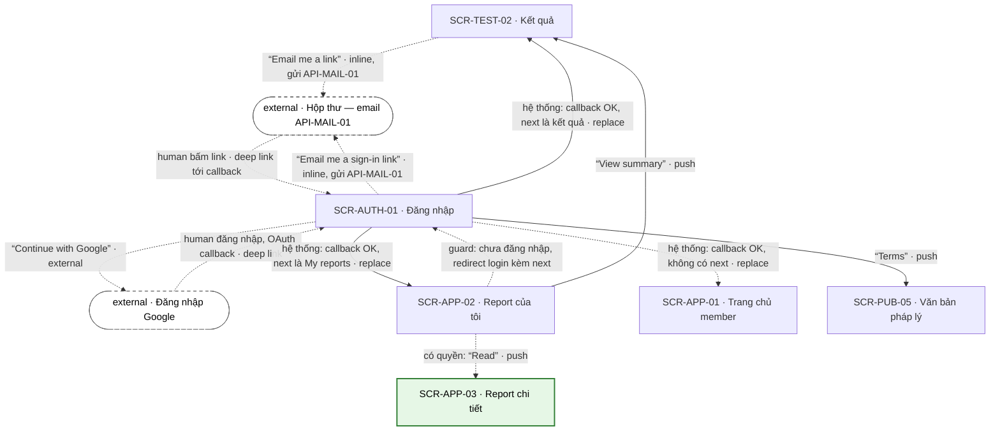

# [FLOW-luu-ket-qua-dang-nhap] — Lưu kết quả bằng email và đăng nhập bằng magic link
> Flow kích hoạt: biến khách thành tài khoản mà không cần mật khẩu. Khách bấm "Email me a link" ở kết quả, bấm magic link trong email, và quay lại đúng trang đang xem (`next`) với kết quả đã gộp vào tài khoản, đọc được ở mọi thiết bị. Màn chính: [SCR-TEST-02](../screens/SCR-TEST-02-ket-qua.md) · [SCR-AUTH-01](../screens/SCR-AUTH-01-dang-nhap.md) · [SCR-APP-02](../screens/SCR-APP-02-report-cua-toi.md). Mục lục: [00-so-do-luong-tong](00-so-do-luong-tong.md).
**Changelog** (mới nhất trước)
- 2026-09-28 · v1.2 · claude-opus-5-5 · Q-11 (magic link + Google, không mật khẩu, checkout khách) và Q-16 (Postmark gửi API-MAIL-01) đã chốt 2026-09-28: ghi vendor email, thêm AI Notice trạng thái. Hai notice cũ sửa: khoá idempotent API-AUTH-01 theo `api-mapping` §1; `from = result` đã có NAV-TEST-02-8.
- 2026-09-28 · v1.1 · claude-opus-5-5 · gap "không có lối đăng nhập từ SCR-TEST-02" đã có NAV-TEST-02-8.
- 2026-09-27 · v1 · claude (subagent) · khởi tạo từ blueprint.

## 0. Meta

| code | role | screens spanned (SCR-IDs + route) | status | measured-by (funnel §5) | basis (RS path) |
|---|---|---|---|---|---|
| FLOW-luu-ket-qua-dang-nhap | activation | SCR-TEST-02 `/results/:resultId` · SCR-AUTH-01 `/login` · `/login?next=<route>` · `/login/callback?token=…` · SCR-APP-01 `/app` · SCR-APP-02 `/app/reports` (nhánh phụ SCR-APP-03 `/app/reports/:reportId` · SCR-PUB-05 `/legal/terms`) | Draft | ft_result · save_email → ft_auth · login (§5) | `research/apps/testlibrary-web/teardown.md` §4.1 · F-20 (đối thủ: không có sign up, tài khoản chỉ sinh sau thanh toán, đặt mật khẩu sau mua) · F-22 · Q-11 · CS-07 · CS-11 · CS-13 |

## 1. Flow diagram

Cạnh đứt tới / từ hộp thư và Google là bước **chỉ human làm** (mở email, đăng nhập Google). Hai cạnh `inline` (NAV-TEST-02-5, NAV-AUTH-01-1) không đổi trang; vẽ tới hộp thư để thấy tác dụng phụ là email API-MAIL-01. Cạnh guard `SCR-APP-02 → SCR-AUTH-01` là redirect của SYS-AUTH, không phải NAV.

| SCR-ID | Route | NAV-ID đi qua | Vai trò trong flow |
|---|---|---|---|
| SCR-TEST-02 | `/results/:resultId` | NAV-TEST-02-5 · NAV-AUTH-01-3 (vào, `next`) · NAV-APP-02-2 (vào) | nơi bắt đầu lưu (form CMP-06) và đích quay lại sau đăng nhập |
| — (external · hộp thư) | email API-MAIL-01 (gửi qua Postmark, Q-16) | — (deep link, không có NAV) | human mở email, bấm link tới callback |
| SCR-AUTH-01 | `/login` · `/login?next=<route>` · `/login/callback?token=…` | NAV-AUTH-01-1 · NAV-AUTH-01-2 · NAV-AUTH-01-3 · NAV-AUTH-01-4 | gửi magic link, xác thực callback (API-AUTH-02 / API-AUTH-04), chuyển tới `next` |
| — (external · Google) | trang đăng nhập Google | NAV-AUTH-01-2 | OAuth (API-AUTH-03 → API-AUTH-04) |
| SCR-APP-01 | `/app` | NAV-AUTH-01-3 (vào) | đích mặc định khi callback không có `next` |
| SCR-APP-02 | `/app/reports` | NAV-AUTH-01-3 (vào, `next`) · NAV-APP-02-2 · NAV-APP-02-1 | lịch sử kết quả đã gộp vào tài khoản |
| SCR-APP-03 | `/app/reports/:reportId` | NAV-APP-02-1 | lối ra: đọc report nếu đã có quyền |
| SCR-PUB-05 | `/legal/terms` | NAV-AUTH-01-4 | phụ: điều khoản trước khi đăng nhập |

## 2. User scenarios

**KB-1 · Happy — khách lưu kết quả trên cùng trình duyệt.** Khách vừa làm xong bài (FLOW-lam-bai-mien-phi), chưa lưu.
1. SCR-TEST-02 → nhập "Email" → "Email me a link" → API-RES-02 gắn email với kết quả và gửi magic link (API-MAIL-01); vẫn xem kết quả bình thường · NAV-TEST-02-5 (inline · BR-TEST-09).
2. Hộp thư → email "View your results" → bấm link → `/login/callback?token=…` (SCR-AUTH-01, không có UI riêng): API-AUTH-02 kiểm token 15 phút, dùng 1 lần (BR-AUTH-01); tạo hoặc đăng nhập tài khoản với email đó và **gộp** mọi kết quả của token `tl_guest` hiện tại vào tài khoản (SYS-AUTH).
3. SCR-AUTH-01 → `next` = `/results/:resultId` (cùng origin, BR-AUTH-02) → SCR-TEST-02 · NAV-AUTH-01-3 (replace). Kết quả giờ thuộc tài khoản: không còn hạn 30 ngày, form lưu (chỉ cho khách chưa lưu) biến mất (BR-TEST-10 · BR-APP-08).

**KB-2 · Mở email ở thiết bị khác.**
1. Như KB-1 bước 1 trên laptop.
2. Mở email trên điện thoại → bấm link → callback tạo phiên `tl_session` mới trên điện thoại · NAV-AUTH-01-3 → SCR-TEST-02 đọc được nhờ tài khoản, không cần token khách của laptop (khác case Locked ở `cong-nghe-loi §3`).

**KB-3 · Đăng nhập từ header, không có `next`.**
1. SCR-PUB-01 → mục shell "Sign in" (SYS-NAV §1, không phải NAV) → SCR-AUTH-01.
2. SCR-AUTH-01 → nhập "Email" → "Email me a sign-in link" → "Check your inbox" + "We sent a sign-in link to [email]. It expires in 15 minutes." · NAV-AUTH-01-1 (inline). Câu này hiện dù email có tài khoản hay không (BR-AUTH-03). "Resend link" bật sau 30 s.
3. Bấm link trong email → callback OK, không `next` → SCR-APP-01 · NAV-AUTH-01-3 (replace).

**KB-4 · Guard + Google.**
1. Mở bookmark `/app/reports` khi chưa đăng nhập → guard 302 `/login?next=/app/reports` (SYS-AUTH · tieu-chuan-chung §1).
2. SCR-AUTH-01 → "Continue with Google" → trang Google (API-AUTH-03) · NAV-AUTH-01-2 (external; human đăng nhập Google).
3. Google trả về callback (API-AUTH-04); email trùng tài khoản có sẵn thì gộp vào tài khoản đó (SYS-AUTH) → `next` → SCR-APP-02 · NAV-AUTH-01-3 (replace).
4. SCR-APP-02 → "View summary" → SCR-TEST-02 · NAV-APP-02-2; hoặc dòng "Full report" → "Read" → SCR-APP-03 · NAV-APP-02-1 (có quyền).

**KB-5 · Link hết hạn.**
1. Bấm link sau hơn 15 phút → SCR-AUTH-01 state Error "This link has expired. We've sent you a new one." (BR-AUTH-01 · BR-APP-10).
2. Bấm link mới trong 15 phút → callback OK → NAV-AUTH-01-3.

## 3. Cover-case grid (web)

| Case | Handling / N/A vì |
|---|---|
| Happy path | KB-1: SCR-TEST-02 (NAV-TEST-02-5, inline) → email API-MAIL-01 → callback SCR-AUTH-01 → SCR-TEST-02 (NAV-AUTH-01-3, replace). Không mật khẩu, không bắt lưu để xem (BR-TEST-09) — khác đối thủ chỉ tạo tài khoản sau thanh toán và bắt đặt mật khẩu (F-20) |
| Hết quota / hết credits / free limit | Gửi lại link tối đa 3 lần/giờ/email (BR-TEST-09 · SYS-AUTH); "Resend link" chỉ bật sau 30 s (SCR-AUTH-01 CMP-06). Vượt → 429 "Too many requests. Please wait a moment and try again." chờ `Retry-After` (cong-nghe-loi §3). Không có quota nào khác: lưu kết quả và tài khoản đều miễn phí (Q-02) |
| Guest (chưa đăng nhập) chạm feature cần tài khoản | Flow này chính là đường khách → tài khoản. Route `account` (`/app`, `/app/reports`) khi chưa có phiên → 302 `/login?next=<route>`, đăng nhập xong quay lại đúng route (SYS-AUTH · tieu-chuan-chung §1). Xem kết quả tóm tắt không cần tài khoản (BR-TEST-09) |
| Rớt mạng giữa chừng | `cong-nghe-loi §3` không có hàng riêng cho auth → áp mặc định tieu-chuan-chung §2: gửi form (API-RES-02 / API-AUTH-01) lỗi mạng → giữ email đã nhập, báo lỗi + thử lại; POST có idempotency key được gửi lại một lần khi online. Callback mất mạng → trang không tải; link vẫn dùng được nếu chưa quá 15 phút và chưa dùng (BR-AUTH-01) |
| User huỷ giữa chừng (Esc / đóng / rời trang) | Đóng tab sau khi gửi → link trong email vẫn hiệu lực 15 phút (BR-APP-10). Rời SCR-AUTH-01 → không mất gì. Huỷ ở trang Google → back trình duyệt về SCR-AUTH-01 (NAV-AUTH-01-2). Không bấm link thì kết quả vẫn là của khách, hết hạn sau 30 ngày (BR-TEST-10) |
| Double-submit / retry (idempotent) | API-RES-02 idempotent theo `resultId` + email chuẩn hoá (00-quy-uoc-api §5); API-AUTH-01 idempotent theo email chuẩn hoá + cửa sổ 1 phút; "Resend link" gửi `resend` nên không bị cửa sổ đó nuốt (SCR-AUTH-01-api · api-mapping §1). Bấm lại link đã dùng: trình duyệt đã có phiên → state Locked của SCR-AUTH-01, chuyển `next` hoặc `/app`; trình duyệt khác → xử lý như link hết hạn (state Error, BR-AUTH-01) |
| Reload / đóng tab rồi mở lại (state còn không?) | Trạng thái "đã gửi" là `inline` (NAV-AUTH-01-1, không đổi URL) nên reload về form trống; link đã gửi vẫn dùng được. Reload callback → token đã dùng: có phiên thì chuyển `next`, không thì Error như trên. Reload SCR-TEST-02 sau khi lưu → đọc theo tài khoản. `cong-nghe-loi §3` (hàng "Kết quả đã hết hạn / token không khớp") chỉ áp khi chưa lưu và mở ở trình duyệt khác |
| Mở thẳng URL / link chia sẻ / back-forward vào giữa flow | `next` chỉ nhận đường dẫn cùng origin, chống open redirect (BR-AUTH-02). Callback rời bằng replace nên back không quay lại callback (NAV-AUTH-01-3). Mở `/login` khi đã đăng nhập → state Locked, chuyển `next` hoặc `/app`. Link kết quả bị chuyển cho người khác → họ không có token/tài khoản → Locked "This result isn't available on this device. Sign in if you saved it, or take the test again." (`cong-nghe-loi §3` · BR-APP-08) |
| Hai tab / hai thiết bị cùng lúc | KB-2: link mở ở thiết bị khác tạo phiên ở thiết bị đó; kết quả đã claim bằng API-RES-02 đi theo tài khoản. Các kết quả khác chỉ gắn với token `tl_guest` của trình duyệt gốc được gộp khi đăng nhập trên chính trình duyệt đó (SYS-AUTH — xem AI Notices). Đăng xuất ở một tab → tab khác nhận sự kiện `storage`, về `/` (tieu-chuan-chung §1) |
| Timezone / đổi giờ | Hạn 15 phút của link tính tuyệt đối ở server, không phụ thuộc giờ máy. Tài khoản tạo ở bước callback lấy timezone trình duyệt lúc tạo làm timezone tài khoản, đổi được ở SCR-ACC-01 (BR-APP-09). Ngày trong SCR-APP-02 hiện theo timezone tài khoản (tieu-chuan-chung §4) |
| Config / giá đổi giữa phiên | N/A vì flow không hiển thị giá hay gói. Thời hạn link (15 phút, 1 lần) và giới hạn gửi lại (3 lần/giờ) là hằng số của BR-APP-10 · BR-TEST-09; văn bản "Terms" luôn mở bản mới nhất có version + ngày cập nhật (BR-PUB-11) |
| Pending / held (webhook chưa về, 3-D Secure) | N/A vì không có thanh toán, không webhook. "Chờ" duy nhất là email chưa tới: "Check your inbox" + "Resend link" sau 30 s, tối đa 3 lần/giờ (SCR-AUTH-01 CMP-06 · BR-TEST-09); email giao dịch gửi qua Postmark (Q-16), độ trễ giao được theo dõi như chỉ số vận hành (SYS-AUTH) |

## 4. BR references

| BR | Tóm tắt | Định nghĩa tại |
|---|---|---|
| BR-TEST-09 | Lưu bằng email: 1 email → magic link (API-RES-02); không bắt buộc để xem; gửi lại tối đa 3 lần/giờ | SCR-TEST-02 §7 |
| BR-TEST-10 | Kết quả khách hết hạn sau 30 ngày nếu chưa lưu; hiện ngày hết hạn cạnh form | SCR-TEST-02 §7 |
| BR-AUTH-01 | Magic link hết hạn 15 phút, dùng 1 lần | SCR-AUTH-01 §7 |
| BR-AUTH-02 | `next` chỉ nhận đường dẫn cùng origin | SCR-AUTH-01 §7 |
| BR-AUTH-03 | Không tiết lộ email có tồn tại hay không — luôn "Check your inbox" | SCR-AUTH-01 §7 |
| BR-REP-01 | Danh sách mới nhất trước; mỗi lần làm bài là 1 dòng | SCR-APP-02 §7 |
| BR-REP-02 | Bài `sensitive` không hiện type ở danh sách | SCR-APP-02 §7 |
| BR-REP-05 | Khách đọc report bằng token trên trình duyệt này; thiết bị khác phải đăng nhập | SCR-APP-03 §7 |
| BR-PUB-11 | Văn bản pháp lý có ngày cập nhật + version | SCR-PUB-05 §7 |
| BR-APP-08 | Kết quả của khách gắn token; lưu bằng email thì gắn vào tài khoản | 00-overview §5 |
| BR-APP-09 | Ngày nghiệp vụ theo timezone tài khoản (mặc định timezone trình duyệt lúc tạo) | 00-overview §5 |
| BR-APP-10 | Magic link 15 phút, 1 lần; phiên trượt 30 ngày; đăng xuất xoá phiên thiết bị hiện tại | 00-overview §5 |

## 5. Funnel

| Bước funnel | Event |
|---|---|
| Kết quả hiện, form lưu hiện với khách | ft_result · start |
| Gửi link lưu (goal nhánh lưu) | ft_result · save_email (success / fail) |
| Vào trang đăng nhập | ft_auth · start (`has_next`) · `screen_active` · `login` |
| Gửi sign-in link | ft_auth · magic_link_sent (success / fail) |
| Đăng nhập xong (goal) | ft_auth · login (`method` = magic_link / google) |
| Mở lịch sử | `screen_active` · `my_reports` |

Tỉ lệ theo dõi: ft_result · save_email success → ft_auth · login (tỉ lệ bấm link) · ft_auth · magic_link_sent → ft_auth · login · tỉ trọng `method` magic_link vs google · tỉ lệ `has_next = true` (đến từ guard). Kết quả bài `sensitive` không bắn ft_result (BR-APP-06), nên lượt lưu từ bài đó chỉ đếm ở server (bảng claim của API-RES-02). Callback không có UI riêng nên không có `screen_active` cho nó.

## 6. AI Notices
- Q-11 (magic link + Google, không mật khẩu, checkout khách) và Q-16 (Postmark gửi API-MAIL-01) đã chốt 2026-09-28; flow không còn chờ quyết định.
- **Gap — ngữ nghĩa gộp khi bấm link ở thiết bị khác:** SYS-AUTH nói bấm link "gộp mọi kết quả của token hiện tại". Ở thiết bị khác, token hiện tại là token của thiết bị đó. Flow này giả định kết quả đã claim bằng API-RES-02 được gắn vào tài khoản ngay khi xác thực link, còn các kết quả khác của trình duyệt gốc chỉ gộp khi đăng nhập trên trình duyệt gốc. Cần khẳng định ở `docs/api/SCR-TEST-02-api.md`.
- **Đã xử lý (2026-09-28) — lối đăng nhập từ SCR-TEST-02:** SCR-TEST-02 §2.2 đã có NAV-TEST-02-8: CMP-11 "Sign in" → SCR-AUTH-01 · `next=/results/:resultId` (chỉ ở state Error 410 / Locked 403).
- Copy xác nhận sau "Email me a link" ở SCR-TEST-02 chưa có trong blueprint; screen doc phải ghi verbatim (có thể dùng lại câu "Check your inbox" của SCR-AUTH-01).
- `from = result` của ft_auth · start (tracking-events) khớp NAV-TEST-02-8 ("Sign in" ở state Error / Locked của SCR-TEST-02).
