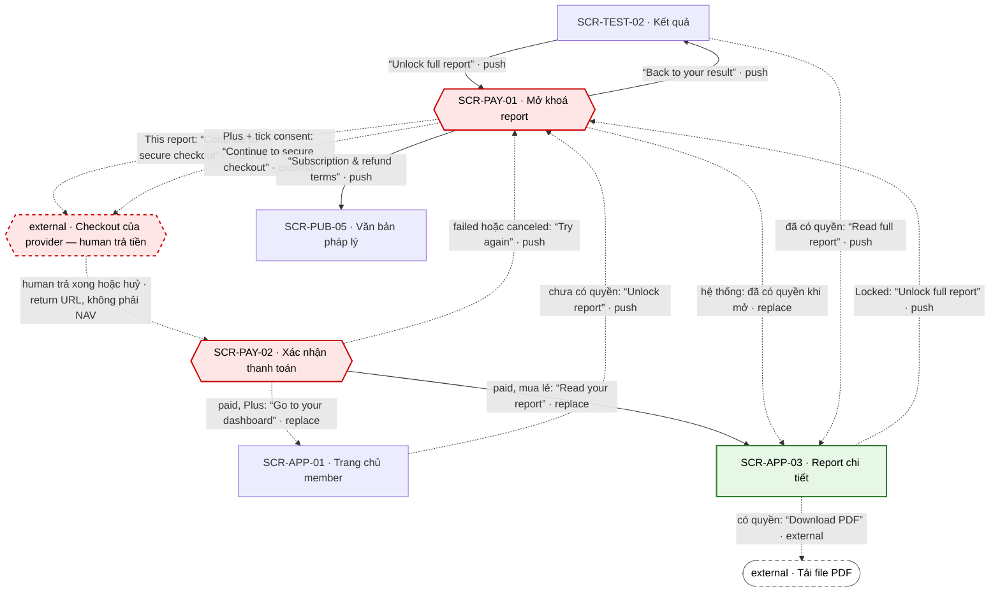

# [FLOW-mo-khoa-report] — Mở khoá report đầy đủ của một kết quả
> Flow tiền chính: sau khi thấy kết quả tóm tắt free, user mở khoá report đầy đủ + PDF của đúng kết quả đó (mua lẻ `report.single`, mặc định) hoặc chọn Plus, trả tiền ở checkout của provider, và đọc report ngay khi server xác nhận qua webhook. Màn chính: [SCR-PAY-01](../screens/SCR-PAY-01-mo-khoa-report.md) · [SCR-PAY-02](../screens/SCR-PAY-02-xac-nhan-thanh-toan.md) · [SCR-APP-03](../screens/SCR-APP-03-report-chi-tiet.md). Mục lục: [00-so-do-luong-tong](00-so-do-luong-tong.md).
**Changelog** (mới nhất trước)
- 2026-09-27 · v1 · claude (subagent) · khởi tạo từ blueprint.

## 0. Meta

| code | role | screens spanned (SCR-IDs + route) | status | measured-by (funnel §5) | basis (RS path) |
|---|---|---|---|---|---|
| FLOW-mo-khoa-report | money | SCR-TEST-02 `/results/:resultId` · SCR-PAY-01 `/unlock/:resultId` · checkout của provider (external) · SCR-PAY-02 `/checkout/return?session=<id>` · SCR-APP-03 `/app/reports/:reportId` · SCR-APP-01 `/app` (điểm vào phụ + đích khi chọn Plus; nhánh phụ SCR-PUB-05 `/legal/subscriptions`) | Draft | ft_result · unlock_click → ft_unlock · checkout_open → ft_unlock · purchase (§5) | `research/apps/testlibrary-web/teardown.md` §4.5 · F-15 · F-17 · F-18 · F-19 · F-23 · F-30 · `research/research-synthesis.md` §K (K1) · P-02 · P-04 · CS-08 · CS-10 · CS-14 · CS-21 |

## 1. Flow diagram

Ranh giới tiền: SCR-PAY-01 (paywall) → checkout provider (viền đứt: human nhập thẻ, agent không bao giờ làm) → SCR-PAY-02 (xác nhận) → SCR-APP-03 (xanh, sau checkout). Paywall là **soft**: luôn có "Back to your result" (NAV-PAY-01-3), không bẫy back. Cạnh `return URL` là deep link của provider (SYS-NAV §4), không phải NAV.

| SCR-ID | Route | NAV-ID đi qua | Vai trò trong flow |
|---|---|---|---|
| SCR-TEST-02 | `/results/:resultId` | NAV-TEST-02-1 · NAV-TEST-02-2 · NAV-PAY-01-3 (vào) | điểm vào chính: khối report CMP-05 sau tóm tắt free |
| SCR-APP-01 | `/app` | NAV-APP-01-3 · NAV-PAY-02-2 (vào) | điểm vào phụ (thẻ report gần nhất) + đích khi mua Plus |
| SCR-PAY-01 | `/unlock/:resultId` | NAV-TEST-02-1 · NAV-APP-01-3 · NAV-APP-03-2 · NAV-PAY-02-3 (vào) · NAV-PAY-01-1 · NAV-PAY-01-2 · NAV-PAY-01-3 · NAV-PAY-01-4 · NAV-PAY-01-5 | paywall: xem trước chương thật, chọn "This report" (chọn sẵn) hoặc "Plus", consent gia hạn, mở checkout (API-PAY-02) |
| — (external · checkout provider) | domain của provider (Q-04) | NAV-PAY-01-1 · NAV-PAY-01-2 | human nhập email + thẻ, 3-D Secure nếu ngân hàng yêu cầu |
| SCR-PAY-02 | `/checkout/return?session=<id>` | NAV-PAY-02-1 · NAV-PAY-02-2 · NAV-PAY-02-3 | chờ webhook (poll API-PAY-03), báo paid / failed / canceled / processing |
| SCR-APP-03 | `/app/reports/:reportId` | NAV-PAY-02-1 · NAV-PAY-01-5 · NAV-TEST-02-2 (vào) · NAV-APP-03-2 · NAV-APP-03-1 | đích: đọc report + tải PDF; state Locked là một điểm vào lại |
| SCR-PUB-05 | `/legal/subscriptions` | NAV-PAY-01-4 | điều khoản gia hạn + hoàn tiền |

## 2. User scenarios

**KB-1 · Happy — khách mua lẻ report (K1).** Khách vừa có kết quả (FLOW-lam-bai-mien-phi), chưa có `report.full`.
1. SCR-TEST-02 → khối report "About [N] pages" + danh sách chương → "Unlock full report" → SCR-PAY-01 · NAV-TEST-02-1.
2. SCR-PAY-01 → thấy chương thật + đoạn đầu chương 1 + "About [N] pages" (số trang thật, BR-PAY-04); thẻ "This report" chọn sẵn, không tự gia hạn (BR-PAY-03); giá từ API-PAY-01 = placeholder — Q-03 (BR-PAY-01); dòng "Sold by [legal entity]. Taxes calculated at checkout." → "Continue to secure checkout" → API-PAY-02 tạo phiên → trang provider · NAV-PAY-01-1 (external, cùng tab).
3. Provider (human): nhập email + thẻ, trả tiền → provider chuyển về `/checkout/return?session=<id>` (deep link).
4. SCR-PAY-02 → "Confirming your payment…"; poll API-PAY-03 mỗi 2 s tối đa 30 s (BR-PAY-08); webhook API-HOOK-01 đã verify → quyền `report.full:<resultId>` (BR-APP-01) → "You're all set" + tóm tắt đơn (số tiền do provider trả, người bán, "A receipt is on its way to [email].") + "To open your report on another device, use the sign-in link in your email."
5. SCR-PAY-02 → "Read your report" → SCR-APP-03 · NAV-PAY-02-1 (replace; back không về màn chờ, BR-PAY-10). Khách đọc được nhờ token trên trình duyệt này (BR-REP-05).
6. SCR-APP-03 → "Download PDF ([N] pages)" → tải file (signed URL) · NAV-APP-03-1 (external). Email API-MAIL-02 (biên nhận + "report đã mở khoá") tới hộp thư.

**KB-2 · Chọn Plus ngay trên trang mở khoá.**
1. SCR-PAY-01 → bấm thẻ "Plus" → hiện toggle "Monthly" / "Annual" + GC-RenewalDisclosure (giá gia hạn, chu kỳ, ngày thu, cách huỷ, email nhắc — BR-APP-02).
2. Tick checkbox consent (không tick sẵn; câu giống SCR-PUB-04) → nút bật (BR-PAY-02) → "Continue to secure checkout" → API-PAY-02 kèm `consent_version` → provider · NAV-PAY-01-2.
3. Provider (human) → return → SCR-PAY-02 paid + `plus` → hiện ngày gia hạn kế tiếp + giá gia hạn + cách huỷ (BR-PAY-09) → "Go to your dashboard" → SCR-APP-01 · NAV-PAY-02-2 (replace). Report của kết quả này mở nhờ `plus` (SYS-ENTITLEMENT). Chi tiết Plus ở FLOW-dang-ky-plus.

**KB-3 · Thanh toán thất bại → thử lại.**
1. Provider từ chối thẻ → return → SCR-PAY-02 "Your payment didn't go through. You haven't been charged." (`cong-nghe-loi §3`).
2. SCR-PAY-02 → "Try again" → SCR-PAY-01 (cùng `resultId`) · NAV-PAY-02-3 → lặp KB-1 bước 2.

**KB-4 · Webhook về trễ.**
1. SCR-PAY-02 poll quá 30 s → "Your payment is still processing. We'll email you as soon as your report is unlocked." (BR-PAY-08).
2. User đóng tab. Webhook về → quyền mở → email API-MAIL-02 "Your report is unlocked" → bấm link → SCR-APP-03 (deep link, SYS-NAV §4).

**KB-5 · Member mở khoá từ dashboard hoặc từ report bị khoá.**
1. SCR-APP-01 → thẻ report gần nhất "Unlock report" → SCR-PAY-01 · NAV-APP-01-3; hoặc SCR-APP-03 state Locked (CMP-09) → "Unlock full report" → SCR-PAY-01 · NAV-APP-03-2.
2. Tiếp như KB-1 bước 2–6.

**KB-6 · Đã có quyền mà vẫn mở trang mở khoá.**
1. User Plus mở lại `/unlock/:resultId` (bookmark, email cũ) → SCR-PAY-01 phát hiện `report.full` → SCR-APP-03 · NAV-PAY-01-5 (replace, BR-APP-01). Không bán trùng (SYS-ENTITLEMENT).

## 3. Cover-case grid (web)

| Case | Handling / N/A vì |
|---|---|
| Happy path | KB-1: NAV-TEST-02-1 → NAV-PAY-01-1 → (provider, human) → return → NAV-PAY-02-1 → SCR-APP-03. Mặc định mua lẻ không tự gia hạn (BR-PAY-03); chỉ hiện "paid" khi webhook xác nhận (BR-PAY-07). Khác đối thủ: không đồng hồ, không "X just bought", không giá gạch, không hứa số trang sai (BR-PAY-05 · BR-PAY-04; F-17 · F-23) |
| Hết quota / hết credits / free limit | Flow này chính là phần vượt giới hạn free: tóm tắt luôn free, report đầy đủ khoá (BR-TEST-07). Report chưa có quyền → state Locked (CMP-09), không redirect sang trang mua (BR-REP-06); "Unlock the full report to read every chapter." (`cong-nghe-loi §3`). Đã có Plus → không bán lẻ nữa, NAV-PAY-01-5 (SYS-ENTITLEMENT) |
| Guest (chưa đăng nhập) chạm feature cần tài khoản | Khách checkout được (Q-11 · SYS-AUTH): provider thu email, webhook tạo tài khoản với email đó nếu chưa có và gắn quyền. Cùng trình duyệt đọc report nhờ token khách (BR-REP-05); thiết bị khác đăng nhập bằng link trong email biên nhận (SCR-PAY-02 CMP-06). Khách chọn Plus: đích NAV-PAY-02-2 là `/app` (route `account`) → guard `/login?next=/app` (xem AI Notices) |
| Rớt mạng giữa chừng | Theo `cong-nghe-loi §3`: API-PAY-02 lỗi trước khi rời trang → ở lại SCR-PAY-01, "We couldn't start checkout. Please try again."; mất mạng ở SCR-PAY-02 → giữ "Confirming your payment…", poll tiếp khi có mạng; quá 30 s → "Your payment is still processing. We'll email you as soon as your report is unlocked." + email khi xong. Quyền không phụ thuộc client (BR-APP-01) nên rớt mạng không làm mất tiền đã trả |
| User huỷ giữa chừng (Esc / đóng / rời trang) | Huỷ ở provider → return "Checkout canceled. You haven't been charged." → "Try again" (NAV-PAY-02-3). Back trình duyệt từ provider → SCR-PAY-01 (NAV-PAY-01-1). Đóng tab ở provider → không thu, không quyền. Rời SCR-PAY-01 bằng "Back to your result" (NAV-PAY-01-3) hoặc back trình duyệt, không bị đẩy lại (BR-PAY-06; khác bẫy back F-19) |
| Double-submit / retry (idempotent) | API-PAY-02 nhận `Idempotency-Key` UUID mỗi lần bấm: bấm đúp → cùng một phiên checkout (00-quy-uoc-api §5). Webhook idempotent theo `event.id` (API-HOOK-01). Reload SCR-PAY-02 chỉ đọc trạng thái (API-PAY-03), không tạo giao dịch. Hai phiên song song ở hai tab cho cùng `resultId` → xem AI Notices |
| Reload / đóng tab rồi mở lại (state còn không?) | Theo `cong-nghe-loi §3`: reload SCR-PAY-02 → poll lại API-PAY-03 theo `session`, trạng thái lấy từ server, tham số URL không mở quyền (BR-PAY-07). Đóng tab lúc pending → email API-MAIL-02 khi xong (BR-PAY-08). Reload SCR-PAY-01 → về mặc định: "This report" chọn sẵn, checkbox Plus không tick (BR-PAY-03 · BR-APP-03) |
| Mở thẳng URL / link chia sẻ / back-forward vào giữa flow | `/unlock/:resultId` của người khác → như SCR-TEST-02: token không khớp / hết hạn → trang 410 thân thiện (SYS-NAV §4). `/checkout/return` thiếu `session` → chuyển `/` (SCR-PAY-02 Empty); phiên không thuộc trình duyệt / tài khoản → Locked "This checkout isn't linked to this browser. Check your email for your receipt.". Back sau "Read your report" không về màn chờ (NAV-PAY-02-1 replace · BR-PAY-10) |
| Hai tab / hai thiết bị cùng lúc | Tab A trả xong, tab B còn mở SCR-PAY-01 → lần tải kế tiếp của B đi NAV-PAY-01-5 sang report. Thiết bị khác: đăng nhập bằng link email → đọc report theo tài khoản (BR-REP-05). Hai checkout song song cho cùng `resultId` chưa có rule chặn → gap (AI Notices) |
| Timezone / đổi giờ | Mua lẻ là vĩnh viễn, không có ngày hết hạn. Plus: "ngày gia hạn kế tiếp" trên SCR-PAY-02 hiện theo timezone tài khoản (BR-APP-09 · tieu-chuan-chung §4). Tài khoản sinh từ webhook không có timezone trình duyệt → gap (AI Notices). Ngày trên biên nhận do provider in |
| Config / giá đổi giữa phiên | Giá trên SCR-PAY-01 lấy từ API-PAY-01 lúc tải trang (placeholder — Q-03, BR-PAY-01); số tiền thật là giá provider tại checkout và SCR-PAY-02 hiện đúng số provider đã thu (CMP-03). Câu consent Plus gửi `consent_version` (BR-PAY-02). Nội dung report đổi version sau khi mua → report ráp theo `contentVersion` (BR-REP-03), PDF cache theo `contentVersion` (TD-03). Giá / version cũ khi gọi API-PAY-02 → chưa có rule (AI Notices) |
| Pending / held (webhook chưa về, 3-D Secure) | 3-D Secure xảy ra trên trang provider trước khi return. Return mà webhook chưa về → quyền `pending`, KHÔNG mở report (SYS-ENTITLEMENT); "Confirming your payment…" poll 2 s trong 30 s → "still processing" + API-MAIL-02 khi xong (`cong-nghe-loi §3` · BR-PAY-08). Tỉ lệ pending > 30 s vượt 1% là trigger xem lại provider (cong-nghe-loi §6 #4) |

## 4. BR references

| BR | Tóm tắt | Định nghĩa tại |
|---|---|---|
| BR-TEST-07 | Tóm tắt free hiện đủ, không làm mờ để ép mua | SCR-TEST-02 §7 |
| BR-TEST-08 | Khối mở khoá liệt kê đúng chương + số trang thật; không đồng hồ, không "X just bought" | SCR-TEST-02 §7 |
| BR-PAY-01 | Giá / chu kỳ từ API-PAY-01 (nguồn 00-overview §2), placeholder tới Q-03 | SCR-PAY-01 §7 |
| BR-PAY-02 | Plus: nút disable tới khi tick consent; gửi `consent_version` trong API-PAY-02 | SCR-PAY-01 §7 |
| BR-PAY-03 | Mặc định chọn "This report"; Plus chỉ khi user bấm | SCR-PAY-01 §7 |
| BR-PAY-04 | Ghi số trang thật của report | SCR-PAY-01 §7 |
| BR-PAY-05 | Không đồng hồ, không giá gạch, không "X just bought", không testimonial không kiểm chứng | SCR-PAY-01 §7 |
| BR-PAY-06 | Back trình duyệt về kết quả, không bị đẩy lại | SCR-PAY-01 §7 |
| BR-PAY-07 | Chỉ hiện "paid" khi API-PAY-03 trả trạng thái do webhook xác nhận; URL không mở quyền | SCR-PAY-02 §7 |
| BR-PAY-08 | Poll API-PAY-03 mỗi 2 s tối đa 30 s; quá hạn → "still processing" + email | SCR-PAY-02 §7 |
| BR-PAY-09 | Plus: hiện ngày gia hạn kế tiếp + giá gia hạn + cách huỷ | SCR-PAY-02 §7 |
| BR-PAY-10 | Rời màn xác nhận bằng replace | SCR-PAY-02 §7 |
| BR-REP-03 | Report ráp từ `report_blocks`; cùng kết quả + cùng `contentVersion` → cùng report | SCR-APP-03 §7 |
| BR-REP-04 | PDF cùng nội dung, ghi số trang thật; quá 10 s chuyển sang email | SCR-APP-03 §7 |
| BR-REP-05 | Khách có token + quyền mua đọc được không cần đăng nhập; thiết bị khác phải đăng nhập | SCR-APP-03 §7 |
| BR-REP-06 | Không có quyền → state Locked, không redirect sang trang mua | SCR-APP-03 §7 |
| BR-APP-01 | Entitlement do server quyết qua webhook đã verify | 00-overview §5 |
| BR-APP-02 | Công bố gia hạn ở mọi bề mặt tiền (GC-RenewalDisclosure) | 00-overview §5 |
| BR-APP-03 | Consent gia hạn tường minh, checkbox không tick sẵn, lưu `consent_version` | 00-overview §5 |
| BR-APP-12 | Giá theo currency của planKey; thuế do MoR / provider tính ở checkout | 00-overview §5 |

## 5. Funnel

| Bước funnel | Event |
|---|---|
| Kết quả hiện | ft_result · start |
| Bấm mở khoá | ft_result · unlock_click |
| Bề mặt mua hiện | ft_unlock · start (`surface` = unlock / report_locked / app_home) · `screen_active` · `unlock` |
| Mở checkout provider | ft_unlock · checkout_open (`plan_key`) |
| Trạng thái cuối (goal) | ft_unlock · purchase (success / fail / pending · `plan_key`) · `screen_active` · `checkout_return` |
| Đọc report | ft_report · start (`from` = checkout_return) · `screen_active` · `report` |
| Tải PDF | ft_report · pdf_download (success / fail / queued) |

Tỉ lệ theo dõi (north-star, tracking-events): ft_result · unlock_click → ft_unlock · checkout_open → ft_unlock · purchase success; tỉ trọng `plan_key` report.single vs Plus; tỉ lệ `pending` (so trigger 1% của cong-nghe-loi §6 #4); purchase success → ft_report · start. **Bài `sensitive` không vào funnel analytics** (BR-APP-06): SCR-TEST-02 và SCR-APP-03 của bài đó không bắn event; doanh thu từ bài đó chỉ đếm ở server (bảng đơn hàng).

## 6. AI Notices
- **Gap — khách mua Plus:** NAV-PAY-02-2 đưa tới `/app` (route `account`), nhưng khách chỉ có token `tl_guest`; SYS-AUTH chỉ nói token khách đọc được **report**. Hiện flow sẽ qua guard `/login?next=/app` rồi magic link tới email checkout. Cần chốt: tạo phiên ngay cho trình duyệt vừa checkout sau khi webhook tạo tài khoản, hay giữ bước magic link (SYS-AUTH · SCR-PAY-02).
- **Gap — hai checkout song song:** không có rule chặn hai phiên API-PAY-02 cho cùng (`resultId`, `planKey`) mở ở hai tab trước khi webhook đầu về → có thể thu hai lần. Đề xuất: API-PAY-02 trả lại phiên đang mở của cùng cặp, và từ chối (422) khi đã có quyền.
- **Gap — timezone tài khoản sinh từ webhook:** BR-APP-09 lấy timezone trình duyệt lúc tạo tài khoản, nhưng tài khoản khách được tạo ở server (webhook). Đề xuất gửi timezone trình duyệt trong API-PAY-02.
- **Gap — giá / `consent_version` cũ:** chưa có rule khi API-PAY-02 nhận `consent_version` hoặc giá khác cấu hình hiện hành (giá đổi giữa lúc tải trang và lúc bấm). Đề xuất 422 + tải lại giá.
- **Gap — tracking bài `sensitive` ở trang tiền:** tracking-events chỉ loại SCR-TEST-01 · SCR-TEST-02 · SCR-APP-03 của bài `sensitive`, nhưng north-star nói bài đó không vào funnel. Cần ghi rõ ở SCR-PAY-01 / SCR-PAY-02 rằng ft_unlock và `screen_active` không bắn khi `resultId` thuộc bài `sensitive`.
- Copy "still processing" ở `cong-nghe-loi §3` nói "your report is unlocked" nên chỉ đúng cho mua lẻ; nhánh Plus (KB-2) cần biến thể copy (ghi ở FLOW-dang-ky-plus).
