# [FLOW-quan-ly-huy-gia-han] — Nhắc gia hạn → huỷ một bước · tiếp tục gia hạn · cập nhật thẻ
> Flow tiền sau khi mua (money · retention): subscriber Plus nhận email nhắc trước kỳ thu, huỷ gia hạn bằng một nút mà vẫn dùng Plus tới hết kỳ đã trả (có email xác nhận), đổi ý thì tiếp tục gia hạn khi còn trong kỳ, cập nhật thẻ / xem hoá đơn ở cổng của provider, và xử lý gia hạn thất bại trong thời gian ân hạn. Hết kỳ thì về Free và mua lại qua trang giá. Màn chính: [SCR-PAY-03](../screens/SCR-PAY-03-goi-va-thanh-toan.md) · [SCR-PAY-04](../screens/SCR-PAY-04-huy-gia-han.md) · [SCR-AUTH-01](../screens/SCR-AUTH-01-dang-nhap.md). Mục lục: [00-so-do-luong-tong](00-so-do-luong-tong.md).
**Changelog** (mới nhất trước)
- 2026-09-28 · v1.1 · claude-opus-5-5 · D-06: khoá idempotency của huỷ / tiếp tục gia hạn = UUID cho mỗi thao tác mới + server kiểm trạng thái hiện tại (thay khoá cố định `subscriptionId` + hành động). D-08: thu hồi quyền hết kỳ qua webhook + API-JOB-07; hoàn tiền trong SYS-ENTITLEMENT. D-14: ft_report `from` = billing. D-15: state của người từng có Plus. D-19: trỏ hàng lỗi gói & thanh toán ở cong-nghe-loi §3.
- 2026-09-28 · v1 · claude (subagent) · khởi tạo từ SCR/API docs (file đã được index ở 00-overview §8 và 00-so-do-luong-tong §2 nhưng chưa có).

## 0. Meta

| code | role | screens spanned (SCR-IDs + route) | status | measured-by (funnel §5) | basis (RS path) |
|---|---|---|---|---|---|
| FLOW-quan-ly-huy-gia-han | money · retention | email API-MAIL-03 · API-MAIL-05 (external, điểm vào) · SCR-AUTH-01 `/login?next=<route>` · `/login/callback?token=…` · SCR-PAY-03 `/account/billing` · SCR-PAY-04 `/account/billing/cancel` · SCR-PUB-06 `/help` · SCR-ACC-01 `/account` · SCR-PUB-04 `/pricing` · cổng khách hàng của provider (external) · email API-MAIL-04 (external) (nhánh phụ SCR-APP-03 `/app/reports/:reportId` · SCR-PUB-05 `/legal/subscriptions`; lối ra checkout của provider → FLOW-dang-ky-plus) | Draft | ft_subscription · start (`from` = email / billing) → ft_subscription · cancel_open → ft_subscription · cancel_confirm; ft_subscription · resume · portal_open (§5) | `research/research-synthesis.md` §K (K4) · P-02 · P-03 · CS-16 · CS-17 · CS-19 · `research/apps/testlibrary-web/teardown.md` §4.3 · §4.9 · F-11 · F-24 · F-29 · `research/apps/testlibrary-web/legal-extract.md` §3.4 · §4 · `research/apps/testlibrary-web/web-evidence.md` F-42 · F-43 · Q-04 · Q-16 · Q-18 |

## 1. Flow diagram

```mermaid
flowchart TD
    EXT_MAIL_03(["external · Email nhắc gia hạn API-MAIL-03"]) -.->|"“Cancel renewal” · deep link, không phải NAV"| SCR_PAY_04["SCR-PAY-04 · Huỷ gia hạn"]
    EXT_MAIL_03 -.->|"“Manage your plan” · deep link, không phải NAV"| SCR_PAY_03["SCR-PAY-03 · Gói & thanh toán"]
    EXT_MAIL_05(["external · Email gia hạn thất bại API-MAIL-05"]) -.->|"link cập nhật thẻ, chưa có copy · deep link, không phải NAV"| SCR_PAY_03
    SCR_PAY_04 -.->|"guard: chưa đăng nhập, redirect login kèm next"| SCR_AUTH_01["SCR-AUTH-01 · Đăng nhập"]
    SCR_PAY_03 -.->|"guard: chưa đăng nhập, redirect login kèm next"| SCR_AUTH_01
    SCR_AUTH_01 -.->|"“Email me a sign-in link” · inline, gửi API-MAIL-01"| EXT_MAIL_01(["external · Hộp thư — email API-MAIL-01"])
    EXT_MAIL_01 -.->|"human bấm link · deep link tới callback"| SCR_AUTH_01
    SCR_AUTH_01 -.->|"“Continue with Google” · external"| EXT_GOOGLE(["external · Đăng nhập Google"])
    EXT_GOOGLE -.->|"human đăng nhập, OAuth callback · deep link"| SCR_AUTH_01
    SCR_AUTH_01 -->|"hệ thống: callback OK, next là trang huỷ · replace"| SCR_PAY_04
    SCR_AUTH_01 -->|"hệ thống: callback OK, next là trang gói · replace"| SCR_PAY_03
    SCR_PUB_06["SCR-PUB-06 · Trợ giúp"] -->|"“Manage or cancel your plan” · push"| SCR_PAY_03
    SCR_ACC_01["SCR-ACC-01 · Tài khoản & quyền riêng tư"] -->|"“Plan & billing” · push"| SCR_PAY_03
    SCR_PUB_04{{"SCR-PUB-04 · Bảng giá"}} -.->|"đã có Plus: “Manage plan” · push"| SCR_PAY_03
    SCR_PAY_03 -.->|"Plus active: “Cancel renewal” · push"| SCR_PAY_04
    SCR_PAY_04 -->|"hệ thống: huỷ OK · replace"| SCR_PAY_03
    SCR_PAY_04 -->|"“Keep my plan” (Empty: “Plan & billing”) · push"| SCR_PAY_03
    SCR_PAY_04 -.->|"hệ thống: huỷ OK, gửi trong 5 phút"| EXT_MAIL_04(["external · Email xác nhận huỷ API-MAIL-04"])
    SCR_PAY_03 -.->|"đã lên lịch huỷ, còn trong kỳ: “Resume renewal” · inline"| SCR_PAY_03
    SCR_PAY_03 -.->|"“Update payment method” / “View invoices” · external"| EXT_PORTAL(["external · Cổng khách hàng của provider"])
    EXT_PORTAL -.->|"human đóng tab, hoặc return URL /account/billing · không phải NAV"| SCR_PAY_03
    SCR_PAY_03 -.->|"Free: “Upgrade to Plus” · push"| SCR_PUB_04
    SCR_PAY_03 -->|"“Read” · push"| SCR_APP_03["SCR-APP-03 · Report chi tiết"]
    SCR_PUB_06 -.->|"form hợp lệ: “Send message” · inline"| SCR_PUB_06
    SCR_PUB_06 -->|"“Refund policy” · push"| SCR_PUB_05["SCR-PUB-05 · Văn bản pháp lý"]
    SCR_PUB_04 -->|"“Subscription & refund terms” · push"| SCR_PUB_05
    SCR_PUB_04 -.->|"Free, đã tick consent: “Continue to secure checkout” · external — sang FLOW-dang-ky-plus"| EXT_CHECKOUT{{"external · Checkout của provider — human trả tiền"}}
    EXT_MAIL_09(["external · Email báo đổi giá / điều khoản API-MAIL-09 — chưa có link, gap"])

    classDef pay fill:#ffe6e6,stroke:#cc0000,stroke-width:2px,color:#000;
    classDef paid fill:#e6f7e6,stroke:#2e7d32,stroke-width:2px,color:#000;
    classDef park fill:#fff3cd,stroke:#b8860b,stroke-width:1px,color:#000;
    classDef ext fill:#ffffff,stroke:#666666,stroke-width:1px,stroke-dasharray:5 5,color:#000;
    classDef payext fill:#ffe6e6,stroke:#cc0000,stroke-width:2px,stroke-dasharray:5 5,color:#000;
    class SCR_PUB_04 pay;
    class SCR_PAY_03,SCR_PAY_04,SCR_APP_03 paid;
    class EXT_CHECKOUT payext;
    class EXT_MAIL_03,EXT_MAIL_05,EXT_MAIL_04,EXT_MAIL_01,EXT_GOOGLE,EXT_PORTAL ext;
    class EXT_MAIL_09 park;
```

Cạnh liền = luôn đi được; cạnh đứt = có điều kiện (trạng thái subscription, chưa có phiên, form hợp lệ) hoặc bước chỉ human làm (mở email, cổng provider, Google, checkout). Cạnh từ email (API-MAIL-03 · API-MAIL-05 · API-MAIL-01) và cạnh quay về từ cổng provider là deep link (SYS-NAV §4), không phải NAV; cạnh guard tới SCR-AUTH-01 là redirect `/login?next=…` của SYS-AUTH. Vòng tự thân là cạnh `inline` NAV-PAY-03-2 ("Resume renewal") và NAV-PUB-06-3 ("Send message"); NAV-AUTH-01-1 vẽ tới hộp thư để thấy email API-MAIL-01. API-MAIL-04 là tác dụng phụ của lần huỷ, không có link nào được định nghĩa. Node vàng (`park`) API-MAIL-09 không có cạnh vì chưa doc nào định nghĩa link hay màn đích (AI Notices). SCR-PAY-03 và SCR-PAY-04 không có NAV tới SCR-PUB-05 hay SCR-PUB-06: điều khoản và trợ giúp chỉ tới được qua footer của shell app ("Subscriptions & refunds" · "Help", GC-SiteFooter `full` · SYS-NAV §1).

| SCR-ID | Route | NAV-ID đi qua | Vai trò trong flow |
|---|---|---|---|
| — (external · email API-MAIL-03) | link `/account/billing/cancel` · `/account/billing` | — (deep link, không có NAV) | điểm vào chính: nhắc trước kỳ thu (Q-16), có link "Cancel renewal" + "Manage your plan" |
| — (external · email API-MAIL-05) | link tới `/account/billing` (SCR-PAY-03 §2.1) | — (deep link, không có NAV) | điểm vào khi gia hạn thất bại (`past_due`) |
| SCR-AUTH-01 | `/login?next=/account/billing/cancel` · `/login?next=/account/billing` · `/login/callback?token=…` | NAV-AUTH-01-1 · NAV-AUTH-01-2 · NAV-AUTH-01-3 | guard khi chưa có phiên; magic link hoặc Google rồi quay lại đúng trang (BR-PAY-16) |
| — (external · hộp thư API-MAIL-01 / Google) | email magic link · trang đăng nhập Google | hộp thư: — (deep link tới callback, không có NAV) · Google: NAV-AUTH-01-2 | human bấm magic link / đăng nhập Google |
| SCR-PUB-06 | `/help` | NAV-PUB-06-1 · NAV-PUB-06-2 · NAV-PUB-06-3 | điểm vào công khai "Manage or cancel your plan"; "Refund policy"; form liên hệ cho hoàn tiền |
| SCR-ACC-01 | `/account` | NAV-ACC-01-2 | điểm vào từ trang tài khoản |
| SCR-PUB-04 | `/pricing` | NAV-PAY-03-3 (vào) · NAV-PUB-04-3 · NAV-PUB-04-4 · NAV-PUB-04-2 (lối ra) | đang có Plus (kể cả đã lên lịch huỷ): "Manage plan"; hết kỳ: mua lại |
| SCR-PAY-03 | `/account/billing` | NAV-PUB-06-1 · NAV-ACC-01-2 · NAV-PUB-04-3 · NAV-PAY-04-1 · NAV-PAY-04-2 · NAV-AUTH-01-3 (vào) · NAV-PAY-03-1 · NAV-PAY-03-2 · NAV-PAY-03-3 · NAV-PAY-03-4 · NAV-PAY-03-5 | trung tâm: gói, trạng thái, giá gia hạn, ngày thu kế tiếp, thẻ (BR-PAY-11); huỷ / tiếp tục gia hạn; cổng provider; report đã mua lẻ |
| SCR-PAY-04 | `/account/billing/cancel` | NAV-PAY-03-1 · NAV-AUTH-01-3 (vào) · NAV-PAY-04-1 · NAV-PAY-04-2 | huỷ gia hạn bằng một nút (API-PAY-05), nói rõ hệ quả trước khi bấm |
| — (external · cổng khách hàng của provider) | domain của provider (Q-04) | NAV-PAY-03-4 | human cập nhật thẻ, tải hoá đơn (API-PAY-07) |
| — (external · email API-MAIL-04) | — | — | xác nhận huỷ trong 5 phút (BR-PAY-15) |
| SCR-APP-03 | `/app/reports/:reportId` | NAV-PAY-03-5 (vào) | nhánh phụ: đọc report đã mua lẻ |
| SCR-PUB-05 | `/legal/subscriptions` | NAV-PUB-06-2 · NAV-PUB-04-4 (vào) | nhánh phụ: điều khoản gia hạn + hoàn tiền |
| — (external · checkout provider) | domain của provider (Q-04) | NAV-PUB-04-2 | lối ra sang FLOW-dang-ky-plus khi mua lại (không thuộc flow này) |

## 2. User scenarios

**KB-1 · Happy — email nhắc → huỷ một bước, đã có phiên (K4).** Plus tháng đang tự gia hạn, trình duyệt đã đăng nhập.
1. API-JOB-01 gửi API-MAIL-03 theo mốc Q-16 (đề xuất: 3 ngày trước kỳ tháng, 7 ngày trước kỳ năm), tính theo timezone tài khoản (BR-APP-09); email này không tắt được (BR-ACC-01 · "Billing and renewal emails are always sent."). Nội dung = GC-RenewalDisclosure `email`: tiêu đề "Your Plus plan renews on [date]" · "Your Plus plan renews automatically on [date]." · "We'll charge [amount] for another [period]." · "Don't want to renew? Cancel renewal — you'll keep Plus until [date]." · link "Manage your plan" (BR-APP-02 · BR-APP-03).
2. Bấm link "Cancel renewal" → `/account/billing/cancel` (deep link, SYS-NAV §4) → SCR-PAY-04 tải API-PAY-04 → Default: H1 "Cancel renewal" · "Your Plus plan stays active until [date]. After that, you'll keep every report you unlocked separately, and your test summaries stay free." · "After [date], you'll no longer have:" · "The 30-day challenge" · "Full reports and PDFs that came with Plus" + GC-RenewalDisclosure `billing` · Active ("Next charge: [amount] on [date]." · "Plus renews automatically every [period] until you cancel.") — [date] = `accessEndsAt`.
3. (tuỳ chọn) "Tell us why (optional)" → textarea tối đa 500 ký tự; không bắt buộc, không chặn nút (BR-PAY-14); nội dung không bao giờ vào analytics.
4. "Cancel renewal" (CMP-04) → API-PAY-05 (`Idempotency-Key` = UUID cho mỗi thao tác mới; `reason` nếu có) → spinner, khoá cả 2 nút → provider đặt huỷ cuối kỳ; bản sao DB `status = canceled` · `cancelAtPeriodEnd = true` · `nextCharge = null`; `plus` giữ tới `accessEndsAt` (SYS-ENTITLEMENT) → SCR-PAY-03 · NAV-PAY-04-1 (replace). Không có "Are you sure?", offer giảm giá, khảo sát bắt buộc hay bước xác minh qua email (BR-PAY-14 · BR-APP-04).
5. SCR-PAY-03 → CMP-03 nhãn "Cancels on [date]" · "No upcoming charges" · "You'll keep Plus until [date]. After that, you won't be charged again." + toast "Your plan won't renew. You have Plus until [date]." (SCR-PAY-03 EC-01 · BR-PAY-15); CMP-04 thành "Resume renewal"; "Update payment method" vẫn hiện.
6. Hộp thư: API-MAIL-04 xác nhận huỷ trong 5 phút (BR-PAY-15); nội dung theo GC-RenewalDisclosure `billing` · Cancels on (GC §5, template chưa chốt — AI Notices). Email chậm → hàng đợi gửi lại; SCR-PAY-03 là nguồn sự thật (SCR-PAY-04 EC-09).

**KB-2 · Email nhắc khi chưa có phiên → đăng nhập → quay lại đúng trang (BR-PAY-16).**
1. Mở link "Cancel renewal" trên trình duyệt chưa đăng nhập → SCR-PAY-04 state Locked (không render) → guard `/login?next=/account/billing/cancel` (SYS-NAV §4 · SCR-PAY-04 EC-03).
2. SCR-AUTH-01 "Sign in to TestLib" → nhập "Email" (email đã dùng khi thanh toán — tài khoản sinh từ email checkout, SYS-AUTH) → "Email me a sign-in link" (API-AUTH-01 kèm `next`) → "Check your inbox" · "We sent a sign-in link to [email]. It expires in 15 minutes." · NAV-AUTH-01-1 (inline; câu này hiện dù email có tài khoản hay không, BR-AUTH-03). Hoặc "Continue with Google" · NAV-AUTH-01-2 (external, API-AUTH-03 → API-AUTH-04).
3. Hộp thư → bấm link API-MAIL-01 → `/login/callback?token=…` → API-AUTH-02 (15 phút, 1 lần — BR-AUTH-01 · BR-APP-10) → `next` đã kiểm cùng origin (BR-AUTH-02) → SCR-PAY-04 · NAV-AUTH-01-3 (replace). Link hết hạn → "This link has expired. We've sent you a new one." (SCR-AUTH-01 EC-04).
4. Tiếp KB-1 bước 2–6. Biến thể: bấm "Manage your plan" → guard `/login?next=/account/billing` → SCR-PAY-03 (Active, "Next charge: [amount] on [date]") → "Cancel renewal" → SCR-PAY-04 · NAV-PAY-03-1 → KB-1 bước 3–6.

**KB-3 · "Keep my plan" hoặc không làm gì.**
1. SCR-PAY-04 → "Keep my plan" (CMP-05) → SCR-PAY-03 · NAV-PAY-04-2 (push, không gọi API); CMP-03 vẫn "Active" + lần thu kế tiếp. Back trình duyệt → SCR-PAY-04. Không popup, không offer chen giữa (BR-PAY-14).
2. Không làm gì sau email nhắc → provider thu đúng ngày → webhook API-HOOK-01 (event gia hạn, `api-mapping §2`) cập nhật bản sao DB → SCR-PAY-03 hiện "Next charge: [amount] on [date]" của kỳ sau (BR-PAY-11); hoá đơn ở "View invoices" (NAV-PAY-03-4). Kỳ sau lại có API-MAIL-03 (Q-16).

**KB-4 · Tiếp tục gia hạn khi còn trong kỳ (BR-PAY-12).**
1. SCR-PAY-03 (subscription `canceled`, `canResume` = true) → CMP-03 "Cancels on [date]" + CMP-04 "Resume renewal".
2. "Resume renewal" → API-PAY-06 (`Idempotency-Key` = UUID cho mỗi thao tác mới; `consent.version` của câu công bố đang hiện, lưu như một lần đồng ý gia hạn lại — BR-APP-03) · NAV-PAY-03-2 (inline) → spinner trong nút → CMP-03 về "Active" + "Next charge: [amount] on [date]." + toast "Plus will renew on [date].". Entitlement vẫn `plus`.
3. 422 `not_resumable` (kỳ vừa hết) → tải lại API-PAY-04: CMP-03 "Free", CMP-04 "Upgrade to Plus", không toast lỗi riêng (SCR-PAY-03 EC-02 → KB-8). 422 `consent_outdated` → "Renewal terms have changed. Please review them and try again." (KB-10). 5xx / timeout 10 s → "Something went wrong on our side. Please try again.".
4. Vào từ trang giá: user đã huỷ mở SCR-PUB-04 → thẻ Plus nhãn "Current plan", checkbox consent ẩn, nút "Manage plan" (SCR-PUB-04 EC-01) → SCR-PAY-03 · NAV-PUB-04-3 → bước 2. Không mua Plus lần hai trong kỳ: tab cũ còn nút checkout thì API-PAY-02 trả 422 `already_entitled` (SCR-PUB-04 EC-06).
5. Khôi phục tài khoản trong 30 ngày sau khi yêu cầu xoá, kỳ Plus còn: gia hạn vẫn tắt (BR-ACC-05), bật lại bằng "Resume renewal" (SCR-ACC-02 EC-02).

**KB-5 · Cập nhật thẻ / xem hoá đơn qua cổng provider.**
1. SCR-PAY-03 → "Update payment method" (CMP-05; hiện khi có subscription, kể cả đã lên lịch huỷ hoặc `past_due`) hoặc "View invoices" (CMP-06; khi có ≥ 1 giao dịch) → tab trống mở ngay trong sự kiện click → API-PAY-07 (`purpose` = `payment_method` / `invoices`) → gán `portalUrl` cho tab đó · NAV-PAY-03-4 (external, tab mới).
2. Cổng provider (human): đổi thẻ hoặc tải hoá đơn. Cổng phải tắt đổi gói (SCR-PAY-03 EC-09 · BR-APP-03 · Q-04); nếu cổng cho huỷ → webhook → "Cancels on [date]" + API-MAIL-04 vẫn gửi (SCR-PAY-03 EC-08).
3. Đóng tab cổng → về SCR-PAY-03 → `visibilitychange` → API-PAY-04 → "[Brand] ending in [last4]" mới (server không lưu số thẻ).
4. Trình duyệt chặn tab mới → mở cổng ngay trong tab này, return URL cố định `/account/billing` (SCR-PAY-03 EC-04). API-PAY-07 5xx / timeout → đóng tab trống + "Something went wrong on our side. Please try again." (EC-05); 404 `no_billing_account` → ẩn CMP-05 · CMP-06.

**KB-6 · Gia hạn thất bại → ân hạn → cập nhật thẻ (BR-PAY-13).**
1. Provider thu kỳ mới thất bại → webhook API-HOOK-01 (event "payment failed", `api-mapping §2`) → subscription `past_due`; `plus` giữ trong thời gian ân hạn của provider (SYS-ENTITLEMENT · Q-04) → email API-MAIL-05 (link cập nhật thẻ; copy chưa có — AI Notices).
2. Link email → SCR-PAY-03 (deep link; chưa có phiên → guard như KB-2) → banner CMP-08 "We couldn't renew your plan. Update your payment method to keep Plus." (`role="alert"`) có nút "Update payment method"; CMP-03 nhãn vẫn "Active", ẩn dòng lần thu kế tiếp (GC-RenewalDisclosure §4).
3. "Update payment method" → KB-5 bước 1–3 · NAV-PAY-03-4 → provider thu lại theo lịch của provider (Q-04) → webhook → `active` → banner chỉ mất khi API-PAY-04 hết `past_due`, client không tự ẩn (SCR-PAY-03 EC-06 · BR-APP-01).
4. Hết ân hạn mà vẫn chưa thu được → mất `plus` → CMP-03 "Free"; report mua lẻ vẫn trong CMP-07 (SCR-PAY-03 EC-07) → KB-8. Muốn dừng hẳn: vẫn huỷ được khi `past_due` ("Cancel renewal" → SCR-PAY-04, Default gồm cả `past_due`); provider ngừng thu lại, [date] = `accessEndsAt`, có thể là hôm nay (SCR-PAY-04 EC-05).

**KB-7 · Vào từ Trợ giúp hoặc Tài khoản; điều khoản và hoàn tiền.**
1. SCR-PUB-06 → liên kết nhanh "Manage or cancel your plan" (CMP-05, ngay dưới H1 "Help") → SCR-PAY-03 · NAV-PUB-06-1; chưa đăng nhập → guard `/login?next=/account/billing` → KB-2 bước 2–3 (khách từng checkout đăng nhập bằng email đã thanh toán, SCR-PUB-06 EC-04). Tài khoản Free → SCR-PAY-03 hiện trạng thái Free, không lỗi (SCR-PUB-06 EC-05).
2. SCR-ACC-01 → "Plan & billing" (CMP-07) → SCR-PAY-03 · NAV-ACC-01-2. Shell app cũng có "Plan & billing" ở menu avatar và drawer @390 (SYS-NAV §1, không phải NAV).
3. SCR-PAY-03 → "Cancel renewal" → SCR-PAY-04 · NAV-PAY-03-1 → KB-1 bước 3–6.
4. Điều khoản: SCR-PUB-06 → "Refund policy" → SCR-PUB-05 `doc=subscriptions` · NAV-PUB-06-2 (cũng từ SCR-PUB-04 "Subscription & refund terms" · NAV-PUB-04-4, hoặc footer "Subscriptions & refunds") → H1 "Subscriptions & refunds" + "Last updated: [date] · Version [n]" (BR-PUB-11); nội dung do legal soạn: tự gia hạn, email nhắc (Q-16), huỷ một bước và dùng tới hết kỳ (BR-APP-04), hoàn tiền (Q-18).
5. Hoàn tiền: huỷ không tự hoàn tiền (SCR-PAY-04 EC-10 · Q-18). FAQ nhóm "Billing & cancellation" ("How do I cancel?" · "Can I get a refund?") → form "Contact us": "Topic" = "Billing & cancellation" → "Send message" (API-HELP-01) · NAV-PUB-06-3 (inline) → "Message sent. We'll reply to [email]." (BR-PUB-12).

**KB-8 · Hết kỳ → Free → mua lại qua trang giá.**
1. Tới `accessEndsAt` sau khi huỷ → mất `plus` (webhook kết thúc của provider; API-JOB-07 đối soát mỗi giờ nếu webhook trễ — SYS-ENTITLEMENT) → SCR-PAY-03: CMP-03 "Free" · "No upcoming charges" (GC-RenewalDisclosure `billing` · Free) + CMP-04 "Upgrade to Plus" (SCR-PAY-03 EC-02); người từng có Plus vẫn ở state Default vì `hasBillingHistory` = true, nên còn "View invoices" (SCR-PAY-03 §4, 2026-09-28).
2. Report có nhờ Plus → SCR-APP-03 Locked "Unlock the full report to read every chapter." + "Unlock full report" (SCR-APP-03 EC-04 · BR-REP-06; NAV-APP-03-2 sang FLOW-mo-khoa-report). Report mua lẻ và tóm tắt free giữ nguyên (SYS-ENTITLEMENT · SCR-PAY-04 CMP-03). Thẻ thử thách về dạng khoá, tiến độ giữ (SCR-APP-01 EC-08 · BR-DASH-03).
3. SCR-PAY-03 → "Upgrade to Plus" → SCR-PUB-04 · NAV-PAY-03-3 (hoặc SCR-APP-01 "Unlock with Plus" · NAV-APP-01-4) → toggle "Monthly" / "Annual" + GC-RenewalDisclosure → tick "I understand Plus renews automatically at [price] per [period] until I cancel. I can cancel anytime in Account → Plan & billing." (không tick sẵn, BR-PUB-10) → "Continue to secure checkout" · NAV-PUB-04-2 → tiếp FLOW-dang-ky-plus (KB-5). Có Plus lại thì thử thách làm tiếp từ ngày đang dở (SCR-APP-01 EC-08).
4. Sau khi hết kỳ không còn "Resume renewal" (BR-PAY-12).

**KB-9 · Đọc report đã mua lẻ từ trang gói (nhánh phụ SCR-APP-03).**
1. SCR-PAY-03 → "Reports you bought" (CMP-07, có ≥ 1 `report.single`) → dòng tên bài · ngày mua · "Read" → SCR-APP-03 · NAV-PAY-03-5 (push); back trình duyệt → SCR-PAY-03.
2. Report mua lẻ là vĩnh viễn, không phụ thuộc Plus còn hay hết (SYS-ENTITLEMENT). Bài `sensitive`: CMP-07 hiện tên bài, không hiện type (SCR-PAY-03 EC-11); SCR-APP-03 có GC-SensitiveNotice và không bắn analytics (BR-APP-06).

**KB-10 · Đổi giá / điều khoản với subscriber đang có (mới định nghĩa một phần).**
1. Thay đổi trọng yếu → `/legal/subscriptions` tăng "Version" + ngày (BR-PUB-11 · SCR-PUB-05 §5) → API-MAIL-09 báo trước ≥ 30 ngày cho subscriber đang `active` (api-mapping §2 · BR-PUB-11).
2. User đã huỷ bấm "Resume renewal" với câu công bố cũ → API-PAY-06 422 `consent_outdated` → tải lại API-PAY-04: "Renewal terms have changed. Please review them and try again." (SCR-PAY-03 §5.2).
3. User Free mua lại trên trang giá đã mở từ trước → API-PAY-02 422 `price_changed` / `consent_outdated` → "Prices or renewal terms have changed. Please review and tick the box again." (SCR-PUB-04 EC-05).
4. Chưa định nghĩa: nội dung + link của API-MAIL-09, giá mới áp từ kỳ nào, có phải đồng ý lại không, SCR-PAY-03 / API-MAIL-03 hiện gì trong thời gian báo trước → AI Notices.

## 3. Cover-case grid (web)

| Case | Handling / N/A vì |
|---|---|
| Happy path | KB-1: API-MAIL-03 ("Cancel renewal") → SCR-PAY-04 → CMP-04 "Cancel renewal" (API-PAY-05) → NAV-PAY-04-1 (replace) → SCR-PAY-03 "Cancels on [date]" + toast → API-MAIL-04 trong 5 phút (BR-PAY-15). Một nút, không bước giữ chân, không bắt nêu lý do, không xác minh qua email (BR-PAY-14 · BR-APP-04); dùng Plus tới hết kỳ đã trả (SYS-ENTITLEMENT). Khác đối thủ: huỷ qua form email + link xác minh, "take effect immediately" nhưng tài khoản "Cancelled" vẫn dùng được (F-11 · F-24), không nhắc trước kỳ thu (F-29) — đúng hai pain P-02 · P-03 |
| Hết quota / hết credits / free limit | Không có quota trong flow quản lý gói. Giới hạn xuất hiện khi quyền kết thúc (hết kỳ sau huỷ, hết ân hạn): report có nhờ Plus về Locked (SCR-APP-03 EC-04 · BR-REP-06), thử thách về thẻ khoá, tiến độ giữ (SCR-APP-01 EC-08); report mua lẻ + tóm tắt free giữ nguyên (SYS-ENTITLEMENT). Trong kỳ đã huỷ không mua Plus lần hai: "Manage plan" (SCR-PUB-04 EC-01), 422 `already_entitled` (EC-06) → chỉ có "Resume renewal" (BR-PAY-12). Hết kỳ thì mua lại qua trang giá (NAV-PAY-03-3). Đổi tháng ↔ năm không có trong MVP (SCR-PAY-03 EC-09, gap) |
| Guest (chưa đăng nhập) chạm feature cần tài khoản | SCR-PAY-03 · SCR-PAY-04 là route `account`: chưa có phiên → `/login?next=/account/billing` hoặc `/login?next=/account/billing/cancel`, magic link / Google xong quay lại đúng trang (SYS-NAV §4 · BR-PAY-16 · NAV-AUTH-01-3). SCR-PUB-06 public nhưng "Manage or cancel your plan" đi qua guard; khách từng checkout mà chưa đăng nhập lần nào dùng email đã thanh toán (SCR-PUB-06 EC-04 · SYS-AUTH). Phiên hết hạn khi bấm nút → 401 → `/login?next=…` (SCR-PAY-03 EC-10 · tieu-chuan-chung §1). Khi chưa có phiên, huỷ từ email cần thêm một vòng magic link (gap, AI Notices) |
| Rớt mạng giữa chừng | `cong-nghe-loi §3` (hàng gói & thanh toán, thêm 2026-09-28) + tieu-chuan-chung §2: API-PAY-04 lỗi → "We couldn't load your plan. Please refresh."; API-PAY-05 lỗi / timeout 10 s / 5xx → ở lại trang, giữ lý do đã gõ, mở lại nút, "We couldn't cancel right now. Please try again, or email support@[domain]." và bấm lại dùng lại khoá của lần lỗi, server còn kiểm trạng thái (SCR-PAY-04 EC-06 · 00-quy-uoc-api §5); API-PAY-06 lỗi → "Something went wrong on our side. Please try again."; API-PAY-07 lỗi → đóng tab trống + cùng câu (SCR-PAY-03 EC-05). POST có idempotency key được gửi lại một lần khi có mạng (tieu-chuan-chung §2). Quyền `plus` nằm ở server nên rớt mạng không đổi quyền (BR-APP-01) |
| User huỷ giữa chừng (Esc / đóng / rời trang) | "Keep my plan" (NAV-PAY-04-2) hoặc back trình duyệt → không gọi API, gia hạn giữ nguyên (SCR-PAY-04 §5.1); không popup giữ chân khi rời trang (BR-PAY-14). Bỏ ngang ở SCR-AUTH-01 (không bấm magic link) → chưa huỷ gì, gia hạn vẫn chạy và sẽ thu đúng ngày; link còn dùng được 15 phút (BR-AUTH-01). Đóng tab cổng provider → về SCR-PAY-03; thay đổi đã lưu ở provider về qua webhook (API-PAY-07). Đóng tab ngay sau khi bấm huỷ → kết quả theo server: SCR-PAY-03 là nguồn sự thật, API-MAIL-04 là xác nhận (SCR-PAY-04 EC-09) |
| Double-submit / retry (idempotent) | API-PAY-05 / API-PAY-06: `Idempotency-Key` UUID cho mỗi thao tác mới + server kiểm trạng thái hiện tại (00-quy-uoc-api §5): bấm đúp hoặc 2 tab → cùng trạng thái, vẫn NAV-PAY-04-1 (SCR-PAY-04 EC-01 · SCR-PAY-03 EC-03); gọi lại API-PAY-05 khi đã `canceled` → 200 trạng thái hiện tại, không gửi email lần hai. 409 = thành công (00-quy-uoc-api §4). Nút khoá + spinner khi đang gọi. API-PAY-07 dùng UUID mỗi lần bấm. Chuỗi huỷ → "Resume renewal" → huỷ lại trong vòng 24 giờ: mỗi thao tác mới một khoá mới, lần huỷ sau có hiệu lực |
| Reload / đóng tab rồi mở lại (state còn không?) | State lấy từ server: reload SCR-PAY-03 → API-PAY-04 (BR-PAY-11); toast sau huỷ truyền qua state của router nên reload không hiện lại (SCR-PAY-03 EC-01). Mở lại `/account/billing/cancel` sau khi huỷ → Empty "You don't have an active renewal." (BR-PAY-17). Lý do đang gõ ở CMP-06 chỉ được giữ khi API-PAY-05 lỗi (SCR-PAY-04 EC-06); doc không định nghĩa lưu nháp. Reload SCR-AUTH-01 sau "Email me a sign-in link" → form trống (NAV-AUTH-01-1 inline), link đã gửi vẫn dùng được |
| Mở thẳng URL / link chia sẻ / back-forward vào giữa flow | `/account/billing/cancel` từ email / bookmark: chưa có phiên → guard (BR-PAY-16); không có gia hạn đang chạy (Free, đã lên lịch huỷ, đã hết kỳ, chỉ có mua lẻ) → Empty + "Plan & billing" (BR-PAY-17 · SCR-PAY-04 EC-02 · EC-07 · EC-08). Back sau khi huỷ không quay lại trang huỷ (NAV-PAY-04-1 replace · SYS-NAV §2); "Keep my plan" là push nên back về SCR-PAY-04. `next` chỉ nhận path cùng origin (BR-AUTH-02); return URL của cổng provider do server đặt cố định `/account/billing` (API-PAY-07, chống open redirect). Link email bị chuyển cho người khác → họ đăng nhập bằng email của họ → Empty, không lộ dữ liệu (SCR-PAY-04 EC-04) |
| Hai tab / hai thiết bị cùng lúc | Huỷ ở tab A; tab B còn SCR-PAY-03 cũ bấm "Cancel renewal" → SCR-PAY-04 tải lại API-PAY-04 → Empty (BR-PAY-17); tab B đang ở SCR-PAY-04 → API-PAY-05 trả trạng thái hiện tại → NAV-PAY-04-1 (SCR-PAY-04 EC-01). "Resume renewal" ở 2 tab → cùng trạng thái (SCR-PAY-03 EC-03). Quay lại tab → `visibilitychange` tải lại API-PAY-04 (SCR-PAY-03 §5.1). Magic link mở ở thiết bị khác → đăng nhập ở nơi mở link, `next` lưu kèm token nên vẫn về đúng trang (SCR-AUTH-01 EC-03). Đổi trong cổng provider ở thiết bị khác → webhook → bản sao DB ≤ 1 phút p95 (SCR-PAY-03 §12). Email mở trên trình duyệt đang đăng nhập tài khoản khác → Empty (SCR-PAY-04 EC-04; gap, AI Notices) |
| Timezone / đổi giờ | [date] trong "Cancels on [date]", "Next charge: [amount] on [date]", toast, email nhắc và email xác nhận hiện kiểu "October 12, 2026" theo timezone tài khoản (tieu-chuan-chung §4 · BR-APP-09); API trả UTC (00-quy-uoc-api §8). API-JOB-01 gửi API-MAIL-03 theo timezone tài khoản, 3 ngày trước kỳ tháng / 7 ngày trước kỳ năm (Q-16, đề xuất; K4 của research ghi 2 ngày cho trial). Đổi timezone có hiệu lực từ ngày nghiệp vụ kế tiếp (BR-ACC-03 · "Used for your daily check-in, streak and reminders."). Quyền mất đúng mốc `accessEndsAt` (SYS-ENTITLEMENT) trong khi copy chỉ ghi ngày, không ghi giờ — chưa có rule nói Plus còn tới hết ngày đó hay không. Tài khoản sinh từ webhook không có timezone trình duyệt (gap đã nêu ở FLOW-mo-khoa-report) |
| Config / giá đổi giữa phiên | Giá = placeholder — Q-03. SCR-PAY-03, SCR-PAY-04 và email hiện `renewalPrice` + `nextCharge` từ API-PAY-04 (bản sao DB do webhook cập nhật), không tính ở client (BR-PAY-11 · BR-APP-12). Câu công bố đổi version giữa lúc tải trang và lúc bấm "Resume renewal" → 422 `consent_outdated` → "Renewal terms have changed. Please review them and try again.". Mua lại ở SCR-PUB-04 → 422 `price_changed` / `consent_outdated` → "Prices or renewal terms have changed. Please review and tick the box again." (EC-05). Cổng provider tắt đổi gói để mọi gói tự gia hạn đều đi qua consent (SCR-PAY-03 EC-09 · BR-APP-03). Đổi giá cho subscriber đang có: BR-PUB-11 + API-MAIL-09 (báo trước ≥ 30 ngày), phần còn lại chưa định nghĩa (KB-10 · AI Notices) |
| Pending / held (webhook chưa về, 3-D Secure) | Nhánh chính không có checkout. API-PAY-05 gọi provider đồng bộ (p95 ≤ 2 s, SCR-PAY-04 §12) rồi ghi ngay bản sao DB (SCR-PAY-04-api); API-PAY-06 cũng cập nhật theo phản hồi của provider, webhook đến sau chỉ xác nhận lại (SCR-PAY-03-api). Đổi thẻ ở cổng mà webhook chưa về → banner CMP-08 giữ tới khi API-PAY-04 hết `past_due` (SCR-PAY-03 EC-06 · BR-APP-01). `past_due` là trạng thái "held": nhãn "Active", ẩn dòng lần thu kế tiếp, giữ `plus` trong ân hạn của provider (BR-PAY-13 · Q-04). Huỷ đúng lúc provider vừa thu kỳ mới mà webhook chưa về → trang còn hiện kỳ cũ; không tự hoàn tiền (SCR-PAY-04 EC-10 · Q-18). 3-D Secure cho lần thu gia hạn chưa có doc nào mô tả (AI Notices). Mua lại sau hết kỳ: pending ở SCR-PAY-02 (FLOW-dang-ky-plus) |

## 4. BR references

| BR | Tóm tắt | Định nghĩa tại |
|---|---|---|
| BR-PAY-11 | Hiện đủ gói, trạng thái, giá gia hạn, ngày thu kế tiếp, phương thức thanh toán; đọc từ bản sao DB do webhook cập nhật | SCR-PAY-03 §7 |
| BR-PAY-12 | "Resume renewal" chỉ khi còn trong kỳ; hết kỳ phải mua lại qua trang giá | SCR-PAY-03 §7 |
| BR-PAY-13 | Gia hạn thất bại: banner CMP-08 + cập nhật thẻ; giữ quyền trong ân hạn của provider | SCR-PAY-03 §7 |
| BR-PAY-14 | Một nút xác nhận; không bước giữ chân, không offer chen giữa, không bắt nêu lý do | SCR-PAY-04 §7 |
| BR-PAY-15 | Sau huỷ: API-MAIL-04 trong 5 phút; SCR-PAY-03 "Cancels on [date]" + toast | SCR-PAY-04 §7 |
| BR-PAY-16 | Vào từ email khi chưa đăng nhập → magic link rồi quay lại đúng trang (`next`) | SCR-PAY-04 §7 |
| BR-PAY-17 | Không có gia hạn active → "You don't have an active renewal." + "Plan & billing" | SCR-PAY-04 §7 |
| BR-AUTH-01 | Magic link hết hạn 15 phút, dùng 1 lần | SCR-AUTH-01 §7 |
| BR-AUTH-02 | `next` chỉ nhận đường dẫn cùng origin | SCR-AUTH-01 §7 |
| BR-AUTH-03 | Không tiết lộ email có tồn tại hay không — luôn "Check your inbox" | SCR-AUTH-01 §7 |
| BR-PUB-10 | Nút checkout Plus disable tới khi tick consent; gửi `consent_version` | SCR-PUB-04 §7 |
| BR-PUB-11 | Văn bản pháp lý có ngày + version; thay đổi trọng yếu với subscriber báo email trước ≥ 30 ngày | SCR-PUB-05 §7 |
| BR-PUB-12 | Form liên hệ: email hợp lệ, 20–2000 ký tự, 5 tin/giờ/IP | SCR-PUB-06 §7 |
| BR-ACC-01 | Email giao dịch và email nhắc gia hạn không tắt được | SCR-ACC-01 §7 |
| BR-ACC-03 | Đổi timezone áp dụng từ ngày nghiệp vụ kế tiếp | SCR-ACC-01 §7 |
| BR-ACC-05 | Xoá tài khoản = tắt gia hạn ngay, xoá cứng sau 30 ngày | SCR-ACC-02 §7 |
| BR-REP-06 | Không có quyền → state Locked tại chỗ, không redirect sang trang mua | SCR-APP-03 §7 |
| BR-DASH-03 | Free thấy thẻ thử thách khoá kèm mô tả thật, không popup | SCR-APP-01 §7 |
| BR-APP-01 | Entitlement do server quyết qua webhook đã verify | 00-overview §5 |
| BR-APP-02 | Công bố gia hạn ở mọi bề mặt tiền, kể cả gói & thanh toán, trang huỷ và email (GC-RenewalDisclosure) | 00-overview §5 |
| BR-APP-03 | Consent gia hạn tường minh + `consent_version`; email nhắc trước kỳ thu (Q-16) | 00-overview §5 |
| BR-APP-04 | Huỷ một bước, dùng tới hết kỳ đã trả; email xác nhận huỷ ngay | 00-overview §5 |
| BR-APP-06 | Bài `sensitive`: disclaimer, không script analytics trên route của bài | 00-overview §5 |
| BR-APP-09 | Ngày nghiệp vụ và email nhắc theo timezone tài khoản | 00-overview §5 |
| BR-APP-10 | Magic link 15 phút / 1 lần; phiên trượt 30 ngày | 00-overview §5 |
| BR-APP-12 | Giá theo currency của planKey; thuế tính ở checkout | 00-overview §5 |

## 5. Funnel

| Bước funnel | Event |
|---|---|
| Vào trang gói (email "Manage your plan" / API-MAIL-05, menu avatar, trợ giúp, tài khoản, trang giá) | `screen_active` · `billing` (`open_from` = email nếu là lần vào đầu phiên) · ft_subscription · start (`from` = billing / email · `plan_key`) |
| Vào thẳng trang huỷ từ link "Cancel renewal" | `screen_active` · `cancel_renewal` · ft_subscription · start (`from` = email) |
| Bị guard, đăng nhập lại | ft_auth · start (`has_next` = true · `from` = guard) → ft_auth · magic_link_sent → ft_auth · login (`method` = magic_link / google) |
| Mở trang huỷ | ft_subscription · cancel_open (`from` = billing / email) |
| Huỷ gia hạn (goal) | ft_subscription · cancel_confirm (success / fail · `plan_key`) |
| Tiếp tục gia hạn | ft_subscription · resume (success / fail · `plan_key`) |
| Cập nhật thẻ / xem hoá đơn | ft_subscription · portal_open |
| Hỏi về gói / hoàn tiền | `screen_active` · `help` · ft_contact · start → ft_contact · submit (`topic` = billing) |
| Đọc điều khoản | `screen_active` · `legal` |
| Mua lại sau khi hết kỳ (sang FLOW-dang-ky-plus) | `screen_active` · `pricing` · ft_unlock · start (`surface` = pricing) → ft_unlock · checkout_open → ft_unlock · purchase |
| Đọc report đã mua từ trang gói | `screen_active` · `report` · ft_report · start (`from` = billing) |

Tỉ lệ theo dõi: ft_subscription · cancel_open → cancel_confirm success (không có bước giữ chân, nên đây là tỉ lệ hoàn tất; fail cao = lỗi provider); tỉ trọng `from` = email vs billing ở start và cancel_open (hiệu quả email nhắc); ft_auth · start (`from` = guard) → ft_auth · login (ma sát khi vào từ email mà chưa có phiên); ft_subscription · resume success sau cancel_confirm (đổi ý); portal_open. "Keep my plan" không có event riêng: chỉ suy ra từ cancel_open không kèm cancel_confirm. Churn tự nguyện, churn do hết ân hạn (`past_due` → Free) và mua lại chỉ đo được ở server (bản sao `subscriptions` do API-HOOK-01 cập nhật, SCR-PAY-03-api) vì event không mang trạng thái subscription. Mọi event chỉ bắn sau consent analytics (tieu-chuan-chung §10); không gửi lý do huỷ, số tiền, 4 số cuối thẻ hay tên bài (SCR-PAY-03 §11 · SCR-PAY-04 §11); report của bài `sensitive` không bắn event (BR-APP-06).

## 6. AI Notices
- **Gap — đổi giá / điều khoản với subscriber đang có (trả lời FLOW-dang-ky-plus §6):** đã có BR-PUB-11 (báo email trước ≥ 30 ngày), API-MAIL-09 trong `api-mapping §2`, yêu cầu "báo trước qua email khi đổi giá" cho `/legal/subscriptions` (`legal-consent §4`), và 422 `consent_outdated` khi "Resume renewal". Chưa định nghĩa: job nào gửi API-MAIL-09, copy + link (không có màn đích nên node `park` ở §1 không có cạnh), giá mới áp từ kỳ nào, subscriber có phải đồng ý lại không (`consent_version` lưu lúc mua gắn với [price] cũ, BR-APP-03), SCR-PAY-03 / API-MAIL-03 hiện gì trong thời gian báo trước, subscriber `canceled` / `past_due` có nhận không. FAQ "When will I be charged again?" ở `pricing-page §4` hứa "at the price shown before you bought" — cần chốt có giữ giá cũ cho subscriber hiện tại hay không (quyết định tiền — Group A, gắn Q-03 · Q-05). Đối thủ: giá mới không áp cho kỳ hiện tại, báo ≥ 30 ngày, "tiếp tục dùng = chấp nhận" (legal-extract §3.4).
- **Đã xử lý (2026-09-28) — khoá idempotency của huỷ / tiếp tục:** `00-quy-uoc-api` §5, SCR-PAY-03-api, SCR-PAY-04-api dùng UUID mỗi lần bấm + server kiểm trạng thái hiện tại, khớp định nghĩa `Idempotency-Key` ở §2; huỷ → "Resume renewal" → huỷ lại trong 24 giờ không còn bị coi là lặp.
- **Gap — câu công bố cạnh "Resume renewal":** `consent` của API-PAY-06 là "version câu công bố đang hiện cạnh nút; bấm nút = đồng ý", nhưng ở trạng thái `canceled` SCR-PAY-03 chỉ hiện GC-RenewalDisclosure `billing` · Cancels on ("You'll keep Plus until [date]. After that, you won't be charged again."); không CMP nào render `consent.template` của API-PAY-04. Bấm nút = đồng ý một câu user không thấy (BR-APP-02 · BR-APP-03). Cần variant GC hoặc CMP riêng cạnh CMP-04. Cũng chưa có email xác nhận sau khi tiếp tục gia hạn; tiếp tục khi đã qua mốc nhắc [n] ngày thì kỳ đó không có email nhắc.
- **Gap — template email thanh toán:** API-MAIL-04 mới chỉ được map vào GC-RenewalDisclosure `billing` · Cancels on, "xác nhận khi viết template email" (GC §5 · §8). API-MAIL-05 chỉ có mô tả "link cập nhật thẻ": chưa có copy, chưa chốt link tới `/account/billing` (SCR-PAY-03 §2.1) hay thẳng cổng provider, chưa rõ gửi một lần hay nhắc lại trong ân hạn. Chưa có email khi quyền kết thúc (hết kỳ sau huỷ, hết ân hạn) và biên nhận cho mỗi lần gia hạn thành công (có thể do MoR gửi — Q-04).
- **Gap — API-JOB-01 chưa đặc tả:** ngoài một dòng ở `api-mapping §2`, chưa có điều kiện chọn subscription (chỉ `active` chưa lên lịch huỷ? có gửi khi `past_due`?), giờ gửi trong ngày theo timezone tài khoản (BR-APP-09), và cách chống gửi trùng mỗi kỳ.
- **Gap — email mở ở trình duyệt đăng nhập tài khoản khác, hoặc chưa có phiên:** SCR-PAY-04 EC-04 cho Empty "You don't have an active renewal." mà không nói đang đăng nhập bằng email nào, cũng không có lối đổi tài khoản → user có thể tưởng đã huỷ trong khi tài khoản kia vẫn tự gia hạn. Khi chưa có phiên, huỷ từ email cần thêm một vòng magic link (2 email, BR-PAY-16) — bề ngoài giống bước xác minh qua email của đối thủ (F-11; đối thủ quảng bá huỷ "no login required" qua `/cancel-sub`, F-43), dù BR-PAY-14 cấm bước xác minh ở SCR-PAY-04. Mọi cách giảm (vd link huỷ có chữ ký trong API-MAIL-03, hiện email đang đăng nhập ở state Empty) cần một quyết định mới trong bảng quyết định.
- **Gap — tracking nguồn email:** `from` = email (ft_subscription) và `open_from` = email (`screen_active`) cần dấu hiệu trên link của API-MAIL-03 / API-MAIL-05, nhưng chưa doc nào định nghĩa; dấu hiệu này còn mất khi đi qua `/login?next=` + magic link nếu `next` không mang theo, và `AppTracking` bỏ query string (tracking-events). ft_report · start đã có `from` = billing cho lối vào từ trang gói (NAV-PAY-03-5, tracking-events 2026-09-28).
- **Đã xử lý (2026-09-28) — cơ chế thu hồi `plus` khi hết kỳ:** webhook kết thúc của provider thu hồi; API-JOB-07 (mỗi giờ, `api-mapping §2`) đối soát `accessEndsAt` đã qua mà webhook chưa về, chỉ thu hồi, không cấp quyền (SYS-ENTITLEMENT). Độ trễ tối đa vì vậy ≤ 1 giờ sau `accessEndsAt`.
- **Đã xử lý (2026-09-28) — hoá đơn sau khi hết Plus:** SCR-PAY-03 §4: Default gồm cả Free có lịch sử thanh toán (`hasBillingHistory` = true) nên người từng có Plus vẫn thấy "View invoices"; Empty chỉ cho tài khoản chưa từng thanh toán.
- **Gap — hoàn tiền (Q-18 Mở):** huỷ không tự hoàn tiền (SCR-PAY-04 EC-10); đường duy nhất là form liên hệ SCR-PUB-06, và SCR-PAY-03 / SCR-PAY-04 không có NAV tới "Refund policy" hay trợ giúp (chỉ footer). SYS-ENTITLEMENT (2026-09-28) đã ghi đề xuất: hoàn tiền toàn phần → mất `plus` / `report.full` của giao dịch đó; hoàn một phần chưa có rule (Q-18). Chưa có rule cho lần huỷ ngay sau khi provider vừa thu kỳ mới (đối thủ: phải huỷ trước ngày gia hạn, legal-extract §4.6–4.7; hoàn tiền theo thang 25% → 40% → 100%, F-42).
- **Gap — tên trên sao kê khi gia hạn:** chưa doc nào quy định tên hiển thị trên sao kê cho lần thu gia hạn (phụ thuộc provider / MoR — Q-04 · Q-05). Đối thủ: lần gia hạn hiện tên lạ "NordicaLab" (F-37), góp phần vào P-02. Đã mở Q-24 (đề xuất: descriptor = brand + domain, giống nhau ở mọi phương thức, in ở trang xác nhận và email biên nhận).
- **Gap — đổi chu kỳ tháng ↔ năm:** không có trong MVP (SCR-PAY-03 EC-09); trong kỳ đã huỷ cũng không mua được gói năm (422 `already_entitled`, SCR-PUB-04 EC-06). Muốn sang gói năm phải chờ hết kỳ tháng rồi mua lại; chưa có copy trợ giúp / FAQ nói điều này.
- **Gap — 3-D Secure khi gia hạn:** không doc nào nói về lần thu gia hạn cần ngân hàng xác thực thêm. Flow giả định provider xử lý (Q-04); thất bại thì thành `past_due` như KB-6.
- **Gap — report mua lẻ của kết quả đã xoá:** xoá kết quả ở SCR-APP-02 (CMP-05, API-RES-03) kéo theo report mua lẻ, nhưng `purchases` của API-PAY-04 / CMP-07 không nói dòng đó còn hay mất; nếu còn, "Read" (NAV-PAY-03-5) rơi vào trang 404 (SCR-APP-03 EC-03).
- **Conflict — mốc nhắc gói năm (Q-26, Group D):** flow viết theo Q-16 (7 ngày trước kỳ năm), nhưng CA ARL, NY GBL §527-a và luật NYC (từ 1/10/2026) đòi báo 15–45 ngày trước gia hạn với kỳ ≥ 1 năm; CA, CT, MN còn đòi nhắc hằng năm cho cả gói tháng (`research/regulatory-landscape.md` §2 · §8). Khi human duyệt Q-26 thì sửa KB-1 bước 1, hàng Timezone ở §3 và API-JOB-01.
- **Quyền rút 14 ngày ở EU (Q-25):** huỷ gia hạn ở flow này (dùng tới hết kỳ) khác với rút hợp đồng trong 14 ngày (hoàn tiền) mà luật EU đòi từ 19/6/2026; chưa có màn nào cho việc rút. Chờ Q-05 (vùng bán) và Q-25.
- K4 (research §K) viết cho trial: "trial sắp hết → nhận email nhắc 2 ngày trước". Sản phẩm không có trial (Q-03, đề xuất) và mốc nhắc là 3 ngày (tháng) / 7 ngày (năm) theo Q-16 (đề xuất); flow viết theo Q-16. Q-03 · Q-04 · Q-16 · Q-18 còn Mở; thời gian ân hạn, lịch thu lại và cấu hình cổng provider (tắt đổi gói, có cho huỷ trong cổng hay không) theo Q-04.
- Khác đối thủ (cố ý): huỷ bằng một nút trong tài khoản thay vì form email + link xác minh (F-11); trạng thái ghi đúng ngày mất quyền thay vì "Cancelled" mà vẫn dùng được (F-24); email nhắc trước mỗi kỳ thu (F-29 · F-42: "no reminders" là khiếu nại lặp lại).
