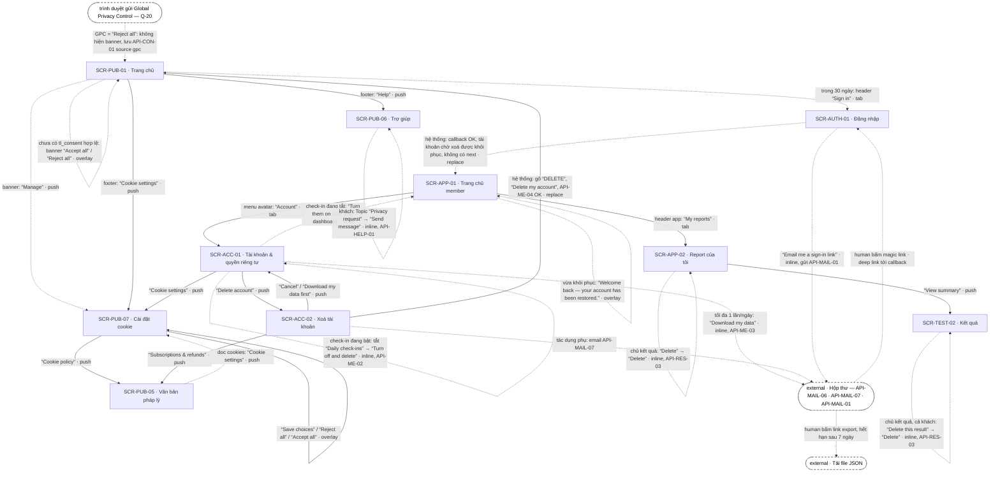

# [FLOW-quyen-rieng-tu] — Consent cookie · export dữ liệu · xoá tài khoản (khôi phục trong 30 ngày)
> Flow niềm tin: khách lần đầu vào site thấy banner consent không chặn trang (trước khi chọn chỉ cookie `necessary` chạy), chọn "Accept all" / "Reject all" / "Manage" ngang hàng và đổi ý bất kỳ lúc nào ở "Cookie settings"; trình duyệt gửi Global Privacy Control (GPC) thì coi như "Reject all", không hiện banner (Q-20). Member tự tải bản sao dữ liệu (JSON, link qua email), tự xoá từng kết quả (cách rút consent dữ liệu nhạy cảm), tắt check-in để rút consent check-in (Q-22) và tự xoá tài khoản: gia hạn Plus dừng ngay, xoá cứng sau 30 ngày, đăng nhập lại trong 30 ngày là khôi phục. Khách tự xoá kết quả trên trình duyệt đã làm bài; muốn bản sao dữ liệu thì tạo tài khoản miễn phí hoặc gửi "Privacy request" ở `/help` (Q-28). Màn chính: [SCR-PUB-07](../screens/SCR-PUB-07-cai-dat-cookie.md) · [SCR-ACC-01](../screens/SCR-ACC-01-tai-khoan.md) · [SCR-ACC-02](../screens/SCR-ACC-02-xoa-tai-khoan.md). Mục lục: [00-so-do-luong-tong](00-so-do-luong-tong.md).
**Changelog** (mới nhất trước)
- 2026-09-28 · v1.3 · claude-opus-5-5 · quyết định 2026-09-28 (AI · uỷ quyền human): KB-5 viết theo rule GPC đã chốt ở SYS-CONSENT (Q-20, D-03 xong); KB-11 theo Q-28 (D-11 xong: khách tự xoá kết quả, tải dữ liệu cần tài khoản miễn phí, hoặc "Privacy request" ở `/help` — BR-PUB-15), thêm nhánh phụ SCR-PUB-06; thêm KB-12 rút consent check-in (Q-22); KB-6 thêm ô 18+ (Q-21 · BR-TEST-11); BR-PUB-11 theo mốc 28 ngày (Q-27); Q-05 · Q-12 · Q-13 · Q-20 · Q-21 · Q-22 · Q-28 đã chốt; AI Notices cập nhật.
- 2026-09-28 · v1.2 · claude-opus-5-5 · D-04 · D-05 đã xử lý (copy banner một nguồn; ft_consent start khi cho phép lần đầu ở SCR-PUB-07). D-16: xác nhận xoá ở SCR-TEST-02 có câu mất report. D-17: overlay khôi phục do shell app hiện.
- 2026-09-28 · v1.1 · claude-opus-5-5 · index §2 đã thêm SCR-APP-02 · SCR-TEST-02 làm nhánh phụ; trỏ tới research pháp lý (GPC, dữ liệu sức khoẻ).
- 2026-09-28 · v1 · claude (subagent) · khởi tạo từ SCR/API docs (file đã được index ở 00-overview §8 và 00-so-do-luong-tong §2 nhưng chưa có).

## 0. Meta

| code | role | screens spanned (SCR-IDs + route) | status | measured-by (funnel §5) | basis (RS path) |
|---|---|---|---|---|---|
| FLOW-quyen-rieng-tu | trust | SCR-PUB-07 `/cookie-settings` · SCR-PUB-05 `/legal/:doc` (`cookies` · `privacy` · `subscriptions`) · SCR-ACC-01 `/account` · `/account#your-data` · SCR-ACC-02 `/account/delete` · SCR-PUB-01 `/` (nhánh phụ SCR-AUTH-01 `/login` · `/login/callback?token=…` · SCR-APP-01 `/app` · `/app#checkin` · SCR-APP-02 `/app/reports` · SCR-TEST-02 `/results/:resultId` — hai màn sau cho xoá từng kết quả · SCR-PUB-06 `/help` — "Privacy request" của khách) | Draft | ft_consent · start → ft_consent · save · ft_data_export · start → ft_data_export · request · ft_account_delete · start → ft_account_delete · confirm (§5; chỉ nhóm đã cho phép analytics — tỉ lệ đồng ý, kể cả phần do GPC, chỉ đo được ở server qua API-CON-01) | `research/apps/testlibrary-web/teardown.md` §4.3 · §4.9 · F-02 · F-13 · F-29 · `research/research-synthesis.md` §3 (Trust "Consent banner + tracking theo consent" · Account "Xoá tài khoản / export dữ liệu") · P-05 · Q-05 · Q-12 · Q-13 · Q-20 · Q-21 · Q-22 · Q-28 · `docs/go-to-market/legal-consent.md` §3 · §3b · §3d |

## 1. Flow diagram

Cạnh liền = luôn đi được; cạnh đứt = có điều kiện (chưa có lựa chọn cookie, trình duyệt gửi GPC, giới hạn 1 export/ngày, trong 30 ngày chờ xoá, là chủ kết quả, check-in đang bật / tắt, là khách) hoặc bước chỉ human làm (mở email, tải file). Vòng tự thân là cạnh không đổi trang: banner GC-ConsentBanner trên SCR-PUB-01 (`overlay`, không có NAV-ID; banner hiện trên mọi trang tới khi có lựa chọn hợp lệ, SCR-PUB-01 chỉ là ví dụ lần vào đầu), NAV-PUB-07-2 (lưu + toast), overlay khôi phục của SCR-APP-01 (EC-11), NAV-APP-02-4 và NAV-TEST-02-10 (xoá kết quả, `inline`), NAV-PUB-06-3 (gửi form liên hệ) và NAV-ACC-01-7 (tắt check-in = rút consent check-in, BR-ACC-07). Cạnh "banner" / "footer" / "header" / "menu avatar" là hành vi của GC hoặc khung SYS-NAV §1, không phải NAV. Cạnh hộp thư → callback là deep link (SYS-NAV §4). Node GPC là tín hiệu của trình duyệt, không phải NAV; rule duy nhất ở SYS-CONSENT (Q-20). "Continue with Google" (NAV-AUTH-01-2) khôi phục giống magic link nên không vẽ. SCR-APP-02 · SCR-TEST-02 là nhánh phụ (index §2 cập nhật 2026-09-28); SCR-PUB-06 là nhánh phụ cho "Privacy request" của khách (Q-28). Route bài `sensitive` không có trên sơ đồ: ở đó "Accept all" vẫn lưu lựa chọn nhưng không tải analytics (KB-6).

| SCR-ID | Route | NAV-ID đi qua | Vai trò trong flow |
|---|---|---|---|
| SCR-PUB-01 | `/` | NAV-ACC-02-1 (vào) · banner, footer "Cookie settings" / "Help", header "Sign in" là khung, không phải NAV | trang vào lần đầu, nơi banner hiện (đại diện cho mọi trang có GC-ConsentBanner + GC-SiteFooter; có GPC thì không hiện); đích sau khi xoá tài khoản, hiện toast (EC-02) |
| SCR-PUB-07 | `/cookie-settings` | NAV-PUB-05-1 · NAV-ACC-01-3 (vào) · NAV-PUB-07-1 · NAV-PUB-07-2 | xem / đổi lựa chọn cookie bất kỳ lúc nào: "Reject all" ngang "Accept all", "Save choices" theo 3 switch; có GPC thì hiện câu giải thích (CMP-09) và vẫn cho bật lại analytics |
| SCR-PUB-05 | `/legal/cookies` · `/legal/privacy` · `/legal/subscriptions` | NAV-PUB-07-1 · NAV-ACC-02-4 (vào) · NAV-PUB-05-1 | chính sách cookie (có link ngược "Cookie settings"), privacy, điều khoản hoàn tiền khi xoá tài khoản |
| SCR-ACC-01 | `/account` · `/account#your-data` | NAV-ACC-02-2 · NAV-ACC-02-3 (vào) · NAV-ACC-01-5 · NAV-ACC-01-1 · NAV-ACC-01-3 · NAV-ACC-01-7 · NAV-ACC-01-8 | trung tâm quyền với dữ liệu: "Download my data", "Delete account", "Cookie settings", tắt check-in = rút consent check-in (KB-12) |
| — (external · hộp thư) | email API-MAIL-06 · API-MAIL-07 · API-MAIL-01 | — (deep link, không có NAV) | link tải export (7 ngày) · xác nhận đã lên lịch xoá + cách khôi phục · magic link để đăng nhập lại |
| — (external · tải file) | link ký tên của file export | — | human tải file JSON |
| SCR-ACC-02 | `/account/delete` | NAV-ACC-01-1 (vào) · NAV-ACC-02-1 · NAV-ACC-02-2 · NAV-ACC-02-3 · NAV-ACC-02-4 | nói rõ hệ quả, cho tải dữ liệu trước, gõ "DELETE", gọi API-ME-04 |
| SCR-AUTH-01 | `/login` · `/login/callback?token=…` · `/login/callback?provider=google&next=…` | NAV-AUTH-01-1 · NAV-AUTH-01-2 · NAV-AUTH-01-3 | nhánh phụ: đăng nhập lại trong 30 ngày = khôi phục (API-AUTH-02 / API-AUTH-04) |
| SCR-APP-01 | `/app` · `/app#checkin` | NAV-AUTH-01-3 · NAV-ACC-01-8 (vào) · menu avatar "Account" và header "My reports" là khung | nhánh phụ: đích mặc định sau khôi phục (overlay EC-11); lối vào tài khoản của member; nơi duy nhất bật lại check-in (KB-12) |
| SCR-APP-02 | `/app/reports` | NAV-APP-02-4 · NAV-APP-02-2 | nhánh phụ: xoá từng kết quả (API-RES-03), cách rút consent dữ liệu nhạy cảm |
| SCR-TEST-02 | `/results/:resultId` | NAV-APP-02-2 (vào) · NAV-TEST-02-10 · NAV-TEST-02-9 (lối ra) | nhánh phụ: xoá kết quả đang xem, kể cả khách trên trình duyệt đã làm bài (cách khách tự xoá dữ liệu, Q-28) |
| SCR-PUB-06 | `/help` | footer "Help" là khung (vào) · NAV-PUB-06-3 | nhánh phụ: khách gửi "Privacy request" để xin bản sao hoặc xoá dữ liệu; trả lời trong 30 ngày (Q-28 · BR-PUB-15) |

## 2. User scenarios

**KB-1 · Happy — khách lần đầu vào site, trả lời banner.** Trình duyệt chưa có cookie `tl_consent` và không gửi GPC (có GPC → KB-5); hành vi giống nhau ở mọi vùng (Q-13).
1. SCR-PUB-01 (vào từ SEO) render. Trước khi chọn chỉ cookie `necessary` chạy: không SDK analytics, 0 request bên thứ ba (BR-APP-05 · tieu-chuan-chung §9 · §10).
2. GC-ConsentBanner variant `default` hiện ở đáy màn (`overlay`: không scrim, không khoá cuộn, không nút ✕ — không có cookie wall, legal-consent §3): "Your cookie choices" · "We use necessary cookies to make this site work. With your permission, we'd also like to use analytics cookies to understand how the site is used. We don't use marketing cookies yet. Your answers never go to advertisers. You can change your choice anytime in Cookie settings." · link "Cookie policy" (→ `/legal/cookies`) · ba nút cùng kiểu, cùng cỡ, cùng hàng "Accept all" · "Reject all" · "Manage" (BR-PUB-13). Bỏ qua banner = vẫn denied, banner hiện lại ở trang sau.
3. "Accept all" → analytics + marketing = granted → ghi `tl_consent` (12 tháng) → ẩn banner → API-CON-01 chạy nền (`consentId`, version, nguồn `banner`) → `AppTracking` tải SDK → ft_consent · start (`from` = banner) + ft_consent · save (`analytics` = granted · `marketing` = granted · `source` = banner) → `screen_active` · `home` một lần; không phát lại event xảy ra trước consent. Screen reader đọc "Your cookie choices are saved." (GC-ConsentBanner §4).
4. Nhánh "Reject all" → analytics + marketing = denied → ghi cookie + API-CON-01 → ẩn banner; không SDK, không event nào, kể cả ft_consent (tracking-events · BR-APP-05). MVP chưa có script marketing nào (Q-12), nên "granted" cho marketing ở bước 3 chưa kích hoạt gì thêm.

**KB-2 · Chọn từng nhóm qua "Manage".**
1. Banner → "Manage" → SCR-PUB-07 `/cookie-settings` (push; banner là GC nên không có NAV-ID). Trang này không hiện banner (`suppressed`).
2. SCR-PUB-07 → H1 "Cookie settings" · "Choose which cookies we can use." · "You can change this at any time." · ba nhóm: "Necessary" (khoá: "Keeps you signed in, remembers your choices and protects forms. Always on.") · "Analytics" (tắt: "Helps us see which pages people use. Never includes your answers, scores or results.") · "Marketing" (tắt: "We don't use marketing cookies yet. If we add any, we'll ask you first."). Switch lấy giá trị từ `tl_consent`, chưa có thì tắt.
3. Bật "Analytics", để "Marketing" tắt → "Save choices" → API-CON-01 (`source` = `settings`, `consentVersion`, `Idempotency-Key`) + cookie `tl_consent` → toast "Your cookie choices are saved." · NAV-PUB-07-2 (overlay · BR-PUB-14). Lần đầu cho phép analytics ngay tại trang này → tải SDK không cần reload, bắn ft_consent · start (`from` = cookie_settings) rồi save (`analytics` = granted · `marketing` = denied · `source` = settings), không bắn bù `screen_active` (EC-04). Lưu ở đây = đã trả lời banner; banner không hiện lại tới khi đổi version (EC-02).
4. (tuỳ chọn) "Cookie policy" → SCR-PUB-05 `doc=cookies` · NAV-PUB-07-1 → trong văn bản "Cookie settings" → SCR-PUB-07 · NAV-PUB-05-1. Văn bản có "Last updated: [date] · Version [n]" (BR-PUB-11).

**KB-3 · Đổi ý sau này — rút analytics.** User đã "Accept all" từ trước.
1. Trang bất kỳ → footer "Cookie settings" → SCR-PUB-07 (khung SYS-NAV §1; có ở cả GC-SiteFooter `full` lẫn `compact`, trừ SCR-TEST-01). Hoặc SCR-ACC-01 → "Cookie settings" · NAV-ACC-01-3; hoặc SCR-PUB-05 `doc=cookies` → "Cookie settings" · NAV-PUB-05-1. Vì analytics đang granted nên có `screen_active` · `cookie_settings` + ft_consent · start (`from` = cookie_settings).
2. SCR-PUB-07 → switch hiện đúng lựa chọn đã lưu → "Reject all" (hoặc tắt "Analytics" rồi "Save choices") → API-CON-01 + `tl_consent` → toast "Your cookie choices are saved." · NAV-PUB-07-2. `AppTracking` ngừng gửi ngay lúc lưu; SDK + cookie analytics bị gỡ ở lần tải trang kế (BR-PUB-14 · EC-03). Không có ft_consent · save vì analytics = denied.
3. Tab khác của site áp dụng lựa chọn mới ở lần điều hướng kế tiếp (EC-06).

**KB-4 · Version consent đổi → hỏi lại.**
1. Nội dung banner hoặc chính sách cookie đổi → tăng version (SYS-CONSENT · Version); `doc=cookies` tăng "Version [n]" (BR-PUB-11).
2. User quay lại, `tl_consent` mang version cũ hơn `consentVersion` hiện hành hoặc đã quá 12 tháng → GC-ConsentBanner variant `re-ask`: thêm "We've updated how we use cookies, so we're asking again." phía trên đoạn thân; mặc định vẫn tắt, không lấy lựa chọn cũ làm sẵn.
3. Trả lời như KB-1 bước 3–4 hoặc KB-2; API-CON-01 ghi lựa chọn kèm version mới. Khoảng giữa lúc đổi version và lúc user trả lời lại: xem AI Notices.

**KB-5 · Trình duyệt gửi Global Privacy Control (Q-20).** Rule duy nhất ở SYS-CONSENT ("GPC · …").
1. Trình duyệt có `navigator.globalPrivacyControl` = true / gửi `Sec-GPC: 1` → consent manager coi như "Reject all": analytics + marketing = denied, không hiện GC-ConsentBanner (kể cả variant `re-ask`), tự ghi `tl_consent` + API-CON-01 chạy nền với `source` = `gpc`. Không SDK, không event nào, kể cả ft_consent (tracking-events).
2. Trình duyệt đã "Accept all" từ trước khi bật GPC → GPC ghi đè lựa chọn "granted" đó ở lần tải trang đầu tiên có GPC: `AppTracking` ngừng gửi, SDK + cookie analytics bị gỡ như khi rút consent (SYS-CONSENT "GPC · ghi đè").
3. User muốn cho phép analytics → footer "Cookie settings" → SCR-PUB-07 (khung SYS-NAV §1) → CMP-09: "Your browser sent a Global Privacy Control signal, so we've turned off analytics and marketing cookies. You can turn analytics back on below if you want to." Switch "Analytics" / "Marketing" đang tắt (SCR-PUB-07 EC-07).
4. Bật "Analytics" → "Save choices" (hoặc "Accept all") → lựa chọn tường minh thắng GPC: API-CON-01 `source` = `settings`, `gpc` = true; tải SDK không cần reload, ft_consent · start (`from` = cookie_settings) + save (`source` = settings) như KB-2 bước 3; CMP-09 ẩn (SCR-PUB-07 EC-08). GPC không ghi đè lựa chọn này tới khi đổi version hoặc quá 12 tháng.
5. Marketing: MVP không có script marketing (Q-12); sau này conversion phía server cũng không chạy cho trình duyệt gửi GPC, kể cả khi đã lưu granted (SYS-CONSENT "GPC · marketing").

**KB-6 · Đã "Accept all" rồi mở bài `sensitive`.**
1. `tl_consent` có analytics = granted → mở SCR-PUB-03 của bài `sensitive` → route không tải SDK analytics, không `screen_active` (BR-PUB-06 · BR-APP-06 · SYS-CONSENT "Tải script"). Tương tự trên SCR-TEST-01 · SCR-TEST-02 · SCR-APP-03 và cả SCR-PAY-01 · SCR-PAY-02 của kết quả thuộc bài đó (BR-APP-06 · tracking-events).
2. Consent dữ liệu nhạy cảm là lớp riêng, tách khỏi cookie: bước "Before you start" của SCR-TEST-01, ô bắt buộc "I'm 18 or older." (không tick sẵn, Q-21 · BR-TEST-11) rồi "I agree — start the test" / "Not now"; `sensitive_consent_version` + thời điểm + `ageConfirmed` gửi trong API-TEST-01 (BR-TEST-04 · legal-consent §3b; chi tiết ở FLOW-lam-bai-mien-phi KB-3). Rút lại bằng cách xoá kết quả (KB-8).
3. Chưa chọn cookie mà vào thẳng route `sensitive` → banner vẫn hiện; "Accept all" lưu lựa chọn nhưng không tải SDK, không bắn ft_consent trên route đó và không hoãn sang route sau (GC-ConsentBanner §4).
4. Rời sang route thường (vd "Privacy policy" → `/legal/privacy` · NAV-TEST-01-7) → analytics chạy lại theo lựa chọn, nhưng `AppTracking` không gửi URL / referrer chứa slug bài (tracking-events "Che URL" · SCR-PUB-05 EC-02).

**KB-7 · Member tải bản sao dữ liệu.**
1. SCR-APP-01 → menu avatar "Account" (khung SYS-NAV §1) → SCR-ACC-01; chưa đăng nhập → `/login?next=/account`. API-ME-01 trả hồ sơ + `lastExportRequestedAt`; ft_data_export · start khi nhóm "Your data" hiện.
2. "Your data" → "Get a copy of your profile, results, answers, check-ins and purchases as a JSON file." → "Download my data" → API-ME-03 · NAV-ACC-01-5 (inline) → "We're preparing your file. We'll email a download link to [email]. The link expires in 7 days."; nút disable tới hết ngày nghiệp vụ (BR-ACC-02). ft_data_export · request.
3. API-JOB-03 dựng file JSON (hồ sơ, kết quả, câu trả lời, check-in, giao dịch; không có dữ liệu thẻ vì thẻ chỉ nằm ở provider) → API-MAIL-06 kèm link ký tên hết hạn sau 7 ngày. File không đính kèm mail, chỉ gửi tới email tài khoản; kết quả bài `sensitive` có trong file vì là dữ liệu của chính user (SCR-ACC-01 EC-04 · EC-08).
4. Hộp thư (human) → bấm link → tải file JSON. Link + file bị xoá sau 7 ngày (legal-consent §1).

**KB-8 · Rút consent dữ liệu nhạy cảm bằng cách xoá một kết quả (nhánh phụ SCR-APP-02 · SCR-TEST-02).**
1. Member: header app "My reports" → SCR-APP-02 → dòng kết quả → "Delete" → xác nhận tại dòng "Delete this result and your answers? This can't be undone." (+ "You'll also lose the full report you unlocked for this result." nếu đã mua lẻ) → "Delete" → API-RES-03 → dòng biến mất + toast "Result deleted." · NAV-APP-02-4 (inline).
2. Hoặc SCR-APP-02 → "View summary" → SCR-TEST-02 · NAV-APP-02-2 → cuối trang "Delete this result" → "Delete this result and your answers? This can't be undone." (+ "You'll also lose the full report you unlocked for this result." nếu đã mua lẻ) → "Delete" → API-RES-03 → "Result deleted." + "Browse all tests" · NAV-TEST-02-10 (inline); "Browse all tests" → SCR-PUB-02 · NAV-TEST-02-9.
3. API-RES-03 xoá cứng ngay kết quả + câu trả lời + report ráp từ kết quả đó: không có 30 ngày chờ, không hoàn tiền tự động cho report đã mua (BR-REP-07 · Q-18). Với bài `sensitive` đây là cách rút consent mà không cần xoá tài khoản (SYS-CONSENT · BR-APP-11). Hành động này không có event analytics.

**KB-9 · Xoá tài khoản khi đang có Plus.**
1. SCR-ACC-01 → "Delete account" → SCR-ACC-02 · NAV-ACC-01-1. ft_account_delete · start.
2. SCR-ACC-02 → "Delete your account" + danh sách hệ quả viết chữ thường: "Your results, reports and check-ins will be deleted." · "If you have Plus, it stops renewing now. You won't be charged again." · "You'll be signed out on all your devices." · "You have 30 days to change your mind — just sign in again to restore your account. After 30 days, everything is permanently deleted, including reports you bought." · "Refunds follow our Subscriptions & refunds policy." · "We'll email you a confirmation." Không có bước giữ chân, không offer, không hỏi lý do.
3. (tuỳ chọn) "Download my data first" → SCR-ACC-01 `#your-data` · NAV-ACC-02-3 → KB-7 bước 2 → quay lại bằng "Delete account" (NAV-ACC-01-1). (tuỳ chọn) "Subscriptions & refunds" → SCR-PUB-05 `doc=subscriptions` · NAV-ACC-02-4.
4. Gõ "DELETE" vào ô "Type DELETE to confirm" (bỏ khoảng trắng đầu/cuối, phân biệt hoa thường) → "Delete my account" bật (BR-ACC-04) → bấm hoặc `Enter` → "Deleting…" → API-ME-04 (`confirm` = "DELETE", `X-CSRF-Token`), chạy theo thứ tự: tắt gia hạn qua provider (BR-APP-04) → đánh dấu chờ xoá, hạn xoá cứng = lúc yêu cầu + 30 ngày → thu hồi mọi `tl_session` → đưa API-MAIL-07 vào hàng đợi (BR-ACC-05).
5. `status` = `scheduled` → ft_account_delete · confirm (bắn trước khi xoá trạng thái đăng nhập ở client) → đặt cờ một lần trong `sessionStorage` → SCR-PUB-01 · NAV-ACC-02-1 (replace; back không quay lại) → toast "Your account is scheduled for deletion. Sign in within 30 days to restore it." (SCR-PUB-01 EC-02).
6. Không đăng nhập lại: quá 30 ngày → API-JOB-04 xoá cứng hồ sơ, kết quả, câu trả lời, check-in, report, PDF cache và file export; đăng nhập lại bằng email đó = tài khoản mới, trống (SCR-ACC-02 EC-04).

**KB-10 · Đổi ý trong 30 ngày → khôi phục (nhánh phụ SCR-AUTH-01 → SCR-APP-01).**
1. SCR-PUB-01 → header "Sign in" → SCR-AUTH-01 → "Email" → "Email me a sign-in link" → "Check your inbox" + "We sent a sign-in link to [email]. It expires in 15 minutes." · NAV-AUTH-01-1 (inline; câu này hiện dù email có tài khoản hay không, BR-AUTH-03). Hoặc "Continue with Google" · NAV-AUTH-01-2 (external).
2. Hộp thư → bấm link trong 15 phút (BR-AUTH-01) → `/login/callback?token=…` → API-AUTH-02: tài khoản đang chờ xoá → huỷ lịch xoá, trả `accountRestored` = true; nhánh Google: API-AUTH-04 thêm `restored=1` (BR-ACC-06 · SCR-AUTH-01 EC-09).
3. Không có `next` → SCR-APP-01 · NAV-AUTH-01-3 (replace) → overlay một lần "Welcome back — your account has been restored.", không chặn thao tác (SCR-APP-01 EC-11). ft_auth · login (`method`).
4. Có Plus: kỳ đã trả còn → quyền `plus` còn tới hết kỳ, gia hạn vẫn tắt; bật lại ở SCR-PAY-03 bằng "Resume renewal" (API-PAY-06 · BR-PAY-12 · SCR-ACC-02 EC-02). Kỳ đã hết → về Free, report mua lẻ vẫn còn (SCR-ACC-02 EC-03).

**KB-11 · Khách (không có tài khoản) — quyền với dữ liệu (Q-28).**
1. Cookie: như KB-1 … KB-5 (banner và SCR-PUB-07 là public). API-CON-01 ghi lựa chọn không gắn tài khoản (SCR-PUB-07 §5 chỉ gắn khi có `tl_session`).
2. Kết quả của khách gắn cookie `tl_guest` (HttpOnly, 30 ngày, SYS-AUTH); SCR-TEST-02 hiện "Saved on this device until [date]"; chưa lưu bằng email thì API-JOB-02 xoá sau 30 ngày (BR-APP-08 · BR-TEST-10 · Q-05).
3. Xoá: mở SCR-TEST-02 trên trình duyệt đã làm bài → "Delete this result" · NAV-TEST-02-10 (API-RES-03 nhận chủ là token `tl_guest`). Đây là cách khách tự xoá dữ liệu, không cần tài khoản (Q-28).
4. Tải toàn bộ dữ liệu cần tài khoản miễn phí: lưu kết quả bằng email ("Email me a link" ở SCR-TEST-02, FLOW-luu-ket-qua-dang-nhap) hoặc mở `/account` → guard `/login?next=/account`; đăng nhập bằng email tạo tài khoản mới và gộp kết quả `tl_guest` của trình duyệt đó (SYS-AUTH · API-AUTH-02), sau đó dùng KB-7 / KB-9. Khách đã checkout thì có sẵn tài khoản theo email thanh toán (SYS-AUTH).
5. Không muốn tạo tài khoản → footer "Help" → SCR-PUB-06 (khung SYS-NAV §1) → form "Contact us", "Topic" = "Privacy request" (phụ: "Ask for a copy of your data or for us to delete it. If you haven't saved your results, include the link to your result so we can find it. We reply within 30 days.") → "Send message" · NAV-PUB-06-3 (inline) → API-HELP-01 `topic` = `privacy_request`; trả lời trong 30 ngày (BR-PUB-15). ft_contact · submit (`topic` = `privacy_request`) chỉ bắn khi analytics đã cho phép.
6. Quyền và thời hạn lưu đọc ở footer "Privacy" → `/legal/privacy`; mô tả của trang này không hứa export cho khách (seo-meta · Q-28).

**KB-12 · Rút consent check-in (Q-22).** Member đã bật check-in qua bước "Turn on daily check-ins?" của SCR-APP-01 (BR-DASH-05; chi tiết ở FLOW-thoi-quen-hang-ngay).
1. SCR-APP-01 → menu avatar "Account" (khung SYS-NAV §1) → SCR-ACC-01 → thẻ "Daily check-ins" → gạt tắt.
2. Xác nhận ngay trong thẻ: "Turn off check-ins and delete your check-in history? Your streak will reset. This can't be undone." · "Turn off and delete" / "Keep check-ins" (BR-ACC-07). "Keep check-ins" → không đổi gì.
3. "Turn off and delete" · NAV-ACC-01-7 (inline) → API-ME-02 → server xoá cứng ngay mọi check-in, streak về 0, "Weekly check-in reminder" về tắt (BR-ACC-07 · BR-ACC-08); widget check-in ở SCR-APP-01 thành thẻ mời bật (BR-DASH-05). ft_checkin · disable (`from` = account) chỉ bắn khi analytics đã cho phép; không gửi giá trị check-in.
4. Bật lại chỉ ở SCR-APP-01: "Turn them on from your dashboard" → `/app#checkin` · NAV-ACC-01-8 → bước "Turn on daily check-ins?" như lần đầu, lưu `checkin_consent_version` + thời điểm mới (BR-ACC-07 · BR-DASH-05 · SYS-CONSENT); lịch sử cũ không quay lại. Export (KB-7) sau khi tắt không còn check-in.

## 3. Cover-case grid (web)

| Case | Handling / N/A vì |
|---|---|
| Happy path | KB-1: banner overlay, 0 request bên thứ ba trước khi chọn (tieu-chuan-chung §9), "Reject all" ngang "Accept all" (BR-PUB-13). KB-7: NAV-ACC-01-5 → API-ME-03 → API-MAIL-06 → tải file. KB-9: NAV-ACC-01-1 → gõ "DELETE" → API-ME-04 → NAV-ACC-02-1 (replace). KB-10: NAV-AUTH-01-3 khôi phục. Khác đối thủ: không banner trong khi Meta Pixel · Bing UET · Google Ads · GA4 chạy ngay (F-02); ~2 event Meta Pixel mỗi câu trả lời (F-13); câu trả lời bị coi là dữ liệu nhạy cảm nhưng "đồng ý khi gửi" và chia sẻ với advertising partners (F-29 · teardown §4.9); profile không có xoá tài khoản hay export (teardown §4.3 · research-synthesis §3) |
| Hết quota / hết credits / free limit | Export tối đa 1 lần / ngày nghiệp vụ: nút disable + "You can request one export per day. Your last request: [date]."; request lọt tới server → 409 kèm export đã có = thành công (BR-ACC-02 · SCR-ACC-01 EC-03). Khôi phục bằng magic link theo hạn mức SYS-AUTH: gửi lại tối đa 3 lần/giờ/email (api-mapping: thêm 20 lần/giờ/IP), vượt → "Too many requests. Please wait a moment and try again." (tieu-chuan-chung §2). Consent cookie, xoá kết quả, xoá tài khoản: docs không đặt hạn mức nào, và không có quyền nào ở đây bị khoá sau gói (Free / Plus như nhau) |
| Guest (chưa đăng nhập) chạm feature cần tài khoản | Banner + SCR-PUB-07 là public, khách chọn được như member; API-CON-01 không gắn tài khoản. Export / xoá tài khoản là route `account` → guard `/login?next=/account` · `/login?next=/account/delete` (SYS-NAV §4). Khách tự xoá kết quả ở SCR-TEST-02 (NAV-TEST-02-10, chủ = `tl_guest`) hoặc để API-JOB-02 xoá sau 30 ngày (BR-APP-08 · BR-TEST-10). Khách không có export tự phục vụ: tải dữ liệu cần tài khoản miễn phí (lưu kết quả bằng email), hoặc gửi "Privacy request" ở `/help` (KB-11 · Q-28 · BR-PUB-15) |
| Rớt mạng giữa chừng | Banner: API-CON-01 lỗi → không báo gì, cookie đã ghi nên lựa chọn có hiệu lực ngay, gửi lại ngầm ở lần tải trang sau với cùng `consentId` (GC-ConsentBanner §3). SCR-PUB-07: API-CON-01 lỗi → state Error, vẫn ghi `tl_consent` và áp dụng ngay, toast "Saved on this device.", bản ghi server gửi lại ở lần tải trang kế. API-ME-03 lỗi → "We couldn't start your export. Please try again."; tải hồ sơ lỗi → "You're offline. Check your connection and try again." (tieu-chuan-chung §2). API-ME-04 lỗi mạng / 5xx / 502 `billing_provider_error` → "We couldn't delete your account right now. Please try again or contact support.", giữ chữ đã gõ, tài khoản không đổi (bước nào lỗi thì dừng, SCR-ACC-02-api). API-RES-03 lỗi → toast "We couldn't delete this result. Please try again.". `cong-nghe-loi §3` không có hàng riêng cho consent / export / xoá; copy lấy từ màn |
| User huỷ giữa chừng (Esc / đóng / rời trang) | Banner không có ✕: bỏ qua = denied, banner hiện lại ở trang sau (GC-ConsentBanner §4). SCR-PUB-07: đổi switch rồi rời trang không bấm lưu → không lưu gì (EC-01). SCR-ACC-02: "Cancel" → SCR-ACC-01 (NAV-ACC-02-2) hoặc back trình duyệt; chưa bấm "Delete my account" thì không có gì thay đổi, không có bước giữ chân. Xác nhận xoá kết quả có "Cancel" tại chỗ (NAV-APP-02-4 · NAV-TEST-02-10); xác nhận tắt check-in có "Keep check-ins" (BR-ACC-07). Đóng tab sau "Download my data" → job vẫn chạy, link tới email (API-JOB-03 → API-MAIL-06). Đã xoá tài khoản rồi đổi ý → đăng nhập lại trong 30 ngày (KB-10) |
| Double-submit / retry (idempotent) | Banner: ba nút khoá ngay sau khi bấm; API-CON-01 idempotent theo UUID client (api-mapping). SCR-PUB-07: 3 nút disable khi đang lưu; `Idempotency-Key` mỗi lần lưu. API-ME-03 theo `userId` + ngày → lặp trả 409 = thành công (00-quy-uoc-api §4–§5). API-ME-04: nút disable từ lần bấm đầu, idempotent theo `userId`, lần gọi sau (vd tab khác) nhận 409 = thành công → cùng replace `/` + toast (SCR-ACC-02 EC-07). API-RES-03 xoá lặp → 404, UI coi như đã xoá: "Result deleted." API-HELP-01 ("Privacy request") idempotent theo UUID client (api-mapping). GPC tự lưu một lần khi áp dụng, không gọi API-CON-01 lại ở mỗi trang (SYS-CONSENT "GPC · lưu") |
| Reload / đóng tab rồi mở lại (state còn không?) | `tl_consent` là cookie 12 tháng → reload giữ lựa chọn, banner không hiện lại; trình duyệt chặn cookie → lựa chọn chỉ giữ trong bộ nhớ trang, lần tải sau banner hiện lại và không tải gì (GC-ConsentBanner §3). SCR-PUB-07 reload → switch theo `tl_consent`, thay đổi chưa lưu mất (EC-01). SCR-ACC-01 reload sau khi yêu cầu export → nút vẫn disable + "You can request one export per day. Your last request: [date]." nhờ `lastExportRequestedAt` (API-ME-01). SCR-ACC-02 reload trước khi xoá → ô trống, nút disable; sau khi xoá → phiên đã bị thu hồi → guard `/login?next=/account/delete`. Toast sau xoá dựa trên cờ một lần trong `sessionStorage`, reload SCR-PUB-01 không hiện lại |
| Mở thẳng URL / link chia sẻ / back-forward vào giữa flow | `/cookie-settings` public, noindex, vào thẳng được (không có banner trên trang này); `/legal/cookies` · `/legal/privacy` index, vào từ SEO. `/account` · `/account#your-data` · `/account/delete` là route `account` → chưa đăng nhập thì `/login?next=…` (SYS-NAV §4); tài khoản đang chờ xoá đi đường này được khôi phục ngay khi đăng nhập rồi về `next`, nhưng trang `next` chưa có overlay xác nhận (AI Notices). Back sau khi xoá không về SCR-ACC-02 (NAV-ACC-02-1 replace); back sau "Cancel" / "Download my data first" về SCR-ACC-02. Link export trong email: mới chỉ biết là link ký tên, hết hạn 7 ngày; hành vi khi hết hạn, khi mở ở trình duyệt khác hay khi tài khoản đang chờ xoá chưa định nghĩa (AI Notices). `/results/:resultId` đã xoá → API-RES-01 404 → giao diện như 403 (SCR-TEST-02 EC-02) |
| Hai tab / hai thiết bị cùng lúc | Lựa chọn cookie theo trình duyệt: tab khác đọc lại `tl_consent` ở lần điều hướng kế (SCR-PUB-07 EC-06); thiết bị khác của cùng tài khoản không nhận lựa chọn (giả định ở GC-ConsentBanner §8, AI Notices). Xoá tài khoản thu hồi mọi phiên → tab / thiết bị khác nhận 401 ở request kế → `/login` (SCR-ACC-02 EC-06); bấm xoá ở hai tab gần như cùng lúc → 409 = thành công (EC-07). Export ở hai tab → cùng một export (SCR-ACC-01 EC-03). Tab A xoá kết quả, tab B đang mở kết quả đó → lần tải kế API-RES-01 trả 404 → giao diện như 403 |
| Timezone / đổi giờ | Giới hạn 1 export mỗi ngày nghiệp vụ tính theo timezone tài khoản (BR-APP-09 · 00-quy-uoc-api §5 · §8); đổi timezone ở cùng trang chỉ có hiệu lực từ ngày kế tiếp, hôm nay vẫn tính theo timezone cũ (BR-ACC-03 · SCR-ACC-01 EC-01). "Your last request: [date]." hiện kiểu "October 12, 2026" theo timezone tài khoản (tieu-chuan-chung §4). Các hạn tuyệt đối tính ở server theo UTC (00-quy-uoc-api §8): link export 7 ngày, hạn xoá cứng = thời điểm yêu cầu + 30 ngày (API-ME-04), `tl_consent` 12 tháng, `expiresAt` 30 ngày của kết quả khách. API-JOB-02 · API-JOB-04 là cron hằng ngày nên xoá ở lần chạy đầu tiên sau hạn. Toast và màn chỉ nói "within 30 days", không hiện ngày cụ thể (AI Notices) |
| Config / giá đổi giữa phiên | Đổi nội dung banner / chính sách → tăng version → banner `re-ask` ở lần tải trang kế (KB-4); trình duyệt gửi GPC thì không hỏi, GPC áp dụng lại với version mới (SYS-CONSENT "GPC · lưu"); văn bản có "Last updated: [date] · Version [n]" (BR-PUB-11). Thêm bất kỳ script marketing nào phải tăng version để hỏi lại (GC-ConsentBanner §8, khớp câu "If we add any, we'll ask you first."); Q-12 (đã chốt) chỉ cho conversion phía server sau consent marketing, không khi có GPC. Banner hiện ở mọi vùng (Q-13). Flow không hiện giá; xoá tài khoản khi có Plus thì hoàn tiền theo `doc=subscriptions` (Q-18), không hoàn tự động |
| Pending / held (webhook chưa về, 3-D Secure) | Flow không có checkout, không 3-D Secure. Các trạng thái chờ: (a) export `queued` → email khi xong (API-JOB-03 → API-MAIL-06); `failed` chưa có copy hay email (AI Notices). (b) Tài khoản "chờ xoá" 30 ngày: mọi phiên bị thu hồi, đăng nhập lại = khôi phục (BR-ACC-06); webhook thanh toán tới trong thời gian này vẫn ghi vào tài khoản đang chờ xoá, khôi phục thì quyền còn, không khôi phục thì bị xoá cùng tài khoản (SCR-ACC-02 EC-08 · BR-APP-01). (c) API-CON-01 lỗi: cookie có hiệu lực trước, server nhận bản ghi sau. (d) Provider không tắt được gia hạn → 502, dừng, không đổi gì — không có trạng thái nửa chừng (SCR-ACC-02 EC-01) |

## 4. BR references

| BR | Tóm tắt | Định nghĩa tại |
|---|---|---|
| BR-PUB-06 | Bài `sensitive`: route không tải analytics; GC-SensitiveNotice trước "Start test" | SCR-PUB-03 §7 |
| BR-PUB-11 | Văn bản pháp lý có ngày cập nhật + version; thay đổi trọng yếu báo subscriber 28 ngày trước (cửa sổ 21–30, Q-27) | SCR-PUB-05 §7 |
| BR-PUB-13 | "Reject all" và "Accept all" cùng cấp độ thị giác | SCR-PUB-07 §7 |
| BR-PUB-14 | Lưu → API-CON-01 + cookie `tl_consent`; rút analytics → gỡ SDK ở lần tải trang kế | SCR-PUB-07 §7 |
| BR-PUB-15 | Form liên hệ `/help` có chủ đề "Privacy request"; trả lời trong 30 ngày; khách kèm link kết quả | SCR-PUB-06 §7 |
| BR-TEST-04 | Bài `sensitive`: không câu nào trước "I agree — start the test"; lưu `sensitive_consent_version` | SCR-TEST-01 §7 |
| BR-TEST-11 | Bài `sensitive`: ô "I'm 18 or older." bắt buộc ở bước consent; chưa tick thì nút bắt đầu khoá; lưu `ageConfirmed` | SCR-TEST-01 §7 |
| BR-TEST-10 | Kết quả khách hết hạn sau 30 ngày nếu chưa lưu; hiện ngày hết hạn | SCR-TEST-02 §7 |
| BR-REP-07 | Xoá một kết quả = xoá cứng kết quả + câu trả lời + report, ngay; cách rút consent bài `sensitive`; không hoàn tiền tự động | SCR-APP-02 §7 |
| BR-ACC-02 | Export JSON (hồ sơ, kết quả, câu trả lời, check-in, giao dịch; không dữ liệu thẻ); link 7 ngày; 1 lần/ngày | SCR-ACC-01 §7 |
| BR-ACC-03 | Đổi timezone áp dụng từ ngày nghiệp vụ kế tiếp | SCR-ACC-01 §7 |
| BR-ACC-04 | Xác nhận xoá bằng gõ đúng "DELETE" (chữ hoa) | SCR-ACC-02 §7 |
| BR-ACC-05 | Xoá = huỷ gia hạn ngay, lên lịch xoá cứng sau 30 ngày (API-JOB-04), đăng xuất mọi thiết bị, gửi API-MAIL-07 | SCR-ACC-02 §7 |
| BR-ACC-06 | Đăng nhập lại trong 30 ngày → khôi phục + "Welcome back — your account has been restored." | SCR-ACC-02 §7 |
| BR-ACC-07 | Tắt check-in ở Account = rút consent → xoá cứng lịch sử check-in ngay, streak về 0; bật lại chỉ ở SCR-APP-01, qua bước consent | SCR-ACC-01 §7 |
| BR-ACC-08 | "Weekly check-in reminder" chỉ khi check-in đang bật; tắt check-in thì tuỳ chọn này về tắt | SCR-ACC-01 §7 |
| BR-DASH-05 | Bật check-in lần đầu có bước consent tường minh; không đồng ý thì không check-in, widget thành thẻ mời bật | SCR-APP-01 §7 |
| BR-AUTH-01 | Magic link hết hạn 15 phút, dùng 1 lần | SCR-AUTH-01 §7 |
| BR-AUTH-03 | Không tiết lộ email có tồn tại hay không — luôn "Check your inbox" | SCR-AUTH-01 §7 |
| BR-PAY-12 | "Resume renewal" chỉ khi còn trong kỳ | SCR-PAY-03 §7 |
| BR-APP-01 | Entitlement do server quyết qua webhook đã verify | 00-overview §5 |
| BR-APP-04 | Huỷ một bước, dùng tới hết kỳ, không bắt nêu lý do | 00-overview §5 |
| BR-APP-05 | Không dữ liệu bài test ở bên thứ ba; tracking không-thiết-yếu chỉ sau consent | 00-overview §5 |
| BR-APP-06 | Bảo vệ bài `sensitive`: consent riêng, disclaimer, route không tải analytics/ads | 00-overview §5 |
| BR-APP-08 | Kết quả khách gắn token cookie; tự xoá sau 30 ngày nếu chưa lưu (Q-05) | 00-overview §5 |
| BR-APP-09 | Ngày nghiệp vụ theo timezone tài khoản | 00-overview §5 |
| BR-APP-11 | Quyền với dữ liệu: export, xoá từng kết quả (API-RES-03), xoá tài khoản; xoá cứng sau 30 ngày, khôi phục bằng đăng nhập lại | 00-overview §5 |

## 5. Funnel

| Bước funnel | Event |
|---|---|
| Banner hiện (lần đầu hoặc `re-ask`) | — không đo được: banner hiện trước consent, không có event, server cũng không ghi lượt hiện |
| Cho phép analytics ở banner (goal nhánh banner) | ft_consent · start (`from` = banner) → ft_consent · save (`analytics` = granted · `marketing`) · `screen_active` của route hiện tại (một lần) |
| Từ chối ở banner / rút analytics | — không event (tracking-events: từ chối thì không có event nào); chỉ còn bản ghi API-CON-01 ở server |
| Trình duyệt gửi GPC (tự lưu denied) | — không event; chỉ bản ghi API-CON-01 `source` = `gpc` ở server |
| Mở cài đặt cookie khi đã granted | `screen_active` · `cookie_settings` · ft_consent · start (`from` = cookie_settings) |
| Lưu ở cài đặt với analytics = granted | ft_consent · save (lần đầu cho phép ngay tại trang: start `from` = cookie_settings bắn ngay trước save, EC-04) |
| Đọc văn bản cookie / privacy | `screen_active` · `legal` (không có param `doc`) |
| Mở tài khoản | `screen_active` · `account` · ft_data_export · start (`from` = account) |
| Yêu cầu export (goal) | ft_data_export · request (success / fail) |
| Mở trang xoá | `screen_active` · `delete_account` · ft_account_delete · start (`from` = account) |
| Xác nhận xoá (goal) | ft_account_delete · confirm (success / fail; bắn trước khi xoá phiên phía client) |
| Khôi phục (đăng nhập lại) | ft_auth · start · ft_auth · magic_link_sent · ft_auth · login (`method`) · `screen_active` · `app_home` — không phân biệt được lượt khôi phục với lượt đăng nhập thường |
| Xoá một kết quả | — không có event (tracking-events không định nghĩa) |
| Gửi "Privacy request" (khách) | ft_contact · start → ft_contact · submit (`topic` = `privacy_request`) |
| Tắt check-in + xoá lịch sử | ft_checkin · disable (`from` = account) |

Đo được gì và không đo được gì: mọi event ở bảng trên chỉ bắn khi trình duyệt đã cho phép analytics (tieu-chuan-chung §10 · tracking-events), còn "Reject all" không để lại event nào, kể cả ft_consent. Vì vậy analytics **không đo được tỉ lệ đồng ý**: không có mẫu số (lượt hiện banner) và không có nhánh từ chối. Tỉ lệ Accept / Reject theo `consentVersion` và nguồn (`banner` / `settings` / `gpc`) chỉ tính được ở server từ bản ghi API-CON-01 (lựa chọn · version · thời điểm · nguồn), và chưa có doc nào định nghĩa báo cáo này (AI Notices). ft_consent · save chỉ cho biết cơ cấu `marketing` trong nhóm đã bật analytics. Tương tự, ft_data_export và ft_account_delete chỉ phản ánh nhóm đã consent; số export, số tài khoản xoá và khôi phục thật phải lấy ở server (yêu cầu của API-ME-03, lịch xoá của API-ME-04, cờ `accountRestored` / `restored=1` của API-AUTH-02 / API-AUTH-04). Bài `sensitive` không bắn event nào (BR-APP-06). Tỉ lệ theo dõi: ft_data_export · start → request (tỉ lệ fail) · ft_account_delete · start → confirm (tỉ lệ fail, nhất là 502 từ provider). Đây là chỉ số sức khoẻ, không phải mục tiêu tăng trưởng: không tối ưu để giảm số người xoá tài khoản (SCR-ACC-02 §1 cấm bước giữ chân). Kiểm tra consent trước launch theo 00-gtm-strategy §6 #8 (trước khi chọn và sau "Reject all": 0 request bên thứ ba, không cookie `_ga*`; route bài `sensitive`: 0 kể cả khi đã "Accept all").

## 6. AI Notices
- **Đã xử lý (2026-09-28) — GPC (Q-20, D-03):** rule duy nhất ở SYS-CONSENT ("GPC · …"); GC-ConsentBanner không hiện khi có GPC; SCR-PUB-07 hiện câu giải thích (CMP-09) và vẫn cho bật lại analytics (EC-07 · EC-08); API-CON-01 ghi `source` = `gpc`. Căn cứ pháp lý (`research/regulatory-landscape.md` §6 · §8 #8) vẫn là `[INFERRED · BK]` chờ verify (`bang-quyet-dinh` §2 #6); quyết định chọn phương án chặt hơn nên verify chỉ có thể nới.
- **Đã xử lý (2026-09-28) — copy banner:** GC-ConsentBanner §1 `body` là nguồn duy nhất; legal-consent §3 chép lại nguyên văn (tieu-chuan-chung §10 chỉ trỏ legal-consent cho danh mục cookie và nút).
- **Gap — khoảng giữa đổi version và trả lời lại:** chưa rõ analytics có tiếp tục chạy theo lựa chọn cũ không. GC-ConsentBanner variant `re-ask` ghi "mặc định vẫn là tắt, không giữ lựa chọn cũ làm sẵn", còn SCR-PUB-07 CMP-03 lấy giá trị ban đầu của switch từ `tl_consent` (có thể là version cũ). Đề xuất: version cũ = chưa chọn (denied) ở banner, SCR-PUB-07 và `AppTracking`.
- **Gap — lựa chọn theo trình duyệt hay theo tài khoản:** API-CON-01 gắn tài khoản khi có `tl_session` (SCR-PUB-07 §5), nhưng lựa chọn chỉ áp dụng qua cookie của trình duyệt (giả định ở GC-ConsentBanner §8, chưa owner doc nào chốt). Hiện tại đăng nhập ở thiết bị mới thì banner hỏi lại.
- **Đã xử lý (2026-09-28) — event consent:** cho phép lần đầu ở SCR-PUB-07 giờ bắn start (`from` = cookie_settings) ngay trước save (SCR-PUB-07 EC-04 · tracking-events), khớp quy ước 1 `start` + ≥ 1 `action`. Khác biệt còn lại có chủ đích: banner bắn bù `screen_active` cho route hiện tại, SCR-PUB-07 thì không (trang cài đặt đã có `screen_active` riêng khi analytics granted từ trước).
- **Gap — đo tỉ lệ đồng ý:** analytics không đo được (§5). Chỉ có bản ghi API-CON-01 ở server, nhưng chưa doc nào định nghĩa báo cáo từ đó; lượt hiện banner không được ghi ở đâu nên không có mẫu số.
- **Gap — "Cookie settings" trên màn làm bài:** SCR-TEST-01 không có footer (GC-SiteFooter §5) nhưng banner vẫn hiện ở đó (GC-ConsentBanner §5): cho consent được ngay trên runner, còn rút consent thì phải rời bài. Owner cần xác nhận có chấp nhận được với quy tắc "Rút consent dễ như lúc cho" (GC-SiteFooter §4) không. Cùng lý do, runner cũng không có "Cancel your plan here" · "Withdraw from contract here" dù BR-APP-14 · SYS-NAV §1 ghi "footer mọi trang" (Q-25); owner BR-APP-14 / GC-SiteFooter cần xác nhận ngoại lệ này.
- **Gap — export:** (a) danh sách field JSON chưa đặc tả (SCR-ACC-01-api AI Notices); phạm vi "profile, results, answers, check-ins and purchases" chưa nói tới các dữ liệu tài khoản khác trong legal-consent §1 (đánh giá report 1–5, tuỳ chọn email, bản ghi consent cookie / `sensitive_consent_version` / `consent_version` gia hạn, tin nhắn liên hệ, lý do huỷ). (b) `status` = `failed` của API-ME-03 không có copy hay email báo lỗi. (c) Link ký tên có cần phiên không, mở sau 7 ngày thấy gì, còn dùng được khi tài khoản đang chờ xoá không. Điểm (c) quan trọng với "Download my data first" rồi xoá ngay: mọi phiên bị thu hồi trước khi email export tới.
- **Gap — xoá từng kết quả:** API-RES-03 (NAV-APP-02-4 · NAV-TEST-02-10) là cách rút consent dữ liệu nhạy cảm (BR-APP-11 · SYS-CONSENT); index §2 đã thêm SCR-APP-02 · SCR-TEST-02 (2026-09-28). Nhóm "Your data" ở SCR-ACC-01 cũng không chỉ tới "My reports" (chỉ có khung header). Câu "You'll also lose the full report you unlocked for this result." đã thêm vào xác nhận xoá ở SCR-TEST-02 (2026-09-28), khớp SCR-APP-02 CMP-05 và field `lostFullReport` của API-RES-03. Hành động này không có event; nếu cần số liệu thì đếm ở server.
- **Đã xử lý (2026-09-28) — overlay khôi phục khi có `next`:** SYS-AUTH giao overlay "Welcome back — your account has been restored." cho shell app, nên trang đích nào sau đăng nhập cũng hiện (kể cả khôi phục qua guard `/login?next=/account`); cờ `accountRestored` (API-AUTH-02) hoặc `restored=1` (API-AUTH-04).
- **Gap — ngày xoá cứng không hiện ở đâu:** toast và SCR-ACC-02 chỉ nói "within 30 days"; nội dung API-MAIL-07 chưa đặc tả (có ghi ngày cụ thể không, có link đăng nhập để khôi phục không).
- **Gap — dữ liệu ngoài DB chính khi xoá tài khoản:** API-JOB-04 (SCR-ACC-02 EC-04) không nói tới event analytics gắn `user_id` (Firebase, thời hạn giữ đề xuất 14 tháng — legal-consent §1), bản ghi API-CON-01 gắn tài khoản, dữ liệu ở vendor email (Q-16), tin nhắn liên hệ (giữ 24 tháng) và cookie `tl_consent` trên trình duyệt. Phần phải giữ đã chốt ở Q-05 (f): chứng từ đơn hàng 7 năm; bằng chứng consent gia hạn 3 năm hoặc 1 năm sau khi hợp đồng kết thúc (lấy mốc dài hơn), giữ cả khi xoá tài khoản. Cần danh sách xoá / giữ đầy đủ ở legal-consent.
- **Đã xử lý (2026-09-28) — check-in (Q-22, D-12):** consent tường minh khi bật check-in lần đầu ở SCR-APP-01 (BR-DASH-05, chi tiết ở FLOW-thoi-quen-hang-ngay); tắt ở SCR-ACC-01 = rút consent, xoá cứng lịch sử ngay (BR-ACC-07, KB-12); legal-consent §1 · §3d đổi căn cứ sang consent. Tắt = NAV-ACC-01-7, bật lại = NAV-ACC-01-8 → SCR-APP-01.
- **Đã xử lý (2026-09-28) — tuổi (Q-21, D-13):** 16+ cho mọi bài (Terms); 18+ cho bài `sensitive` bằng ô "I'm 18 or older." ở bước consent của SCR-TEST-01 (BR-TEST-11), lưu `ageConfirmed`, không thu ngày sinh. Người dưới 18 không bắt đầu được và được chỉ tới nguồn hỗ trợ (SCR-TEST-01 EC-08; KB-6).
- **Đã xử lý (2026-09-28) — quyền của khách (Q-28, D-11):** copy landing đổi thành "Delete your results anytime. Download all your data with a free account."; seo-meta `/legal/privacy` không hứa export cho khách; `/help` có chủ đề "Privacy request", trả lời trong 30 ngày (BR-PUB-15) — KB-11.
- **Gap — xác minh "Privacy request" của khách:** link kết quả chỉ giúp tìm dữ liệu, không chứng minh người gửi là chủ kết quả (link có thể đã bị chia sẻ). Chưa doc nào ghi hỗ trợ xác minh thế nào trước khi gửi bản sao dữ liệu hoặc xoá (vd chỉ gửi bản sao khi yêu cầu đến từ trình duyệt có `tl_guest` của kết quả, hoặc hướng khách tự xoá ở SCR-TEST-02). Owner: SCR-PUB-06 (BR-PUB-15) + legal-consent.
- Q-05 · Q-12 · Q-13 · Q-20 · Q-21 · Q-22 · Q-28 đã chốt (AI · uỷ quyền human 2026-09-28); flow viết theo các quyết định đó.
- Khác đối thủ (research): đối thủ không có banner trong khi pixel quảng cáo chạy ngay (F-02), bắn pixel theo từng câu trả lời (F-13), coi câu trả lời là dữ liệu nhạy cảm nhưng "đồng ý khi gửi" và chia sẻ với advertising partners (F-29 · teardown §4.9), và profile không có xoá tài khoản hay export (teardown §4.3 · research-synthesis §3). Flow này cố ý làm ngược cả bốn điểm (P-05).
