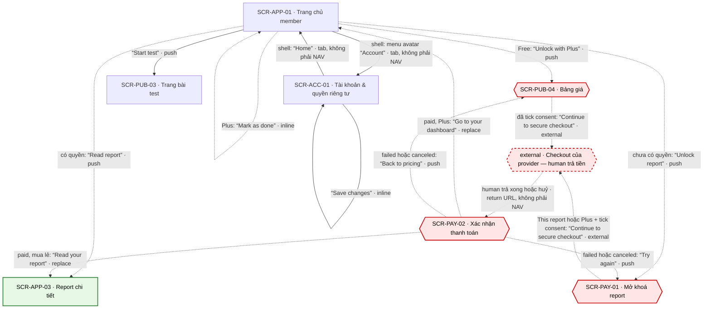

# [FLOW-thoi-quen-hang-ngay] — Check-in hằng ngày + streak · thử thách 30 ngày (Free thấy thẻ khoá)
> Flow giữ chân: mỗi ngày member mở dashboard và check-in một chạm "How focused do you feel today?" để giữ streak và dải "Last 7 days". Tài khoản Plus làm thêm thử thách 30 ngày lấy từ type của kết quả thật, mở từng ngày và làm bù được. Tài khoản Free thấy thẻ thử thách khoá ngay trên dashboard và mở bằng Plus (trang giá → checkout của provider → xác nhận → quay lại ngày 1). Giá trị check-in là dữ liệu nhạy cảm, không bao giờ rời server của mình. Màn chính: [SCR-APP-01](../screens/SCR-APP-01-trang-chu-member.md) · [SCR-PUB-04](../screens/SCR-PUB-04-bang-gia.md) · [SCR-PAY-02](../screens/SCR-PAY-02-xac-nhan-thanh-toan.md). Mục lục: [00-so-do-luong-tong](00-so-do-luong-tong.md).
**Changelog** (mới nhất trước)
- 2026-09-28 · v1.1 · claude-opus-5-5 · D-14: `from` của ft_test / ft_report khi đi từ dashboard đã khớp tracking-events.
- 2026-09-28 · v1 · claude (subagent) · khởi tạo từ SCR/API docs (file đã được index ở 00-overview §8 và 00-so-do-luong-tong §2 nhưng chưa có).

## 0. Meta

| code | role | screens spanned (SCR-IDs + route) | status | measured-by (funnel §5) | basis (RS path) |
|---|---|---|---|---|---|
| FLOW-thoi-quen-hang-ngay | retention | SCR-APP-01 `/app` · SCR-PUB-04 `/pricing` · checkout của provider (external) · SCR-PAY-02 `/checkout/return?session=<id>` (nhánh phụ SCR-PUB-03 `/tests/:slug` · SCR-APP-03 `/app/reports/:reportId` · SCR-PAY-01 `/unlock/:resultId` · SCR-ACC-01 `/account`) | Draft | ft_checkin · start → ft_checkin · submit; ft_challenge · start → ft_challenge · day_complete; ft_unlock · start (`surface` = app_home) → ft_unlock · purchase (§5) | `research/apps/testlibrary-web/teardown.md` §4.3 · §4.6 · F-21 (đối thủ: check-in "How focused have you felt today?" + streak + "Last 7 days"; thử thách 30 ngày mở từng ngày, xoay 4 track, "Miss a day? No guilt"; insight + poll tuần) · `research/research-synthesis.md` P-07 · CS-12 · Q-15 · Q-22 |

## 1. Flow diagram

Cạnh liền = luôn đi được; cạnh đứt = có điều kiện (quyền Free / Plus, trạng thái thanh toán, có hay chưa có quyền report) hoặc bước human. Vòng tự thân trên SCR-APP-01 là hai cạnh `inline`: NAV-APP-01-5 (check-in, mọi tài khoản) và NAV-APP-01-6 ("Mark as done", chỉ `plus`). Vòng trên SCR-ACC-01 là NAV-ACC-01-6 ("Save changes"). Cạnh SCR-APP-01 ↔ SCR-ACC-01 là mục shell (menu avatar "Account", header "Home"; SYS-NAV §1, kiểu `tab`), không phải NAV. SCR-PUB-04 là paywall **soft**: vào từ dashboard thì back trình duyệt về SCR-APP-01 (cột "Back / đóng →" của NAV-APP-01-4), lối free "Take a free test" / "Take a test to unlock" (NAV-PUB-04-1 · NAV-PUB-04-5) vẫn như FLOW-dang-ky-plus. Checkout của provider là bước chỉ human làm (viền đứt). Cạnh `return URL` là deep link (SYS-NAV §4), không phải NAV. Không có cạnh nào từ nhánh làm bài quay lại SCR-APP-01 (xem AI Notices).

| SCR-ID | Route | NAV-ID đi qua | Vai trò trong flow |
|---|---|---|---|
| SCR-APP-01 | `/app` | NAV-AUTH-01-3 · NAV-PAY-02-2 (vào) · NAV-APP-01-5 · NAV-APP-01-6 · NAV-APP-01-4 · NAV-APP-01-1 · NAV-APP-01-2 · NAV-APP-01-3 | màn chính: check-in + streak + dải 7 ngày (CMP-05), thử thách 30 ngày (CMP-06); Free thấy thẻ khoá; đích sau khi mua Plus |
| SCR-PUB-04 | `/pricing` | NAV-APP-01-4 · NAV-PAY-02-4 (vào) · NAV-PUB-04-2 · NAV-PUB-04-3 | paywall soft của Plus: toggle "Monthly" / "Annual", GC-RenewalDisclosure, checkbox consent (chi tiết FLOW-dang-ky-plus) |
| — (external · checkout provider) | domain của provider (Q-04) | NAV-PUB-04-2 · NAV-PAY-01-1 · NAV-PAY-01-2 | human nhập email + thẻ, 3-D Secure nếu có |
| SCR-PAY-02 | `/checkout/return?session=<id>` | NAV-PAY-02-2 · NAV-PAY-02-4 · NAV-PAY-02-1 · NAV-PAY-02-3 | chờ webhook, báo paid + ngày gia hạn kế tiếp; "Go to your dashboard" mở lại dashboard với thử thách đã mở |
| SCR-PUB-03 | `/tests/:slug` | NAV-APP-01-1 (vào) | nhánh phụ: làm bài để có kết quả làm nguồn cho thử thách (tiếp ở FLOW-lam-bai-mien-phi) |
| SCR-APP-03 | `/app/reports/:reportId` | NAV-APP-01-2 · NAV-PAY-02-1 (vào) | nhánh phụ: đọc report của kết quả gần nhất |
| SCR-PAY-01 | `/unlock/:resultId` | NAV-APP-01-3 · NAV-PAY-02-3 (vào) · NAV-PAY-01-1 · NAV-PAY-01-2 | nhánh phụ: mở khoá report gần nhất; chọn "Plus" ở đây cũng mở thử thách |
| SCR-ACC-01 | `/account` | shell menu avatar "Account" (vào) · NAV-ACC-01-6 · NAV-ACC-01-5 | nhánh phụ: đổi "Time zone" (BR-ACC-03), bật "Weekly check-in reminder" (BR-ACC-01), tải dữ liệu có check-in (BR-ACC-02) |

## 2. User scenarios

**KB-1 · Happy — check-in hằng ngày (mọi tài khoản, cả Free).** Tài khoản đã đăng nhập, hôm nay chưa check-in.
1. Vào `/app` (shell "Home", URL, hoặc NAV-AUTH-01-3 sau đăng nhập) → API-APP-01 trả khối `checkin` (`today` = ngày nghiệp vụ theo timezone tài khoản, BR-APP-09) → CMP-05 "How focused do you feel today?" + 5 lựa chọn GC-ScaleInput `emoji5`: "Not at all" · "A little" · "Somewhat" · "Fairly" · "Very" (nhãn chữ luôn hiện, không mức nào chọn sẵn) + "[n]-day streak" + dải "Last 7 days". Widget đặt cao nhất sau lời chào vì là thao tác 1 chạm mỗi ngày; không popup, không banner bán hàng (SCR-APP-01 §3). ft_checkin · start bắn.
2. Chọn "Fairly" → lựa chọn hiện ngay → API-APP-02 (`value` = 4) → server ghi cho ngày nghiệp vụ hiện tại và tính lại streak → "Checked in for today. You can change it until the day ends." + "[n]-day streak" + `last7` mới · NAV-APP-01-5 (inline, BR-DASH-01). ft_checkin · submit chỉ mang `streak_days`, KHÔNG mang mức đã chọn (BR-DASH-04). Bàn phím: mũi tên chỉ di chuyển focus, `Space` / `Enter` chọn; phím 1–5 chỉ có tác dụng khi focus nằm trong nhóm (SCR-APP-01 §9).
3. Đổi ý trong ngày → chọn "Very" → API-APP-02 cập nhật đúng bản ghi hôm nay (idempotent theo `userId` + ngày nghiệp vụ, 00-quy-uoc-api §5), không tạo check-in thứ hai; số ngày trong streak giữ nguyên.

**KB-2 · Quay lại hôm sau · lỡ một ngày (streak về 0).**
1. Ngày nghiệp vụ mới → mở `/app` → CMP-05 chưa chọn mức nào; khi hôm nay chưa check-in, streak vẫn là chuỗi tính tới hôm qua (ví dụ ở API-APP-01: `todayValue` = null, `streakDays` = 4) → ft_checkin · start → chọn một mức → streak tăng thêm một ngày (BR-DASH-01).
2. Lỡ trọn một ngày nghiệp vụ → streak về 0 → CMP-05 hiện "New streak starts today." (`streakDays` = 0; copy trung tính, BR-DASH-01) → check-in → "[n]-day streak" với n = 1. Ngày lỡ có `value` = null trong `last7`; dải "Last 7 days" hiện ô đó thế nào thì chưa định nghĩa (AI Notices).
3. Không có popup hay email nhắc mặc định. Email nhắc chỉ gửi khi user tự bật "Weekly check-in reminder" ở SCR-ACC-01 (mặc định tắt, BR-ACC-01): API-JOB-06 gửi API-MAIL-10 hằng tuần, link tới SCR-APP-01 (api-mapping §2).

**KB-3 · Happy Plus — thử thách 30 ngày từ kết quả thật.** Tài khoản Plus, có ≥ 1 kết quả không `sensitive`, chưa bắt đầu thử thách.
1. SCR-APP-01 → API-APP-01 `challenge.access` = `active`, `card` = ngày 1 → CMP-06 "Day 1 · [action title]" + nội dung hành động + "Mark as done"; ngày chưa mở chỉ hiện ổ khoá. Nội dung là nội dung biên tập theo type của kết quả gần nhất (BR-DASH-02 · TD-02). ft_challenge · start (`day` = 1).
2. "Mark as done" → API-APP-03 (`day` = 1) → server ghi ngày bắt đầu = ngày nghiệp vụ hôm nay (SCR-APP-01 EC-05) → "Done" + "[k] of 30 days done" · NAV-APP-01-6 (inline); "Done" được đọc qua `aria-live="polite"`, focus giữ trên thẻ (SCR-APP-01 §9). ft_challenge · day_complete (`day` = 1). Đã làm hết các ngày đang mở thì thẻ giữ ngày hôm nay ở trạng thái "Done" (quy tắc `card` của API-APP-01).
3. Ngày nghiệp vụ kế tiếp → ngày 2 mở (ngày N mở khi đã qua N−1 ngày nghiệp vụ từ ngày bắt đầu, BR-DASH-02) → "Day [n] · [action title]" với n = 2 → lặp. Xong 30/30 → `access` = `completed` → "You finished the 30-day challenge."; MVP không có vòng mới (SCR-APP-01 EC-09).

**KB-4 · Lỡ vài ngày thử thách → làm bù.**
1. Plus xong ngày 1–2 rồi vắng vài ngày → khi quay lại, mọi ngày đã tới hạn theo BR-DASH-02 đều đã mở; `doneCount` giữ nguyên (thử thách không reset như streak check-in).
2. CMP-06 hiện ngày mở sớm nhất chưa làm trước ("Day [n] · [action title]" với n = 3; `card` của API-APP-01 ưu tiên làm bù) → "Mark as done" → API-APP-03 nhận ngày cũ (làm bù) và trả `card` kế tiếp → lặp tới ngày của hôm nay; mỗi lần "[k] of 30 days done" tăng 1. Đối thủ cũng cho làm bù ("Miss a day? No guilt", teardown §4.3).
3. Ngày chưa tới hạn vẫn khoá. Request cho ngày chưa mở (đồng hồ client lệch) → 422 `day_locked` → tải lại API-APP-01, không có copy.

**KB-5 · Free thấy thẻ khoá → Plus → ngày 1.**
1. SCR-APP-01 (Free, API-APP-01 `challenge.access` = `locked`) → CMP-06 thẻ khoá ngay tại chỗ: "One small action a day for 30 days, based on your latest test result. Included with Plus." + "Unlock with Plus"; không popup (BR-DASH-03). ft_unlock · start (`surface` = app_home) bắn khi thẻ hiện lần đầu trong phiên. Check-in vẫn dùng đủ (KB-1).
2. "Unlock with Plus" → SCR-PUB-04 · NAV-APP-01-4 → thẻ Plus: toggle mặc định "Monthly" (BR-PUB-09), giá + chu kỳ từ API-PAY-01 = placeholder — Q-03 (BR-PUB-07), GC-RenewalDisclosure; bảng so sánh có hàng "30-day challenge" (chỉ Plus) và "Daily check-in and streak" ("With a free account" ở Free). Tick "I understand Plus renews automatically at [price] per [period] until I cancel. I can cancel anytime in Account → Plan & billing." (mặc định không tick) → "Continue to secure checkout" (BR-PUB-10) → API-PAY-02 kèm `consent_version` → trang provider · NAV-PUB-04-2 (external, cùng tab). Chi tiết ở FLOW-dang-ky-plus KB-1 bước 2–4.
3. Provider (human) trả tiền → return → SCR-PAY-02 "Confirming your payment…" → webhook API-HOOK-01 đã verify → quyền `plus` và `challenge` (SYS-ENTITLEMENT · BR-APP-01) → "You're all set" + ngày gia hạn kế tiếp + giá gia hạn + cách huỷ (BR-PAY-09).
4. "Go to your dashboard" → SCR-APP-01 · NAV-PAY-02-2 (replace, BR-PAY-10) → CMP-06 "Day 1 · [action title]" + "Mark as done" → tiếp KB-3 bước 2. Tài khoản chưa có kết quả không `sensitive` → KB-6.

**KB-6 · Plus nhưng chưa có kết quả (hoặc chỉ có kết quả `sensitive`).**
1. SCR-APP-01 state Empty (tài khoản mới, 0 bài) → API-APP-01 `challenge.access` = `no_result` → CMP-06 "Your challenge is built from your latest result. Take a test to start." Không có nội dung chung; đối thủ ghi "built from your results" nhưng tài khoản chưa có kết quả vẫn ra nội dung chung (EV-TLW-213). CMP-03 thành "Take your first test" + "Next: [Test]" + "Start test"; CMP-05 check-in vẫn hiện; ẩn CMP-04.
2. "Start test" (CMP-03) hoặc một thẻ gợi ý CMP-07 (không gồm bài `sensitive`, API-CAT-01 `includeSensitive=false`) → SCR-PUB-03 · NAV-APP-01-1 → FLOW-lam-bai-mien-phi (NAV-PUB-03-1 → NAV-TEST-01-1) → SCR-TEST-02.
3. Về lại `/app` bằng shell (SCR-TEST-02 chỉ có logo → `/`, rồi "Home") → API-APP-01 `access` = `active` → "Day 1 · [action title]" theo type của kết quả vừa có → KB-3.
4. Kết quả gần nhất là bài `sensitive` → thử thách lấy từ kết quả gần nhất KHÔNG `sensitive`, CMP-04 không hiện type (SCR-APP-01 EC-07 · BR-REP-02). Tài khoản chỉ có kết quả `sensitive` vẫn là `no_result` (API-APP-01).

**KB-7 · Từ dashboard: làm bài mới giữa thử thách · đọc hoặc mở khoá report.**
1. Plus đang ở ngày 8 → "Start test" → SCR-PUB-03 · NAV-APP-01-1 → làm bài → có kết quả mới: ngày chưa mở lấy nội dung theo kết quả mới nhất, ngày đã mở giữ nguyên nội dung (SCR-APP-01 EC-06).
2. CMP-04 thẻ report gần nhất có `report.full` (Plus luôn có, SYS-ENTITLEMENT) → "Read report" → SCR-APP-03 · NAV-APP-01-2; back trình duyệt về SCR-APP-01.
3. Free, kết quả chưa mở khoá → "Unlock report" → SCR-PAY-01 · NAV-APP-01-3 → mua lẻ như FLOW-mo-khoa-report KB-1 (NAV-PAY-01-1 → SCR-PAY-02 → "Read your report" · NAV-PAY-02-1); hoặc chọn thẻ "Plus" + tick consent (BR-PAY-02) → "Continue to secure checkout" · NAV-PAY-01-2 → SCR-PAY-02 → "Go to your dashboard" · NAV-PAY-02-2 → report đó và thử thách cùng mở (SCR-PAY-01 EC-12 · SYS-ENTITLEMENT). Thanh toán thất bại → "Try again" → SCR-PAY-01 · NAV-PAY-02-3.

**KB-8 · Đổi timezone ở SCR-ACC-01.**
1. SCR-APP-01 → menu avatar "Account" (shell, SYS-NAV §1) → SCR-ACC-01 → "Time zone" (ghi chú "Used for your daily check-in, streak and reminders.") → chọn timezone mới → "Save changes" → API-ME-02 → toast "Changes saved."; CMP-02 hiện thêm "Your new time zone applies from [date]." · NAV-ACC-01-6 (inline, BR-ACC-03).
2. Timezone mới vào `pendingTimezone`, hiệu lực từ ngày nghiệp vụ kế tiếp tính theo timezone cũ (API-ME-02). Hôm nay check-in, streak và ngày thử thách vẫn theo timezone cũ (SCR-APP-01 EC-02 · SCR-ACC-01 EC-01). Đổi lần hai trong cùng ngày → thay giá trị đang chờ (SCR-ACC-01 EC-02).
3. Cùng form có thể bật "Weekly check-in reminder" (KB-2 bước 3). Lưu lỗi → "We couldn't save your changes. Please try again." (giữ dữ liệu đã nhập). Rời trang khi chưa lưu → hộp `beforeunload` của trình duyệt (SCR-ACC-01 §5.1).
4. Shell "Home" → SCR-APP-01.

**KB-9 · Plus hết kỳ giữa thử thách.**
1. Huỷ gia hạn: SCR-PAY-04 báo trước "After [date], you'll no longer have:" · "The 30-day challenge"; `plus` còn tới hết kỳ đã trả (BR-APP-04 · SYS-ENTITLEMENT) nên thử thách chạy bình thường tới ngày đó.
2. Hết kỳ (hoặc hết ân hạn khi gia hạn thất bại) → mất `plus` và `challenge` → CMP-06 về biến thể Free (thẻ khoá + "Unlock with Plus"), tiến độ giữ nguyên (SCR-APP-01 EC-08). Bấm "Mark as done" đúng lúc mất quyền → API-APP-03 403 `plus_required` → CMP-06 chuyển sang biến thể Free, không hiện lỗi. Check-in + streak không bị ảnh hưởng (quyền `checkin`).
3. Mua lại Plus (KB-5) → làm tiếp từ ngày đang dở (EC-08). Theo BR-DASH-02, các ngày tới hạn trong thời gian không có Plus hiện dưới dạng làm bù (KB-4).

**KB-10 · Dữ liệu check-in là dữ liệu nhạy cảm.**
1. Mức đã chọn chỉ gửi tới API-APP-02 và lưu ở server của mình tới khi xoá tài khoản (cong-nghe-loi §4). ft_checkin chỉ mang `streak_days` (BR-DASH-04 · BR-APP-05 · GC-ScaleInput); legal-consent §1 xếp giá trị check-in vào nhóm "không bao giờ rời hệ thống của mình".
2. SCR-ACC-01 "Download my data" · NAV-ACC-01-5 (inline) → file JSON có cả check-in, link gửi qua email, hết hạn 7 ngày (BR-ACC-02 · BR-APP-11). Xoá tài khoản → "Your results, reports and check-ins will be deleted." (SCR-ACC-02 CMP-03).
3. Căn cứ pháp lý còn mở (Q-22, cần legal review): đề xuất xin consent tường minh lần đầu bật check-in, nhưng SCR-APP-01 chưa có bước đó và cong-nghe-loi §4 / legal-consent §1 đang ghi "hợp đồng". Flow viết theo docs hiện tại, tức không có bước consent (AI Notices).

## 3. Cover-case grid (web)

| Case | Handling / N/A vì |
|---|---|
| Happy path | KB-1 + KB-3: check-in NAV-APP-01-5 (inline, API-APP-02) → "Checked in for today. You can change it until the day ends."; "Mark as done" NAV-APP-01-6 (inline, API-APP-03) → "[k] of 30 days done". KB-5 (Free → Plus): NAV-APP-01-4 → NAV-PUB-04-2 → (provider, human) → return → NAV-PAY-02-2 → "Day 1 · [action title]". Khác đối thủ: thử thách lấy từ type của kết quả thật; chưa có kết quả thì nói thật "Take a test to start." thay vì nội dung chung (EV-TLW-213); không poll cộng đồng (Q-15); thẻ khoá không popup (BR-DASH-03) |
| Hết quota / hết credits / free limit | Check-in + streak mở cho mọi tài khoản (quyền `checkin`, SYS-ENTITLEMENT; SCR-PUB-04 CMP-08 "Daily check-in and streak" = "With a free account"); giới hạn duy nhất là một bản ghi mỗi ngày nghiệp vụ, sửa được trong ngày (BR-DASH-01). Thử thách = quyền `challenge` = `plus`: Free thấy thẻ khoá có mô tả thật (BR-DASH-03) → NAV-APP-01-4. Đã có Plus mở trang giá → "Manage plan" (NAV-PUB-04-3); tab cũ bấm checkout → 422 `already_entitled` (SCR-PUB-04 EC-06). Plus hết kỳ → CMP-06 về biến thể Free, tiến độ giữ nguyên (EC-08 · 403 `plus_required`). Xong 30/30 → "You finished the 30-day challenge.", MVP không có vòng mới (EC-09) |
| Guest (chưa đăng nhập) chạm feature cần tài khoản | `/app` là route `account`: khách → guard `/login?next=/app` (SYS-NAV §4 · tieu-chuan-chung §1), đăng nhập xong quay lại `/app`. Khách không có check-in vì quyền `checkin` gắn với tài khoản (SYS-ENTITLEMENT). Phiên hết hạn (phiên trượt 30 ngày, BR-APP-10) khi đang dùng widget → 401 → `/login?next=/app` (00-quy-uoc-api §4), mức vừa chọn chưa được ghi. Khách mua Plus ở trang giá (Q-11): "Go to your dashboard" — email mới → phiên cấp ngay trên trình duyệt đó, vào thẳng `/app`; email đã có tài khoản → "Check your email to sign in and open your purchase." (SYS-AUTH · SCR-PAY-02 EC-07) |
| Rớt mạng giữa chừng | `cong-nghe-loi §3` không có hàng cho dashboard, nên theo SCR-APP-01: một khối của API-APP-01 lỗi → riêng widget đó "We couldn't load this. Try again." + "Try again", widget khác vẫn dùng được; cả request lỗi → mọi widget như vậy, header vẫn dùng được (state Error · SCR-APP-01-api). API-APP-02 lỗi → lựa chọn hiện ngay rồi trả về giá trị đã lưu + "We couldn't save your check-in." + "Try again" (gửi lại mức vừa chọn, không tạo bản trùng; EC-04 · GC-ScaleInput); gửi lại sau nửa đêm → gap (AI Notices). API-APP-03 lỗi → "We couldn't save that. Try again." Nhánh mua như FLOW-dang-ky-plus: API-PAY-01 lỗi → "We couldn't load prices. Please refresh."; mất mạng ở SCR-PAY-02 → giữ "Confirming your payment…", poll tiếp (SCR-PAY-02 EC-08) |
| User huỷ giữa chừng (Esc / đóng / rời trang) | Check-in và "Mark as done" là thao tác một chạm, không có bước xác nhận để huỷ. Đổi mức check-in trong ngày thì chọn lại (BR-DASH-01); "Mark as done" không có hoàn tác (gap, AI Notices). Rời SCR-PUB-04 lúc nào cũng được: back trình duyệt → SCR-APP-01 (NAV-APP-01-4), không popup giữ chân (BR-PUB-08). Huỷ ở provider → "Checkout canceled. You haven't been charged." → "Back to pricing" (NAV-PAY-02-4); thẻ thử thách vẫn khoá. Rời SCR-ACC-01 khi chưa lưu timezone → hộp `beforeunload`; không lưu thì timezone giữ nguyên |
| Double-submit / retry (idempotent) | API-APP-02 idempotent theo `userId` + ngày nghiệp vụ, server tự suy ra (00-quy-uoc-api §5): bấm nhiều mức liên tiếp vẫn là một bản ghi, lần sau ghi đè lần trước (EC-03). API-APP-03 idempotent theo `userId` + `day`: bấm đúp "Mark as done" → trả trạng thái hiện tại, `doneCount` không tăng hai lần. Nhánh mua: `Idempotency-Key` UUID mỗi lần bấm ở API-PAY-02; webhook idempotent theo `event.id` (API-HOOK-01). "Save changes": API-ME-02 idempotent theo giá trị |
| Reload / đóng tab rồi mở lại (state còn không?) | Còn, vì trạng thái nằm ở server: reload `/app` → API-APP-01 trả lại `todayValue` (hiện đúng mức đã lưu; chưa check-in thì không chọn sẵn, GC-ScaleInput), `streakDays`, `last7`, `challenge.card` + `doneCount`. Lần chọn chưa lưu được (đã trả về giá trị cũ, EC-04) không còn sau reload. Loading: skeleton từng widget (SCR-APP-01 §4). Nhánh mua: reload SCR-PUB-04 → checkbox không tick (BR-PUB-10); reload SCR-PAY-02 → poll lại API-PAY-03 (BR-PAY-07). Reload SCR-ACC-01 → timezone đang chờ đọc lại từ `pendingTimezone` (API-ME-01) |
| Mở thẳng URL / link chia sẻ / back-forward vào giữa flow | `/app` mở từ bookmark hoặc email nhắc hằng tuần API-MAIL-10 → cần phiên, guard như hàng Guest; `/app` là `noindex`, không có gì để chia sẻ. Không có route riêng cho một ngày thử thách hay lịch sử check-in (SYS-NAV §4). Check-in và "Mark as done" là `inline`, không đổi URL, nên back trình duyệt không hoàn tác chúng (SYS-NAV §2). Back sau "Go to your dashboard" không về màn chờ (NAV-PAY-02-2 replace · BR-PAY-10 · SCR-PAY-02 EC-12). Back từ SCR-PUB-03 / SCR-APP-03 / SCR-PAY-01 / SCR-PUB-04 → SCR-APP-01 (NAV-APP-01-1 · NAV-APP-01-2 · NAV-APP-01-3 · NAV-APP-01-4) |
| Hai tab / hai thiết bị cùng lúc | Hai tab hoặc hai máy cùng check-in → một bản ghi cho ngày đó, lần sau ghi đè (EC-03); widget ở tab kia chỉ đúng lại sau khi tải lại API-APP-01 (chưa có đồng bộ tab cho dashboard; chỉ đăng xuất đồng bộ qua sự kiện `storage`, tieu-chuan-chung §1). "Mark as done" cùng ngày ở hai máy → idempotent theo `userId` + `day`. Mua Plus ở tab khác → tab SCR-APP-01 vẫn hiện thẻ khoá tới khi tải lại; quyền ở server (SYS-ENTITLEMENT). Máy ở múi giờ khác → "hôm nay" vẫn theo timezone tài khoản, không theo đồng hồ máy (BR-APP-09) |
| Timezone / đổi giờ | Cốt lõi của flow: streak, ngày thử thách, ngày bắt đầu thử thách và email nhắc đều theo timezone tài khoản (BR-APP-09 · SCR-APP-01 EC-05), mặc định là timezone trình duyệt lúc tạo tài khoản. Check-in sát nửa đêm → server tính ngày lúc nhận request, widget theo `day` trong phản hồi (EC-01). Ngày thử thách chưa mở do đồng hồ client lệch → 422 `day_locked` → tải lại (API-APP-03). Đổi timezone ở SCR-ACC-01 → hiệu lực từ ngày nghiệp vụ kế tiếp; hôm nay và streak hôm nay không đổi (BR-ACC-03 · EC-02 · KB-8). Đổi làm nhảy / lặp ngày lịch, và tài khoản sinh từ webhook không có timezone trình duyệt → gap (AI Notices) |
| Config / giá đổi giữa phiên | Câu hỏi check-in cố định trong MVP, bộ nhãn mặc định `emoji5` (SCR-APP-01 AI Notices); đối thủ đổi câu mỗi ngày ("Come back tomorrow for a new question.", teardown §4.6). Nội dung ngày thử thách là nội dung biên tập theo type (TD-02); làm bài mới giữa chừng → ngày chưa mở theo kết quả mới, ngày đã mở giữ nguyên (EC-06); nội dung thử thách chưa có version (gap). Nhánh mua: giá = placeholder — Q-03, luôn lấy từ API-PAY-01 (BR-PUB-07); giá hoặc câu consent đổi giữa lúc tick và lúc bấm → 422 `price_changed` / `consent_outdated` → "Prices or renewal terms have changed. Please review and tick the box again." (SCR-PUB-04 §5.2) |
| Pending / held (webhook chưa về, 3-D Secure) | Check-in và thử thách không có trạng thái chờ: API-APP-02 / API-APP-03 ghi đồng bộ. Nhánh Free → Plus: 3-D Secure xảy ra ở trang provider trước return; webhook chưa về → SCR-PAY-02 "Confirming your payment…", poll 2 s tối đa 30 s → "Your payment is still processing. We'll email you as soon as your Plus plan is active." (`cong-nghe-loi §3` · BR-PAY-08); "Go to your dashboard" chỉ hiện khi paid (BR-PAY-07). User tự vào `/app` lúc đang chờ → CMP-06 không có biến thể chờ, vẫn hiện "Unlock with Plus" → có thể mua trùng (gap, AI Notices) |

## 4. BR references

| BR | Tóm tắt | Định nghĩa tại |
|---|---|---|
| BR-DASH-01 | Check-in 1 lần / ngày nghiệp vụ, sửa được trong ngày; streak = số ngày liên tiếp; lỡ 1 ngày → 0 + "New streak starts today." | SCR-APP-01 §7 |
| BR-DASH-02 | Ngày N mở khi đã qua N−1 ngày nghiệp vụ từ ngày bắt đầu; làm bù được; nội dung theo type của kết quả gần nhất (TD-02) | SCR-APP-01 §7 |
| BR-DASH-03 | Free thấy thẻ thử thách khoá kèm mô tả thật, không popup | SCR-APP-01 §7 |
| BR-DASH-04 | Giá trị check-in không gửi analytics | SCR-APP-01 §7 |
| BR-ACC-01 | Email giao dịch + nhắc gia hạn không tắt được; email không thiết yếu (có "Weekly check-in reminder") mặc định tắt | SCR-ACC-01 §7 |
| BR-ACC-02 | Export JSON gồm cả check-in; 1 lần / ngày; link hết hạn 7 ngày | SCR-ACC-01 §7 |
| BR-ACC-03 | Đổi timezone áp dụng từ ngày nghiệp vụ kế tiếp, không phá streak hôm nay | SCR-ACC-01 §7 |
| BR-PUB-07 | Giá / chu kỳ lấy từ API-PAY-01, không hard-code; placeholder tới Q-03 | SCR-PUB-04 §7 |
| BR-PUB-08 | Không đồng hồ, không "X just bought", không giá gạch, không logo "featured in" | SCR-PUB-04 §7 |
| BR-PUB-09 | Toggle mặc định Monthly; số tiết kiệm của Annual tính từ 00-overview §2 | SCR-PUB-04 §7 |
| BR-PUB-10 | Nút checkout Plus disable tới khi tick consent; gửi `consent_version` | SCR-PUB-04 §7 |
| BR-PAY-02 | Plus trên trang mở khoá: consent verbatim + `consent_version` | SCR-PAY-01 §7 |
| BR-PAY-07 | Chỉ hiện "paid" khi webhook xác nhận; URL không mở quyền | SCR-PAY-02 §7 |
| BR-PAY-08 | Poll mỗi 2 s tối đa 30 s; quá hạn → "still processing" + email | SCR-PAY-02 §7 |
| BR-PAY-09 | Plus: hiện ngày gia hạn kế tiếp + giá gia hạn + cách huỷ | SCR-PAY-02 §7 |
| BR-PAY-10 | Rời màn xác nhận bằng replace | SCR-PAY-02 §7 |
| BR-REP-02 | Bài `sensitive` không hiện type (CMP-04 của dashboard áp như vậy) | SCR-APP-02 §7 |
| BR-REP-07 | Xoá một kết quả = xoá cứng kết quả + câu trả lời + report ráp từ nó | SCR-APP-02 §7 |
| BR-APP-01 | Entitlement do server quyết qua webhook đã verify | 00-overview §5 |
| BR-APP-02 | Công bố gia hạn ở mọi bề mặt tiền | 00-overview §5 |
| BR-APP-03 | Consent gia hạn tường minh, checkbox không tick sẵn | 00-overview §5 |
| BR-APP-04 | Huỷ một bước, dùng tới hết kỳ | 00-overview §5 |
| BR-APP-05 | Không dữ liệu bài test ở bên thứ ba; tracking chỉ sau consent | 00-overview §5 |
| BR-APP-06 | Bảo vệ bài `sensitive` (không gợi ý ở dashboard: API-CAT-01 `includeSensitive=false`) | 00-overview §5 |
| BR-APP-09 | Streak, ngày thử thách, email nhắc theo timezone tài khoản | 00-overview §5 |
| BR-APP-10 | Magic link 15 phút, dùng 1 lần; phiên trượt 30 ngày | 00-overview §5 |
| BR-APP-11 | User tự export dữ liệu, xoá kết quả, xoá tài khoản | 00-overview §5 |

## 5. Funnel

| Bước funnel | Event |
|---|---|
| Vào dashboard | `screen_active` · `app_home` |
| Widget check-in hiện, hôm nay chưa check-in | ft_checkin · start |
| Check-in (goal) | ft_checkin · submit (success / fail · `streak_days`) |
| Thẻ ngày thử thách hiện (Plus) | ft_challenge · start (`day`) |
| Xong một ngày thử thách (goal) | ft_challenge · day_complete (success / fail · `day`) |
| Free thấy thẻ thử thách khoá | ft_unlock · start (`surface` = app_home) |
| Xem trang giá | `screen_active` · `pricing` · ft_unlock · start (`surface` = pricing) |
| Mở checkout | ft_unlock · checkout_open (`plan_key` = plan.plus.monthly hoặc plan.plus.annual) |
| Trạng thái cuối mua Plus | ft_unlock · purchase (success / fail / pending · `plan_key`) · `screen_active` · `checkout_return` |
| Nhánh phụ | ft_test · start (`from` = app_home) · `screen_active` · `report` · ft_report · start · `screen_active` · `unlock` · `screen_active` · `account` |

Tỉ lệ theo dõi: ft_checkin · start → ft_checkin · submit success (tỉ lệ check-in trong ngày) · phân bố `streak_days` · tỉ lệ quay lại `app_home` sau 1 ngày và 7 ngày theo `user_id` · ft_challenge · day_complete theo `day` (đường rơi từ ngày 1 tới ngày 30) · ft_unlock · start (`surface` = app_home) → checkout_open → purchase success (chuyển đổi từ thẻ khoá) · purchase success → ft_challenge · day_complete (`day` = 1) trong 24 giờ. Mọi event chỉ bắn sau consent analytics (tieu-chuan-chung §10). Không param nào mang mức check-in, type hay điểm (BR-DASH-04 · BR-APP-05). `from` = app_home của ft_test · start được router state mang qua SCR-PUB-03; ft_report · start có `from` = app_home (tracking-events, 2026-09-28).

## 6. AI Notices
- **Gap — consent cho check-in (Q-22, Mở):** research pháp lý 2026-09-28 nghiêng về coi check-in cảm xúc là dữ liệu sức khoẻ (WA My Health My Data, GDPR Điều 9 — `research/regulatory-landscape.md` §5 · §8 #10, `[INFERRED · BK]` chưa verify). Q-22 đề xuất xin consent tường minh lần đầu bật check-in, nhưng SCR-APP-01 CMP-05 không có bước consent, API-APP-02 không có field version consent, còn cong-nghe-loi §4 và legal-consent §1 ghi căn cứ "hợp đồng". Flow viết theo docs hiện tại. Nếu human chốt consent thì cần: state "chưa đồng ý" + copy cho CMP-05, version consent ở API-APP-02, cách rút consent (xoá lịch sử check-in; chưa có API, BR-APP-11 chỉ nói xoá kết quả / tài khoản), và điều kiện bắn ft_checkin · start.
- **Gap — thẻ thử thách khi webhook Plus chưa về:** API-APP-01 `challenge.access` chỉ có `locked` · `no_result` · `active` · `completed`; CMP-06 không có dạng "Confirming your payment…" như CMP-04 (SCR-APP-01 EC-10). User rời SCR-PAY-02 lúc "still processing" rồi vào `/app` sẽ thấy lại "Unlock with Plus". API-PAY-02 `purchase_pending` chỉ chặn cùng `planKey` (mua "Annual" sau "Monthly" vẫn lọt) và trả copy nói về report. Đề xuất thêm `challenge.access = pending` + dùng copy Plus của cong-nghe-loi §3.
- **Gap — không có lối về dashboard sau khi làm bài:** SCR-TEST-02 dùng header `minimal` (logo → `/`) và không có NAV tới SCR-APP-01, nên user Plus `no_result` (KB-6) phải về qua `/` rồi shell "Home". CMP-06 `no_result` cũng không có nút riêng; lối làm bài là CMP-03 "Start test" (NAV-APP-01-1). Owner SCR-TEST-02 / SCR-APP-01 cần quyết có thêm cạnh hay không.
- **Gap — "Try again" check-in qua nửa đêm:** API-APP-02 không nhận `day`; server lấy ngày nghiệp vụ lúc nhận request (EC-01). Mức chọn trước nửa đêm bị lỗi mạng, gửi lại sau nửa đêm (EC-04) sẽ thành check-in của ngày mới, ngày cũ để trống, streak có thể đứt. Chưa có rule: bỏ lần gửi lại, hay ghi cho ngày cũ trong một khoảng ân hạn.
- **Gap — đổi timezone làm nhảy hoặc lặp ngày lịch:** BR-ACC-03 chỉ nói hiệu lực từ ngày kế tiếp theo timezone cũ. Chưa nói khi ngày lịch đầu tiên theo timezone mới đã qua (đổi sang phía đông nhiều giờ) hoặc bị lặp (đổi sang phía tây): streak có đứt không, ngày thử thách N có mở sớm / muộn một ngày không.
- **Gap — timezone của tài khoản sinh từ webhook:** như FLOW-mo-khoa-report, khách mua Plus bằng email mới không có timezone trình duyệt lúc tài khoản được tạo, nên ngày nghiệp vụ của check-in và thử thách chưa xác định (BR-APP-09).
- **Gap — không hoàn tác "Mark as done":** API-APP-03 chỉ có complete; bấm nhầm không sửa được, trong khi check-in sửa được trong ngày.
- **Gap — dải "Last 7 days":** chưa định nghĩa dải có gồm hôm nay không, và hiện mức đã chọn hay chỉ hiện có / không (API-APP-01 `last7` trả `value` 1–5).
- **Gap — nội dung thử thách:** nội dung ngày (`title` · `body`, TD-02) chưa được viết và chưa có version như `contentVersion` của report (BR-REP-03), nên chưa rõ khi biên tập sửa nội dung thì ngày đã mở có đổi không. BR-DASH-02 nói "theo type", nhưng bài không có type dùng tên dải điểm (SCR-TEST-02 CMP-02). Xoá kết quả nguồn giữa thử thách (BR-REP-07 · API-RES-03) chưa có rule. Việc bỏ bài `sensitive` khỏi nguồn thử thách là đề xuất in-house theo Q-06, cần duyệt (SCR-APP-01 AI Notices).
- **Tracking:** đã xử lý 2026-09-28 — ft_test · start `from` = app_home được router state mang qua SCR-PUB-03 (NAV-APP-01-1); ft_report · start có `from` = app_home (NAV-APP-01-2). Còn mở: ft_challenge · start ("thẻ ngày thử thách hiện") chưa có luật chống bắn lặp khi reload.
- Poll cộng đồng hằng tuần của đối thủ (EV-TLW-212) để v1.x (Q-15). Đối thủ xoay 4 track; mình chưa định nghĩa track, nội dung đi theo type của kết quả (TD-02).
