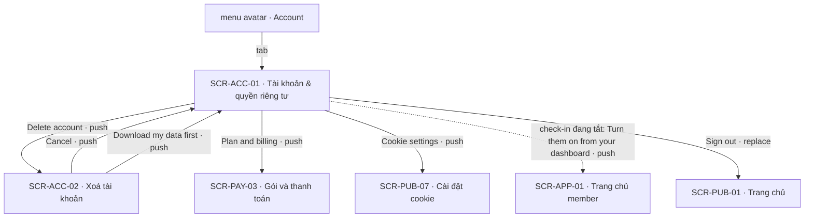
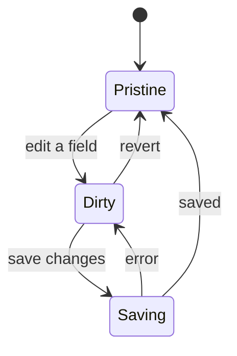
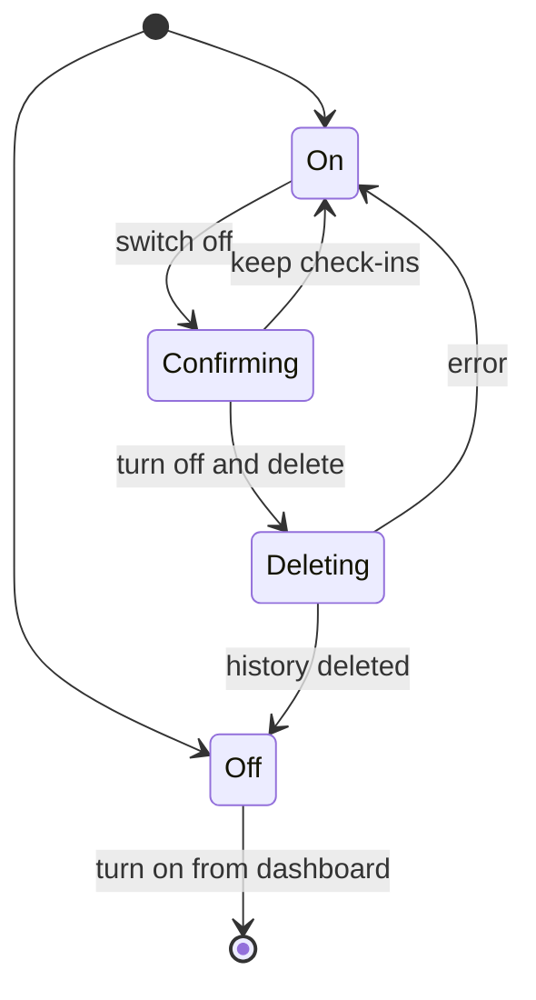

# [SCR-ACC-01] Tài khoản & quyền riêng tư — FULL

## 0. General

| id | module | doc level | platforms | route | access | indexable | viewports | related FLOW | status | design | tracking | api | Evidence / visual basis |
|---|---|---|---|---|---|---|---|---|---|---|---|---|---|
| SCR-ACC-01 | ACC | Full | Web | `/account` | account | noindex | 390 · 768 · 1280 | FLOW-quyen-rieng-tu · FLOW-thoi-quen-hang-ngay | Draft | (sau design) | `tracking-events.md` → `account` · ft_data_export · ft_auth · ft_checkin | `docs/api/SCR-ACC-01-api.md` | **EV-TLW-246 · SC-TLW-26 · basis research-synthesis §3 · BR-APP-11 · Q-05 · Q-22** |

**Changelog** (mới nhất trước)
- 2026-09-28 · v1.2 · claude-opus-5-5 · Q-22 (consent check-in, giải quyết D-12): thêm CMP-10 "Daily check-ins" (tắt = rút consent, xác nhận "Turn off and delete", xoá cứng lịch sử ngay), BR-ACC-07 · BR-ACC-08, NAV-ACC-01-7 · 8 (bật lại ở SCR-APP-01 `/app#checkin`), EC-10…15 (EC-15: chờ đồng ý bản mới của câu đồng ý), ft_checkin disable; "Weekly check-in reminder" chỉ khi check-in đang bật, không gửi khi đang chờ đồng ý lại; Q-16: vendor email = Postmark. BR-ACC-07: tắt check-in xoá luôn file export còn hạn (BR-APP-11).
- 2026-09-28 · v1.1 · claude-opus-5-5 · AI Notice cũ: job + email nhắc check-in hằng tuần đã có (API-JOB-06 · API-MAIL-10).
- 2026-09-27 · v1 · claude (subagent) · khởi tạo từ blueprint.

## 1. Purpose & context

Trang tài khoản, chứa hồ sơ (tên, email chỉ đọc, timezone), tuỳ chọn email, công tắc check-in hằng ngày, quyền với dữ liệu (tải bản sao JSON), link xoá tài khoản, link gói & thanh toán, cài đặt cookie và đăng xuất. Trang profile của đối thủ chỉ có Name · Email · Change password · Plan details · Logout, không có export hay xoá dữ liệu (EV-TLW-246 · research-synthesis §3). Mình không dùng mật khẩu (magic link + Google, SYS-AUTH), nên không có mục đổi mật khẩu. Email giao dịch và email nhắc gia hạn luôn được gửi; email không-thiết-yếu mặc định tắt (BR-ACC-01). Timezone quyết định ngày nghiệp vụ của check-in, streak và email nhắc (BR-APP-09). Đổi timezone chỉ có hiệu lực từ ngày kế tiếp (BR-ACC-03). Check-in là dữ liệu nhạy cảm dựa trên consent (Q-22): bật ở SCR-APP-01 qua bước đồng ý; tắt ở đây có bước xác nhận và xoá cứng lịch sử check-in ngay (BR-ACC-07). · basis BR-APP-11 · BR-APP-09 · Q-05 · Q-16 · Q-22

## 2. Điều hướng

### 2.1 Vào

| Vào qua | Từ | Trigger |
|---|---|---|
| NAV-ACC-02-2 | SCR-ACC-02 | "Cancel" |
| NAV-ACC-02-3 | SCR-ACC-02 | "Download my data first" (`#your-data`) |
| entry ngoài | menu avatar "Account" · drawer app @390 · URL trực tiếp; chưa đăng nhập → `/login?next=/account` | SYS-NAV §1 · SYS-NAV §4 |

### 2.2 Ra

| NAV-ID | Tới (SCR-ID · tham số) | Trigger (CMP-ID "nhãn") | Kiểu | URL / history | Animation | Back / đóng → | Guard / điều kiện | Nền tảng | Basis |
|---|---|---|---|---|---|---|---|---|---|
| NAV-ACC-01-1 | SCR-ACC-02 | CMP-06 "Delete account" | push | `/account/delete` (push) | mặc định | back trình duyệt → SCR-ACC-01 | — | Web | BR-APP-11 |
| NAV-ACC-01-2 | SCR-PAY-03 | CMP-07 "Plan & billing" | push | `/account/billing` (push) | mặc định | back trình duyệt → SCR-ACC-01 | — | Web | BR-APP-02 |
| NAV-ACC-01-3 | SCR-PUB-07 | CMP-08 "Cookie settings" | push | `/cookie-settings` (push) | mặc định | back trình duyệt → SCR-ACC-01 | — | Web | SYS-CONSENT |
| NAV-ACC-01-4 | SCR-PUB-01 | CMP-09 "Sign out" | replace | `/account` → `/` (replace) | mặc định | back KHÔNG quay lại trang tài khoản | — | Web | BR-APP-10 |
| NAV-ACC-01-5 | (cùng màn) yêu cầu export | CMP-05 "Download my data" | inline | không đổi URL | mặc định | — | tối đa 1 lần/ngày | Web | BR-APP-11 |
| NAV-ACC-01-6 | (cùng màn) lưu hồ sơ | CMP-03 "Save changes" | inline | không đổi URL | mặc định | — | form hợp lệ | Web | in-house |
| NAV-ACC-01-7 | (cùng màn) tắt check-in + xoá lịch sử check-in | CMP-10 gạt "Daily check-ins" → xác nhận "Turn off and delete" | inline | không đổi URL | mặc định | — | check-in đang bật | Web | BR-ACC-07 · Q-22 |
| NAV-ACC-01-8 | SCR-APP-01 · `#checkin` | CMP-10 "Turn them on from your dashboard" | push | `/app#checkin` (push) | mặc định | back trình duyệt → SCR-ACC-01 | check-in đang tắt | Web | BR-ACC-07 · BR-DASH-05 |

### 2.3 Diagram

## 3. Layout & UI components

- **Design brief @390 (top→bottom):**
  - header app;
  - H1 "Account";
  - nhóm "Profile": "Name" → "Email" (chỉ đọc) → "Time zone";
  - nhóm "Emails": toggle "Product updates" + toggle "Weekly check-in reminder" (chỉ khi check-in đang bật, BR-ACC-08) + ghi chú email thanh toán luôn gửi;
  - nút "Save changes" (lưu cả hai nhóm trên), full width; dính đáy màn khi form có thay đổi chưa lưu;
  - thẻ "Daily check-ins" (CMP-10): đang bật → toggle + ghi chú, gạt tắt thì xác nhận ngay trong thẻ; đang tắt → dòng trạng thái + link sang dashboard để bật; tác dụng ngay, không qua "Save changes";
  - nhóm "Your data" (anchor `#your-data`): mô tả → nút "Download my data" → link "Delete account" (màu `color.danger`);
  - hàng link: "Plan & billing" · "Cookie settings";
  - nút "Sign out" ở cuối trang.
- **Delta 1280:** 1 cột căn giữa, rộng tối đa `layout.reading-width`. Mỗi nhóm là một thẻ. Nút "Save changes" nằm cuối nhóm "Emails", không dính đáy.

| CMP-ID | Component | Display condition | Copy verbatim (en-US) | Basis (EV / Q) |
|---|---|---|---|---|
| CMP-01 | Header | luôn | GC-SiteHeader (app) | SYS-NAV §1 |
| CMP-02 | Hồ sơ | luôn | tiêu đề nhóm "Profile" · ô "Name" (tuỳ chọn, ≤ 80 ký tự) · "Email" (chỉ đọc) + ghi chú "This is the email you sign in with." · chọn "Time zone" (danh sách IANA kèm độ lệch UTC) + ghi chú "Used for your daily check-in, streak and reminders." · khi có timezone chờ áp dụng: "Your new time zone applies from [date]." | EV-TLW-246 · BR-APP-09 · BR-ACC-03 |
| CMP-03 | Nút lưu | luôn; disable khi chưa có thay đổi | "Save changes" · đang lưu: spinner trong nút · xong: toast "Changes saved." | in-house |
| CMP-04 | Tuỳ chọn email | luôn | tiêu đề nhóm "Emails" · toggle "Product updates" (mặc định tắt) · toggle "Weekly check-in reminder" (mặc định tắt; chỉ hiện khi check-in đang bật) · ghi chú "Billing and renewal emails are always sent." | BR-ACC-01 · BR-ACC-08 · Q-16 |
| CMP-05 | Dữ liệu của bạn | luôn; anchor `#your-data` | tiêu đề "Your data" · "Get a copy of your profile, results, answers, check-ins and purchases as a JSON file." · nút "Download my data" · sau khi yêu cầu: "We're preparing your file. We'll email a download link to [email]. The link expires in 7 days." · đã yêu cầu trong ngày: nút disable + "You can request one export per day. Your last request: [date]." | BR-ACC-02 · BR-APP-11 |
| CMP-06 | Link xoá tài khoản | luôn | "Delete account" | BR-APP-11 |
| CMP-07 | Link gói | luôn | "Plan & billing" | BR-APP-02 |
| CMP-08 | Link cookie | luôn | "Cookie settings" | SYS-CONSENT |
| CMP-09 | Đăng xuất | luôn | "Sign out" | BR-APP-10 |
| CMP-10 | Check-in hằng ngày | luôn; thẻ riêng, tác dụng ngay (không qua "Save changes") | đang bật: toggle "Daily check-ins" (bật) + ghi chú "Your check-ins are used only for your streak and your last 7 days. Turning them off deletes your check-in history." · gạt tắt → xác nhận ngay trong thẻ: "Turn off check-ins and delete your check-in history? Your streak will reset. This can't be undone." + nút "Turn off and delete" (`color.danger`) · "Keep check-ins" · xong: toast "Check-ins turned off. Your check-in history has been deleted." · lỗi: "We couldn't turn off check-ins. Please try again." · đang tắt (chưa bật lần nào, đã chọn "Not now", hoặc đã tắt): không có toggle — nhãn "Daily check-ins" + "Check-ins are off." + link "Turn them on from your dashboard" (NAV-ACC-01-8) | Q-22 · BR-ACC-07 · legal-consent §3d |

## 4. Screen states

| State | Trigger cụ thể | Frame | EV / basis |
|---|---|---|---|
| Default | API-ME-01 trả hồ sơ | CMP-01…10 (CMP-10 theo `checkins.enabled`) | EV-TLW-246 |
| Loading | API-ME-01 chạy ≥ 300 ms · đang lưu · đang yêu cầu export · đang tắt check-in · đang đăng xuất | skeleton form; spinner trong đúng nút đang chạy | tieu-chuan-chung §3 |
| Empty | N/A — tài khoản luôn có hồ sơ (email là bắt buộc) | — | SYS-AUTH |
| Error | lưu thất bại · yêu cầu export thất bại · tắt check-in thất bại · tải hồ sơ lỗi | lưu: "We couldn't save your changes. Please try again." (giữ nguyên dữ liệu đã nhập) · export: "We couldn't start your export. Please try again." · tắt check-in: "We couldn't turn off check-ins. Please try again." (toggle giữ bật, lịch sử còn nguyên) · tải: "You're offline. Check your connection and try again." / "Something went wrong on our side. Please try again." | in-house · tieu-chuan-chung §2 |
| Locked | chưa đăng nhập → guard redirect `/login?next=/account` (không render) | — | SYS-NAV §4 |

CMP-10 · check-in:

## 5. Interaction & validation

### 5.1 Behavior

| Hành động | Kết quả |
|---|---|
| Sửa "Name", "Time zone" hoặc bật/tắt toggle email (CMP-04) | form chuyển sang có thay đổi, "Save changes" được bật |
| "Save changes" | API-ME-02 chỉ gửi các field đã đổi → toast "Changes saved."; đổi timezone thì CMP-02 hiện thêm "Your new time zone applies from [date]." |
| Rời trang khi còn thay đổi chưa lưu | dùng hộp xác nhận `beforeunload` của trình duyệt (không có modal riêng) |
| "Download my data" | API-ME-03 → hiện trạng thái đang chuẩn bị; nút disable tới hết ngày nghiệp vụ |
| Gạt "Daily check-ins" sang tắt (CMP-10 đang bật) | mở xác nhận ngay trong thẻ; toggle vẫn hiện bật tới khi xác nhận; chưa gọi API. Rời trang khi xác nhận đang mở = không đổi gì (không dùng hộp `beforeunload`) |
| "Turn off and delete" | API-ME-02 chỉ gửi `checkins: { enabled: false }` (không gộp với form) → CMP-10 thành "Check-ins are off." + link · toast "Check-ins turned off. Your check-in history has been deleted." · CMP-04 ẩn "Weekly check-in reminder" (NAV-ACC-01-7) |
| "Keep check-ins" | đóng xác nhận, toggle giữ bật, không gọi API |
| "Turn them on from your dashboard" | push `/app#checkin` → SCR-APP-01 mở sẵn bước bật check-in (NAV-ACC-01-8); bật lại chỉ làm ở đó (BR-ACC-07) |
| "Delete account" · "Plan & billing" · "Cookie settings" | push sang trang tương ứng |
| "Sign out" | API-AUTH-05 → replace `/`; các tab khác nhận sự kiện `storage` và cũng về `/` (tieu-chuan-chung §1) |
| Mở `/account#your-data` | cuộn tới CMP-05, focus vào tiêu đề "Your data" |

### 5.2 Validation (verbatim)

| Check | Khi nào | Copy |
|---|---|---|
| "Name" ≤ 80 ký tự | blur + submit | "Name must be 80 characters or fewer." |
| "Name" chỉ có khoảng trắng | submit | coi như trống (được phép), lưu chuỗi rỗng |
| "Time zone" hợp lệ | submit | UI chỉ cho chọn trong danh sách nên không có copy; server trả 422 thì hiện "Choose a time zone from the list." |
| Export tối đa 1 lần/ngày | trước khi gọi (nút disable) + server trả 409 | "You can request one export per day. Your last request: [date]." |

## 6. Data & API

### 6.1 Dữ liệu hiển thị
Tên, email, timezone hiện tại và timezone đang chờ áp dụng (kèm ngày hiệu lực), 2 tuỳ chọn email ("Weekly check-in reminder" chỉ khi check-in đang bật), trạng thái check-in (`checkins.enabled`), thời điểm yêu cầu export gần nhất.

### 6.2 Endpoint

| API | Khi nào |
|---|---|
| API-ME-01 | mở màn |
| API-ME-02 | "Save changes" · "Turn off and delete" (CMP-10, chỉ gửi `checkins`) |
| API-ME-03 | "Download my data" |
| API-AUTH-05 | "Sign out" |

### 6.3 Chi tiết → `docs/api/SCR-ACC-01-api.md`

## 7. Business rules & permissions

| BR-ID | Rule | Basis | Access |
|---|---|---|---|
| BR-ACC-01 | Email giao dịch và nhắc gia hạn không tắt được; email marketing mặc định tắt | BR-APP-03 · Q-16 | account |
| BR-ACC-02 | Export JSON gồm hồ sơ, kết quả, câu trả lời, check-in, giao dịch (không dữ liệu thẻ); link hết hạn 7 ngày; 1 lần/ngày | BR-APP-11 · research-synthesis §3 · cong-nghe-loi §4 | account |
| BR-ACC-03 | Đổi timezone áp dụng từ ngày nghiệp vụ kế tiếp (không phá streak hôm nay) | BR-APP-09 · BR-DASH-01 | account |
| BR-ACC-07 | Tắt check-in = rút consent: chỉ sau xác nhận "Turn off and delete"; server xoá cứng ngay toàn bộ lịch sử check-in trong cùng request API-ME-02 (một transaction), streak về 0, "Weekly check-in reminder" về tắt; file export đang còn hạn (dựng trước đó, còn trong 7 ngày) bị xoá cùng lúc vì có chứa check-in (BR-APP-11); không khoảng chờ, không khôi phục. Bật lại chỉ ở SCR-APP-01, qua bước bật check-in (SCR-APP-01 CMP-08) như lần đầu (link "Turn them on from your dashboard" → `/app#checkin`), lưu version + thời điểm mới; bước đồng ý chỉ có một chỗ (SYS-CONSENT · legal-consent §3d) | Q-22 · BR-DASH-05 · SYS-CONSENT | account |
| BR-ACC-08 | "Weekly check-in reminder" chỉ hiện ở CMP-04 khi check-in đang bật; API-JOB-06 chỉ gửi API-MAIL-10 khi check-in đang chạy (bật và đã đồng ý bản cùng major hiện hành — không gửi khi đang chờ đồng ý lại, BR-DASH-06); tắt check-in thì tuỳ chọn này về tắt, bật lại check-in không tự bật lại nhắc | BR-ACC-01 · BR-ACC-07 · BR-DASH-06 · api-mapping §2 | account |

## 8. Edge cases & error handling

| EC-xx | Case | Kết quả xác định (kể cả khi fail) | Basis |
|---|---|---|---|
| EC-01 | Đổi timezone | lưu vào timezone chờ, hiệu lực từ ngày nghiệp vụ kế tiếp (tính theo timezone cũ); hôm nay vẫn theo timezone cũ | BR-ACC-03 |
| EC-02 | Đổi timezone lần 2 trong cùng ngày | giá trị mới thay giá trị đang chờ; vẫn hiệu lực từ ngày kế tiếp | BR-ACC-03 |
| EC-03 | Yêu cầu export lần 2 trong ngày | nút đã disable; nếu request vẫn tới server thì trả 409 kèm export đã có (idempotent) → hiện copy giới hạn | BR-ACC-02 · 00-quy-uoc-api §5 |
| EC-04 | Dữ liệu lớn | job API-JOB-03 chạy nền; xong thì gửi API-MAIL-06 với link hết hạn sau 7 ngày | BR-ACC-02 |
| EC-05 | Hai tab: tab A lưu tên, tab B lưu timezone | PATCH chỉ gửi field đã đổi nên hai tab không ghi đè nhau | in-house |
| EC-06 | Phiên hết hạn khi đang sửa form | giữ dữ liệu form, hiện "Your session expired. Sign in to continue — we kept what you entered." rồi mở `/login?next=/account` | tieu-chuan-chung §1 |
| EC-07 | "Sign out" | xoá phiên của thiết bị này; tab khác về `/`; back trình duyệt không mở lại `/account` (replace + guard) | BR-APP-10 |
| EC-08 | File export có bài `sensitive` | có trong file (dữ liệu của chính user); file chỉ tải qua link gửi tới email tài khoản, không đính kèm mail | BR-APP-06 · BR-APP-11 |
| EC-09 | Tắt toggle "Weekly check-in reminder" | dừng từ lần gửi kế tiếp; email thanh toán và gia hạn không bị ảnh hưởng | BR-ACC-01 |
| EC-10 | "Turn off and delete" | API-ME-02 `checkins.enabled = false`: trong cùng một transaction server xoá cứng mọi check-in (giá trị, ngày), streak về 0, `weeklyCheckinReminder` về tắt, ghi thời điểm tắt vào bản ghi consent; CMP-10 thành "Check-ins are off." + link, toast, CMP-04 ẩn "Weekly check-in reminder" | BR-ACC-07 · BR-ACC-08 · Q-22 |
| EC-11 | "Keep check-ins", hoặc rời trang / tải lại khi xác nhận đang mở | không gọi API; check-in và lịch sử giữ nguyên | BR-ACC-07 |
| EC-12 | Tắt lỗi (mất mạng / 5xx) | toggle giữ bật; lịch sử còn nguyên (transaction không nửa vời); "We couldn't turn off check-ins. Please try again."; bấm lại an toàn (API-ME-02 idempotent theo giá trị: tắt lặp → 200, không xoá lần hai) | 00-quy-uoc-api §5 · tieu-chuan-chung §2 |
| EC-13 | Tab dashboard đang mở khi tắt ở đây | lần chọn mức kế tiếp ở tab đó → API-APP-02 422 `consent_required` → tab đó tải lại, hiện thẻ mời bật (SCR-APP-01 EC-16) | BR-DASH-05 |
| EC-14 | Muốn bật lại check-in | không có toggle bật ở đây: link "Turn them on from your dashboard" → `/app#checkin` → bước bật check-in (SCR-APP-01 CMP-08) như lần đầu (SCR-APP-01 EC-17 · EC-18); streak bắt đầu lại từ 0; "Weekly check-in reminder" hiện lại ở CMP-04, trạng thái tắt | BR-ACC-07 · BR-ACC-08 · BR-DASH-05 |
| EC-15 | Check-in đang chờ đồng ý bản mới (câu đồng ý đổi major; SCR-APP-01 `reask` / `paused`) | CMP-10 vẫn là toggle bật vì lịch sử còn; tắt = xoá như EC-10; muốn chạy lại thì đồng ý bản mới ở SCR-APP-01; "Weekly check-in reminder" vẫn hiện nhưng không gửi tới khi đồng ý lại (BR-ACC-08) | BR-DASH-06 · BR-ACC-07 · BR-ACC-08 |

## 9. Responsive deltas

| Aspect | 390 | 768 | 1280 |
|---|---|---|---|
| Form | full width, nhãn nằm trên ô | rộng tối đa `layout.reading-width`, căn giữa | như 768 |
| Toggle | một hàng: nhãn trái, toggle phải, target ≥ 44 px | như 390 | như 390 |
| Xác nhận tắt check-in (CMP-10) | câu hỏi trên, 2 nút xếp dọc full width ("Turn off and delete" trên) | 2 nút cùng hàng, rộng theo chữ | như 768 |
| "Save changes" | full width, dính đáy khi có thay đổi chưa lưu | co theo nội dung, cuối nhóm "Emails" | như 768 |

## 10. SEO

`noindex` (route `account`, tieu-chuan-chung §8). Không có row trong `seo-meta.md`.

## 11. Tracking

`screen_active` · `account` · ft_data_export: start (nhóm "Your data" hiện) · request (API-ME-03 trả về) · ft_auth logout (API-AUTH-05 xong) · ft_checkin disable (`from` = account; success / fail) khi API-ME-02 tắt check-in trả về. Không gửi tên, email, timezone hay giá trị check-in.

## 12. Non-functional

| Hạng mục | Mục tiêu |
|---|---|
| A11y | toggle dùng `role="switch"` có nhãn; lỗi gắn `aria-describedby`; toast đọc qua `aria-live="polite"`; xác nhận tắt check-in mở ngay trong thẻ, focus chuyển vào câu hỏi xác nhận (`tabindex="-1"`), `Esc` = "Keep check-ins", đóng xác nhận thì focus về toggle |
| Riêng tư | email không nằm trong URL hay event analytics; link tải export ký tên, chỉ gửi tới email tài khoản; tắt check-in xoá cứng lịch sử trong cùng request, không có bản xoá mềm (BR-ACC-07) |
| Đăng xuất | xoá phiên ở server trước khi chuyển trang, để back trình duyệt không hiện lại dữ liệu cũ từ cache |

## 13. AI Notices
- Toggle "Weekly check-in reminder": job + email ở `api-mapping.md` §2 (API-JOB-06 · API-MAIL-10, link tới SCR-APP-01); SCR-APP-01 §2.1 đã liệt kê link email này, SYS-NAV §4 chưa. Registry chưa ghi điều kiện "chỉ gửi khi check-in đang bật" (BR-ACC-08).
- "Product updates" là email marketing. Vendor email đã chốt là Postmark (Q-16, message stream giao dịch); stream gửi email marketing và luồng huỷ đăng ký trong email chưa được mô tả.
- Đổi email đăng nhập ngoài scope MVP; ghi chú "This is the email you sign in with." thay cho nút đổi email.
- Tiêu đề nhóm ("Account", "Profile", "Emails") và các copy toast là copy đề xuất. Copy mới của CMP-10 (ghi chú, "Check-ins are off.", link, toast, lỗi) cũng vậy; câu xác nhận tắt ("Turn off check-ins and delete your check-in history? Your streak will reset. This can't be undone." · "Turn off and delete" · "Keep check-ins") là copy chốt (`legal-consent` §3d).
- Consent check-in (Q-22) đã chốt 2026-09-28, giải quyết D-12. Bật lại chọn làm ở SCR-APP-01 (không bật ngay tại đây) để bước đồng ý (SCR-APP-01 CMP-08) chỉ có một chỗ, khớp SYS-CONSENT và `legal-consent` §3d.
- Gap: file export còn hạn (≤ 7 ngày, BR-ACC-02) dựng trước khi tắt check-in vẫn chứa check-in tới khi hết hạn; chưa có rule xoá hay dựng lại file đó khi user rút consent — cần legal xác nhận.
