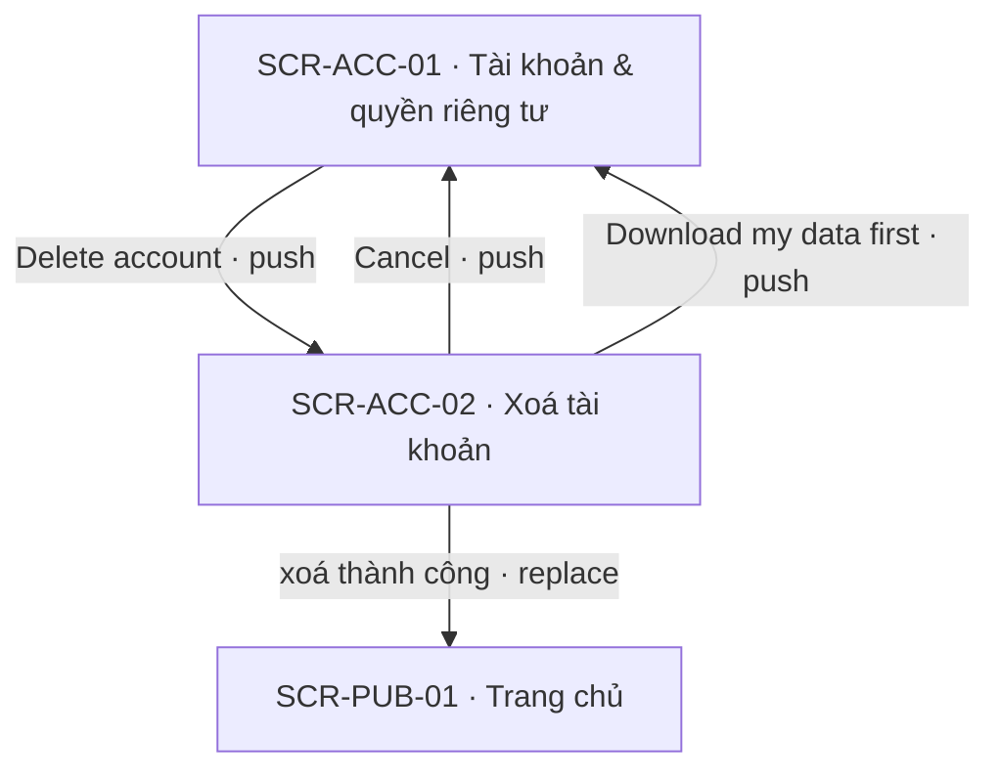
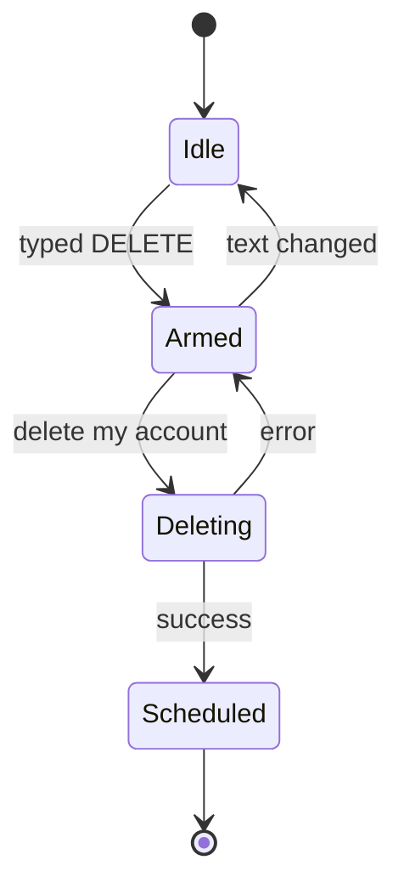

# [SCR-ACC-02] Xoá tài khoản — FULL

## 0. General

| id | module | doc level | platforms | route | access | indexable | viewports | related FLOW | status | design | tracking | api | Evidence / visual basis |
|---|---|---|---|---|---|---|---|---|---|---|---|---|---|
| SCR-ACC-02 | ACC | Full | Web | `/account/delete` | account | noindex | 390 · 768 · 1280 | FLOW-quyen-rieng-tu | Draft | (sau design) | `tracking-events.md` → `delete_account` · ft_account_delete | `docs/api/SCR-ACC-02-api.md` | **EV-TLW-246 (đối thủ không có xoá tài khoản) · màn in-house · basis BR-APP-11 · Q-05 · Q-18** |

**Changelog** (mới nhất trước)
- 2026-09-28 · v1.1 · claude-opus-5-5 · D-17: overlay khôi phục do shell app hiện ở mọi trang đích (SYS-AUTH).
- 2026-09-27 · v1 · claude (subagent) · khởi tạo từ blueprint.

## 1. Purpose & context

Trang để user tự xoá tài khoản. Trang nói rõ hệ quả, cho tải dữ liệu trước, rồi yêu cầu gõ "DELETE" để bật nút xoá. Xoá sẽ tắt gia hạn Plus ngay (không thu thêm), lên lịch xoá cứng sau 30 ngày, đăng xuất mọi thiết bị và gửi email xác nhận (BR-ACC-05). Trong 30 ngày đó, chỉ cần đăng nhập lại là tài khoản được khôi phục (BR-ACC-06). Đối thủ không có xoá tài khoản cũng không có export dữ liệu (EV-TLW-246 · research-synthesis §3). Đây là trang riêng có route chứ không phải modal, để back trình duyệt đóng được và a11y tốt hơn (00-overview §3). Không có bước giữ chân, không offer chen giữa, không hỏi lý do. · basis BR-APP-11 · BR-APP-04 · Q-05 · Q-18

## 2. Điều hướng

### 2.1 Vào

| Vào qua | Từ | Trigger |
|---|---|---|
| NAV-ACC-01-1 | SCR-ACC-01 | "Delete account" |
| entry ngoài | URL trực tiếp; chưa đăng nhập → `/login?next=/account/delete` | SYS-NAV §4 |

### 2.2 Ra

| NAV-ID | Tới (SCR-ID · tham số) | Trigger (CMP-ID "nhãn") | Kiểu | URL / history | Animation | Back / đóng → | Guard / điều kiện | Nền tảng | Basis |
|---|---|---|---|---|---|---|---|---|---|
| NAV-ACC-02-1 | SCR-PUB-01 | hệ thống: API-ME-04 thành công sau CMP-06 "Delete my account" | replace | `/account/delete` → `/` (replace) | mặc định | back KHÔNG quay lại | — | Web | BR-APP-11 |
| NAV-ACC-02-2 | SCR-ACC-01 | CMP-07 "Cancel" | push | `/account` (push) | mặc định | back trình duyệt → SCR-ACC-02 | — | Web | in-house |
| NAV-ACC-02-3 | SCR-ACC-01 · `#your-data` | CMP-04 "Download my data first" | push | `/account#your-data` (push) | mặc định | back trình duyệt → SCR-ACC-02 | — | Web | BR-APP-11 |
| NAV-ACC-02-4 | SCR-PUB-05 · `doc=subscriptions` | CMP-08 "Subscriptions & refunds" | push | `/legal/subscriptions` (push) | mặc định | back trình duyệt → SCR-ACC-02 | — | Web | Q-18 |

### 2.3 Diagram

## 3. Layout & UI components

- **Design brief @390 (top→bottom):**
  - header app;
  - H1 "Delete your account";
  - danh sách hệ quả, mỗi ý một dòng, chữ thường (không in đậm để doạ);
  - link "Download my data first";
  - ô "Type DELETE to confirm";
  - nút "Delete my account" (màu `color.danger`, disable cho tới khi gõ đúng), full width;
  - nút "Cancel" (nút phụ, cùng cỡ) ngay dưới.
- **Delta 1280:** 1 cột căn giữa, rộng tối đa `layout.reading-width`. Hai nút nằm cùng hàng: "Cancel" bên trái, "Delete my account" bên phải.

| CMP-ID | Component | Display condition | Copy verbatim (en-US) | Basis (EV / Q) |
|---|---|---|---|---|
| CMP-01 | Header | luôn | GC-SiteHeader (app) | SYS-NAV §1 |
| CMP-02 | Tiêu đề | luôn | "Delete your account" | in-house |
| CMP-03 | Hệ quả | luôn | "Your results, reports and check-ins will be deleted." · "If you have Plus, it stops renewing now. You won't be charged again." · "You'll be signed out on all your devices." · "You have 30 days to change your mind — just sign in again to restore your account. After 30 days, everything is permanently deleted, including reports you bought." · "Refunds follow our Subscriptions & refunds policy." · "We'll email you a confirmation." | BR-ACC-05 · BR-ACC-06 · Q-18 |
| CMP-04 | Link tải dữ liệu | luôn | "Download my data first" | BR-APP-11 |
| CMP-05 | Ô xác nhận | luôn | nhãn "Type DELETE to confirm" · ô chữ (`autocapitalize="characters"`, tắt autocomplete và kiểm chính tả) | BR-ACC-04 |
| CMP-06 | Nút xoá | luôn; disable tới khi CMP-05 khớp | "Delete my account" · đang xoá: "Deleting…" | BR-ACC-04 · BR-ACC-05 |
| CMP-07 | Nút huỷ | luôn | "Cancel" | in-house |
| CMP-08 | Link "Subscriptions & refunds" | luôn, trong câu hoàn tiền của CMP-03 | "Subscriptions & refunds" (NAV-ACC-02-4) | Q-18 |

Sau NAV-ACC-02-1, SCR-PUB-01 hiện toast (overlay, SYS-NAV §2): "Your account is scheduled for deletion. Sign in within 30 days to restore it." Cờ hiện toast là cờ một lần trong `sessionStorage`, không đưa lên URL.

## 4. Screen states

| State | Trigger cụ thể | Frame | EV / basis |
|---|---|---|---|
| Default | trang mở, phiên hợp lệ | CMP-01…07; CMP-06 disable | in-house |
| Loading | đang gọi API-ME-04 | CMP-06 hiện spinner + "Deleting…"; mọi control disable | tieu-chuan-chung §3 |
| Empty | N/A — trang luôn có nội dung, không phụ thuộc dữ liệu | — | in-house |
| Error | API-ME-04 lỗi (mạng, 5xx, provider không tắt được gia hạn) | "We couldn't delete your account right now. Please try again or contact support." dưới nút; giữ chữ đã gõ; tài khoản không bị thay đổi | in-house · cong-nghe-loi §3 |
| Locked | chưa đăng nhập → guard redirect `/login?next=/account/delete` (không render) | — | SYS-NAV §4 |

## 5. Interaction & validation

### 5.1 Behavior

| Hành động | Kết quả |
|---|---|
| Gõ vào CMP-05 | so với "DELETE" sau khi bỏ khoảng trắng đầu/cuối, phân biệt hoa thường; khớp thì bật CMP-06 |
| "Delete my account" | API-ME-04 → thành công: bắn ft_account_delete confirm TRƯỚC khi xoá trạng thái đăng nhập ở client → đặt cờ một lần trong `sessionStorage` (không đưa lên URL) → replace `/`; SCR-PUB-01 đọc cờ và hiện toast (SCR-PUB-01 EC-02) |
| `Enter` trong CMP-05 | đã khớp = bấm "Delete my account"; chưa khớp thì không làm gì |
| "Cancel" | push `/account` |
| "Download my data first" | push `/account#your-data` |
| Bấm "Delete my account" nhiều lần | nút disable ngay lần bấm đầu; API-ME-04 idempotent theo `userId` |

### 5.2 Validation (verbatim)

| Check | Khi nào | Copy |
|---|---|---|
| Gõ đúng "DELETE" | mỗi lần gõ; không báo lỗi đỏ khi đang gõ | không có copy lỗi: nút chỉ bật khi khớp; nhãn "Type DELETE to confirm" đã nói cách làm |
| Phiên còn hạn | khi bấm xoá | 401 → "Your session expired. Sign in to continue — we kept what you entered." rồi mở `/login?next=/account/delete` (tieu-chuan-chung §1) |

## 6. Data & API

### 6.1 Dữ liệu hiển thị
Không có dữ liệu riêng của user trên trang: nội dung là copy tĩnh. Header dùng dữ liệu của GC-SiteHeader.

### 6.2 Endpoint

| API | Khi nào |
|---|---|
| API-ME-04 | bấm "Delete my account" (hoặc `Enter` khi đã khớp) |

### 6.3 Chi tiết → `docs/api/SCR-ACC-02-api.md`

## 7. Business rules & permissions

| BR-ID | Rule | Basis | Access |
|---|---|---|---|
| BR-ACC-04 | Xác nhận bằng gõ đúng "DELETE" (chữ hoa) | BR-APP-11 · in-house | account |
| BR-ACC-05 | Xoá = huỷ gia hạn ngay (server), lên lịch xoá cứng sau 30 ngày (API-JOB-04), đăng xuất mọi thiết bị, gửi API-MAIL-07 | BR-APP-11 · BR-APP-04 · Q-18 | account |
| BR-ACC-06 | Đăng nhập lại trong 30 ngày → khôi phục, hiện banner xác nhận "Welcome back — your account has been restored." | BR-APP-11 · Q-05 | account |

## 8. Edge cases & error handling

| EC-xx | Case | Kết quả xác định (kể cả khi fail) | Basis |
|---|---|---|---|
| EC-01 | Đang có Plus | server tắt gia hạn qua provider TRƯỚC khi lên lịch xoá; provider lỗi → dừng lại, không đổi gì, hiện copy Error | BR-ACC-05 · BR-APP-04 |
| EC-02 | Khôi phục trong 30 ngày khi kỳ Plus còn | quyền Plus còn tới hết kỳ đã trả; gia hạn vẫn tắt, user bật lại được ở SCR-PAY-03 ("Resume renewal", BR-PAY-12) | SYS-ENTITLEMENT · BR-PAY-12 |
| EC-03 | Khôi phục khi kỳ Plus đã hết | tài khoản về Free; report mua lẻ vẫn còn | SYS-ENTITLEMENT |
| EC-04 | Quá 30 ngày | API-JOB-04 xoá cứng hồ sơ, kết quả, câu trả lời, check-in, report, file PDF cache và file export; đăng nhập lại bằng email đó = tài khoản mới, trống | BR-ACC-05 · cong-nghe-loi §4 |
| EC-05 | Đăng nhập lại (magic link hoặc Google) trong 30 ngày | khôi phục ngay khi tạo phiên; trang đích hiện banner BR-ACC-06 một lần, dựa trên cờ `accountRestored` (API-AUTH-02) hoặc query `restored=1` (API-AUTH-04) | BR-ACC-06 · SYS-AUTH |
| EC-06 | Tab / thiết bị khác đang mở | mọi phiên bị thu hồi; request kế tiếp nhận 401 → `/login` | BR-ACC-05 · tieu-chuan-chung §1 |
| EC-07 | Bấm xoá 2 lần gần như cùng lúc (2 tab, mạng chập chờn) | idempotent theo `userId`: lần sau nhận 409 = thành công → cùng kết quả | 00-quy-uoc-api §5 |
| EC-08 | Webhook thanh toán tới sau khi đã lên lịch xoá | vẫn ghi nhận (API-HOOK-01) vào tài khoản đang chờ xoá; khôi phục thì quyền còn, không khôi phục thì bị xoá cùng tài khoản | BR-APP-01 · in-house |
| EC-09 | Gõ "delete" chữ thường | không khớp, nút vẫn disable | BR-ACC-04 |

## 9. Responsive deltas

| Aspect | 390 | 768 | 1280 |
|---|---|---|---|
| Nội dung | full width, gutter 16 | rộng tối đa `layout.reading-width`, căn giữa | như 768 |
| Nút | xếp dọc: "Delete my account" trên, "Cancel" dưới, full width, ≥ 44 px | cùng hàng: "Cancel" trái, "Delete my account" phải | như 768 |

## 10. SEO

`noindex` (route `account`, tieu-chuan-chung §8). Không có row trong `seo-meta.md`.

## 11. Tracking

`screen_active` · `delete_account` · ft_account_delete: start (SCR-ACC-02 hiện) · confirm (API-ME-04 trả về, bắn TRƯỚC khi xoá phiên phía client). Không gửi email, lý do hay trạng thái gói.

## 12. Non-functional

| Hạng mục | Mục tiêu |
|---|---|
| API-ME-04 | phần đồng bộ chỉ gồm tắt gia hạn + thu hồi phiên + lên lịch; xoá cứng chạy ở API-JOB-04 |
| A11y | nút phá huỷ có nhãn đầy đủ "Delete my account"; ô xác nhận có nhãn luôn hiện; nút disable vẫn đọc được trạng thái (`aria-disabled`) |
| Bảo mật | yêu cầu phiên còn hạn + `X-CSRF-Token` (00-quy-uoc-api §2); server kiểm lại chuỗi xác nhận |

## 13. AI Notices
- "Subscriptions & refunds" giờ là link (CMP-08 · NAV-ACC-02-4), đã bổ sung theo review.
- Banner "Welcome back — your account has been restored." dựa trên cờ `accountRestored` / query `restored=1` mô tả ở `SCR-AUTH-01-api.md`, hiện ở trang đích sau đăng nhập (SCR-APP-01 EC-11 khi không có `next`). Trang đích là `next` khác cũng hiện vì overlay do shell app hiện (SYS-AUTH, 2026-09-28).
- Bản ghi giao dịch mà luật thuế/kế toán buộc giữ lại sau khi xoá cứng phụ thuộc pháp nhân và vùng bán (Q-05); cần chốt ở `legal-consent.md`.
- Có nên bắt đăng nhập lại gần đây trước khi xoá hay không: MVP không yêu cầu (vì xoá khôi phục được trong 30 ngày). Human xem lại nếu muốn chặt hơn.
