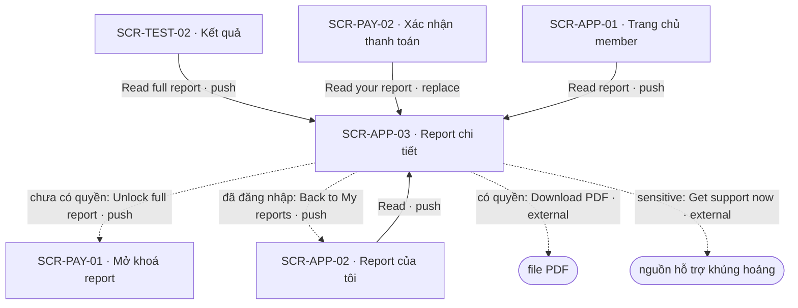
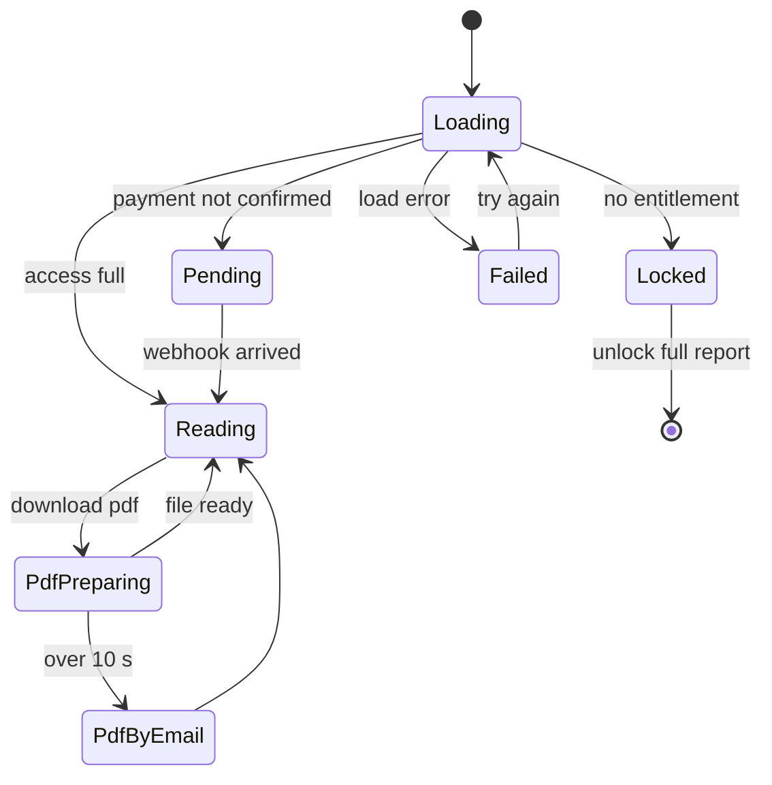

# [SCR-APP-03] Report chi tiết — FULL

## 0. General

| id | module | doc level | platforms | route | access | indexable | viewports | related FLOW | status | design | tracking | api | Evidence / visual basis |
|---|---|---|---|---|---|---|---|---|---|---|---|---|---|
| SCR-APP-03 | APP | Full | Web | `/app/reports/:reportId` | entitled | noindex | 390 · 768 · 1280 | FLOW-mo-khoa-report | Draft | (sau design) | `tracking-events.md` → `report` · ft_report · ft_unlock | `docs/api/SCR-APP-03-api.md` | **EV-TLW-243 · EV-TLW-244 · EV-TLW-245 · EV-TLW-261 · SC-TLW-25 · basis RS·F-23 · F-34 · TD-02 · TD-03 · CS-14** |

**Changelog** (mới nhất trước)
- 2026-09-27 · v1 · claude (subagent) · khởi tạo từ blueprint.

## 1. Purpose & context

Report đầy đủ của một kết quả: hero, điểm các thang, mục lục, các chương, và nút tải PDF. Nội dung chương viết sẵn, ráp theo type/dải điểm của đúng kết quả đó (TD-02). PDF render ở server từ cùng nội dung (TD-03), và nút tải ghi số trang thật. Đối thủ có report 9 chương có mục lục (RS·F-23 · EV-TLW-244), nhưng offer hứa "20-page report" trong khi PDF chỉ có 11 trang (RS·F-23 · F-34 · EV-TLW-261). Khi chưa có quyền, màn chuyển sang state Locked ngay tại trang: tiêu đề chương vẫn hiện, nội dung bị ẩn, có nút mở khoá; không tự chuyển sang trang mua (BR-REP-06). Khách đã mua trên trình duyệt này đọc được mà không cần đăng nhập (BR-REP-05 · SYS-AUTH). Bài `sensitive` luôn có GC-SensitiveNotice và không bắn analytics (BR-APP-06). · basis RS·F-23 · F-34 · Q-08 · TD-02 · TD-03

## 2. Điều hướng

### 2.1 Vào

| Vào qua | Từ | Trigger |
|---|---|---|
| NAV-TEST-02-2 | SCR-TEST-02 | "Read full report" |
| NAV-PAY-01-5 | SCR-PAY-01 | hệ thống: đã có `report.full` khi mở trang (replace) |
| NAV-PAY-02-1 | SCR-PAY-02 | "Read your report" (replace) |
| NAV-PAY-03-5 | SCR-PAY-03 | "Read" |
| NAV-APP-01-2 | SCR-APP-01 | "Read report" |
| NAV-APP-02-1 | SCR-APP-02 | "Read" |
| entry ngoài | email "Your report is unlocked" (API-MAIL-02) · URL trực tiếp; không có phiên VÀ không có token khách sở hữu kết quả → `/login?next=/app/reports/:reportId` | SYS-NAV §4 · SYS-AUTH |

### 2.2 Ra

| NAV-ID | Tới (SCR-ID · tham số) | Trigger (CMP-ID "nhãn") | Kiểu | URL / history | Animation | Back / đóng → | Guard / điều kiện | Nền tảng | Basis |
|---|---|---|---|---|---|---|---|---|---|
| NAV-APP-03-1 | external: tải file PDF | CMP-03 "Download PDF" | external | tải file (signed URL) | mặc định | — | có quyền | Web | TD-03 |
| NAV-APP-03-2 | SCR-PAY-01 · `resultId` | CMP-09 "Unlock full report" | push | `/unlock/:resultId` (push) | mặc định | back trình duyệt → SCR-APP-03 | chưa có quyền | Web | BR-APP-01 |
| NAV-APP-03-3 | SCR-APP-02 | CMP-10 "Back to My reports" | push | `/app/reports` (push) | mặc định | back trình duyệt → SCR-APP-03 | đã đăng nhập | Web | in-house |
| NAV-APP-03-4 | (cùng màn) nhảy tới chương | CMP-05 mục | inline | `#chapter-<n>` (replace) | mặc định | — | — | Web | in-house |
| NAV-APP-03-5 | external: trang nguồn hỗ trợ khủng hoảng | CMP-07 "Get support now" | external | tab mới | mặc định | đóng tab → SCR-APP-03 | bài `sensitive` | Web | Q-06 |

### 2.3 Diagram

## 3. Layout & UI components

- **Design brief @390 (top→bottom):**
  - header: GC-SiteHeader (app) khi đã đăng nhập; khách đọc bằng token thì GC-SiteHeader `minimal` (chỉ logo);
  - (bài `sensitive`) GC-SensitiveNotice ngay dưới header;
  - hero: dòng nhỏ "[Test name] · [date]" → tên type chữ lớn (`type.result`) → 1 câu mô tả → "Scored with version [v]";
  - nút "Download PDF ([N] pages)" full width;
  - GC-ScoreBars;
  - mục lục thu gọn thành nút "Contents" (mở ra danh sách chương);
  - các chương: mỗi chương một tiêu đề H2 (`type.h2`) và nội dung, cột chữ `layout.reading-width`;
  - "Was this report useful?" với 5 nút 1–5 ở cuối report;
  - link "Back to My reports" (chỉ khi đã đăng nhập).
- **Locked:** hero, điểm và tên chương vẫn hiện; nút PDF và nội dung chương được thay bằng panel khoá (CMP-09).
- **Delta 1280:** 2 cột. Mục lục dính ở cột trái và đánh dấu chương đang đọc. Nội dung nằm ở cột phải, rộng tối đa `layout.reading-width`. Nút PDF đặt cạnh hero.

| CMP-ID | Component | Display condition | Copy verbatim (en-US) | Basis (EV / Q) |
|---|---|---|---|---|
| CMP-01 | Header | luôn | đã đăng nhập: GC-SiteHeader (app) · khách có token: GC-SiteHeader biến thể `minimal` (chỉ logo "TestLib" → `/`) | SYS-NAV §4 · SYS-AUTH |
| CMP-02 | Hero report | luôn (cả Locked) | "[Test name] · [date]" · H1 "[Type]" · 1 câu mô tả · "Scored with version [v]" | EV-TLW-243 · BR-APP-07 |
| CMP-03 | Nút tải PDF | có quyền `report.pdf` | "Download PDF ([N] pages)" ([N] = số trang của file PDF thật; chưa có file thì chỉ ghi "Download PDF") · đang tạo: "Preparing your PDF…" · quá 10 s: "Your PDF is taking longer than usual. We'll email it to you — or use Print → Save as PDF." + nút "Print / Save as PDF" | TD-03 · RS·F-23 · cong-nghe-loi §3 |
| CMP-04 | Điểm các thang | luôn (cả Locked) | GC-ScoreBars, như SCR-TEST-02 CMP-03 | EV-TLW-244 · BR-TEST-07 |
| CMP-05 | Mục lục | luôn; Locked: tên chương hiện nhưng không bấm được | tiêu đề "Contents"; mỗi mục là tên một chương, link tới `#chapter-<n>`; @390 thu gọn thành nút "Contents" | EV-TLW-244 |
| CMP-06 | Các chương | có quyền `report.full` | mỗi chương: H2 tên chương + các đoạn ráp từ `report_blocks` | TD-02 · EV-TLW-245 |
| CMP-07 | Thông báo bài nhạy cảm | bài `sensitive`, kể cả state Locked và bản PDF | GC-SensitiveNotice biến thể `full`: "This is a self-reflection tool, not a diagnosis." + "Get support now" (phần còn lại theo GC) | Q-06 · BR-APP-06 |
| CMP-08 | Khảo sát hữu ích | có quyền, cuối report | "Was this report useful?" + 5 nút "1"…"5" (nhãn hai đầu: "Not useful" · "Very useful"); sau khi chọn: "Thanks for your feedback." | EV-TLW-244 (đối thủ: "Did you like our test?") |
| CMP-09 | Panel khoá | chưa có quyền (`access = locked`) | "Unlock the full report to read every chapter." + nút "Unlock full report" · đang chờ webhook (`access = pending`): "Confirming your payment…" (không nút) | cong-nghe-loi §3 · BR-REP-06 |
| CMP-10 | Link về danh sách | đã đăng nhập | "Back to My reports" | in-house |

## 4. Screen states

| State | Trigger cụ thể | Frame | EV / basis |
|---|---|---|---|
| Default | API-REP-02 trả `access = full` | CMP-01 · 02 · 03 · 04 · 05 · 06 · 08 · 10 (+ CMP-07 nếu bài `sensitive`) | EV-TLW-243 |
| Loading | API-REP-02 chạy ≥ 300 ms; đang tạo PDF | skeleton hero + 3 khối chương; nút CMP-03 hiện "Preparing your PDF…" (spinner trong nút) | tieu-chuan-chung §3 · TD-03 |
| Empty | N/A — report không có nội dung là lỗi cấu hình → xử lý như Error | — | BR-REP-03 |
| Error | tải report lỗi (mất mạng, 5xx, report rỗng) · tạo PDF lỗi hoặc quá 10 s | mất mạng: "You're offline. Check your connection and try again." · 5xx / report rỗng: "Something went wrong on our side. Please try again." + nút "Try again" · PDF: "Your PDF is taking longer than usual. We'll email it to you — or use Print → Save as PDF." | cong-nghe-loi §3 · tieu-chuan-chung §2 |
| Locked | có quyền xem kết quả nhưng chưa có `report.full` (`access = locked` / `pending`) · không có phiên và không có token sở hữu → guard redirect `/login?next=…` (không render) | CMP-01 · 02 · 04 · 05 (không link) · 09 (+ CMP-07 nếu bài `sensitive`); không redirect sang trang mua | cong-nghe-loi §3 · BR-REP-06 · SYS-NAV §4 |

## 5. Interaction & validation

### 5.1 Behavior

| Hành động | Kết quả |
|---|---|
| "Download PDF" | API-REP-03 (tạo hoặc lấy job) → nếu `ready` thì tải ngay; nếu không thì hỏi API-REP-04 mỗi 1 s, tối đa 10 s → có URL thì tải (signed URL 10 phút); quá 10 s thì hiện copy gửi email + nút "Print / Save as PDF" (server gửi API-MAIL-08 khi xong) |
| "Print / Save as PDF" | `window.print()` với print stylesheet |
| Bấm một mục lục | cuộn tới chương, URL thành `#chapter-<n>` (replace), focus vào H2 của chương |
| "Contents" (@390) | mở/đóng danh sách chương (`aria-expanded`) |
| Cuộn nội dung (@1280) | mục lục dính đánh dấu chương đang đọc; không đổi focus, không đổi URL |
| "Was this report useful?" | chọn 1–5 → "Thanks for your feedback."; chọn lại được trong lần xem đó |
| "Unlock full report" | push `/unlock/:resultId` (ft_unlock start đã bắn khi panel khoá hiện) |
| "Back to My reports" | push `/app/reports` |
| "Get support now" | mở trang nguồn hỗ trợ ở tab mới |

### 5.2 Validation (verbatim)

| Check | Khi nào | Copy |
|---|---|---|
| Không có ô nhập tự do | — | màn chỉ có nút và lựa chọn 1–5; không có copy lỗi nhập |
| Bấm "Download PDF" lặp khi đang tạo | trong lúc có job | nút disable tới khi xong; API-REP-03 idempotent nên không tạo job thứ hai |

## 6. Data & API

### 6.1 Dữ liệu hiển thị
Tên bài, ngày làm, type + mô tả, điểm các thang, danh sách chương (tên luôn có; nội dung chỉ khi có quyền), `scoringVersion`, `contentVersion`, cờ `sensitive`, trạng thái quyền (`full` · `pending` · `locked`), `resultId` cho nút mở khoá, trạng thái + số trang PDF (khi đã có file), người xem đã đăng nhập hay đọc bằng token khách.

### 6.2 Endpoint

| API | Khi nào |
|---|---|
| API-REP-02 | mở màn; tải lại mỗi 2 s tối đa 30 s khi `access = pending`; nút "Try again" |
| API-REP-03 | bấm "Download PDF" |
| API-REP-04 | hỏi trạng thái PDF sau API-REP-03; lấy lại signed URL khi URL cũ hết hạn |
| API-REP-05 | chọn 1–5 ở CMP-08 (ghi đè lựa chọn trước) |

### 6.3 Chi tiết → `docs/api/SCR-APP-03-api.md`

## 7. Business rules & permissions

| BR-ID | Rule | Basis | Access |
|---|---|---|---|
| BR-REP-03 | Nội dung ráp từ `report_blocks` theo (bài × type/dải × thang); cùng kết quả + cùng `contentVersion` → cùng report (TD-02, BR-APP-07) | TD-02 · BR-APP-07 · Q-08 | entitled |
| BR-REP-04 | PDF = cùng nội dung, nút ghi số trang thật; tạo ≤ 10 s hoặc chuyển sang email (cong-nghe-loi §3) | TD-03 · RS·F-23 · F-34 | entitled |
| BR-REP-05 | Khách có token sở hữu + quyền mua trên trình duyệt này đọc được không cần đăng nhập; thiết bị khác phải đăng nhập (SYS-AUTH) | SYS-AUTH · BR-APP-08 · Q-11 | guest (có token) · account |
| BR-REP-06 | Không có quyền → state Locked (CMP-09), không redirect sang trang mua | BR-APP-01 · RS·F-19 | guest (có token) · account |

## 8. Edge cases & error handling

| EC-xx | Case | Kết quả xác định (kể cả khi fail) | Basis |
|---|---|---|---|
| EC-01 | Mở link email "Your report is unlocked" ở thiết bị khác, chưa đăng nhập | guard → `/login?next=/app/reports/:reportId`; đăng nhập bằng email đã mua thì đọc được | BR-REP-05 · SYS-AUTH |
| EC-02 | Khách đọc trên trình duyệt đã mua (token `tl_guest`), chưa đăng nhập | render bình thường với GC-SiteHeader `minimal`; ẩn CMP-10 vì khách không có "My reports" | BR-REP-05 · SYS-NAV §4 |
| EC-03 | `reportId` không thuộc tài khoản/token hiện tại, hoặc không tồn tại | trang 404 chung (00-quy-uoc-api §4); không hiện Locked vì không bán report của người khác | in-house |
| EC-04 | Plus hết kỳ sau khi huỷ, report không mua lẻ | `access = locked` → CMP-09 | SYS-ENTITLEMENT |
| EC-05 | Đã thanh toán nhưng webhook chưa về | `access = pending` → CMP-09 hiện "Confirming your payment…" không có nút; tải lại mỗi 2 s tối đa 30 s, hết hạn thì hiện "Your payment is still processing. We'll email you as soon as your report is unlocked." | SYS-ENTITLEMENT · cong-nghe-loi §3 |
| EC-06 | Nội dung bài có `contentVersion` mới sau khi user làm bài | report giữ `contentVersion` đã ghim ở kết quả; nội dung mới chỉ áp cho lần làm bài sau | BR-REP-03 · BR-APP-07 |
| EC-07 | Tạo PDF quá 10 s hoặc lỗi | copy email + "Print / Save as PDF"; khi job xong server gửi API-MAIL-08; job lỗi thì worker thử lại, user vẫn còn đường in | cong-nghe-loi §3 · TD-03 |
| EC-08 | Bấm "Download PDF" nhiều lần / mở 2 tab | API-REP-03 idempotent theo `reportId` + `contentVersion` + locale → cùng job, cùng file | 00-quy-uoc-api §5 |
| EC-09 | Signed URL hết hạn (sau 10 phút) rồi bấm tải lại | gọi API-REP-04 lấy URL mới; file đã cache nên không render lại | TD-03 |
| EC-10 | Mở `#chapter-<n>` khi đang Locked | bỏ qua anchor, hiện CMP-09 | in-house |
| EC-11 | Bài `sensitive` | CMP-07 hiện trên trang; trang đầu của PDF cũng in disclaimer + nguồn hỗ trợ; không `screen_active`, không ft_report | BR-APP-06 |
| EC-12 | Locked | nội dung chương không được gửi về client (không chỉ ẩn bằng CSS) | BR-APP-01 · BR-REP-06 |

## 9. Responsive deltas

| Aspect | 390 | 768 | 1280 |
|---|---|---|---|
| Mục lục | nút "Contents" dưới GC-ScoreBars, mở ra danh sách | như 390 | cột trái dính khi cuộn, đánh dấu chương đang đọc |
| Nội dung chương | full width, gutter 16 | rộng tối đa `layout.reading-width`, căn giữa | cột phải, rộng tối đa `layout.reading-width` |
| Nút PDF | full width | co theo nội dung | co theo nội dung, cạnh hero |
| Khảo sát 1–5 | 5 nút một hàng, mỗi nút ≥ 44 px | như 390 | như 390 |

## 10. SEO

`noindex` (route `entitled`, tieu-chuan-chung §8), kể cả biến thể `?print=1`. Không có row trong `seo-meta.md`. `<title>` là "Your report · TestLib", không chứa type.

## 11. Tracking

`screen_active` · `report` (không bắn cho bài `sensitive`) · ft_report: start (report hiện) · pdf_download (`success` · `fail` · `queued`, kèm `duration_ms`) · ft_unlock start (`surface=report_locked`) khi CMP-09 hiện. Không gửi type, điểm hay tên chương. Bài `sensitive` không bắn event nào (BR-APP-06).

## 12. Non-functional

| Hạng mục | Mục tiêu |
|---|---|
| Mở report | p50 ≤ 1 s · p95 ≤ 2,5 s (TD-02, cong-nghe-loi §2) |
| Tạo PDF | p95 ≤ 10 s lần đầu · ≤ 1 s khi đã cache (TD-03, cong-nghe-loi §2) |
| A11y | mục lục là `nav` có `aria-label="Contents"`; chương là H2 theo đúng thứ tự; đánh dấu chương đang đọc không cướp focus |
| In | print stylesheet ẩn header, nút và khảo sát; giữ GC-SensitiveNotice với bài `sensitive` |
| Bảo mật | renderer PDF mở `?print=1` bằng token nội bộ ngắn hạn, không dùng cookie của user |

## 13. AI Notices
- CMP-08 ghi qua API-REP-05 (lưu server, cong-nghe-loi §4) và event ft_report `rate`, event này không bắn với bài `sensitive` (đã bổ sung owner doc theo review).
- "[N] pages" trên nút chỉ hiện khi đã có file PDF thật; chưa có file thì nút ghi "Download PDF", không ước lượng (BR-REP-04).
- Copy "Contents", "Preparing your PDF…", "Thanks for your feedback." và nhãn hai đầu của CMP-08 là copy đề xuất.
