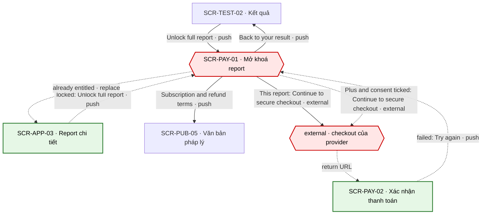
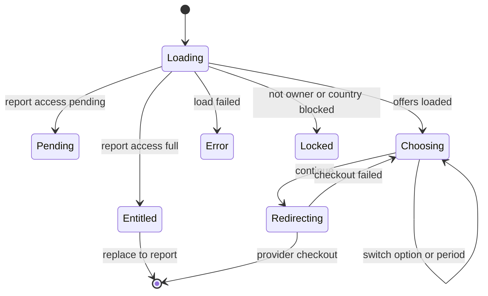

# [SCR-PAY-01] Mở khoá report — FULL

## 0. General

| id | module | doc level | platforms | route | access | indexable | viewports | related FLOW | status | design | tracking | api | Evidence / visual basis |
|---|---|---|---|---|---|---|---|---|---|---|---|---|---|
| SCR-PAY-01 | PAY | Full | Web | `/unlock/:resultId` | guest | noindex | 390 · 768 · 1280 | FLOW-mo-khoa-report | Draft | (sau design) | `tracking-events.md` → `unlock` · ft_unlock | `docs/api/SCR-PAY-01-api.md` | **EV-TLW-108 · EV-TLW-109 · EV-TLW-111 · EV-TLW-112 · EV-TLW-116 · EV-TLW-261 · SC-TLW-21 · SC-TLW-22 · basis RS·F-17 · F-18 · F-19 · F-23 · F-30 · Q-02 · Q-03** |

**Changelog** (mới nhất trước)
- 2026-09-27 · v1 · claude (subagent) · khởi tạo từ blueprint.

## 1. Purpose & context

Trang mua report đầy đủ cho MỘT kết quả cụ thể. Người dùng thấy đúng thứ mình sẽ mua (danh sách chương thật, số trang thật, đoạn đầu chương 1 của chính report đó), chọn giữa "This report" (mua một lần, chọn sẵn, không gia hạn) và "Plus" (tự gia hạn, phải tick consent), rồi sang checkout hosted của provider. Offer của đối thủ ở cùng vị trí trong funnel là mẫu phải tránh: đồng hồ "Results saved for", ticker "just bought", logo "featured in" và không một chữ nào về gia hạn (RS·F-17); checkout không checkbox (RS·F-18); hứa "20-page report" nhưng PDF chỉ 11 trang (RS·F-23); "30-day satisfaction guarantee" không có trong văn bản pháp lý (RS·F-30); back bị đẩy về lại offer (RS·F-19). Trang này không mở quyền: quyền đọc chỉ mở khi server nhận webhook đã verify (BR-APP-01). · basis Q-02 · Q-03 · BR-APP-01 · BR-APP-03 · P-02

## 2. Điều hướng

### 2.1 Vào

| Vào qua | Từ | Trigger |
|---|---|---|
| NAV-TEST-02-1 | SCR-TEST-02 | "Unlock full report" |
| NAV-PAY-02-3 | SCR-PAY-02 | "Try again" (thanh toán thất bại / huỷ, có `resultId`) |
| NAV-APP-01-3 | SCR-APP-01 | "Unlock report" |
| NAV-APP-03-2 | SCR-APP-03 | "Unlock full report" (panel khoá) |
| entry ngoài | URL trực tiếp của chủ kết quả (token `tl_guest` hoặc tài khoản); không phải chủ hoặc kết quả đã hết hạn → xử lý như SCR-TEST-02 | SYS-NAV §4 |

### 2.2 Ra

| NAV-ID | Tới (SCR-ID · tham số) | Trigger (CMP-ID "nhãn") | Kiểu | URL / history | Animation | Back / đóng → | Guard / điều kiện | Nền tảng | Basis |
|---|---|---|---|---|---|---|---|---|---|
| NAV-PAY-01-1 | external: checkout của provider · `planKey=report.single` · `resultId` | CMP-08 "Continue to secure checkout" | external | rời domain, cùng tab (sau khi API-PAY-02 trả `checkoutUrl`) | mặc định | back trình duyệt → SCR-PAY-01 | đã chọn "This report" | Web | Q-04 |
| NAV-PAY-01-2 | external: checkout của provider · `planKey=plan.plus.monthly` hoặc `plan.plus.annual` | CMP-08 "Continue to secure checkout" | external | rời domain, cùng tab (sau khi API-PAY-02 trả `checkoutUrl`) | mặc định | back trình duyệt → SCR-PAY-01 | chọn "Plus" + CMP-07 đã tick (BR-APP-03) | Web | BR-APP-03 |
| NAV-PAY-01-3 | SCR-TEST-02 · `resultId` | CMP-01 "Back to your result" | push | `/results/:resultId` (push) | mặc định | back trình duyệt → SCR-PAY-01 | — | Web | RS·F-19 |
| NAV-PAY-01-4 | SCR-PUB-05 · `doc=subscriptions` | CMP-09 "Subscription & refund terms" | push | `/legal/subscriptions` (push) | mặc định | back trình duyệt → SCR-PAY-01 | — | Web | RS·F-30 |
| NAV-PAY-01-5 | SCR-APP-03 · `reportId` | hệ thống: đã có `report.full` khi mở trang | replace | `/unlock/:resultId` → `/app/reports/:reportId` (replace) | mặc định | back trình duyệt → trang trước SCR-PAY-01 | đã có quyền | Web | SYS-ENTITLEMENT |

### 2.3 Diagram

## 3. Layout & UI components

- **Design brief @390 (top→bottom):**
  - thanh funnel: logo bên trái, link "Back to your result" bên phải; không header/footer site;
  - H1 "Unlock your full [Test] report";
  - khối xem trước: "About [N] pages" → danh sách chương đánh số → đoạn đầu chương 1 (chữ thật, không làm mờ);
  - hai thẻ lựa chọn dạng radio xếp dọc: "This report" (chọn sẵn) ở trên, "Plus" ở dưới;
  - GC-RenewalDisclosure ngay dưới 2 thẻ, TRƯỚC nút: chọn "This report" thì là câu một lần; chọn "Plus" thì mở thêm toggle "Monthly" / "Annual" → câu gia hạn → checkbox consent;
  - nút "Continue to secure checkout" full width (không dính đáy, để không che phần công bố gia hạn);
  - link "Subscription & refund terms";
  - dòng người bán.
- **Không** đồng hồ, không "just bought", không testimonial, không logo "featured in", không badge giảm giá, không "guarantee" không có trong văn bản (BR-PAY-05).
- **Delta 1280:** 2 cột trong container 1120: trái là khối xem trước (CMP-03), phải là CMP-04…10; cột phải dính (sticky) khi cuộn. Thanh funnel giữ nguyên.

| CMP-ID | Component | Display condition | Copy verbatim (en-US) | Basis (EV / Q) |
|---|---|---|---|---|
| CMP-01 | Thanh trên funnel | luôn | logo (shell funnel, SYS-NAV §4) · link "Back to your result" | RS·F-19 · EV-TLW-116 |
| CMP-02 | Tiêu đề | luôn | H1 "Unlock your full [Test] report" | Q-02 |
| CMP-03 | Xem trước report | luôn (trừ Locked vì không phải chủ) | "About [N] pages" (N = số trang PDF thật) · danh sách tiêu đề chương thật của report này · đoạn đầu chương 1, nguyên văn | RS·F-23 · TD-02 · TD-03 · EV-TLW-109 · EV-TLW-261 |
| CMP-04 | Hai lựa chọn (GC-PlanCard, variant `selectable`) | luôn; "This report" **chọn sẵn** | tên "This report" · "Plus"; giá "[price] one-time" · "[price] per month" hoặc "[price] per year"; bullet verbatim theo bảng "Quyền → bullet" của GC-PlanCard §4 | Q-02 · BR-PAY-03 · RS·F-17 · P-02 |
| CMP-05 | Toggle chu kỳ | chỉ khi chọn "Plus"; mặc định "Monthly" | "Monthly" · "Annual"; ở "Annual" thẻ Plus hiện "Save [n]%" (GC-PlanCard `savings`, cách tính BR-PUB-09) | Q-03 · BR-PUB-09 |
| CMP-06 | GC-RenewalDisclosure | chọn "Plus": variant `pre-purchase` · Plus, ngay trên CMP-07; chọn "This report": variant `pre-purchase` · một lần | copy verbatim theo GC; bản một lần: "One-time payment. No subscription — nothing renews." | BR-APP-02 · RS·F-17 · RS·F-09 |
| CMP-07 | Checkbox consent Plus | chỉ khi chọn "Plus"; KHÔNG tick sẵn; tự bỏ tick khi đổi lựa chọn hoặc chu kỳ | "I understand Plus renews automatically at [price] per [period] until I cancel. I can cancel anytime in Account → Plan & billing." | BR-APP-03 · BR-PAY-02 · RS·F-08 |
| CMP-08 | Nút chính | luôn khi còn mua được; "This report": bấm được; "Plus": khoá tới khi tick CMP-07 | "Continue to secure checkout" · gợi ý khi chưa tick: "Tick the box above to continue." | BR-PAY-02 · Q-04 |
| CMP-09 | Link điều khoản | luôn | "Subscription & refund terms" | RS·F-30 · Q-18 |
| CMP-10 | Dòng người bán | luôn | "Sold by [legal entity]. Taxes calculated at checkout." | Q-05 · RS·F-12 · BR-APP-12 |

## 4. Screen states

| State | Trigger cụ thể | Frame | EV / basis |
|---|---|---|---|
| Default | API-RES-01 `report.access = none` + API-PAY-01 trả đủ 3 gói trả phí | CMP-01…10, "This report" chọn sẵn | EV-TLW-108 (đối lập) · Q-02 |
| Loading | tải API-RES-01 + API-PAY-01 > 300 ms | skeleton khối xem trước + 2 thẻ; CMP-07 và CMP-08 disabled (không cho đồng ý một câu còn thiếu số); sau khi bấm CMP-08: spinner trong nút | tieu-chuan-chung §3 · GC-RenewalDisclosure |
| Empty | N/A — luôn có 2 lựa chọn; API-PAY-01 rỗng hoặc thiếu gói → xử lý như Error | như Error | BR-PAY-01 |
| Error | tải giá lỗi (503 `pricing_unavailable` / mạng) · tạo phiên checkout lỗi (API-PAY-02 5xx / timeout 10 s) · kết quả khách hết hạn (410) | giá: "We couldn't load prices. Please refresh." · checkout: "We couldn't start checkout. Please try again." · 410: "This result isn't available on this device. Sign in if you saved it, or take the test again." | cong-nghe-loi §3 · tieu-chuan-chung §2 |
| Locked | (1) đã có quyền (`report.access = full`) → NAV-PAY-01-5; (2) thanh toán đang chờ webhook (`report.access = pending`); (3) quốc gia không hỗ trợ; (4) không phải chủ kết quả (403) | (1) không render, replace sang report · (2) CMP-04…08 ẩn, hiện "Your payment is still processing. We'll email you as soon as your report is unlocked." · (3) "Purchases aren't available in your country yet.", CMP-08 disabled · (4) chỉ CMP-01 + copy cong-nghe-loi §3, không lộ tên bài hay chương | SYS-ENTITLEMENT · Q-04 · BR-APP-08 |

## 5. Interaction & validation

### 5.1 Behavior

| Hành động | Kết quả |
|---|---|
| Chọn thẻ "This report" / "Plus" (CMP-04; bấm vào đâu trên thẻ cũng được) | đổi lựa chọn. "Plus" → hiện CMP-05 (Monthly), CMP-06 bản Plus, CMP-07 (không tick) và khoá CMP-08. Về "This report" → ẩn CMP-05 và CMP-07, bỏ tick CMP-07, CMP-06 về bản một lần, mở lại CMP-08 |
| Đổi CMP-05 | cập nhật giá, CMP-06 và câu CMP-07 theo chu kỳ mới; bỏ tick CMP-07 (BR-APP-03) |
| Tick CMP-07 | mở khoá CMP-08 |
| Bấm CMP-08 khi chưa tick (`aria-disabled`) | không gọi API; chuyển focus tới CMP-07 và hiện "Tick the box above to continue." |
| Bấm CMP-08 | sinh `Idempotency-Key` mới → API-PAY-02 (`planKey`, `resultId`, `origin=unlock`, `displayedPrice`, + `consent` nếu Plus); nút spinner + khoá; thành công → `location.assign(checkoutUrl)` cùng tab (NAV-PAY-01-1 / NAV-PAY-01-2) |
| Bấm "Back to your result" | NAV-PAY-01-3 |
| Back trình duyệt | về trang trước (thường là SCR-TEST-02); trang không chèn history entry, không tự điều hướng lại (BR-PAY-06) |
| Bàn phím | CMP-04 và CMP-05 là radio group (↑/↓ hoặc ←/→); Space tick CMP-07; Enter bấm CMP-08 |

### 5.2 Validation (verbatim)

| Check | Khi nào | Copy |
|---|---|---|
| Consent Plus đã tick | client trước API-PAY-02; server kiểm lại | chưa tick: CMP-08 khoá + "Tick the box above to continue."; 422 `consent_required` → bỏ tick, focus CMP-07, cùng câu |
| Giá / câu consent còn hiệu lực | server (API-PAY-02) | 422 `price_changed` / `consent_outdated` → tải lại API-PAY-01, bỏ tick: "Prices or renewal terms have changed. Please review and tick the box again." |
| Người gọi là chủ kết quả, kết quả còn hạn | server (API-RES-01, API-PAY-02) | 403 / 404 / 410: "This result isn't available on this device. Sign in if you saved it, or take the test again." |
| Chưa có quyền, không có thanh toán đang chờ | server (API-RES-01 `report.access`, API-PAY-02) | `full` → NAV-PAY-01-5 · `pending` hoặc 422 `purchase_pending` → "Your payment is still processing. We'll email you as soon as your report is unlocked." |

## 6. Data & API

### 6.1 Dữ liệu hiển thị
Tên bài, cờ `sensitive`, danh sách chương + số trang PDF thật + đoạn đầu chương 1 của report ứng với kết quả này, trạng thái quyền (`report.access`, `reportId`), giá + chu kỳ của `report.single` và 2 gói Plus, câu consent + version, số ngày nhắc gia hạn, `purchasable`, tên pháp nhân bán.

### 6.2 Endpoint

| API | Khi nào |
|---|---|
| API-RES-01 | mở trang (`include=excerpt`): quyền, tên bài, cờ `sensitive`, xem trước report |
| API-PAY-01 | mở trang, song song với API-RES-01 (gọi có cookie); dùng `report.single` + 2 gói Plus |
| API-PAY-02 | bấm CMP-08 "Continue to secure checkout" |

### 6.3 Chi tiết → `docs/api/SCR-PAY-01-api.md`

### 6.4 Bảng giá (cite 00-overview §2)

| Plan | planKey | Giá base | Giới hạn | Neo đối thủ (RS·F · EV · [LIVE:browser]) |
|---|---|---|---|---|
| This report | `report.single` | placeholder — Q-03 (00-overview §2) | report đầy đủ + PDF của đúng kết quả này, vĩnh viễn; không gia hạn | "One Time $57.00" · "One test with its full report. No subscription." · RS·F-05 `[LIVE:browser · EV-TLW-025 · 2026-09-27]` |
| Plus tháng | `plan.plus.monthly` | placeholder — Q-03 (00-overview §2) | mọi report + PDF; thử thách 30 ngày; tự gia hạn mỗi tháng tới khi huỷ | offer ở cùng vị trí: "Download report $1.95", rồi "$39.95 every 4 weeks" chỉ nằm trong đoạn chữ ở checkout · RS·F-17 · F-18 `[LIVE:browser · EV-TLW-109 · EV-TLW-112 · 2026-09-27]` |
| Plus năm | `plan.plus.annual` | placeholder — Q-03 (00-overview §2) | như Plus tháng; tự gia hạn mỗi năm tới khi huỷ | đối thủ không có gói năm · RS·F-05 `[LIVE:browser · EV-TLW-025 · 2026-09-27]` |

## 7. Business rules & permissions

| BR-ID | Rule | Basis | Access |
|---|---|---|---|
| BR-PAY-01 | Giá/chu kỳ từ API-PAY-01 (nguồn 00-overview §2) — placeholder tới Q-03. Giá hiển thị được gửi lại trong API-PAY-02 để server từ chối nếu đã đổi | 00-overview §2 · Q-03 · BR-APP-12 | guest |
| BR-PAY-02 | Plus: nút disable tới khi tick CMP-07; câu consent verbatim + `consent_version` gửi trong API-PAY-02 | BR-APP-03 · RS·F-08 · RS·F-18 | guest |
| BR-PAY-03 | Mặc định chọn "This report" (không tự gia hạn); Plus chỉ chọn khi user bấm | RS·F-17 · P-02 | guest |
| BR-PAY-04 | Ghi số trang thật của report (đối thủ hứa "20-page report" nhưng PDF 11 trang). Số trang đo từ PDF render thật theo (bài × type × `contentVersion`), không ước lượng; danh sách chương là chương thật của report sẽ nhận | RS·F-23 · TD-03 · EV-TLW-109 · EV-TLW-261 | guest |
| BR-PAY-05 | Không đồng hồ, không giá gạch, không "X just bought", không testimonial không kiểm chứng. Không ghi cam kết nào (vd "guarantee") không có trong "Subscription & refund terms" | RS·F-17 · F-18 · F-30 | guest |
| BR-PAY-06 | Back trình duyệt về kết quả, không bị đẩy lại | RS·F-19 · EV-TLW-114 · EV-TLW-116 | guest |

## 8. Edge cases & error handling

| EC-xx | Case | Kết quả xác định (kể cả khi fail) | Basis |
|---|---|---|---|
| EC-01 | Đã có `report.full` cho kết quả này (mua lẻ trước đó, hoặc đang có Plus kể cả đã lên lịch huỷ còn trong kỳ) | NAV-PAY-01-5: replace sang report, không hiện lựa chọn mua (không bán trùng) | SYS-ENTITLEMENT |
| EC-02 | Không phải chủ kết quả (link chia sẻ, trình duyệt khác chưa đăng nhập) hoặc id lạ | Locked (4): copy cong-nghe-loi §3; không lộ tên bài, type hay chương | BR-APP-08 · SYS-NAV §4 |
| EC-03 | Kết quả khách đã quá 30 ngày (410) | Error, cùng copy cong-nghe-loi §3 | BR-APP-08 |
| EC-04 | Đổi lựa chọn hoặc chu kỳ sau khi đã tick | bỏ tick CMP-07, phải tick lại | BR-APP-03 |
| EC-05 | API-PAY-02 lỗi / timeout 10 s | giữ lựa chọn + dấu tick, mở lại nút: "We couldn't start checkout. Please try again."; thử lại do mạng dùng cùng key | cong-nghe-loi §3 · 00-quy-uoc-api §5 |
| EC-06 | Back từ trang checkout của provider | về SCR-PAY-01 (bfcache), tắt spinner, giữ lựa chọn; lần bấm sau dùng key mới | RS·F-19 |
| EC-07 | Đã thanh toán, webhook chưa về, user mở lại trang này | `report.access = pending` → Locked (2), ẩn nút mua để tránh mua trùng; server cũng chặn bằng 422 `purchase_pending` | SYS-ENTITLEMENT · cong-nghe-loi §3 |
| EC-08 | Hai tab cùng thanh toán `report.single` cho một `resultId` | webhook thứ hai ghi nhận mua trùng; xử lý hoàn tiền lần trùng theo chính sách hoàn tiền (Q-18, đề xuất: tự hoàn) | Q-18 · 00-quy-uoc-api §6 |
| EC-09 | Bài `sensitive` | nội dung trang như bài thường, nhưng không tải analytics, không bắn event; `<title>` chung "Unlock your report · TestLib", không chứa tên bài | BR-APP-05 · BR-APP-06 |
| EC-10 | Bài chưa có nội dung report (lỗi cấu hình) | không bán; trang 404 chung | 00-quy-uoc-api §4 · TD-02 |
| EC-11 | Quốc gia provider không hỗ trợ | Locked (3): xem trước report vẫn hiện, CMP-08 khoá; server trả 403 `country_not_supported` nếu client bị qua mặt | Q-04 |
| EC-12 | Mua Plus từ trang này | `resultId` vẫn gửi kèm; sau khi webhook mở Plus, report này đọc được theo Plus; thanh toán thất bại → SCR-PAY-02 "Try again" quay lại đúng trang này | SYS-ENTITLEMENT |

## 9. Responsive deltas

| Aspect | 390 | 768 | 1280 |
|---|---|---|---|
| Bố cục | 1 cột: xem trước → lựa chọn → nút | 2 cột (tieu-chuan-chung §6): xem trước bên trái, lựa chọn + nút bên phải | 2 cột, cột phải sticky; container 1120 |
| Thẻ lựa chọn | xếp dọc, "This report" ở trên | xếp dọc trong cột phải | như 768 |
| Nút CMP-08 | full width, không dính đáy | full width trong cột phải | như 768 |
| Thanh funnel | logo + "Back to your result" | như 390 | như 390 |

## 10. SEO

`noindex` (route `guest`, tieu-chuan-chung §8). Không có row trong `seo-meta.md`. `<title>` không chứa tên bài (EC-09).

## 11. Tracking

`screen_active` · `unlock` · ft_unlock start (`surface` = unlock) khi trang hiện · ft_unlock checkout_open (`plan_key`) khi API-PAY-02 trả URL. Bài `sensitive`: không bắn event nào (EC-09). Không gửi giá, trạng thái consent hay tên bài.

## 12. Non-functional

| Hạng mục | Mục tiêu |
|---|---|
| Mở trang → thấy giá + xem trước | p50 ≤ 1 s (API-RES-01 và API-PAY-01 gọi song song) `[INFERRED]` |
| Bấm CMP-08 → rời trang | p95 ≤ 1,5 s `[INFERRED]`, đo ở staging |
| A11y | CMP-04 `role="radiogroup"`, mỗi thẻ là một radio có nhãn đầy đủ (tên + giá + chu kỳ); phần hiện thêm khi chọn Plus nằm ngay sau 2 thẻ theo thứ tự DOM; CMP-07 trỏ `aria-describedby` tới CMP-06; CMP-08 khoá dùng `aria-disabled` + `aria-describedby` |

## 13. AI Notices
- Giá là placeholder tới Q-03. Chính sách với mua trùng (EC-08) chờ Q-18.
- Đoạn đầu chương 1 cần API-RES-01 trả thêm `report.excerpt` (tham số `include=excerpt`); schema gốc của API-RES-01 do `docs/api/SCR-TEST-02-api.md` sở hữu, cần bổ sung ở đó.
- Với bài `sensitive`, blueprint không có GC-SensitiveNotice trên trang này; `tracking-events.md` cũng chưa liệt kê SCR-PAY-01 vào nhóm route không bắn event. EC-09 là đề xuất, cần owner xác nhận.
- Blueprint chỉ hiện CMP-06 khi chọn Plus; file này theo GC-RenewalDisclosure §5 hiện thêm bản một lần cho "This report" (nói rõ không gia hạn, khác lỗi copy của đối thủ ở RS·F-09).
- Copy mới không có trong blueprint (đề xuất): "Tick the box above to continue.", "Prices or renewal terms have changed. Please review and tick the box again.", `<title>` "Unlock your report · TestLib". Bullet của 2 thẻ lấy từ GC-PlanCard §4.
