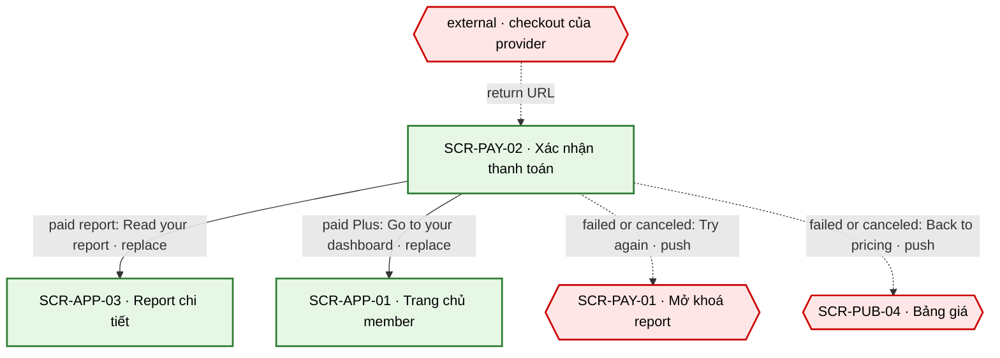
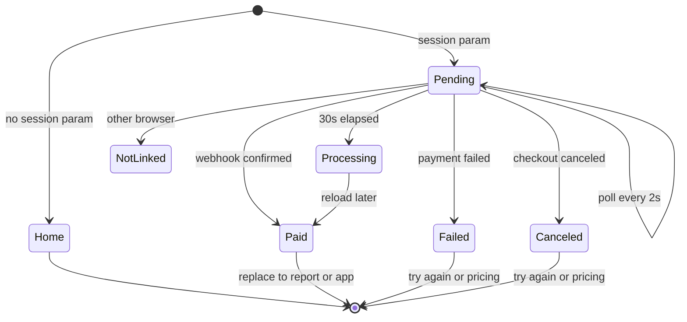

# [SCR-PAY-02] Xác nhận thanh toán — FULL

## 0. General

| id | module | doc level | platforms | route | access | indexable | viewports | related FLOW | status | design | tracking | api | Evidence / visual basis |
|---|---|---|---|---|---|---|---|---|---|---|---|---|---|
| SCR-PAY-02 | PAY | Full | Web | `/checkout/return` | guest | noindex | 390 · 768 · 1280 | FLOW-mo-khoa-report · FLOW-dang-ky-plus | Draft | (sau design) | `tracking-events.md` → `checkout_return` · ft_unlock | `docs/api/SCR-PAY-02-api.md` | **không có EV đối thủ (CS-21 `[BLOCKED · payment]`) — màn in-house · basis cong-nghe-loi §3 · BR-APP-01 · SYS-ENTITLEMENT** |

**Changelog** (mới nhất trước)
- 2026-09-27 · v1.1 · claude-opus-5-5 · EC-07 / "Go to your dashboard" theo luật phiên sau checkout khách (SYS-AUTH).
- 2026-09-27 · v1 · claude (subagent) · khởi tạo từ blueprint.

## 1. Purpose & context

Màn đích sau checkout hosted: provider trả người dùng về `/checkout/return?session=<id>`. Màn chỉ đọc trạng thái phiên từ server (API-PAY-03) và KHÔNG tin tham số URL: "paid" chỉ hiện khi webhook đã được verify và quyền đã ghi (BR-APP-01). Webhook chưa về thì hỏi lại mỗi 2 s trong tối đa 30 s, quá hạn thì nói thật là đang xử lý và sẽ gửi email khi xong (cong-nghe-loi §3). Mọi lối ra khi đã thanh toán đều dùng replace để back không quay lại màn chờ (RS·F-19). Phía đối thủ không quan sát được (CS-21, không thanh toán thật); human ghi nhận đối thủ bắt đặt mật khẩu ngay sau thanh toán (RS·F-20), còn mình không bắt tạo tài khoản: email biên nhận có sẵn magic link (SYS-AUTH). · basis cong-nghe-loi §3 · BR-APP-01 · SYS-ENTITLEMENT · Q-04 · Q-11

## 2. Điều hướng

### 2.1 Vào

Không có NAV nào tới màn này: chỉ vào từ return URL của provider (deep link).

| Vào qua | Từ | Trigger |
|---|---|---|
| entry ngoài | return URL của provider sau checkout hosted bắt đầu ở SCR-PUB-04 hoặc SCR-PAY-01: `/checkout/return?session=<id>` (nhánh thành công và nhánh huỷ dùng cùng route, xem `returnType` ở API-PAY-03) | provider redirect · SYS-NAV §4 |
| entry ngoài | reload / mở lại cùng URL trên cùng trình duyệt | URL trực tiếp |

### 2.2 Ra

| NAV-ID | Tới (SCR-ID · tham số) | Trigger (CMP-ID "nhãn") | Kiểu | URL / history | Animation | Back / đóng → | Guard / điều kiện | Nền tảng | Basis |
|---|---|---|---|---|---|---|---|---|---|
| NAV-PAY-02-1 | SCR-APP-03 · `reportId` | CMP-04 "Read your report" | replace | `/checkout/return` → `/app/reports/:reportId` (replace) | mặc định | back trình duyệt → trang trước checkout | trạng thái paid + `report.single` | Web | BR-APP-01 |
| NAV-PAY-02-2 | SCR-APP-01 | CMP-04 "Go to your dashboard" | replace | `/checkout/return` → `/app` (replace) | mặc định | back trình duyệt → trang trước checkout | paid + `plus` | Web | BR-APP-01 |
| NAV-PAY-02-3 | SCR-PAY-01 · `resultId` | CMP-05 "Try again" | push | `/unlock/:resultId` (push) | mặc định | back trình duyệt → SCR-PAY-02 | failed/canceled + có `resultId` | Web | cong-nghe-loi §3 |
| NAV-PAY-02-4 | SCR-PUB-04 | CMP-05 "Back to pricing" | push | `/pricing` (push) | mặc định | back trình duyệt → SCR-PAY-02 | failed/canceled + mua từ pricing | Web | cong-nghe-loi §3 |

### 2.3 Diagram

## 3. Layout & UI components

- **Design brief @390 (top→bottom):**
  - thanh funnel: chỉ logo;
  - panel trạng thái căn giữa: icon trạng thái tĩnh → tiêu đề → 1 dòng mô tả; cả panel là vùng `aria-live`;
  - (paid) tóm tắt đơn dạng danh sách nhãn–giá trị, GC-RenewalDisclosure (Plus), người bán, dòng biên nhận;
  - nút chính (paid) hoặc nút phụ (failed / canceled), full width;
  - ghi chú cho khách chưa đăng nhập (paid).
- **Không** confetti hay hiệu ứng ăn mừng kéo dài, không upsell Plus ngay sau khi mua lẻ, không loader "đang phân tích" giả (tieu-chuan-chung §3).
- **Delta 1280:** panel rộng tối đa 560, căn giữa; bố cục không đổi.

| CMP-ID | Component | Display condition | Copy verbatim (en-US) | Basis (EV / Q) |
|---|---|---|---|---|
| CMP-01 | Thanh trên funnel | luôn | logo (shell funnel, SYS-NAV §4) | SYS-NAV §4 |
| CMP-02 | Panel trạng thái | mọi state trừ Empty | pending: "Confirming your payment…" · paid: "You're all set" · failed: "Your payment didn't go through. You haven't been charged." · canceled: "Checkout canceled. You haven't been charged." · processing (> 30 s): "Your payment is still processing. We'll email you as soon as your report is unlocked." (Plus, đề xuất: "Your payment is still processing. We'll email you as soon as your Plus plan is active.") · Locked: "This checkout isn't linked to this browser. Check your email for your receipt." | cong-nghe-loi §3 · BR-PAY-07 · BR-PAY-08 |
| CMP-03 | Tóm tắt đơn | paid | nhãn "Product" · "Total paid" · "Billing period" (Plus) · "Next charge" (Plus) · "Sold by"; giá trị lấy từ API-PAY-03 (số tiền do provider trả, đã gồm thuế); GC-RenewalDisclosure variant `post-purchase` (chỉ Plus); "A receipt is on its way to [email]." ([email] đã che một phần) | BR-PAY-09 · BR-APP-02 · BR-APP-12 · Q-05 |
| CMP-04 | Nút chính | paid | "Read your report" (`report.single`) · "Go to your dashboard" (Plus) | BR-APP-01 · BR-PAY-10 |
| CMP-05 | Nút phụ | failed · canceled | "Try again" (có `resultId`) · "Back to pricing" (mua từ trang giá) | cong-nghe-loi §3 |
| CMP-06 | Ghi chú khách | paid + chưa đăng nhập | "To open your report on another device, use the sign-in link in your email." (Plus, đề xuất: "Use the sign-in link in your email to start using Plus.") | SYS-AUTH · Q-11 |

## 4. Screen states

| State | Trigger cụ thể | Frame | EV / basis |
|---|---|---|---|
| Default | API-PAY-03 `status = paid` | CMP-02 "You're all set" · CMP-03 · CMP-04 (+ CMP-06 nếu khách) | BR-PAY-07 · BR-APP-01 |
| Loading | có `session`, `status = pending`: poll 2 s, tối đa 30 s; quá 30 s → processing, dừng poll | CMP-02 "Confirming your payment…" (chỉ hiện sau 300 ms); sau 30 s đổi sang câu processing | cong-nghe-loi §3 · BR-PAY-08 · tieu-chuan-chung §3 |
| Empty | URL thiếu `session` | không render gì; replace sang `/` | SYS-NAV §4 |
| Error | `status = failed` · `status = canceled` · `session` lạ (404) | CMP-02 copy tương ứng + CMP-05; `session` lạ dùng câu của Locked | cong-nghe-loi §3 |
| Locked | 403 `not_linked`: phiên không thuộc token `tl_guest` / tài khoản trên trình duyệt này | CMP-02 "This checkout isn't linked to this browser. Check your email for your receipt."; không hiện sản phẩm, số tiền hay email | BR-APP-01 · SYS-AUTH |

## 5. Interaction & validation

### 5.1 Behavior

| Hành động | Kết quả |
|---|---|
| Mở trang có `session` | gọi API-PAY-03 ngay (kèm `returnType` lấy từ URL, chỉ là gợi ý) |
| Poll | `pending` → gọi lại sau `pollAfterMs` (mặc định 2 s), tối đa 30 s tính theo thời gian tab đang hiện; tab ẩn thì tạm dừng, hiện lại thì gọi ngay |
| Nhận trạng thái cuối | dừng poll; focus chuyển tới tiêu đề CMP-02; bắn ft_unlock purchase đúng một lần cho mỗi `session` |
| "Read your report" | NAV-PAY-02-1 (replace) |
| "Go to your dashboard" | NAV-PAY-02-2 (replace). Khách mua Plus bằng email **mới**: phiên được cấp ngay trên trình duyệt này (SYS-AUTH) nên vào thẳng `/app`. Email **đã có tài khoản**: nút đổi thành thông báo "Check your email to sign in and open your purchase." (không tự đăng nhập) |
| "Try again" / "Back to pricing" | NAV-PAY-02-3 / NAV-PAY-02-4 (push) |
| Reload | gọi lại API-PAY-03 (GET, không tạo thanh toán mới); processing có thể thành paid |
| Back trình duyệt | về entry trước trong history (thường là trang checkout của provider, hành vi phụ thuộc provider, Q-04); màn này không tự đẩy người dùng đi đâu |

### 5.2 Validation (verbatim)

| Check | Khi nào | Copy |
|---|---|---|
| `session` có trên URL | khi mở trang | thiếu → replace `/`, không copy (Empty) |
| Tham số trạng thái trên URL (vd provider gắn thêm `status=success`) | luôn | bỏ qua: không dùng để hiện "paid" hay mở quyền (BR-PAY-07) |
| Phiên thuộc trình duyệt / tài khoản này | server (API-PAY-03) | 403 / 404: "This checkout isn't linked to this browser. Check your email for your receipt." |

## 6. Data & API

### 6.1 Dữ liệu hiển thị
Trạng thái phiên, planKey, tên sản phẩm, tổng đã thu + currency (theo provider, gồm thuế), phần thuế nếu provider tách, chu kỳ, ngày thu kế tiếp + giá gia hạn (Plus), người bán, email biên nhận đã che, `origin` + `resultId` (chọn nút CMP-05), `reportId` (đích NAV-PAY-02-1), đã đăng nhập hay chưa (CMP-06).

### 6.2 Endpoint

| API | Khi nào |
|---|---|
| API-PAY-03 | mở trang; poll 2 s tới 30 s khi `pending`; reload |

### 6.3 Chi tiết → `docs/api/SCR-PAY-02-api.md`

### 6.4 Bảng giá (cite 00-overview §2)

Màn này hiện số tiền provider đã thu thật (API-PAY-03), không tự tính từ bảng giá. Bảng dưới chỉ để đối chiếu gói.

| Plan | planKey | Giá base | Giới hạn | Neo đối thủ (RS·F · EV · [LIVE:browser]) |
|---|---|---|---|---|
| This report | `report.single` | placeholder — Q-03 (00-overview §2) | report đầy đủ + PDF của 1 kết quả, vĩnh viễn | "One Time $57.00" · RS·F-05 `[LIVE:browser · EV-TLW-025 · 2026-09-27]` |
| Plus tháng | `plan.plus.monthly` | placeholder — Q-03 (00-overview §2) | mọi report + PDF; thử thách 30 ngày; tự gia hạn mỗi tháng | "$39.95 every 4 weeks" · RS·F-05 `[LIVE:browser · EV-TLW-025 · 2026-09-27]` |
| Plus năm | `plan.plus.annual` | placeholder — Q-03 (00-overview §2) | như Plus tháng; tự gia hạn mỗi năm | đối thủ không có gói năm · RS·F-05 `[LIVE:browser · EV-TLW-025 · 2026-09-27]` |

## 7. Business rules & permissions

| BR-ID | Rule | Basis | Access |
|---|---|---|---|
| BR-PAY-07 | Chỉ hiện "paid" khi API-PAY-03 trả trạng thái do webhook xác nhận (BR-APP-01); tham số URL không mở quyền | BR-APP-01 · 00-quy-uoc-api §6 | guest |
| BR-PAY-08 | Poll API-PAY-03 mỗi 2 s tối đa 30 s; quá hạn → copy "still processing" + email khi xong (API-MAIL-02) | cong-nghe-loi §3 · cong-nghe-loi §6 | guest |
| BR-PAY-09 | Plus: hiện ngày gia hạn kế tiếp + giá gia hạn + cách huỷ (GC-RenewalDisclosure, BR-APP-02) | BR-APP-02 · RS·F-17 | guest |
| BR-PAY-10 | Rời trang bằng replace để back không quay lại màn chờ | RS·F-19 | guest |

## 8. Edge cases & error handling

| EC-xx | Case | Kết quả xác định (kể cả khi fail) | Basis |
|---|---|---|---|
| EC-01 | Webhook về sau 30 s | câu processing; poll dừng; API-MAIL-02 gửi khi quyền mở; reload sau đó → paid | cong-nghe-loi §3 · BR-PAY-08 |
| EC-02 | Đóng tab khi đang chờ | quyền vẫn mở khi webhook về; email API-MAIL-02 | BR-APP-01 |
| EC-03 | Provider trả người dùng về ở trình duyệt khác (app ngân hàng / bước xác thực thẻ mở trình duyệt mặc định) | không có token → Locked; email biên nhận có magic link để đăng nhập | SYS-AUTH · Q-11 |
| EC-04 | Chia sẻ URL có `session` | người khác chỉ thấy Locked; không lộ sản phẩm, số tiền, email | BR-APP-01 |
| EC-05 | Webhook lặp hoặc tới lộn thứ tự | server idempotent theo event id; màn chỉ đọc trạng thái | 00-quy-uoc-api §6 |
| EC-06 | Khách mua `report.single` | đọc được ngay trên trình duyệt này nhờ token khách; thiết bị khác → CMP-06 | SYS-AUTH |
| EC-07 | Khách (chưa đăng nhập) mua Plus | email mới → tài khoản mới + phiên cấp ngay trên trình duyệt này → "Go to your dashboard" vào thẳng `/app`; email đã có tài khoản → không tự đăng nhập, gửi magic link, hiện "Check your email to sign in and open your purchase." | SYS-AUTH (phiên sau checkout khách) · Q-11 |
| EC-08 | Mất mạng khi đang poll | giữ `pending`, thử lại ở nhịp sau; tới 30 s → câu processing | tieu-chuan-chung §2 |
| EC-09 | Reload khi đã paid | Default như cũ; ft_unlock purchase không bắn lại (khoá theo `session` trong sessionStorage) | tracking-events |
| EC-10 | Thanh toán thành công rồi bị hoàn tiền / tranh chấp | màn không xử lý; quyền thu hồi qua webhook (API-HOOK-01) | BR-APP-01 |
| EC-11 | Bài `sensitive` (mua lẻ report của bài đó) | không tải analytics, không bắn event; tên sản phẩm chỉ hiện cho chủ phiên; `<title>` chung "Payment · TestLib" | BR-APP-05 · BR-APP-06 |
| EC-12 | Back từ SCR-APP-03 / SCR-APP-01 sau replace | về entry trước `/checkout/return` (thường là trang của provider); không quay lại màn chờ | BR-PAY-10 · Q-04 |

## 9. Responsive deltas

| Aspect | 390 | 768 | 1280 |
|---|---|---|---|
| Panel | full width, padding 16 | tối đa 560, căn giữa | tối đa 560, căn giữa |
| Nút | full width | full width trong panel | full width trong panel |
| Tóm tắt đơn | nhãn trên, giá trị dưới | nhãn trái, giá trị phải | như 768 |

## 10. SEO

`noindex` (route `guest`, tieu-chuan-chung §8). Không có row trong `seo-meta.md`. URL có `session` không bao giờ vào sitemap.

## 11. Tracking

`screen_active` · `checkout_return` · ft_unlock purchase (`plan_key`; `status` = success khi paid · fail khi failed / canceled · pending khi quá 30 s) — bắn một lần cho mỗi `session`, sau consent analytics. Bài `sensitive`: không bắn (EC-11).

## 12. Non-functional

| Hạng mục | Mục tiêu |
|---|---|
| Webhook → trạng thái paid | p95 ≤ 30 s; tỉ lệ phiên chờ quá 30 s < 1% (cong-nghe-loi §6 #4) |
| Số request poll | tối đa 16 cho mỗi lần mở trang (1 + 15) |
| A11y | panel trạng thái `aria-live="polite"`; icon có text thay thế; khi có trạng thái cuối, focus chuyển tới tiêu đề |

## 13. AI Notices
- Provider chưa chốt (Q-04): cách nhận biết `canceled` (nhánh huỷ của return URL, phiên hết hạn) và hành vi back sau khi rời trang của provider phụ thuộc provider.
- Copy biến thể cho Plus ở CMP-02 (processing) và CMP-06 là đề xuất; câu gốc ở cong-nghe-loi §3 chỉ nói về report.
- Khách mua Plus phải đăng nhập bằng magic link mới vào được `/app` (EC-07). Muốn bỏ bước này thì cần quyết định ở Q-11.
- Mua Plus từ SCR-PAY-01 (có `resultId`): blueprint chỉ có "Go to your dashboard"; đề xuất cân nhắc thêm lối tới report của kết quả đó.
- Nhãn tóm tắt đơn ("Product", "Total paid", "Billing period", "Next charge", "Sold by") và `<title>` "Payment · TestLib" là đề xuất.
