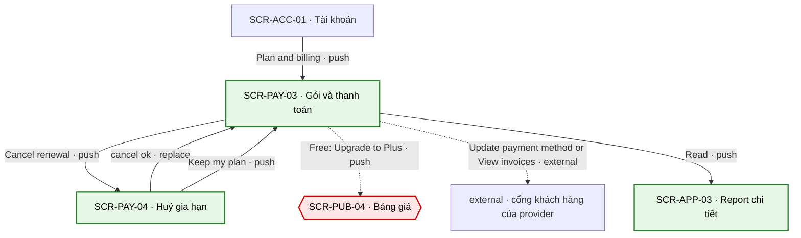
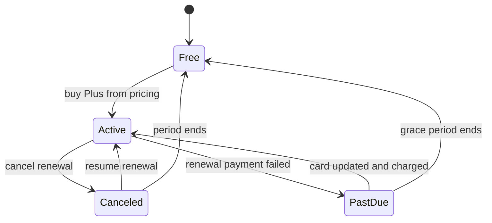

# [SCR-PAY-03] Gói & thanh toán — FULL

## 0. General

| id | module | doc level | platforms | route | access | indexable | viewports | related FLOW | status | design | tracking | api | Evidence / visual basis |
|---|---|---|---|---|---|---|---|---|---|---|---|---|---|
| SCR-PAY-03 | PAY | Full | Web | `/account/billing` | account | noindex | 390 · 768 · 1280 | FLOW-quan-ly-huy-gia-han | Draft | (sau design) | `tracking-events.md` → `billing` · ft_subscription | `docs/api/SCR-PAY-03-api.md` | **EV-TLW-247 · EV-TLW-046 · SC-TLW-27 · basis RS·F-11 · F-24 · BR-APP-02 · BR-APP-04** |

**Changelog** (mới nhất trước)
- 2026-09-28 · v1.1 · claude-opus-5-5 · D-06: khoá idempotency của huỷ / tiếp tục gia hạn = UUID cho mỗi thao tác mới + server kiểm trạng thái hiện tại (thay khoá cố định `subscriptionId` + hành động). D-15: Default gồm cả Free có lịch sử thanh toán (vẫn thấy "View invoices"); Empty chỉ khi chưa từng thanh toán.
- 2026-09-27 · v1 · claude (subagent) · khởi tạo từ blueprint.

## 1. Purpose & context

Nơi duy nhất để xem và quản lý tiền: gói hiện tại, trạng thái, giá gia hạn, ngày thu kế tiếp, phương thức thanh toán (BR-APP-02); huỷ gia hạn (sang SCR-PAY-04, một bước) hoặc tiếp tục gia hạn nếu đã lên lịch huỷ; cập nhật thẻ và xem hoá đơn qua cổng khách hàng của provider; danh sách report đã mua lẻ. Trang "Plan details" của đối thủ chỉ có Type · Member since · Next payment · Payment amount, ghi "Cancelled" nhưng tài khoản vẫn dùng được như cũ (RS·F-24), còn huỷ thì đi qua form email + link xác minh và ghi "take effect immediately" (RS·F-11). Ở đây trạng thái nói đúng điều đang xảy ra ("Cancels on [date]"), và quyền giữ tới hết kỳ đã trả (BR-APP-04). · basis BR-APP-02 · BR-APP-04 · SYS-ENTITLEMENT · Q-04

## 2. Điều hướng

### 2.1 Vào

| Vào qua | Từ | Trigger |
|---|---|---|
| NAV-PUB-04-3 | SCR-PUB-04 | "Manage plan" (đã có Plus) |
| NAV-PUB-06-1 | SCR-PUB-06 | "Manage or cancel your plan" |
| NAV-PAY-04-1 | SCR-PAY-04 | hệ thống: huỷ gia hạn thành công (replace) |
| NAV-PAY-04-2 | SCR-PAY-04 | "Keep my plan" |
| NAV-ACC-01-2 | SCR-ACC-01 | "Plan & billing" |
| entry ngoài | menu avatar / drawer app "Plan & billing" · email thanh toán gia hạn thất bại (API-MAIL-05) · email nhắc gia hạn (API-MAIL-03); chưa đăng nhập → `/login?next=/account/billing`, xong quay lại | SYS-NAV §1 · §4 |

### 2.2 Ra

| NAV-ID | Tới (SCR-ID · tham số) | Trigger (CMP-ID "nhãn") | Kiểu | URL / history | Animation | Back / đóng → | Guard / điều kiện | Nền tảng | Basis |
|---|---|---|---|---|---|---|---|---|---|
| NAV-PAY-03-1 | SCR-PAY-04 | CMP-04 "Cancel renewal" | push | `/account/billing/cancel` (push) | mặc định | back trình duyệt → SCR-PAY-03 | `plus` active, chưa lên lịch huỷ | Web | BR-APP-04 |
| NAV-PAY-03-2 | (cùng màn) tiếp tục gia hạn | CMP-04 "Resume renewal" | inline | không đổi URL | mặc định | — | đã lên lịch huỷ, còn trong kỳ | Web | BR-APP-04 |
| NAV-PAY-03-3 | SCR-PUB-04 | CMP-04 "Upgrade to Plus" | push | `/pricing` (push) | mặc định | back trình duyệt → SCR-PAY-03 | Free | Web | Q-02 |
| NAV-PAY-03-4 | external: cổng khách hàng của provider | CMP-05 "Update payment method" / CMP-06 "View invoices" | external | tab mới | mặc định | đóng tab → SCR-PAY-03 | có subscription/mua hàng | Web | Q-04 |
| NAV-PAY-03-5 | SCR-APP-03 · `reportId` | CMP-07 "Read" | push | `/app/reports/:reportId` (push) | mặc định | back trình duyệt → SCR-PAY-03 | — | Web | SYS-ENTITLEMENT |

### 2.3 Diagram

## 3. Layout & UI components

- **Design brief @390 (top→bottom):**
  - GC-SiteHeader (app);
  - H1 "Plan & billing";
  - (chỉ khi thanh toán gia hạn thất bại) banner CMP-08, trong banner có nút "Update payment method";
  - thẻ gói hiện tại: tên gói + nhãn trạng thái → giá + chu kỳ → "Next charge: …" hoặc "No upcoming charges" → phương thức thanh toán → GC-RenewalDisclosure;
  - nút hành động gói (CMP-04) ngay dưới thẻ, kích thước và độ tương phản như nút thường (không giấu, không làm mờ);
  - hai nút chữ "Update payment method" · "View invoices" (có icon mở tab mới);
  - danh sách report đã mua lẻ.
- **Delta 1280:** 2 cột trong container 1120: trái là thẻ gói + CMP-04…06, phải là CMP-07. Banner CMP-08 trải full width phía trên 2 cột.

| CMP-ID | Component | Display condition | Copy verbatim (en-US) | Basis (EV / Q) |
|---|---|---|---|---|
| CMP-01 | Header | luôn | GC-SiteHeader (app), theo GC | SYS-NAV §1 |
| CMP-02 | Tiêu đề | luôn | H1 "Plan & billing" | SYS-NAV §1 |
| CMP-03 | Thẻ gói hiện tại | luôn | tên gói ("Free" · "Plus"); giá + chu kỳ "[price] per month" · "[price] per year"; phương thức "[Brand] ending in [last4]" (từ provider); nhãn trạng thái + "Next charge: [amount] on [date]" hoặc "No upcoming charges" + câu gia hạn = GC-RenewalDisclosure variant `billing` (Active · Cancels on · Free), copy verbatim theo GC; `past_due`: nhãn vẫn "Active", ẩn dòng lần thu kế tiếp | BR-APP-02 · BR-PAY-11 · EV-TLW-247 |
| CMP-04 | Nút hành động gói | theo trạng thái | "Cancel renewal" (Active, chưa lên lịch huỷ) · "Resume renewal" (đã lên lịch huỷ, còn trong kỳ) · "Upgrade to Plus" (Free) | BR-APP-04 · BR-PAY-12 · RS·F-11 |
| CMP-05 | Cập nhật phương thức thanh toán | có subscription (kể cả đã lên lịch huỷ hoặc đang lỗi thanh toán); khi `past_due` thì nằm trong banner CMP-08 | "Update payment method" (mở tab mới) | Q-04 · BR-PAY-13 |
| CMP-06 | Hoá đơn | có ít nhất 1 giao dịch (subscription hoặc mua lẻ) | "View invoices" (mở tab mới) | Q-04 · BR-APP-12 |
| CMP-07 | Report đã mua lẻ | có ≥ 1 `report.single` | tiêu đề "Reports you bought"; mỗi dòng: tên bài · ngày mua · "Read" | SYS-ENTITLEMENT |
| CMP-08 | Banner thanh toán thất bại | subscription `past_due` (đang trong ân hạn) | "We couldn't renew your plan. Update your payment method to keep Plus." | BR-PAY-13 · API-MAIL-05 |

## 4. Screen states

| State | Trigger cụ thể | Frame | EV / basis |
|---|---|---|---|
| Default | API-PAY-04 trả subscription (`active` · `canceled` còn trong kỳ · `past_due`), hoặc Free có lịch sử thanh toán (`hasBillingHistory` = true: từng có Plus hoặc có mua lẻ) | CMP-01…07 theo trạng thái (+ CMP-08 khi `past_due`); Free thì CMP-03 "Free", CMP-04 "Upgrade to Plus", CMP-06 "View invoices" vẫn hiện | EV-TLW-247 (đối lập) · BR-PAY-11 |
| Loading | tải API-PAY-04 > 300 ms; bấm "Resume renewal" | skeleton thẻ gói; spinner trong nút CMP-04 | tieu-chuan-chung §3 |
| Empty | Free, chưa từng thanh toán (`hasBillingHistory` = false) | "You're on Free. Test summaries are always free." + CMP-04 "Upgrade to Plus" | Q-02 |
| Error | API-PAY-04 lỗi / timeout / 5xx | "We couldn't load your plan. Please refresh." | tieu-chuan-chung §2 |
| Locked | chưa đăng nhập | không render; guard redirect `/login?next=/account/billing` | SYS-NAV §4 · SYS-AUTH |

## 5. Interaction & validation

### 5.1 Behavior

| Hành động | Kết quả |
|---|---|
| "Cancel renewal" | NAV-PAY-03-1; không gọi API ở màn này |
| "Resume renewal" | API-PAY-06 (`Idempotency-Key` = UUID cho mỗi thao tác mới, 00-quy-uoc-api §5, kèm `consent.version` của câu công bố đang hiện); nút spinner + khoá; OK → CMP-03 về "Active" + toast "Plus will renew on [date]." (NAV-PAY-03-2) |
| "Upgrade to Plus" | NAV-PAY-03-3 |
| "Update payment method" / "View invoices" | mở tab trống NGAY trong sự kiện click (tránh popup blocker) → API-PAY-07 (`purpose`) → gán `portalUrl` cho tab đó (NAV-PAY-03-4); lỗi → đóng tab trống, hiện lỗi |
| "Read" (CMP-07) | NAV-PAY-03-5 |
| Quay lại tab này (sau khi dùng cổng provider) | sự kiện `visibilitychange` → gọi lại API-PAY-04 để cập nhật 4 số cuối của thẻ và banner |
| Bàn phím | mọi nút đi được bằng Tab theo thứ tự hiển thị; nút mở tab mới có `aria-label` "… (opens in a new tab)" |

### 5.2 Validation (verbatim)

| Check | Khi nào | Copy |
|---|---|---|
| "Resume renewal" còn hợp lệ (còn trong kỳ, đang lên lịch huỷ) | server (API-PAY-06) | 422 `not_resumable` → tải lại API-PAY-04, hiện trạng thái thật (không toast lỗi riêng) |
| Câu công bố gia hạn còn đúng version | server (API-PAY-06) | 422 `consent_outdated` → tải lại API-PAY-04: "Renewal terms have changed. Please review them and try again." |
| Mở được cổng provider | server (API-PAY-07) | 5xx / timeout: "Something went wrong on our side. Please try again." |

## 6. Data & API

### 6.1 Dữ liệu hiển thị
planKey hiện tại; subscription: trạng thái, lên lịch huỷ hay chưa, ngày hết kỳ, ngày mất quyền thực tế, giá gia hạn, chu kỳ, lần thu kế tiếp (số tiền + ngày), phương thức thanh toán (hãng + 4 số cuối, từ provider), hạn ân hạn khi `past_due`, có được "Resume renewal" không; danh sách report mua lẻ (tên bài, ngày mua, `reportId`); đã có giao dịch nào chưa; câu công bố + version.

### 6.2 Endpoint

| API | Khi nào |
|---|---|
| API-PAY-04 | mở trang; quay lại tab sau khi dùng cổng provider; sau API-PAY-06 |
| API-PAY-06 | bấm CMP-04 "Resume renewal" |
| API-PAY-07 | bấm CMP-05 "Update payment method" / CMP-06 "View invoices" |

### 6.3 Chi tiết → `docs/api/SCR-PAY-03-api.md`

### 6.4 Bảng giá (cite 00-overview §2)

| Plan | planKey | Giá base | Giới hạn | Neo đối thủ (RS·F · EV · [LIVE:browser]) |
|---|---|---|---|---|
| Free | `plan.free` | 0 · basis Q-02 (00-overview §2) | làm mọi bài; tóm tắt chấm thật; lịch sử; check-in + streak | đối thủ không có gói free · RS·F-05 `[LIVE:browser · EV-TLW-025 · 2026-09-27]` |
| This report | `report.single` | placeholder — Q-03 (00-overview §2) | report + PDF của 1 kết quả, vĩnh viễn | "One Time $57.00" · RS·F-05 `[LIVE:browser · EV-TLW-025 · 2026-09-27]` |
| Plus tháng | `plan.plus.monthly` | placeholder — Q-03 (00-overview §2) | mọi report + PDF; thử thách 30 ngày; tự gia hạn mỗi tháng | "$39.95 every 4 weeks"; trang "Plan details" chỉ ghi "Payment amount $39.95", không có ngày thu kế tiếp khi "Cancelled" · RS·F-24 `[LIVE:browser · EV-TLW-025 · EV-TLW-247 · 2026-09-27]` |
| Plus năm | `plan.plus.annual` | placeholder — Q-03 (00-overview §2) | như Plus tháng; tự gia hạn mỗi năm | đối thủ không có gói năm · RS·F-05 `[LIVE:browser · EV-TLW-025 · 2026-09-27]` |

## 7. Business rules & permissions

| BR-ID | Rule | Basis | Access |
|---|---|---|---|
| BR-PAY-11 | Hiện đủ: gói, trạng thái, giá gia hạn, ngày thu kế tiếp, phương thức thanh toán (BR-APP-02). Dữ liệu đọc từ bản sao trong DB (cập nhật bởi webhook), không suy ra ở client | BR-APP-02 · BR-APP-01 | account |
| BR-PAY-12 | "Resume renewal" chỉ khi còn trong kỳ; hết kỳ phải mua lại qua trang giá | BR-APP-04 · SYS-ENTITLEMENT | account |
| BR-PAY-13 | Thanh toán gia hạn thất bại: banner CMP-08 + link cập nhật thẻ; quyền giữ trong thời gian ân hạn của provider (SYS-ENTITLEMENT) | SYS-ENTITLEMENT · Q-04 · API-MAIL-05 | account |

## 8. Edge cases & error handling

| EC-xx | Case | Kết quả xác định (kể cả khi fail) | Basis |
|---|---|---|---|
| EC-01 | Vừa huỷ ở SCR-PAY-04 (vào bằng replace) | CMP-03 "Cancels on [date]" + toast "Your plan won't renew. You have Plus until [date]." — toast truyền qua state của router, không qua URL, nên reload không hiện lại | BR-PAY-15 · BR-APP-04 |
| EC-02 | "Resume renewal" đúng lúc kỳ vừa hết | 422 `not_resumable` → tải lại, CMP-03 hiện "Free", CMP-04 thành "Upgrade to Plus" | BR-PAY-12 |
| EC-03 | Bấm "Resume renewal" ở 2 tab | server kiểm trạng thái hiện tại (đã `active`) → cả hai nhận trạng thái hiện tại, không gọi provider lần hai | 00-quy-uoc-api §5 |
| EC-04 | Trình duyệt vẫn chặn tab mới | fallback mở cổng provider ngay trong tab này; cổng có return URL cố định về `/account/billing` | Q-04 |
| EC-05 | API-PAY-07 lỗi | đóng tab trống, hiện "Something went wrong on our side. Please try again." | tieu-chuan-chung §2 |
| EC-06 | Đã cập nhật thẻ nhưng webhook chưa về | banner CMP-08 giữ nguyên tới khi API-PAY-04 hết `past_due`; client không tự ẩn | BR-APP-01 |
| EC-07 | Hết ân hạn mà vẫn chưa thu được | mất `plus` (SYS-ENTITLEMENT) → CMP-03 "Free"; report mua lẻ vẫn còn trong CMP-07 | SYS-ENTITLEMENT |
| EC-08 | Huỷ gia hạn ngay trong cổng provider (nếu cổng cho phép) | webhook cập nhật bản sao → CMP-03 "Cancels on [date]"; email xác nhận huỷ (API-MAIL-04) vẫn gửi | BR-APP-04 · 00-quy-uoc-api §6 |
| EC-09 | Đổi chu kỳ tháng ↔ năm | không có trong MVP (không có API); cổng provider phải tắt tính năng đổi gói để mọi gói tự gia hạn đều đi qua consent (BR-APP-03) | BR-APP-03 · Q-04 |
| EC-10 | Phiên đăng nhập hết hạn khi bấm nút | 401 → `/login?next=/account/billing` (tieu-chuan-chung §1) | SYS-AUTH |
| EC-11 | Report mua lẻ thuộc bài `sensitive` | vẫn liệt kê tên bài (đây là sản phẩm đã mua, có trên hoá đơn); không hiện type | BR-APP-06 |

## 9. Responsive deltas

| Aspect | 390 | 768 | 1280 |
|---|---|---|---|
| Bố cục | 1 cột | 1 cột, tối đa 720 | 2 cột: thẻ gói + nút bên trái, CMP-07 bên phải |
| CMP-04 | full width | tự co theo chữ | tự co theo chữ |
| CMP-08 | full width, trên thẻ gói | như 390 | full width trên 2 cột |

## 10. SEO

`noindex` (route `account`, tieu-chuan-chung §8). Không có row trong `seo-meta.md`.

## 11. Tracking

`screen_active` · `billing` · ft_subscription start (`from` = billing, hoặc email khi vào từ link email; `plan_key`) · ft_subscription resume (success / fail, `plan_key`) khi API-PAY-06 trả về · ft_subscription portal_open khi API-PAY-07 trả URL. ft_subscription cancel_open bắn ở SCR-PAY-04. Không gửi 4 số cuối thẻ, số tiền hay tên bài.

## 12. Non-functional

| Hạng mục | Mục tiêu |
|---|---|
| API-PAY-04 | p95 ≤ 500 ms (đọc DB, không gọi provider) `[INFERRED]` |
| Độ trễ đồng bộ | webhook của provider → bản sao DB ≤ 1 phút (p95) `[INFERRED]`, theo dõi bằng log API-HOOK-01 |
| A11y | nhãn trạng thái là chữ (không chỉ màu); banner CMP-08 `role="alert"` khi tải trang; toast `aria-live="polite"` |

## 13. AI Notices
- Thời gian ân hạn và hành vi thu lại khi thất bại theo cấu hình provider (Q-04).
- Cấu hình cổng khách hàng của provider (tắt đổi gói, có hay không cho huỷ trong cổng) cần chốt cùng Q-04.
- Copy mới không có trong blueprint (đề xuất): "[Brand] ending in [last4]", "Reports you bought", toast "Plus will renew on [date].", "Renewal terms have changed. Please review them and try again.".
- Ghi `consent.version` khi "Resume renewal" là đề xuất để audit gia hạn lại (BR-APP-03 chỉ nói lúc mua).
