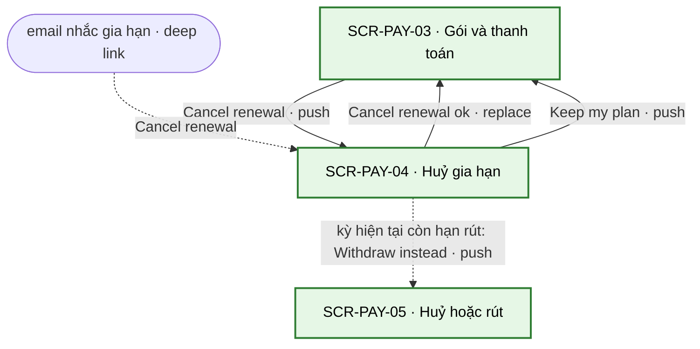
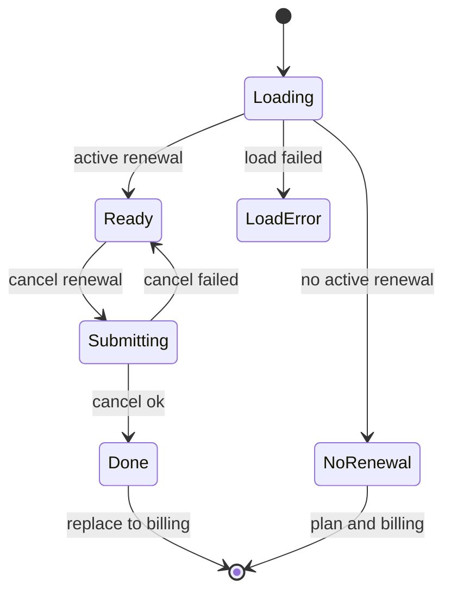

# [SCR-PAY-04] Huỷ gia hạn — FULL

## 0. General

| id | module | doc level | platforms | route | access | indexable | viewports | related FLOW | status | design | tracking | api | Evidence / visual basis |
|---|---|---|---|---|---|---|---|---|---|---|---|---|---|
| SCR-PAY-04 | PAY | Full | Web | `/account/billing/cancel` | account | noindex | 390 · 768 · 1280 | FLOW-quan-ly-huy-gia-han | Draft | (sau design) | `tracking-events.md` → `cancel_renewal` · ft_subscription | `docs/api/SCR-PAY-04-api.md` | **EV-TLW-046 · EV-TLW-247 · SC-TLW-07 · basis RS·F-11 · F-24 · BR-APP-04 · BR-APP-14 · Q-18 · Q-25** |

**Changelog** (mới nhất trước)
- 2026-09-28 · v1.2 · claude-opus-5-5 · Q-18 · Q-25: thêm NAV-PAY-04-3 + CMP-07 (dòng thông tin "Paid in the last 14 days? …" + "Withdraw instead" → SCR-PAY-05; không phải bước giữ chân); ghi huỷ cũng làm được không cần đăng nhập ở SCR-PAY-05; EC-10 theo Q-18 đã chốt, thêm EC-12 · EC-13; Q-16: email nhắc 21 / 7 ngày; Q-03: giá thật ở §6.4; ft_subscription `channel` = account; AI Notices cập nhật. EC-03 thêm link "Cancel without signing in" của email nhắc (GC-RenewalDisclosure `email`).
- 2026-09-28 · v1.1 · claude-opus-5-5 · D-06: khoá idempotency của huỷ / tiếp tục gia hạn = UUID cho mỗi thao tác mới + server kiểm trạng thái hiện tại (thay khoá cố định `subscriptionId` + hành động). D-07: thời hạn lưu lý do huỷ thống nhất — tách khỏi danh tính sau 90 ngày, xoá luôn nếu tài khoản bị xoá trước đó.
- 2026-09-27 · v1 · claude (subagent) · khởi tạo từ blueprint.

## 1. Purpose & context

Trang riêng có route (link được từ email nhắc gia hạn) để huỷ gia hạn Plus bằng MỘT nút. Trang nói rõ hệ quả trước khi bấm: Plus còn dùng tới hết kỳ đã trả, report mua lẻ và kết quả tóm tắt vẫn giữ, chỉ mất thử thách 30 ngày và các report có được nhờ Plus. Không có bước giữ chân, không offer giảm giá chen giữa, không bắt nêu lý do (BR-APP-04). Huỷ cũng làm được không cần đăng nhập ở `/cancel` (SCR-PAY-05, link "Cancel your plan here" ở footer mọi trang). Nếu khoản thanh toán của kỳ Plus hiện tại còn trong 14 ngày (lần thanh toán đầu, hoặc một lần gia hạn năm), trang có thêm một dòng thông tin kèm link "Withdraw instead" (NAV-PAY-04-3) để rút và được hoàn toàn bộ (BR-APP-14); dòng này đặt sau hai nút, không phải bước giữ chân. Đối thủ huỷ qua form email + link xác minh, ghi "take effect immediately" và mất quyền ngay (RS·F-11), nhưng thực tế tài khoản đã "Cancelled" vẫn dùng được, nên người dùng không biết khi nào mất quyền (RS·F-24). · basis BR-APP-04 · BR-APP-14 · Q-18 · Q-25 · SYS-ENTITLEMENT · P-03

## 2. Điều hướng

### 2.1 Vào

| Vào qua | Từ | Trigger |
|---|---|---|
| NAV-PAY-03-1 | SCR-PAY-03 | "Cancel renewal" |
| entry ngoài | email nhắc gia hạn (21 ngày trước kỳ năm, 7 ngày trước kỳ tháng — Q-16), link "Cancel renewal" (API-MAIL-03, deep link); chưa đăng nhập → `/login?next=/account/billing/cancel`, magic link xong quay lại đúng trang này (BR-PAY-16) | SYS-NAV §4 |

### 2.2 Ra

| NAV-ID | Tới (SCR-ID · tham số) | Trigger (CMP-ID "nhãn") | Kiểu | URL / history | Animation | Back / đóng → | Guard / điều kiện | Nền tảng | Basis |
|---|---|---|---|---|---|---|---|---|---|
| NAV-PAY-04-1 | SCR-PAY-03 | hệ thống: API-PAY-05 thành công sau CMP-04 "Cancel renewal" | replace | `/account/billing/cancel` → `/account/billing` (replace) | mặc định | back trình duyệt → trang trước SCR-PAY-04 | — | Web | BR-APP-04 |
| NAV-PAY-04-2 | SCR-PAY-03 | CMP-05 "Keep my plan" | push | `/account/billing` (push) | mặc định | back trình duyệt → SCR-PAY-04 | — | Web | BR-APP-04 |
| NAV-PAY-04-3 | SCR-PAY-05 · `mode=withdraw` · `order=<orderNumber>` | CMP-07 "Withdraw instead" | push | `/cancel?mode=withdraw&order=<orderNumber>` (push) | mặc định | back trình duyệt → SCR-PAY-04 | khoản thanh toán của kỳ Plus hiện tại còn hạn rút: lần thanh toán đầu hoặc gia hạn năm, ≤ 14 ngày (`currentPeriodPayment.withdrawableUntil` > now) | Web | BR-APP-14 · Q-25 |

### 2.3 Diagram

## 3. Layout & UI components

- **Design brief @390 (top→bottom):**
  - GC-SiteHeader (app);
  - H1 "Cancel renewal";
  - khối hệ quả: câu chính (ngày [date] in đậm) → danh sách những gì sẽ mất → GC-RenewalDisclosure (`billing` · Active) cho thấy lần thu kế tiếp, là lần thu sẽ dừng nếu huỷ;
  - ô lý do tuỳ chọn, thu gọn mặc định (bấm "Tell us why (optional)" mới mở textarea), để nút chính vẫn thấy được mà không cần cuộn nhiều;
  - nút chính "Cancel renewal" full width;
  - nút phụ "Keep my plan" full width, ngay dưới;
  - (chỉ khi khoản thanh toán của kỳ hiện tại còn hạn rút) dòng thông tin CMP-07 dưới hai nút: một câu + link "Withdraw instead", chữ thường, không nổi hơn nút chính.
- **Không** có hộp thoại "Are you sure?", offer giảm giá, khảo sát bắt buộc, nút huỷ bị làm mờ hay đặt xa, hoặc bước xác minh qua email (BR-PAY-14).
- **Delta 1280:** nội dung rộng tối đa 640, căn giữa; 2 nút nằm cùng hàng, "Cancel renewal" bên trái; CMP-07 dưới hàng nút.

| CMP-ID | Component | Display condition | Copy verbatim (en-US) | Basis (EV / Q) |
|---|---|---|---|---|
| CMP-01 | Header | luôn | GC-SiteHeader (app), theo GC | SYS-NAV §1 |
| CMP-02 | Tiêu đề | luôn | H1 "Cancel renewal" | BR-APP-04 |
| CMP-03 | Hệ quả | có gia hạn đang chạy | "Your Plus plan stays active until [date]. After that, you'll keep every report you unlocked separately, and your test summaries stay free." + "After [date], you'll no longer have:" · "The 30-day challenge" · "Full reports and PDFs that came with Plus"; kèm GC-RenewalDisclosure variant `billing` · Active (trạng thái hiện tại trước khi huỷ: lần thu kế tiếp + câu gia hạn, copy verbatim theo GC) | BR-APP-04 · BR-APP-02 · SYS-ENTITLEMENT · RS·F-24 |
| CMP-04 | Nút chính | có gia hạn đang chạy | "Cancel renewal" — một lần bấm là huỷ, không có bước xác nhận thứ hai | BR-APP-04 · BR-PAY-14 · RS·F-11 |
| CMP-05 | Nút phụ | luôn; ở state Empty nhãn đổi thành "Plan & billing" (cùng cạnh NAV-PAY-04-2) | "Keep my plan" | BR-APP-04 · BR-PAY-17 |
| CMP-06 | Ô lý do | có gia hạn đang chạy; tuỳ chọn, thu gọn mặc định, không chặn CMP-04 | "Tell us why (optional)" — textarea tối đa 500 ký tự | BR-PAY-14 |
| CMP-07 | Dòng rút thay vì huỷ | khoản thanh toán của kỳ Plus hiện tại còn hạn rút (lần thanh toán đầu hoặc gia hạn năm, ≤ 14 ngày: `currentPeriodPayment.withdrawableUntil` > now); hiện cả ở state Empty nếu điều kiện này đúng | "Paid in the last 14 days? You can withdraw instead and get a full refund." + link "Withdraw instead" (NAV-PAY-04-3) — thông tin, không phải bước giữ chân; không chặn, không làm chậm CMP-04 | BR-APP-14 · Q-25 · BR-PAY-14 |

## 4. Screen states

| State | Trigger cụ thể | Frame | EV / basis |
|---|---|---|---|
| Default | API-PAY-04: subscription `active` hoặc `past_due`, chưa lên lịch huỷ | CMP-01…06 (+ CMP-07 khi khoản của kỳ hiện tại còn hạn rút) | BR-APP-04 · BR-APP-14 |
| Loading | tải API-PAY-04 > 300 ms; đang gọi API-PAY-05 | skeleton khối hệ quả; khi huỷ: spinner trong CMP-04, khoá cả 2 nút | tieu-chuan-chung §3 |
| Empty | không có gia hạn đang chạy (Free, đã lên lịch huỷ, đã hết kỳ) | "You don't have an active renewal." + CMP-05 với nhãn "Plan & billing"; ẩn CMP-03, CMP-04, CMP-06; CMP-07 vẫn hiện nếu khoản của kỳ hiện tại còn hạn rút (vd đã lên lịch huỷ trong 14 ngày đầu) | BR-PAY-17 · BR-APP-14 |
| Error | API-PAY-05 lỗi / timeout 10 s / 5xx · API-PAY-04 lỗi | huỷ lỗi: "We couldn't cancel right now. Please try again, or email support@[domain]." (giữ lý do đã gõ) · tải lỗi: "We couldn't load your plan. Please refresh." | cong-nghe-loi §3 · tieu-chuan-chung §2 |
| Locked | chưa đăng nhập | không render; guard redirect `/login?next=/account/billing/cancel` | SYS-NAV §4 · BR-PAY-16 |

## 5. Interaction & validation

### 5.1 Behavior

| Hành động | Kết quả |
|---|---|
| Bấm CMP-04 "Cancel renewal" | API-PAY-05 (`Idempotency-Key` = UUID cho mỗi thao tác mới, 00-quy-uoc-api §5; body có `reason` nếu đã gõ); spinner, khoá 2 nút; OK → NAV-PAY-04-1 (replace) + toast trên SCR-PAY-03 (BR-PAY-15) |
| Bấm CMP-05 "Keep my plan" | NAV-PAY-04-2; không gọi API |
| Bấm "Withdraw instead" (CMP-07) | NAV-PAY-04-3 (push; router state `from` = billing cho ft_withdrawal ở SCR-PAY-05); không gọi API, không huỷ gì ở màn này |
| Mở / gõ CMP-06 | không validate bắt buộc; bộ đếm ký tự khi còn ≤ 50; `Enter` xuống dòng, không submit |
| Back trình duyệt | về trang trước (SCR-PAY-03 hoặc trang trước khi mở link email) |
| Bàn phím | thứ tự Tab: CMP-06 (nút mở) → CMP-04 → CMP-05 → CMP-07 (nếu có); focus nhìn thấy trên mọi nút / link |

### 5.2 Validation (verbatim)

| Check | Khi nào | Copy |
|---|---|---|
| Lý do (tuỳ chọn) | không bao giờ chặn | `maxlength` 500 trên textarea; server cắt phần thừa, không từ chối (BR-PAY-14) |
| Còn gia hạn để huỷ | server (API-PAY-05) | 422 `not_active` → state Empty: "You don't have an active renewal." |
| Huỷ thành công | sau API-PAY-05 | lỗi: "We couldn't cancel right now. Please try again, or email support@[domain]." |

## 6. Data & API

### 6.1 Dữ liệu hiển thị
Gói (Plus tháng / năm), trạng thái, đã lên lịch huỷ chưa, ngày mất quyền thực tế (`accessEndsAt`, dùng cho [date]), lần thu kế tiếp (số tiền + ngày, cho GC-RenewalDisclosure), giá gia hạn (giá đã khoá lúc mua, BR-APP-13), chu kỳ, khoản thanh toán của kỳ hiện tại (mã đơn + hạn rút, cho CMP-07).

### 6.2 Endpoint

| API | Khi nào |
|---|---|
| API-PAY-04 | mở trang: có gia hạn đang chạy không, ngày cho câu hệ quả |
| API-PAY-05 | bấm CMP-04 "Cancel renewal" |

### 6.3 Chi tiết → `docs/api/SCR-PAY-04-api.md`

### 6.4 Bảng giá (cite 00-overview §2)

| Plan | planKey | Giá base | Giới hạn | Neo đối thủ (RS·F · EV · [LIVE:browser]) |
|---|---|---|---|---|
| Plus tháng | `plan.plus.monthly` | $12.99 / month (USD, chưa gồm thuế — 00-overview §2) | huỷ thì giữ Plus tới hết tháng đã trả, không thu kỳ sau; kỳ gia hạn tháng không hoàn; lần thanh toán đầu rút được trong 14 ngày (BR-APP-14) | "$39.95 every 4 weeks"; huỷ "take effect immediately" · RS·F-05 · F-11 `[LIVE:browser · EV-TLW-025 · EV-TLW-046 · 2026-09-27]` |
| Plus năm | `plan.plus.annual` | $69.99 / year (USD, chưa gồm thuế — 00-overview §2) | huỷ thì giữ Plus tới hết năm đã trả, không thu kỳ sau; lần thanh toán đầu và mỗi lần gia hạn năm rút được trong 14 ngày (BR-APP-14) | đối thủ không có gói năm · RS·F-05 `[LIVE:browser · EV-TLW-025 · 2026-09-27]` |

## 7. Business rules & permissions

| BR-ID | Rule | Basis | Access |
|---|---|---|---|
| BR-PAY-14 | Một nút xác nhận; không bước giữ chân, không offer giảm giá chen giữa, không bắt nêu lý do (BR-APP-04). Lý do dù dài hay rỗng đều không làm huỷ thất bại. Dòng CMP-07 (rút thay vì huỷ) chỉ là thông tin, đặt sau hai nút, không chặn CMP-04 | BR-APP-04 · RS·F-11 · P-03 | account |
| BR-PAY-15 | Sau huỷ: email xác nhận (API-MAIL-04) trong 5 phút, có ngày giờ nhận yêu cầu (cùng template với huỷ ở SCR-PAY-05 — BR-PAY-21); SCR-PAY-03 hiện "Cancels on [date]" + toast "Your plan won't renew. You have Plus until [date]." | BR-APP-04 · Q-16 · BR-PAY-21 | account |
| BR-PAY-16 | Vào từ email khi chưa đăng nhập → magic link rồi quay lại đúng trang này (`next`); không muốn đăng nhập thì huỷ ở `/cancel` (SCR-PAY-05) | SYS-AUTH · BR-APP-10 · BR-PAY-18 | account |
| BR-PAY-17 | Không có gia hạn active → "You don't have an active renewal." + link "Plan & billing" | BR-APP-04 | account |

## 8. Edge cases & error handling

| EC-xx | Case | Kết quả xác định (kể cả khi fail) | Basis |
|---|---|---|---|
| EC-01 | Bấm 2 lần / 2 tab cùng huỷ | nút khoá sau lần bấm đầu; tab thứ hai gửi khoá khác nhưng server kiểm trạng thái hiện tại (đã lên lịch huỷ) → 200, không gọi provider, không gửi email lần hai → vẫn NAV-PAY-04-1 | 00-quy-uoc-api §5 |
| EC-02 | Mở link email khi đã huỷ từ trước | state Empty (BR-PAY-17) | BR-PAY-17 |
| EC-03 | Mở link email khi chưa đăng nhập | guard `/login?next=/account/billing/cancel` → magic link → quay lại trang này; hoặc dùng link "Cancel without signing in" ngay trong email nhắc (`/cancel?order=…`) hay "Cancel your plan here" ở footer → SCR-PAY-05, không cần đăng nhập | BR-PAY-16 · SYS-AUTH · BR-PAY-18 |
| EC-04 | Đăng nhập bằng email khác email đã mua | tài khoản này không có gia hạn → Empty; không lộ thông tin của tài khoản khác | SYS-AUTH |
| EC-05 | Subscription đang `past_due` (thanh toán gia hạn lỗi) | vẫn huỷ được; provider ngừng thu lại; [date] = `accessEndsAt` do server trả (có thể là hôm nay nếu kỳ đã hết) | SYS-ENTITLEMENT · Q-04 |
| EC-06 | API-PAY-05 lỗi / timeout 10 s | ở lại trang, giữ lý do đã gõ, mở lại nút, hiện copy Error; bấm lại dùng cùng key | cong-nghe-loi §3 · 00-quy-uoc-api §5 |
| EC-07 | Kỳ vừa hết trong lúc trang đang mở | 422 `not_active` → Empty | BR-PAY-17 |
| EC-08 | Tài khoản Free chỉ có report mua lẻ | Empty; report mua lẻ không có gia hạn nên không có gì để huỷ | SYS-ENTITLEMENT |
| EC-09 | Email xác nhận chưa tới sau 5 phút | job gửi lại theo hàng đợi email; SCR-PAY-03 vẫn là nguồn sự thật cho trạng thái | BR-PAY-15 · API-MAIL-04 |
| EC-10 | Muốn hoàn tiền kỳ hiện tại | huỷ không hoàn tiền (Q-18 (a)). Khoản của kỳ này là lần thanh toán đầu hoặc gia hạn năm và còn trong 14 ngày → CMP-07 "Withdraw instead" (NAV-PAY-04-3) → SCR-PAY-05: hoàn toàn bộ, Plus kết thúc ngay. Kỳ gia hạn tháng hoặc quá 14 ngày → không hoàn, trừ lỗi phía mình hoặc khi luật nơi khách sống cho nhiều hơn (liên hệ hỗ trợ, SCR-PUB-06) | Q-18 · BR-APP-14 |
| EC-11 | Đổi ý sau khi huỷ | "Resume renewal" ở SCR-PAY-03 khi còn trong kỳ | BR-PAY-12 |
| EC-12 | Đã huỷ ở đây rồi mới muốn rút (còn trong 14 ngày) | vẫn rút được: "Withdraw and get a refund" ở SCR-PAY-03 (NAV-PAY-03-6), CMP-07 ở state Empty, hoặc footer "Withdraw from contract here" → SCR-PAY-05 | BR-APP-14 · BR-PAY-23 |
| EC-13 | Hạn rút qua khi trang đang mở | CMP-07 vẫn hiện tới khi tải lại; SCR-PAY-05 trả 422 `not_eligible` → câu quá hạn, vẫn huỷ được | BR-PAY-20 |

## 9. Responsive deltas

| Aspect | 390 | 768 | 1280 |
|---|---|---|---|
| Nội dung | full width, padding 16 | tối đa 640, căn giữa | tối đa 640, căn giữa |
| 2 nút | xếp dọc, "Cancel renewal" trên | cùng hàng, "Cancel renewal" trái | như 768 |
| CMP-06 | thu gọn mặc định | thu gọn mặc định | thu gọn mặc định |
| CMP-07 | dưới 2 nút, full width | dưới hàng nút | như 768 |

## 10. SEO

`noindex` (route `account`, tieu-chuan-chung §8). Không có row trong `seo-meta.md`.

## 11. Tracking

`screen_active` · `cancel_renewal` · ft_subscription cancel_open (`from` = billing / email) khi trang hiện · ft_subscription cancel_confirm (success / fail, `plan_key`, `channel` = account) khi API-PAY-05 trả về. CMP-07 không bắn event ở đây: NAV-PAY-04-3 mang `from` = billing qua router state để SCR-PAY-05 bắn ft_withdrawal start. ft_subscription start chỉ bắn ở đây khi vào thẳng từ email (vào từ SCR-PAY-03 thì start đã bắn ở đó). Không bao giờ gửi nội dung lý do lên analytics.

## 12. Non-functional

| Hạng mục | Mục tiêu |
|---|---|
| API-PAY-05 | p95 ≤ 2 s (gọi provider đồng bộ để đặt huỷ cuối kỳ) `[INFERRED]` |
| Email xác nhận | ≤ 5 phút sau khi huỷ (BR-PAY-15) |
| A11y | CMP-03 là đoạn văn thường (không ẩn trong tooltip); 2 nút có nhãn rõ, không chỉ icon; kết quả lỗi đọc bằng `role="alert"` |

## 13. AI Notices
- Q-18 · Q-25 đã chốt (2026-09-28): huỷ không hoàn tiền; rút trong 14 ngày (lần thanh toán đầu, gia hạn năm) làm ở SCR-PAY-05, lối vào từ đây là CMP-07 (NAV-PAY-04-3). Huỷ cũng làm được không cần đăng nhập ở SCR-PAY-05.
- Blueprint có link "Plan & billing" ở state Empty nhưng không có NAV riêng: file này dùng lại CMP-05 (đổi nhãn) trên cạnh NAV-PAY-04-2 để không thêm NAV ngoài blueprint.
- BR-APP-02 yêu cầu trang huỷ có công bố gia hạn, nhưng blueprint không có CMP riêng cho GC-RenewalDisclosure ở màn này: đã gộp vào CMP-03.
- Lý do huỷ là dữ liệu tự do (có thể chứa thông tin cá nhân): chỉ lưu nội bộ, tách khỏi danh tính sau 90 ngày (cong-nghe-loi §4), xoá luôn nếu tài khoản bị xoá trước mốc đó (BR-APP-11); không vào analytics.
- Copy AI viết, không có trong blueprint: "After [date], you'll no longer have:" và 2 dòng liệt kê. Copy từ quyết định 2026-09-28: CMP-07 ("Paid in the last 14 days? You can withdraw instead and get a full refund." · "Withdraw instead").
