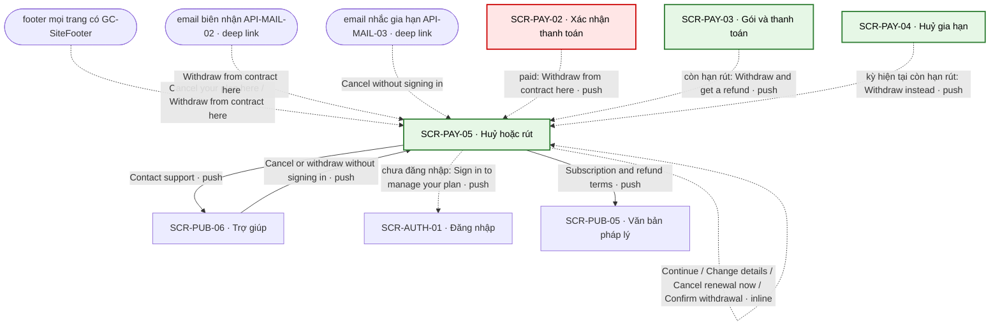
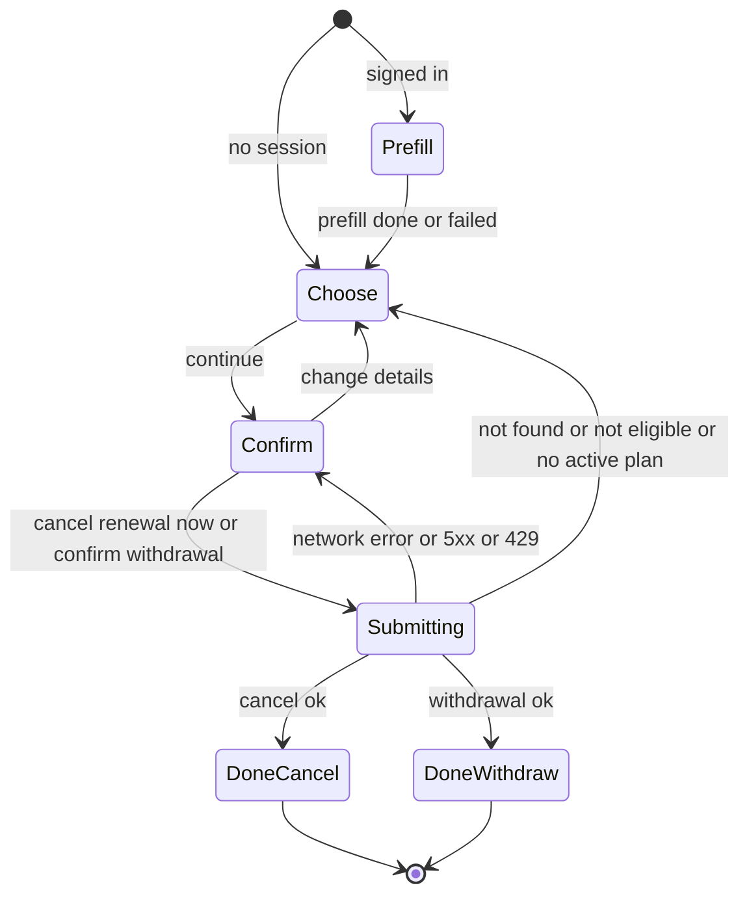

# [SCR-PAY-05] Huỷ hoặc rút — FULL

## 0. General

| id | module | doc level | platforms | route | access | indexable | viewports | related FLOW | status | design | tracking | api | Evidence / visual basis |
|---|---|---|---|---|---|---|---|---|---|---|---|---|---|
| SCR-PAY-05 | PAY | Full | Web | `/cancel` · `/cancel?order=<orderNumber>` · `/cancel?mode=withdraw` · `/cancel?mode=withdraw&order=<orderNumber>` | public | index | 390 · 768 · 1280 | FLOW-quan-ly-huy-gia-han | Draft | (sau design) | `tracking-events.md` → `cancel_or_withdraw` · ft_subscription · ft_withdrawal | `docs/api/SCR-PAY-05-api.md` | **EV-TLW-046 · web-evidence F-42 · F-43 · basis RS·F-11 · BR-APP-04 · BR-APP-14 · Q-18 · Q-25 · regulatory-landscape §3** |

**Changelog** (mới nhất trước)
- 2026-09-28 · v1 · claude (subagent) · khởi tạo theo Q-18 · Q-25 (AI · uỷ quyền human 2026-09-28): một trang public huỷ gia hạn Plus + rút một khoản trong 14 ngày, không cần đăng nhập; NAV-PAY-05-1…6, BR-PAY-18…22; schema API-PAY-08 · API-PAY-09 ở `SCR-PAY-05-api.md`. Bổ sung khi viết màn: bước 1 có ô tên bắt buộc (chỉ ghi vào bản ghi yêu cầu + email xác nhận); cặp email + mã đơn luôn được chấp nhận, kể cả khi đang đăng nhập tài khoản khác (email điền sẵn sửa được); hạn rút = `paidAt` + 15 ngày; thêm đường vào `/cancel?order=` từ email nhắc API-MAIL-03 (EC-20); bỏ mã copy của brief. Hạn rút chốt lại: `paidAt` + 15 ngày + 1 giờ (không ngắn hơn hạn luật kể cả khi đổi giờ mùa); "until [date]" hiện ngày của mốc lùi 1 ngày (không hứa quá mốc server nhận).

## 1. Purpose & context

Một trang, không cần đăng nhập, làm hai việc: (1) **huỷ gia hạn Plus** — hiệu lực như SCR-PAY-04: dùng Plus tới hết kỳ đã trả, không thu kỳ sau; (2) **rút một khoản trong 14 ngày** — hoàn toàn bộ, không hỏi lý do, quyền của khoản đó kết thúc ngay (BR-APP-14). Trang là "withdrawal function" của EU (hai bước, email xác nhận có ngày giờ nhận) và là nút huỷ không cần đăng nhập kiểu §312k BGB; áp cho mọi khách, không rẽ nhánh theo nước (Q-05 (b) · Q-25). Bước 1 hỏi tên, email và mã đơn in trên email biên nhận: email + mã đơn để tìm đơn; tên chỉ ghi vào bản ghi yêu cầu và in lại trong email xác nhận (chức năng rút EU và §312k BGB đòi khách nhập tên). Đã đăng nhập thì điền sẵn, vẫn sửa được. Không có offer giữ chân, không hỏi lý do, không "tạm dừng", không bước xác minh qua email. Đối thủ cũng có trang huỷ "no login required" (`/cancel-sub`), nhưng phải xác minh qua email, huỷ "take effect immediately" và mất quyền ngay, còn hoàn tiền theo thang 25% → 40% → 100% (EV-TLW-046 · RS·F-11 · web-evidence F-42 · F-43). · basis BR-APP-04 · BR-APP-14 · Q-18 · Q-25 · P-02 · P-03

## 2. Điều hướng

### 2.1 Vào

| Vào qua | Từ | Trigger |
|---|---|---|
| footer (khung shell, không có NAV-ID) | mọi trang có GC-SiteFooter, cả `full` lẫn `compact` | "Cancel your plan here" → `/cancel` · "Withdraw from contract here" → `/cancel?mode=withdraw` (SYS-NAV §1) |
| NAV-PUB-06-4 | SCR-PUB-06 | "Cancel or withdraw without signing in" |
| NAV-PAY-02-5 | SCR-PAY-02 | "Withdraw from contract here" (paid; `mode=withdraw&order=<orderNumber>`) |
| NAV-PAY-03-6 | SCR-PAY-03 | "Withdraw and get a refund" (`mode=withdraw&order=<orderNumber>`) |
| NAV-PAY-04-3 | SCR-PAY-04 | "Withdraw instead" (`mode=withdraw&order=<orderNumber>`) |
| entry ngoài | email biên nhận API-MAIL-02, link "Withdraw from contract here" → `/cancel?mode=withdraw&order=<orderNumber>` (deep link) · email nhắc gia hạn API-MAIL-03, link "Cancel without signing in" → `/cancel?order=<orderNumber>` (deep link, GC-RenewalDisclosure `email`) · tìm kiếm ("cancel [brand]") · URL trực tiếp | SYS-NAV §4 |

### 2.2 Ra

| NAV-ID | Tới (SCR-ID · tham số) | Trigger (CMP-ID "nhãn") | Kiểu | URL / history | Animation | Back / đóng → | Guard / điều kiện | Nền tảng | Basis |
|---|---|---|---|---|---|---|---|---|---|
| NAV-PAY-05-1 | SCR-AUTH-01 · `next=/account/billing` | CMP-12 "Sign in to manage your plan" (và cụm "sign in to manage your plan" trong câu không khớp của CMP-10) | push | `/login?next=/account/billing` (push) | mặc định | back trình duyệt → SCR-PAY-05 | chưa đăng nhập (có phiên thì ẩn) | Web | BR-PAY-18 · SYS-AUTH |
| NAV-PAY-05-2 | SCR-PUB-05 · `doc=subscriptions` | CMP-13 "Subscription & refund terms" | push | `/legal/subscriptions` (push) | mặc định | back trình duyệt → SCR-PAY-05 | luôn | Web | BR-APP-14 · RS·F-29 |
| NAV-PAY-05-3 | SCR-PUB-06 · `#contact` | CMP-14 "Contact support" | push | `/help#contact` (push) | mặc định | back trình duyệt → SCR-PAY-05 | luôn | Web | BR-PUB-12 · Q-18 (c) |
| NAV-PAY-05-4 | (cùng màn) gửi bước 2 → state Done | CMP-08 "Cancel renewal now" (API-PAY-09) / "Confirm withdrawal" (API-PAY-08) | inline | không đổi URL | mặc định | — | đang ở bước 2 | Web | BR-PAY-19 · BR-PAY-21 · Q-25 |
| NAV-PAY-05-5 | (cùng màn) bước 1 → bước 2 | CMP-06 "Continue" | inline | không đổi URL | mặc định | — | bước 1 hợp lệ (§5.2) | Web | BR-PAY-19 |
| NAV-PAY-05-6 | (cùng màn) bước 2 → bước 1, giữ dữ liệu | CMP-09 "Change details" | inline | không đổi URL | mặc định | — | đang ở bước 2, không đang gửi | Web | BR-PAY-19 |

### 2.3 Diagram

## 3. Layout & UI components

- **Design brief @390 (top→bottom):**
  - GC-SiteHeader (public; `app` khi đã có phiên, theo GC);
  - H1 "Cancel your plan or withdraw from a purchase" + intro; chưa đăng nhập thì link "Sign in to manage your plan" ngay dưới intro;
  - (khi có) thông báo CMP-10 `role="alert"` ngay trên form;
  - **bước 1:** "Full name" → "Email" → "Order number" (+ hint) → nhóm lựa chọn: 2 thẻ radio, mỗi thẻ có nhãn + câu phụ, không thẻ nào chọn sẵn → nút "Continue" full width;
  - **bước 2** (thay bước 1 tại chỗ): H2 "Confirm your request" → tóm tắt việc đã chọn, email, mã đơn, hệ quả → nút chính "Cancel renewal now" hoặc "Confirm withdrawal" full width → nút chữ "Change details";
  - **Done** (thay form): câu kết quả `role="status"`;
  - cuối nội dung: "Subscription & refund terms" · "Contact support";
  - GC-SiteFooter `full`.
- **Không** có: offer giữ chân, giảm giá, "tạm dừng", câu hỏi lý do, checkbox kiểu "I understand…", CAPTCHA bên thứ ba, bước xác minh qua email, hộp thoại "Are you sure?" chen giữa (BR-PAY-19 · BR-PAY-22).
- **Delta 1280:** nội dung rộng tối đa 640, căn giữa; 2 thẻ lựa chọn vẫn xếp dọc để câu phụ đọc trọn; bước 2: nút chính bên trái, "Change details" bên phải, cùng hàng.

| CMP-ID | Component | Display condition | Copy verbatim (en-US) | Basis (EV / Q) |
|---|---|---|---|---|
| CMP-01 | Header | luôn | GC-SiteHeader (public; `app` khi có phiên), theo GC | SYS-NAV §1 |
| CMP-02 | Tiêu đề + intro | luôn (Done vẫn giữ H1) | H1 "Cancel your plan or withdraw from a purchase" · không phiên: "You don't need to sign in. Enter your name, and the email address and order number from your receipt." · có phiên: "You're signed in as [email]. We've filled in what we can from your account." | Q-25 · BR-PAY-18 |
| CMP-03 | Ô tên + email | bước 1 | nhãn "Full name" · `autocomplete="name"`, 1–100 ký tự, bắt buộc cho cả huỷ lẫn rút; có phiên thì điền sẵn tên tài khoản nếu có. Nhãn "Email" · `type="email"`, `autocomplete="email"`, bắt buộc; có phiên thì điền sẵn email tài khoản, sửa được (email khác email tài khoản → server định danh bằng cặp email + mã đơn). Tên không dùng để khớp đơn: chỉ ghi vào bản ghi yêu cầu và in lại trong email xác nhận | BR-PAY-18 · Q-25 (a) · regulatory-landscape §3 |
| CMP-04 | Ô mã đơn | bước 1 | nhãn "Order number" · hint "You'll find it in your receipt email." · điền sẵn theo §5.1; có ≥ 2 khoản còn hạn rút mà URL không có `order`: hint thêm "You have more than one recent purchase. Enter the order number of the one you want — it's also in Account → Plan & billing." | BR-PAY-18 · API-MAIL-02 |
| CMP-05 | Lựa chọn việc | bước 1 | `fieldset` legend "What would you like to do?" · radio "Cancel Plus renewal" + câu phụ "Stop future charges. You keep Plus until the end of the period you've paid for." · radio "Withdraw from a purchase" + câu phụ "For purchases made in the last 14 days. We refund the full amount, and your access to that purchase ends now." — không chọn sẵn; `mode=withdraw` thì "Withdraw from a purchase" được chọn (user vừa bấm link rút), vẫn đổi được | BR-PAY-19 · Q-25 (a) |
| CMP-06 | Nút bước 1 | bước 1 | "Continue" (NAV-PAY-05-5) | BR-PAY-19 |
| CMP-07 | Tóm tắt bước 2 | bước 2 | H2 "Confirm your request" · huỷ: "You're canceling Plus renewal." · rút: "You're withdrawing from a purchase." · "Name: [name]" · "Email: [email]" · "Order number: [orderNumber]" (huỷ theo đường phiên mà ô trống thì bỏ dòng này) · huỷ: "Stop future charges. You keep Plus until the end of the period you've paid for." · rút: "We refund the full amount, and your access to that purchase ends now." | BR-PAY-19 · BR-PAY-20 |
| CMP-08 | Nút bước 2 | bước 2 | huỷ: "Cancel renewal now" · rút: "Confirm withdrawal" (NAV-PAY-05-4); đang gửi: spinner trong nút, nhãn giữ nguyên | BR-PAY-19 · Q-25 (a) |
| CMP-09 | Quay lại bước 1 | bước 2 | "Change details" (NAV-PAY-05-6) | BR-PAY-19 |
| CMP-10 | Thông báo | sau lỗi / khi không đủ điều kiện | copy theo §5.2 (không khớp · quá hạn · gia hạn tháng · đã hoàn · không có gói · lỗi mạng / 5xx · 429); `role="alert"` | BR-PAY-20 · BR-PAY-22 · tieu-chuan-chung §2 |
| CMP-11 | Kết quả | Done | huỷ: "Your renewal is canceled. You'll keep Plus until [date]. We've emailed a confirmation to [email]." + "We received your request on [date] at [time]." · đã huỷ từ trước: "Your renewal was already canceled. You'll keep Plus until [date]." · rút: "We received your withdrawal on [date] at [time]. We're refunding [amount] to your original payment method. We've emailed a confirmation to [email]." + một câu quyền (report lẻ: "Your access to this report has ended." — đang có Plus thì "You can still read this report while your Plus plan is active."; Plus: "Your Plus plan has ended and won't renew.") + "It can take a few business days for the refund to reach you, depending on your bank." | Q-25 (a) · BR-PAY-21 · SYS-ENTITLEMENT |
| CMP-12 | Link đăng nhập | chưa đăng nhập | "Sign in to manage your plan" (NAV-PAY-05-1) | BR-PAY-18 |
| CMP-13 | Link điều khoản | luôn | "Subscription & refund terms" (NAV-PAY-05-2) | BR-APP-14 |
| CMP-14 | Link hỗ trợ | luôn | "Contact support" (NAV-PAY-05-3) | Q-18 (c) |
| CMP-15 | Footer | luôn | GC-SiteFooter `full`; hai link "Cancel your plan here" · "Withdraw from contract here" trỏ về chính trang này | SYS-NAV §1 · GC-SiteFooter |

Placeholder: `[date]` kiểu "October 12, 2026", `[time]` kiểu "2:05 PM CEST" (Intl en-US, có tên múi giờ), theo timezone tài khoản khi có phiên, không thì timezone trình duyệt (tieu-chuan-chung §4 · BR-APP-09); `[amount]` Intl en-US + currency; `[name]` = tên user đã nhập; `[email]` = ô "Email" ở bước 2, `confirmationEmail` của API ở Done.

## 4. Screen states

| State | Trigger cụ thể | Frame | EV / basis |
|---|---|---|---|
| Default · chọn việc | mở trang; không phiên (API-ME-01 của GC-SiteHeader trả 401), hoặc có phiên và đã điền sẵn xong | CMP-01…06 + CMP-12 (chưa đăng nhập) + CMP-13 · CMP-14 · CMP-15; không lựa chọn nào chọn sẵn, trừ `mode=withdraw` | BR-PAY-18 · BR-PAY-19 |
| Loading · điền sẵn | có phiên, API-PAY-04 > 300 ms | skeleton các ô của CMP-03 · CMP-04; "Continue" khoá tới khi API-PAY-04 về hoặc lỗi (tối đa 10 s, quá thì nhập tay) | tieu-chuan-chung §3 |
| Xác nhận (bước 2) | "Continue" với bước 1 hợp lệ | CMP-07 · CMP-08 · CMP-09 thay CMP-03…06; focus vào H2 "Confirm your request" | BR-PAY-19 |
| Loading · đang gửi | đang gọi API-PAY-09 / API-PAY-08 | spinner trong CMP-08; khoá CMP-08 · CMP-09 | tieu-chuan-chung §3 |
| Done · huỷ | API-PAY-09 200 | CMP-11 (huỷ) thay form; H1, CMP-13, CMP-14 giữ nguyên | BR-PAY-21 · BR-APP-04 |
| Done · rút | API-PAY-08 200 | CMP-11 (rút) thay form | BR-PAY-21 · BR-PAY-20 |
| Không khớp | 404 `not_found` | về bước 1, giữ dữ liệu và lựa chọn; CMP-10 câu không khớp | BR-PAY-22 |
| Không rút được | 422 `not_eligible` (`window_closed` · `monthly_renewal` · `already_refunded`) | về bước 1, giữ dữ liệu; CMP-10 theo mã | BR-PAY-20 |
| Không có gói đang gia hạn | 422 `no_active_plan` (chỉ khi huỷ) | về bước 1, giữ dữ liệu; CMP-10 | BR-APP-04 |
| Empty | N/A — form luôn có; "không có gói" là state riêng ở trên | — | — |
| Error · mạng / 5xx | lỗi mạng / timeout 10 s / 5xx | ở lại bước 2, giữ dữ liệu, mở lại CMP-08; CMP-10 copy lỗi; bấm lại dùng lại `Idempotency-Key` | 00-quy-uoc-api §5 · tieu-chuan-chung §2 |
| Error · 429 | quá tần suất (BR-PAY-22) | ở lại bước 2; CMP-10 "Too many requests. Please wait a moment and try again."; CMP-08 khoá tới hết `Retry-After`, CMP-12 · CMP-14 vẫn dùng được | tieu-chuan-chung §2 |
| Locked | N/A — trang public, không cần đăng nhập (BR-PAY-18) | — | Q-25 (d) |

## 5. Interaction & validation

### 5.1 Behavior

| Hành động | Kết quả |
|---|---|
| Mở trang | đọc `mode` (`withdraw` → chọn "Withdraw from a purchase"; giá trị khác bỏ qua) và `order` (điền CMP-04; `order` không kèm `mode` thì không chọn sẵn việc). Phiên lấy từ API-ME-01 mà GC-SiteHeader đã gọi: 401 → không phiên; 200 → tên (nếu có) + email tài khoản vào CMP-03, sửa được + gọi API-PAY-04 để điền mã đơn |
| Điền sẵn mã đơn (có phiên, URL không có `order`) | theo thứ tự: (1) có đúng 1 khoản còn hạn rút (`purchases[]` chưa hoàn hoặc `subscription.currentPeriodPayment`, `withdrawableUntil` > now) → mã của khoản đó; (2) không có khoản nào còn hạn rút mà có gói Plus → `subscription.currentPeriodPayment.orderNumber`; (3) còn lại để trống, ≥ 2 khoản còn hạn rút thì hiện hint thứ hai của CMP-04. Không bao giờ ghi đè ô user đã gõ |
| Chọn một lựa chọn (CMP-05) | chỉ đổi lựa chọn; bắn start của feature tương ứng (§11), tối đa 1 lần mỗi lượt xem |
| "Continue" (CMP-06) | kiểm ở client (§5.2); lỗi → lỗi theo field, focus ô lỗi đầu tiên; hợp lệ → NAV-PAY-05-5: bước 2 thay bước 1, focus H2; không gọi API |
| "Change details" (CMP-09) | NAV-PAY-05-6: về bước 1, giữ dữ liệu và lựa chọn; bỏ `Idempotency-Key` đang giữ (lần gửi sau là thao tác mới) |
| "Cancel renewal now" / "Confirm withdrawal" (CMP-08) | sinh `Idempotency-Key` (UUID) cho thao tác này nếu chưa có → API-PAY-09 / API-PAY-08 (body theo SCR-PAY-05-api); spinner, khoá CMP-08 · CMP-09; kết quả theo §4 (NAV-PAY-05-4) |
| Bấm lại sau lỗi mạng / 5xx / timeout | dùng lại `Idempotency-Key` của lần lỗi (00-quy-uoc-api §5); server còn kiểm trạng thái nên không huỷ / hoàn hai lần |
| Nhận 404 / 422 | về bước 1 với CMP-10; bỏ key cũ; user sửa rồi "Continue" là thao tác mới |
| Cụm "sign in to manage your plan" (CMP-10) · CMP-12 | NAV-PAY-05-1 |
| "Subscription & refund terms" · "Contact support" | NAV-PAY-05-2 · NAV-PAY-05-3 |
| Bấm link footer của chính trang này | `mode` đổi theo link (vd sang `mode=withdraw` → chọn "Withdraw from a purchase"); giữ email / mã đơn đã gõ; đang ở bước 2 hay Done thì về bước 1 |
| Back trình duyệt | rời trang (bước 1 ↔ 2 là inline, không thêm entry history); không có hộp thoại "Leave page?" |
| Bàn phím | Tab: CMP-12 → CMP-03 ("Full name" → "Email") → CMP-04 → nhóm radio (mũi tên đổi lựa chọn) → CMP-06; bước 2: CMP-08 → CMP-09; `Enter` trong ô = "Continue" |

### 5.2 Validation (verbatim)

| Check | Khi nào | Copy |
|---|---|---|
| Có tên | client khi "Continue": 1–100 ký tự sau khi bỏ khoảng trắng đầu / cuối (`maxlength` 100); server 400 `invalid_name` | "Enter your full name." |
| Email hợp lệ | client khi "Continue" (luôn bắt buộc; có phiên thì đã điền sẵn); server 400 `invalid_email` | "Enter a valid email address." |
| Có mã đơn | client khi "Continue" (bắt buộc, trừ khi có phiên, chọn huỷ và email trùng email tài khoản); server 400 `invalid_order_number` | "Enter the order number from your receipt." |
| Đã chọn việc | client khi "Continue" | "Choose what you'd like to do." |
| Cặp email + mã đơn khớp | server (API-PAY-08 · API-PAY-09) → 404 `not_found` | không phiên: "We couldn't find a purchase with this email address and order number. Check your receipt email, or sign in to manage your plan." (cụm cuối là link NAV-PAY-05-1) · có phiên: "We couldn't find a purchase with this email address and order number. Check your receipt email and use the email address it was sent to." |
| Còn trong 14 ngày | API-PAY-08 → 422 `not_eligible` · `window_closed` | "This purchase is more than 14 days old, so it can't be withdrawn. You can still cancel renewal to stop future charges." — câu 2 chỉ khi `canCancelRenewal` = true |
| Không phải kỳ gia hạn tháng | API-PAY-08 → 422 `not_eligible` · `monthly_renewal` | "Monthly renewals can't be withdrawn. You can still cancel renewal to stop future charges and keep Plus until the end of the month you've paid for." — câu 2 chỉ khi `canCancelRenewal` = true |
| Chưa được hoàn | API-PAY-08 → 422 `not_eligible` · `already_refunded` | "This purchase has already been refunded." |
| Có gói đang gia hạn | API-PAY-09 → 422 `no_active_plan` | có gửi mã đơn (đường cặp): "There's no Plus renewal to cancel for this order. If you have Plus, use the order number from a Plus receipt." · không gửi mã đơn (đường phiên): "You don't have an active renewal." |
| Gửi được | mạng / timeout 10 s / 5xx | huỷ: "We couldn't cancel right now. Please try again, or email support@[domain]." · rút: "We couldn't send your withdrawal right now. Please try again, or email support@[domain]." · offline: "You're offline. Check your connection and try again." |
| Tần suất | 429 | "Too many requests. Please wait a moment and try again." (tieu-chuan-chung §2) |

## 6. Data & API

### 6.1 Dữ liệu hiển thị
Có phiên: tên + email tài khoản (API-ME-01 qua GC-SiteHeader), mã đơn điền sẵn và hạn rút của từng khoản (API-PAY-04). Bước 2: tên, email, mã đơn đã nhập. Sau khi gửi: huỷ → ngày giờ nhận yêu cầu, ngày mất quyền (`accessEndsAt`), email nhận xác nhận, đã huỷ từ trước hay chưa; rút → ngày giờ nhận yêu cầu, số tiền hoàn + currency, loại khoản (report / Plus), report còn đọc được nhờ Plus hay không, email nhận xác nhận. Lỗi: mã lỗi và `canCancelRenewal`.

### 6.2 Endpoint

| API | Khi nào |
|---|---|
| API-PAY-04 | mở trang khi có phiên: điền sẵn mã đơn |
| API-PAY-09 | bấm CMP-08 "Cancel renewal now" |
| API-PAY-08 | bấm CMP-08 "Confirm withdrawal" |

### 6.3 Chi tiết → `docs/api/SCR-PAY-05-api.md`

### 6.4 Bảng giá (cite 00-overview §2)

| Plan | planKey | Giá base | Giới hạn | Neo đối thủ (RS·F · EV · [LIVE:browser]) |
|---|---|---|---|---|
| Mở khoá 1 report | `report.single` | $9.99, một lần (USD, chưa gồm thuế — 00-overview §2) | rút trong 14 ngày kể từ lúc mua: hoàn toàn bộ số đã trả (gồm thuế); report + PDF của khoản đó mất ngay (BR-APP-14) | hoàn theo thang 25% → 40% → 100%, chỉ hoàn đủ khi khách doạ chargeback · web-evidence F-42 `[LIVE:web]` |
| Plus tháng | `plan.plus.monthly` | $12.99 / month (00-overview §2) | huỷ: giữ Plus tới hết tháng đã trả; rút trong 14 ngày từ lần thanh toán đầu: hoàn toàn bộ, Plus kết thúc ngay; kỳ gia hạn tháng không hoàn | "$39.95 every 4 weeks"; `/cancel-sub` "no login required" nhưng phải xác minh email, huỷ "take effect immediately" · RS·F-05 · F-11 `[LIVE:browser · EV-TLW-025 · EV-TLW-046 · 2026-09-27]` · web-evidence F-43 `[LIVE:web]` |
| Plus năm | `plan.plus.annual` | $69.99 / year (00-overview §2) | huỷ: giữ Plus tới hết năm đã trả; rút trong 14 ngày từ lần thanh toán đầu và từ mỗi lần gia hạn năm: hoàn toàn bộ khoản đó, Plus kết thúc ngay | đối thủ không có gói năm · RS·F-05 `[LIVE:browser · EV-TLW-025 · 2026-09-27]` |

## 7. Business rules & permissions

| BR-ID | Rule | Basis | Access |
|---|---|---|---|
| BR-PAY-18 | `/cancel` dùng được không cần đăng nhập, link ở footer mọi trang có footer ("Cancel your plan here" · "Withdraw from contract here"; runner SCR-TEST-01 là ngoại lệ có chủ đích); bước 1 hỏi tên (bắt buộc, chỉ ghi vào bản ghi yêu cầu và email xác nhận, không dùng để khớp đơn), email và mã đơn in trên email biên nhận; có phiên thì điền sẵn (tên + email tài khoản, mã đơn từ API-PAY-04), vẫn sửa được. Server dùng phiên khi email gửi lên trùng email tài khoản và khoản / gói thuộc tài khoản; còn lại định danh bằng cặp email + mã đơn như không phiên (cùng giới hạn tần suất), kể cả khi đang đăng nhập tài khoản khác | Q-25 (a) (d) · BR-APP-04 · BR-APP-14 · regulatory-landscape §3 | public |
| BR-PAY-19 | Hai bước, không giữ chân: bước 1 điền + chọn việc (không chọn sẵn; `mode=withdraw` là lựa chọn user vừa bấm ở link rút, vẫn đổi được); bước 2 nút đúng tên việc ("Cancel renewal now" / "Confirm withdrawal"). Không offer, không giảm giá, không hỏi lý do, không "tạm dừng", không checkbox thêm, không bước xác minh qua email | Q-25 (a) · BR-APP-04 · RS·F-11 · regulatory-landscape §3 | public |
| BR-PAY-20 | Điều kiện rút = BR-APP-14: trong 14 ngày (server nhận tới `withdrawableUntil` = `paidAt` + 15 ngày + 1 giờ, không ngắn hơn hạn luật ở mọi múi giờ; ngày hiện cho user lùi 1 ngày — cách tính ở SCR-PAY-05-api) kể từ mỗi lần mua report lẻ, lần thanh toán đầu của một gói Plus, mỗi lần gia hạn gói năm; hoàn toàn bộ số đã trả qua Paddle; quyền của khoản đó kết thúc ngay (Plus: gói kết thúc, không gia hạn). Kỳ gia hạn tháng không rút được (huỷ thay thế) | BR-APP-14 · Q-18 (b) (c) · SYS-ENTITLEMENT | public |
| BR-PAY-21 | Xác nhận ngay trên trang (CMP-11) + email ≤ 5 phút: huỷ → API-MAIL-04 (huỷ không đăng nhập có thêm link "Resume renewal"), rút → API-MAIL-11; trang và email đều có ngày giờ server nhận yêu cầu (`receivedAt`) | Q-25 (a) · Q-16 · api-mapping §2 | public |
| BR-PAY-22 | Chống lạm dụng: định danh bằng cặp email + mã đơn (không phiên, hoặc có phiên mà email khác email tài khoản) thì 5 lần / giờ / IP và 5 lần / giờ / email (chung cho API-PAY-08 · API-PAY-09), quá thì 429; sai cặp email + mã đơn → MỘT thông báo chung ("We couldn't find a purchase with this email address and order number. …"), cùng mã lỗi và thời gian phản hồi tương đương, không nói riêng email có tồn tại hay không; không CAPTCHA bên thứ ba | api-mapping §1 · BR-AUTH-03 (cùng nguyên tắc) · tieu-chuan-chung §9 | public |

## 8. Edge cases & error handling

| EC-xx | Case | Kết quả xác định (kể cả khi fail) | Basis |
|---|---|---|---|
| EC-01 | Bấm 2 lần / 2 tab cùng gửi | nút khoá sau lần bấm đầu; tab thứ hai gửi khoá khác nhưng server kiểm trạng thái: khoản đã rút → 200 kết quả cũ (không hoàn lần hai, không email lần hai); gói đã lên lịch huỷ → 200 `alreadyCanceled` → Done | 00-quy-uoc-api §5 |
| EC-02 | Server đã nhận mà client mất phản hồi (timeout) | bấm lại cùng key → 409 hoặc 200 kết quả cũ → Done với `receivedAt` của lần đầu | 00-quy-uoc-api §4 · §5 |
| EC-03 | Mở `/cancel?mode=withdraw&order=…` từ email biên nhận, chưa đăng nhập | chọn sẵn rút, CMP-04 điền sẵn; user gõ tên + email → "Continue" → "Confirm withdrawal" | BR-PAY-18 · API-MAIL-02 |
| EC-04 | Đang đăng nhập tài khoản A, khoản mua bằng email B | sửa ô "Email" thành B (điền sẵn A nhưng sửa được) + mã đơn → server định danh bằng cặp email B + mã đơn như không phiên (cùng giới hạn tần suất); không cần đăng xuất; email xác nhận gửi tới B | BR-PAY-18 · SCR-PAY-05-api |
| EC-05 | Rút khoản Plus khi gói đã lên lịch huỷ | vẫn rút được nếu còn hạn; Plus kết thúc ngay, hoàn toàn bộ | BR-PAY-20 |
| EC-06 | Rút khoản Plus khi `past_due` | rút được nếu lần thanh toán thành công gần nhất còn hạn; gói kết thúc, Paddle ngừng thu lại | BR-PAY-20 · SYS-ENTITLEMENT |
| EC-07 | Rút report lẻ khi kết quả đã bị xoá | vẫn rút được: quyền rút không phụ thuộc đã đọc hay chưa (Q-18 (b) · Q-25 (b)); hoàn toàn bộ | BR-APP-14 |
| EC-08 | Đang có Plus, rút một report lẻ mua trước khi có Plus | chỉ khoản report bị hoàn; report vẫn đọc được nhờ Plus tới khi Plus hết → câu "You can still read this report while your Plus plan is active." | SYS-ENTITLEMENT |
| EC-09 | Rút kỳ gia hạn tháng | 422 `monthly_renewal` → copy §5.2; vẫn huỷ gia hạn được | Q-18 (c) |
| EC-10 | Quá 14 ngày / đã hoàn qua hỗ trợ | 422 `window_closed` / `already_refunded` → copy §5.2; muốn xem xét thêm (lỗi phía mình, luật nơi khách sống cho nhiều hơn) → "Contact support" | Q-18 (c) |
| EC-11 | Huỷ khi gói đã lên lịch huỷ | 200 `alreadyCanceled` → "Your renewal was already canceled. You'll keep Plus until [date]."; không gửi email lần hai | 00-quy-uoc-api §5 |
| EC-12 | Huỷ với mã đơn của report lẻ, hoặc tài khoản Free / gói đã hết kỳ | 422 `no_active_plan` → copy §5.2 | BR-APP-04 |
| EC-13 | Người khác biết email + mã đơn và gửi yêu cầu | huỷ chỉ tắt gia hạn cuối kỳ (không mất quyền ngay); API-MAIL-04 tới chủ gói có link "Resume renewal" → SCR-PAY-03 để hoàn tác. Rút thì tiền về phương thức thanh toán gốc của chủ khoản, không về người gửi | BR-PAY-21 · API-PAY-09 |
| EC-14 | Quá 5 lần / giờ (định danh bằng cặp email + mã đơn) | 429; giữ dữ liệu; CMP-08 khoá tới hết `Retry-After`; vẫn có "Sign in to manage your plan" và "Contact support" | BR-PAY-22 |
| EC-15 | `mode` lạ / `order` sai định dạng | `mode` lạ bỏ qua (không chọn sẵn); `order` vẫn điền, server kiểm (400 / 404) | BR-PAY-19 |
| EC-16 | Reload sau Done | về bước 1 trống (không lưu trạng thái ở client); gửi lại cùng việc → server trả kết quả cũ (EC-01) | 00-quy-uoc-api §5 |
| EC-17 | Rút rồi đổi ý | không có hoàn tác; mua lại qua trang giá (lần mua mới có 14 ngày mới) | BR-APP-14 |
| EC-18 | Email xác nhận chưa tới sau 5 phút | hàng đợi email gửi lại; CMP-11 đã ghi ngày giờ nhận yêu cầu; "Contact support" nếu vẫn chưa có | BR-PAY-21 |
| EC-19 | JavaScript tắt | trang tĩnh vẫn hiện H1 + intro + CMP-13 · CMP-14 và câu "Please enable JavaScript to use this form, or email support@[domain] with your order number and what you'd like to do." | cong-nghe-loi §3 · Q-09 |
| EC-20 | Mở `/cancel?order=…` từ link "Cancel without signing in" của email nhắc gia hạn | CMP-04 điền sẵn mã đơn, không chọn sẵn việc (BR-PAY-19); user gõ tên + email, chọn "Cancel Plus renewal" → "Continue" → "Cancel renewal now" | BR-PAY-18 · GC-RenewalDisclosure |

## 9. Responsive deltas

| Aspect | 390 | 768 | 1280 |
|---|---|---|---|
| Nội dung | full width, padding 16 | tối đa 640, căn giữa | tối đa 640, căn giữa |
| Thẻ lựa chọn (CMP-05) | xếp dọc, full width; cả thẻ là vùng chạm ≥ 44 px | xếp dọc | xếp dọc |
| Nút bước 2 | xếp dọc: nút chính trên, "Change details" dưới | cùng hàng: nút chính trái | như 768 |

## 10. SEO

`index` (00-overview §3 · SYS-NAV §4) — title, description, OG, canonical theo hàng `/cancel` của `seo-meta.md` §1: title "Cancel Your Plan or Withdraw from a Purchase · TestLib" · canonical `https://<domain>/cancel` (bỏ `mode` · `order`) · không JSON-LD. Render sẵn bằng SSG + revalidate (Q-09); `mode` / `order` chỉ đọc ở client, không vào title / OG / analytics.

## 11. Tracking

`screen_active` · `cancel_or_withdraw` (sau consent; `AppTracking` bỏ query string nên `order` không bao giờ gửi đi). ft_withdrawal start khi trang ở chế độ rút (vào bằng `mode=withdraw` hoặc chọn "Withdraw from a purchase"), tối đa 1 lần mỗi lượt xem; `from` lấy từ router state của link nguồn: footer (GC-SiteFooter) · help (NAV-PUB-06-4) · billing (NAV-PAY-03-6 · NAV-PAY-04-3) · checkout_return (NAV-PAY-02-5); không có router state mà URL có `order` → email; không có cả hai (vào thẳng / từ tìm kiếm) → không gửi `from`. ft_withdrawal confirm (success / fail / not_eligible / not_found; `plan_key` chỉ khi success) khi API-PAY-08 trả về. ft_subscription start (`from` = cancel_page; `plan_key` chỉ khi có phiên) khi chọn "Cancel Plus renewal", tối đa 1 lần mỗi lượt xem. ft_subscription cancel_confirm (success / fail / not_found; `plan_key` khi success; `channel` = account khi server định danh bằng phiên (`identifiedBy` = `session`), no_login khi bằng cặp email + mã đơn (`identifiedBy` = `order`)) khi API-PAY-09 trả về; 422 `no_active_plan` tính `not_found`; 429 / mạng / 5xx tính `fail`. Không gửi tên, email, mã đơn, số tiền hay tên bài.

## 12. Non-functional

| Hạng mục | Mục tiêu |
|---|---|
| API-PAY-08 | p95 ≤ 1 s: ghi yêu cầu + thu hồi quyền + xếp hàng hoàn tiền; gọi Paddle chạy ở worker, không chặn phản hồi `[INFERRED]` |
| API-PAY-09 | p95 ≤ 2 s (gọi Paddle đồng bộ để đặt huỷ cuối kỳ, như API-PAY-05) `[INFERRED]` |
| Email xác nhận | API-MAIL-04 / API-MAIL-11 ≤ 5 phút (BR-PAY-21) |
| Luôn truy cập được | trang tĩnh (SSG, Q-09) nên API lỗi không làm mất trang; mọi câu lỗi đều có đường khác ("email support@[domain]") |
| A11y | nhóm lựa chọn là `fieldset` + `legend`, radio native, câu phụ gắn `aria-describedby`; lỗi field có `aria-invalid` + `aria-describedby`; CMP-10 `role="alert"`; chuyển bước dời focus tới heading của bước; CMP-11 `role="status"` và nhận focus; không chỉ dùng màu |
| Bảo mật | `X-CSRF-Token` cho mọi POST (00-quy-uoc-api §2); `Referrer-Policy: strict-origin-when-cross-origin` (tieu-chuan-chung §10) nên `order` không lọt sang site khác; không tải script bên thứ ba trước consent; mã đơn không đoán được (SCR-PAY-05-api) |

## 13. AI Notices
- File mới ngày 2026-09-28 theo Q-18 · Q-25 (AI · uỷ quyền human). H1, intro, nhãn trường, hai lựa chọn, hai nút bước 2, câu xong, câu không khớp (không phiên) và câu quá hạn là copy đã chốt, giữ nguyên từng chữ; legend, hint, các lỗi khác, bước 2, câu phụ ở Done do AI viết theo giọng các màn tiền. Cần legal review cùng các văn bản khác (`bang-quyet-dinh` §2 #2).
- `mode=withdraw` chọn sẵn "Withdraw from a purchase" vì user vừa bấm một link rút; `/cancel` trơn không chọn sẵn (BR-PAY-19).
- NAV-PAY-05-5 · NAV-PAY-05-6 (inline, bước 1 ↔ 2) là ID AI tự đặt thêm, ngoài danh sách đã đặt sẵn.
- Cần thêm ở file khác: tên người yêu cầu vào hàng "Yêu cầu huỷ / rút" của `cong-nghe-loi` §4; NAV-PAY-05-1 vào SCR-AUTH-01 §2.1; `from` cho lượt vào thẳng / từ tìm kiếm và status `no_active_plan` ở `tracking-events`; hàng lỗi huỷ / rút không đăng nhập ở `cong-nghe-loi` §3.
- Thời gian tiền về, cách Paddle hoàn tiền (có cần duyệt không) và cách kết thúc gói ngay trên Paddle: xác nhận khi mở tài khoản (`bang-quyet-dinh` §2 #3).
- Mua rồi rút lặp lại để dùng miễn phí: đo ở server (tỉ lệ rút); vượt ngưỡng thì mở lại Q-18 (`bang-quyet-dinh` §2).
