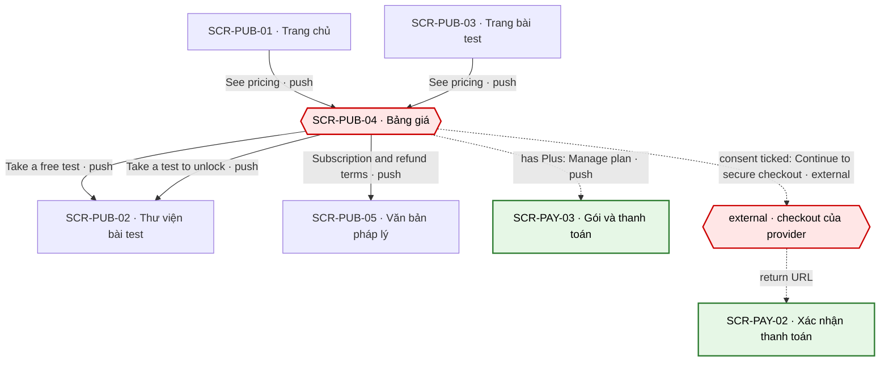
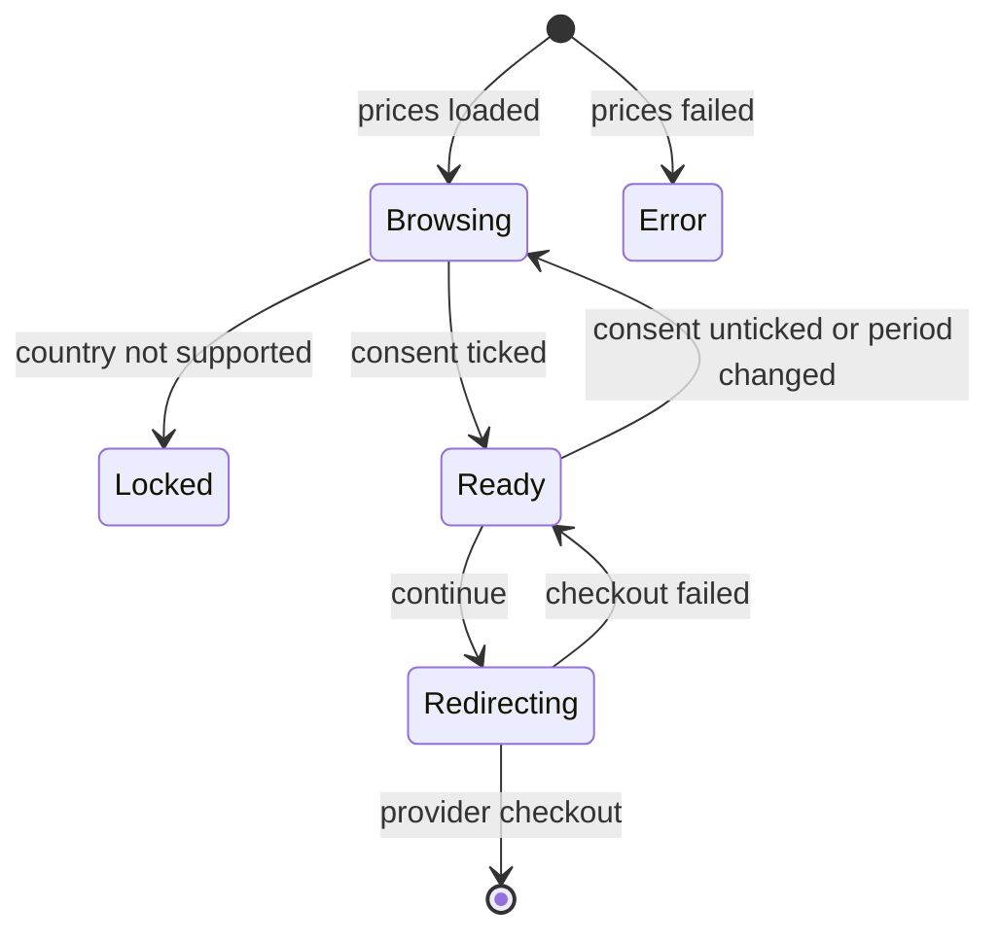

# [SCR-PUB-04] Bảng giá — FULL

## 0. General

| id | module | doc level | platforms | route | access | indexable | viewports | related FLOW | status | design | tracking | api | Evidence / visual basis |
|---|---|---|---|---|---|---|---|---|---|---|---|---|---|
| SCR-PUB-04 | PUB | Full | Web | `/pricing` | public | index | 390 · 768 · 1280 | FLOW-dang-ky-plus | Draft | (sau design) | `tracking-events.md` → `pricing` · ft_unlock | `docs/api/SCR-PUB-04-api.md` | **EV-TLW-024 · EV-TLW-025 · EV-TLW-033 · EV-TLW-108 · SC-TLW-04 · basis RS·F-05 · F-08 · F-17 · F-18 · Q-02 · Q-03 · Q-04 · Q-18 · Q-24 · Q-25** |

**Changelog** (mới nhất trước)
- 2026-09-28 · v1.1 · claude-opus-5-5 · đồng bộ pricing-page theo quyết định 2026-09-28: giá thật (Q-03), "Save 55%" + dòng phụ quy đổi tháng, bảng so sánh + 8 câu FAQ; thêm CMP-11 dòng rút 14 ngày (Q-18 · Q-25) và CMP-12 câu reseller Paddle + tên trên sao kê (Q-04 · Q-24); bỏ "ưu tiên hỗ trợ". §10 SEO khớp seo-meta §1 (title, JSON-LD `Offer`), bỏ chữ "SSR" (Q-09: SSG + revalidate).
- 2026-09-27 · v1 · claude (subagent) · khởi tạo từ blueprint.

## 1. Purpose & context

Trang giá công khai, nói thật ba điều: mọi bài test và kết quả tóm tắt đều miễn phí; report đầy đủ có thể mua lẻ một lần cho đúng một kết quả; Plus (tháng hoặc năm) mở mọi report và tự gia hạn cho tới khi huỷ. Đối thủ bán 3 thẻ chu kỳ 4 tuần, không có gói free, không có dòng thuế, và tô đặc nút của gói trial có phí (RS·F-05, EV-TLW-024); ở funnel riêng họ dùng đồng hồ, ticker "just bought" và neo "-87%" mà không nói gì về gia hạn (RS·F-17 · F-18). Màn này lấy giá từ một nguồn duy nhất (API-PAY-01, dữ liệu từ 00-overview §2: $9.99 · $12.99 / month · $69.99 / year — Q-03), bắt tick consent gia hạn trước khi sang checkout Plus (BR-APP-03), hiện điều khoản gia hạn bằng GC-RenewalDisclosure (BR-APP-02), và không dùng chiêu gây áp lực nào. Gần vùng mua, trang nói rõ Paddle là bên bán trên hoá đơn (câu reseller, Q-04), tên sẽ hiện trên sao kê (Q-24) và quyền rút trong 14 ngày được hoàn toàn bộ (Q-18 · Q-25). Mua lẻ không bắt đầu ở đây vì luôn gắn với một kết quả, nên thẻ "One report" dẫn đi làm bài. · basis Q-02 · Q-03 · Q-04 · Q-18 · Q-24 · BR-APP-01 · BR-APP-02 · BR-APP-03 · BR-APP-14 · BR-APP-15

## 2. Điều hướng

### 2.1 Vào

| Vào qua | Từ | Trigger |
|---|---|---|
| NAV-PUB-01-3 | SCR-PUB-01 | "See pricing" (khối giá tóm tắt) |
| NAV-PUB-03-4 | SCR-PUB-03 | "See pricing" (khối "What you'll get") |
| NAV-PAY-02-4 | SCR-PAY-02 | "Back to pricing" (thanh toán thất bại / huỷ, mua từ trang giá) |
| NAV-PAY-03-3 | SCR-PAY-03 | "Upgrade to Plus" (tài khoản Free) |
| NAV-APP-01-4 | SCR-APP-01 | "Unlock with Plus" (thẻ thử thách khoá) |
| entry ngoài | shell "Pricing" (header public @≥768 · drawer @390) · SEO · URL trực tiếp | SYS-NAV §1 · §4 |

### 2.2 Ra

| NAV-ID | Tới (SCR-ID · tham số) | Trigger (CMP-ID "nhãn") | Kiểu | URL / history | Animation | Back / đóng → | Guard / điều kiện | Nền tảng | Basis |
|---|---|---|---|---|---|---|---|---|---|
| NAV-PUB-04-1 | SCR-PUB-02 | CMP-03 "Take a free test" (thẻ Free) | push | `/tests` (push) | mặc định | back trình duyệt → SCR-PUB-04 | — | Web | Q-02 |
| NAV-PUB-04-2 | external: trang checkout của provider · `planKey` | CMP-07 "Continue to secure checkout" | external | rời domain, cùng tab (sau khi API-PAY-02 trả `checkoutUrl`) | mặc định | back trình duyệt → SCR-PUB-04 | CMP-06 đã tick (BR-APP-03); đã có Plus thì nút đổi thành "Manage plan" | Web | BR-APP-03 · Q-04 |
| NAV-PUB-04-3 | SCR-PAY-03 | CMP-07 "Manage plan" | push | `/account/billing` (push) | mặc định | back trình duyệt → SCR-PUB-04 | đã đăng nhập + có `plus` | Web | SYS-ENTITLEMENT |
| NAV-PUB-04-4 | SCR-PUB-05 · `doc=subscriptions` | CMP-09 "Subscription & refund terms" | push | `/legal/subscriptions` (push) | mặc định | back trình duyệt → SCR-PUB-04 | — | Web | RS·F-29 |
| NAV-PUB-04-5 | SCR-PUB-02 | CMP-03 "Take a test to unlock" (thẻ One report) | push | `/tests` (push) | mặc định | back trình duyệt → SCR-PUB-04 | — | Web | Q-02 |

### 2.3 Diagram

## 3. Layout & UI components

- **Design brief @390 (top→bottom):**
  - GC-SiteHeader (public, drawer ☰);
  - H1 "Simple, honest pricing" + sub, căn trái;
  - 3 thẻ xếp chồng theo thứ tự cố định Free → One report → Plus; không thẻ nào được tô nổi hay gắn badge kiểu "Most popular" (đối thủ tô đặc nút gói trial, EV-TLW-024);
  - trong thẻ Plus, từ trên xuống: toggle "Monthly" / "Annual" → giá + chu kỳ → bullet → GC-RenewalDisclosure → checkbox consent → nút "Continue to secure checkout" → dòng rút 14 ngày (CMP-11). Checkbox và nút luôn nằm SAU phần công bố gia hạn;
  - dưới nhóm thẻ: câu reseller (Paddle là bên bán trên hoá đơn) + dòng tên trên sao kê (CMP-12);
  - bảng so sánh (ở 390 hiển thị dạng danh sách theo tính năng, không cuộn ngang);
  - FAQ billing (accordion) + link "Subscription & refund terms";
  - GC-SiteFooter.
- **Không** có đồng hồ đếm ngược, ticker "just bought", giá gạch, logo "featured in", testimonial hay số người mua (BR-PUB-08).
- **Delta 1280:** 3 thẻ ngang cùng chiều cao trong container 1120; bảng so sánh 4 cột; FAQ rộng tối đa 720, căn giữa.

| CMP-ID | Component | Display condition | Copy verbatim (en-US) | Basis (EV / Q) |
|---|---|---|---|---|
| CMP-01 | Header | luôn | GC-SiteHeader (public), theo GC | SYS-NAV §1 |
| CMP-02 | Tiêu đề trang | luôn | H1 "Simple, honest pricing" · sub "Every test and summary is free. Pay only if you want the full report." | Q-02 · RS·F-05 |
| CMP-03 | Thẻ gói ×3 (GC-PlanCard, variant `action`) | luôn; thứ tự cố định Free → One report → Plus | tên "Free" · "One report" · "Plus"; giá từ API-PAY-01 (Free = số 0, không có chu kỳ · One report: "[price] one-time" (= $9.99) · Plus: "[price] per month" (= $12.99) hoặc "[price] per year" (= $69.99) theo CMP-04; gói năm có thêm dòng phụ "[annual price ÷ 12] per month, billed yearly" (= $5.83, `monthlyEquivalent`)); bullet verbatim theo `go-to-market/pricing-page.md` §1 (server trả ở `plans[].features`); nút "Take a free test" (Free) · "Take a test to unlock" (One report) · CMP-07 (Plus); dưới nhóm thẻ: CMP-12 | 00-overview §2 · Q-02 · Q-03 · BR-PUB-07 · BR-APP-12 · EV-TLW-024 |
| CMP-04 | Toggle chu kỳ Plus | trong thẻ Plus; mặc định "Monthly" | "Monthly" · "Annual"; nhãn "Save [n]%" cạnh "Annual" (= "Save 55%", từ `savingsPercent`; null thì ẩn), chữ thường, không giá gạch (GC-PlanCard `cycle-toggle` · pricing-page §2) | BR-PUB-09 · Q-03 |
| CMP-05 | GC-RenewalDisclosure | trong thẻ Plus, sau giá + bullet, ngay trên CMP-06 và CMP-07 (không bao giờ dưới nút) | variant `pre-purchase` · Plus, copy verbatim theo GC (giá gia hạn, chu kỳ, tự gia hạn, cách huỷ, email nhắc [n] ngày trước kỳ thu: 7 với "Monthly", 21 với "Annual" — `renewalReminderDays`, Q-16) | BR-APP-02 · RS·F-17 |
| CMP-06 | Checkbox consent Plus | thẻ Plus, khi chưa có Plus; mặc định KHÔNG tick; tự bỏ tick khi đổi CMP-04 | "I understand Plus renews automatically at [price] per [period] until I cancel. I can cancel anytime in Account → Plan & billing." | BR-APP-03 · BR-PUB-10 · RS·F-08 · EV-TLW-033 |
| CMP-07 | Nút của thẻ Plus | chưa có Plus: "Continue to secure checkout", khoá tới khi tick CMP-06; đã có Plus: "Manage plan" | "Continue to secure checkout" · "Manage plan" · gợi ý khi chưa tick: "Tick the box above to continue." | BR-PUB-10 · SYS-ENTITLEMENT · Q-04 |
| CMP-08 | Bảng so sánh | luôn | cột "Free" · "One report" · "Plus"; hàng verbatim theo pricing-page §3: "Take every test" (✓ · ✓ · ✓) · "Scored summary of every result" (✓ · ✓ · ✓) · "Save results with your email" (✓ · ✓ · ✓) · "Full report and PDF" ("—" · "One result" · "Every result, while your plan is active") · "30-day challenge" ("—" · "—" · ✓) · "Daily check-in and streak" ("With a free account" · "With a free account" · ✓) · "Renews automatically" ("No" · "No" · "Yes, until you cancel") · "Price" ("Free" · "[price] one-time" · "[price] per month or [price] per year") | 00-overview §2 · SYS-ENTITLEMENT · pricing-page §3 |
| CMP-09 | FAQ billing + link điều khoản | luôn | 8 câu hỏi, đúng thứ tự: "How do I cancel?" · "Can I get a refund?" · "Are taxes included?" · "When will I be charged again?" · "What will I see on my statement?" · "What happens to my reports if I cancel?" · "Is there a free trial?" · "What if a renewal payment fails?"; câu trả lời verbatim ở `go-to-market/pricing-page.md` §4, khớp SCR-PUB-05 `doc=subscriptions` (huỷ một bước, cả không cần đăng nhập: BR-APP-04 · rút 14 ngày hoàn toàn bộ: BR-APP-14 · thuế tính ở checkout: BR-APP-12 · nhắc 21 / 7 ngày + giữ giá lúc mua: Q-16 · BR-APP-13 · tên trên sao kê: BR-APP-15) · link "Subscription & refund terms" | RS·F-29 · F-30 · Q-18 · Q-24 · Q-27 |
| CMP-10 | Footer | luôn | GC-SiteFooter, theo GC (có "Cancel your plan here" · "Withdraw from contract here" → SCR-PAY-05) | SYS-NAV §1 · Q-25 |
| CMP-11 | Dòng rút 14 ngày | thẻ Plus, ngay dưới CMP-07, khi chưa có Plus; ẩn ở Error và Locked | "Changed your mind? Withdraw within 14 days for a full refund." (chữ thường, không link; rút ở SCR-PAY-05 qua footer hoặc Plan & billing) | Q-18 · Q-25 · BR-APP-14 · pricing-page §1 |
| CMP-12 | Dòng người bán + sao kê | dưới nhóm thẻ; ẩn khi API-PAY-01 lỗi (không render câu có chỗ trống) | "Our order process is conducted by our online reseller [merchantOfRecord]. [merchantOfRecord] is the Merchant of Record for all our orders. Taxes calculated at checkout." (`[merchantOfRecord]` = `seller.merchantOfRecord`, "Paddle.com") · "Charges will appear as [descriptor] on your statement." (`[descriptor]` = `statementDescriptor`; null thì không hiện câu này) | Q-04 · Q-24 · BR-APP-12 · BR-APP-15 · pricing-page §1 |

## 4. Screen states

| State | Trigger cụ thể | Frame | EV / basis |
|---|---|---|---|
| Default | API-PAY-01 trả đủ 4 planKey | CMP-01…12; thẻ Plus ở "Monthly"; CMP-07 khoá tới khi tick CMP-06 | EV-TLW-024 · Q-02 |
| Loading | điều hướng phía client và API-PAY-01 > 300 ms (lần tải đầu là HTML render sẵn — SSG + revalidate, Q-09 — giá có sẵn trong HTML) | skeleton 3 thẻ, CMP-07 disabled | tieu-chuan-chung §3 |
| Empty | N/A — luôn có 4 gói; API-PAY-01 rỗng hoặc thiếu planKey là lỗi cấu hình → xử lý như Error | như Error | BR-PUB-07 |
| Error | API-PAY-01 lỗi / timeout / 503 `pricing_unavailable` | thẻ không hiện giá, CMP-07 disabled, câu "We couldn't load prices. Please refresh."; CMP-08 (không có giá) và CMP-09 vẫn hiện; CMP-11 · CMP-12 ẩn | tieu-chuan-chung §2 |
| Locked | `purchasable = false` (quốc gia Paddle không bán) | thẻ vẫn hiện giá; CMP-06 và CMP-11 ẩn; CMP-07 disabled; câu "Purchases aren't available in your country yet." | Q-04 · Q-05 (a) |

## 5. Interaction & validation

### 5.1 Behavior

| Hành động | Kết quả |
|---|---|
| Chọn "Monthly" / "Annual" (CMP-04) | cập nhật giá, chu kỳ, CMP-05 và câu CMP-06 theo gói mới; **bỏ tick** CMP-06 vì câu đồng ý đã đổi (BR-APP-03); đọc giá mới bằng `aria-live="polite"` |
| Tick / bỏ tick CMP-06 | mở / khoá CMP-07 |
| Bấm CMP-07 khi chưa tick (`aria-disabled`) | không gọi API; chuyển focus tới CMP-06 và hiện câu gợi ý "Tick the box above to continue." |
| Bấm CMP-07 "Continue to secure checkout" | sinh `Idempotency-Key` mới cho lần bấm này → API-PAY-02 (`planKey`, `origin=pricing`, `consent.version`, `displayedPrice`); nút hiện spinner và khoá; thành công → `location.assign(checkoutUrl)` cùng tab (NAV-PUB-04-2) |
| Bấm CMP-07 "Manage plan" | NAV-PUB-04-3 |
| Bấm "Take a free test" / "Take a test to unlock" | NAV-PUB-04-1 / NAV-PUB-04-5 |
| Bấm "Subscription & refund terms" | NAV-PUB-04-4 |
| Bàn phím | CMP-04 là radio group (←/→ đổi); Space tick CMP-06; Enter bấm CMP-07; Enter/Space mở–đóng từng câu FAQ |
| Back từ trang checkout của provider | trang khôi phục từ bfcache: tắt spinner, giữ lựa chọn chu kỳ và dấu tick người dùng vừa đặt; lần bấm sau dùng key mới |

### 5.2 Validation (verbatim)

| Check | Khi nào | Copy |
|---|---|---|
| Consent Plus đã tick | client: trước khi gọi API-PAY-02; server: kiểm lại trong API-PAY-02 | chưa tick: CMP-07 khoá + "Tick the box above to continue."; server trả 422 `consent_required` → bỏ tick, focus CMP-06, hiện cùng câu |
| Giá và câu consent còn hiệu lực | server khi tạo phiên (API-PAY-02) | 422 `price_changed` / `consent_outdated` → tải lại API-PAY-01, bỏ tick: "Prices or renewal terms have changed. Please review and tick the box again." |
| Được mua ở vùng này | client (API-PAY-01 `purchasable`) + server (API-PAY-02) | "Purchases aren't available in your country yet." |
| Tạo phiên checkout thành công | sau API-PAY-02 | 5xx / timeout 10 s: "We couldn't start checkout. Please try again." |

## 6. Data & API

### 6.1 Dữ liệu hiển thị
Danh sách gói (planKey, tên, kiểu, chu kỳ, giá, giá gia hạn, bullet), `savingsPercent` và `monthlyEquivalent` của gói năm, câu consent hiện hành + version, số ngày gửi email nhắc trước kỳ thu (7 / 21), bên bán trên hoá đơn (`seller.merchantOfRecord`), chuỗi trên sao kê (`statementDescriptor`), `purchasable`, và `viewer` (gói hiện tại, chỉ khi đã đăng nhập).

### 6.2 Endpoint

| API | Khi nào |
|---|---|
| API-PAY-01 | lúc render sẵn trang (SSG + revalidate, Q-09) gọi không cookie (cache public ngắn) để crawler và lần hiển thị đầu có giá; sau hydrate gọi lại có cookie (`private`) để lấy `purchasable` + `viewer` |
| API-PAY-02 | bấm CMP-07 "Continue to secure checkout" (chỉ Plus; mua lẻ bắt đầu ở SCR-PAY-01) |

### 6.3 Chi tiết → `docs/api/SCR-PUB-04-api.md`

### 6.4 Bảng giá (cite 00-overview §2)

| Plan | planKey | Giá base | Giới hạn | Neo đối thủ (RS·F · EV · [LIVE:browser]) |
|---|---|---|---|---|
| Free | `plan.free` | 0 · basis Q-02 (00-overview §2) | làm mọi bài; kết quả tóm tắt chấm thật; lưu lịch sử khi có tài khoản; daily check-in + streak | đối thủ không có gói free; kết quả free không phụ thuộc câu trả lời · RS·F-14 `[LIVE:browser · EV-TLW-138 · 2026-09-27]` |
| One report | `report.single` | $9.99 (USD, chưa gồm thuế — 00-overview §2 · Q-03) | report đầy đủ + PDF của đúng 1 kết quả, vĩnh viễn; không gia hạn; rút trong 14 ngày được hoàn toàn bộ (BR-APP-14) | "One Time $57.00" · "One test with its full report. No subscription." · RS·F-05 `[LIVE:browser · EV-TLW-025 · 2026-09-27]` |
| Plus tháng | `plan.plus.monthly` | $12.99 / month (USD, chưa gồm thuế — 00-overview §2) | mọi report + PDF; thử thách 30 ngày; tự gia hạn mỗi tháng tới khi huỷ; rút trong 14 ngày từ lần thanh toán đầu được hoàn toàn bộ (BR-APP-14) | "$39.95 every 4 weeks" (13 kỳ mỗi năm); gói "7-day Full Access" "$1.95" rồi tự chuyển sang giá này · RS·F-05 `[LIVE:browser · EV-TLW-025 · 2026-09-27]` |
| Plus năm | `plan.plus.annual` | $69.99 / year (USD, chưa gồm thuế; ≈ $5.83 / month, "Save 55%" — 00-overview §2) | như Plus tháng; tự gia hạn mỗi năm tới khi huỷ; rút trong 14 ngày từ lần thanh toán đầu và từ mỗi lần gia hạn năm (BR-APP-14) | đối thủ không có gói năm · RS·F-05 `[LIVE:browser · EV-TLW-025 · 2026-09-27]` |

## 7. Business rules & permissions

| BR-ID | Rule | Basis | Access |
|---|---|---|---|
| BR-PUB-07 | Giá/chu kỳ trên thẻ lấy từ API-PAY-01 (nguồn 00-overview §2), không hard-code (giá hiện hành: $9.99 · $12.99 / month · $69.99 / year — Q-03). Client không tự tính hay làm tròn giá; thiếu bất kỳ planKey nào thì vào state Error, không hiện thẻ thiếu giá | 00-overview §2 · Q-03 · BR-APP-12 | public |
| BR-PUB-08 | Không đồng hồ đếm ngược, không "X just bought", không giá gạch/neo giả, không logo "featured in" | RS·F-17 · F-18 · EV-TLW-108 · EV-TLW-112 | public |
| BR-PUB-09 | Toggle mặc định Monthly; số tiết kiệm của Annual tính từ §2 (số thật). `savingsPercent` do server tính = làm tròn xuống của (1 − giá năm ÷ (12 × giá tháng)) × 100; nhỏ hơn 1 thì không hiện (giá hiện hành: 55). Quy đổi theo tháng của gói năm (`monthlyEquivalent` = giá năm ÷ 12, làm tròn tới cent gần nhất; hiện 583 = $5.83) cũng do server tính và chỉ là dòng phụ | 00-overview §2 · Q-03 · pricing-page §2 | public |
| BR-PUB-10 | Nút checkout Plus disable tới khi tick CMP-06; gửi `consent_version` trong API-PAY-02. Checkbox không bao giờ được tick sẵn (kể cả khi trình duyệt khôi phục form lúc reload) và tự bỏ tick khi đổi chu kỳ | BR-APP-03 · RS·F-08 · 00-quy-uoc-api §6 | public |

## 8. Edge cases & error handling

| EC-xx | Case | Kết quả xác định (kể cả khi fail) | Basis |
|---|---|---|---|
| EC-01 | Đã có Plus (active, đã lên lịch huỷ còn trong kỳ, hoặc đang trong ân hạn thanh toán) | thẻ Plus hiện nhãn "Current plan" (GC-PlanCard `status`); CMP-06 và CMP-11 ẩn; CMP-07 = "Manage plan" (NAV-PUB-04-3); thẻ One report thêm dòng "Included in your Plus plan." | SYS-ENTITLEMENT |
| EC-02 | Đổi chu kỳ sau khi đã tick | bỏ tick CMP-06, câu consent đổi theo gói mới; phải tick lại mới bấm được | BR-APP-03 |
| EC-03 | Bấm CMP-07 hai lần / mạng chậm | lần bấm đầu khoá nút; thử lại do mạng dùng cùng `Idempotency-Key` → cùng một phiên checkout | 00-quy-uoc-api §5 |
| EC-04 | API-PAY-02 lỗi / timeout 10 s / 5xx | ở lại trang, giữ chu kỳ + dấu tick, mở lại nút, hiện "We couldn't start checkout. Please try again." | cong-nghe-loi §3 · tieu-chuan-chung §2 |
| EC-05 | Giá hoặc version câu consent đổi trong lúc trang đang mở | 422 `price_changed` / `consent_outdated` → tải lại API-PAY-01, bỏ tick, hiện copy ở §5.2 | BR-APP-02 · BR-APP-03 |
| EC-06 | Tab cũ vẫn hiện nút checkout dù tài khoản đã có Plus | API-PAY-02 trả 422 `already_entitled` → CMP-07 đổi thành "Manage plan", không tạo phiên | SYS-ENTITLEMENT |
| EC-07 | Khách chưa đăng nhập mua Plus | được: checkout khách, provider thu email, webhook tạo hoặc gắn tài khoản theo email đó | SYS-AUTH · Q-11 |
| EC-08 | Lần gọi API-PAY-01 có cookie (sau hydrate) thất bại | không chặn: giữ giá trong HTML render sẵn, coi như `purchasable`; API-PAY-02 là chốt chặn thật (403 `country_not_supported`, 422 `already_entitled`) | BR-APP-01 · Q-04 |
| EC-09 | Firefox khôi phục trạng thái form khi reload | checkbox đặt `autocomplete="off"` và luôn render không tick; chỉ bfcache (back từ provider) mới giữ dấu tick người dùng vừa đặt | BR-APP-03 |
| EC-10 | Người dùng ở vùng dùng tiền tệ khác | vẫn hiện USD; thuế và quy đổi (nếu có) do provider hiện ở checkout | BR-APP-12 · Q-04 |
| EC-11 | Đã mua lẻ report rồi mua Plus | được; report mua lẻ giữ vĩnh viễn, kể cả sau khi Plus hết kỳ | SYS-ENTITLEMENT |

## 9. Responsive deltas

| Aspect | 390 | 768 | 1280 |
|---|---|---|---|
| Thẻ gói | xếp chồng Free → One report → Plus | 2 + 1: Free và One report hàng trên, Plus full width hàng dưới | 3 cột bằng nhau, cùng chiều cao |
| Thẻ Plus | toggle → giá → bullet → CMP-05 → CMP-06 → CMP-07 (nút full width) → CMP-11 | như 390 | như 390, nút rộng bằng thẻ |
| Bảng so sánh | danh sách theo tính năng (mỗi mục 3 giá trị), không cuộn ngang | bảng 4 cột | bảng 4 cột |
| FAQ | accordion full width | accordion, tối đa 720 | accordion, tối đa 720, căn giữa |

## 10. SEO

`index`. Head meta theo dòng `/pricing` ở `go-to-market/seo-meta.md` §1: title "Pricing: Free Summaries, Full Reports & Plus · TestLib" (mẫu `<Tên trang> · TestLib`, tieu-chuan-chung §8). Render sẵn (Next.js SSG + revalidate, Q-09) để crawler không chạy JS vẫn đọc được giá và FAQ. JSON-LD theo seo-meta §1: `FAQPage` cho CMP-09 + `Offer` cho 3 planKey trả phí (`price` · `priceCurrency` USD lấy từ API-PAY-01 lúc build + revalidate, cùng nguồn với giá hiển thị); giá chỉ nằm ở JSON-LD `Offer`, title / description / OG không ghi số giá (seo-meta §2). Canonical `/pricing`, không query.

## 11. Tracking

`screen_active` · `pricing` · ft_unlock start (`surface` = pricing) khi trang hiện · ft_unlock checkout_open (`plan_key`) khi API-PAY-02 trả URL. ft_unlock purchase không bắn ở đây mà ở SCR-PAY-02. Không gửi giá, trạng thái consent hay email. Chỉ bắn sau consent analytics (BR-APP-05).

## 12. Non-functional

| Hạng mục | Mục tiêu |
|---|---|
| LCP 390 (4G) | ≤ 2,5 s; giá có sẵn trong HTML render sẵn, không chờ JS (tieu-chuan-chung §9) |
| JS của route | ≤ 200 KB gzip (tieu-chuan-chung §9) |
| Bấm CMP-07 → rời trang | p95 ≤ 1,5 s (API-PAY-02 tạo phiên ở provider) `[INFERRED]`, đo ở staging |
| A11y | CMP-04 `role="radiogroup"`; giá đổi được đọc bằng `aria-live="polite"`; nhãn CMP-06 là cả câu và bấm được; CMP-07 khi chưa tick dùng `aria-disabled="true"` (vẫn focus được) + `aria-describedby` trỏ tới câu gợi ý |

## 13. AI Notices
- Giá hiện hành ở 00-overview §2 (Q-03, chốt 2026-09-28): copy dùng token `[price]` điền từ API-PAY-01, số "(= …)" chỉ để đối chiếu. `savingsPercent` (55) và `monthlyEquivalent` (583) do server tính (BR-PUB-09).
- Bullet thẻ gói, bảng CMP-08 và câu trả lời FAQ lấy nguyên văn `go-to-market/pricing-page.md` §1 · §3 · §4 (nguồn copy duy nhất); `plans[].features` của API-PAY-01 phải khớp pricing-page §1.
- `purchasable` theo danh sách nước Paddle bán được (Q-04 · Q-05 (a)). Giá hiển thị chưa gồm thuế (Q-03 · Q-04); "Taxes calculated at checkout." nằm trong câu reseller ở CMP-12.
- Câu reseller (CMP-12) theo câu Paddle yêu cầu và chuỗi trên sao kê (`statementDescriptor`, lấy từ giao dịch thử): verify khi mở tài khoản Paddle (bang-quyet-dinh §2 #3).
- Copy mới không có trong blueprint (AI viết, cần duyệt): "Tick the box above to continue.", "Included in your Plus plan.", "Prices or renewal terms have changed. Please review and tick the box again.", "We couldn't start checkout. Please try again." (mượn từ SCR-PAY-01).
