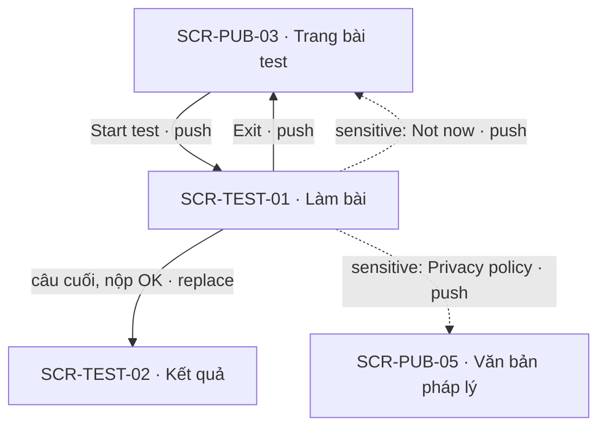
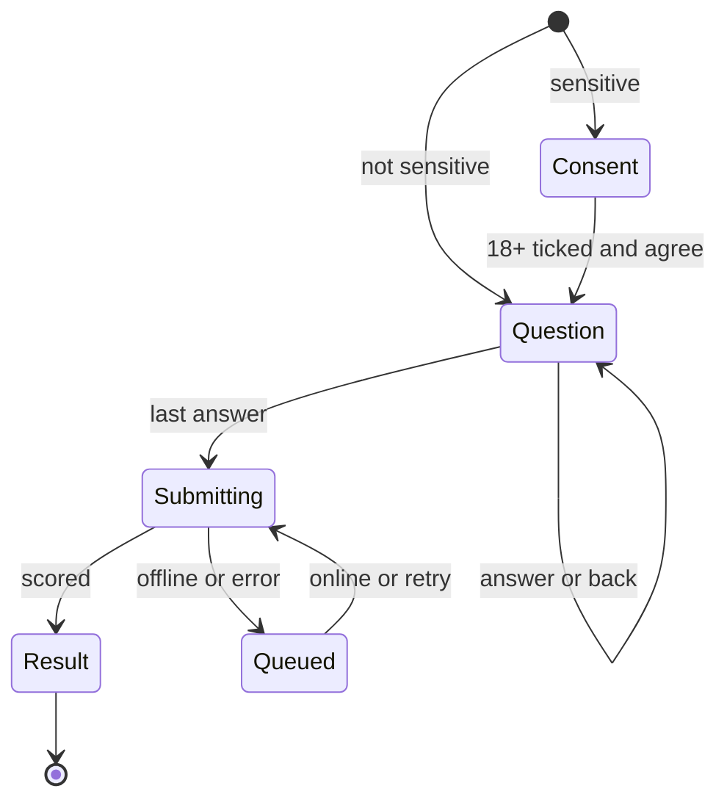

# [SCR-TEST-01] Làm bài — FULL

## 0. General

| id | module | doc level | platforms | route | access | indexable | viewports | related FLOW | status | design | tracking | api | Evidence / visual basis |
|---|---|---|---|---|---|---|---|---|---|---|---|---|---|
| SCR-TEST-01 | TEST | Full | Web | `/tests/:slug/take` | guest | noindex | 390 · 768 · 1280 | FLOW-lam-bai-mien-phi | Draft | (sau design) | `tracking-events.md` → `test_take` · ft_test | `docs/api/SCR-TEST-01-api.md` | **EV-TLW-054 · EV-TLW-061 · EV-TLW-065 · EV-TLW-083 · EV-TLW-138 · SC-TLW-13 · SC-TLW-18 · basis RS·F-13 · F-14 · F-16 · TD-01 · CS-04** |

**Changelog** (mới nhất trước)
- 2026-09-28 · v1.1 · claude-opus-5-5 · quyết định 2026-09-28 (AI · uỷ quyền human): bước consent bài `sensitive` (CMP-03) thêm ô "I'm 18 or older." + gợi ý + dòng phụ cho người dưới 18, thêm BR-TEST-11 và EC-08 (Q-21); NAV-TEST-01-6 thêm trigger dòng phụ; API-TEST-01 gửi `ageConfirmed`, bài `sensitive` chưa consent → 422 không tạo attempt. Q-10 · Q-21 đã chốt.
- 2026-09-27 · v1 · claude-opus-5-5 · khởi tạo (exemplar SCR full).

## 1. Purpose & context

Màn làm bài: mỗi màn một câu Likert, chọn là sang câu kế, tiến độ lưu liên tục nên reload hay mất mạng cũng không mất bài. Nộp xong thì server chấm điểm thật (TD-01) và chuyển sang kết quả. Đối thủ có flow offline/resume tốt (TK-04 · TK-05) nhưng kết quả không phụ thuộc câu trả lời (RS·F-14), bắn pixel quảng cáo theo từng câu (RS·F-13) và chèn loader "labor illusion" (RS·F-16). Màn này giữ phần tốt, bỏ ba phần xấu. Với bài `sensitive`, bước đầu là consent riêng cho dữ liệu nhạy cảm (Q-06), kèm ô tự xác nhận 18+ (Q-21); bài thường không có cổng tuổi. · basis TD-01 · Q-06 · Q-10 · Q-21

## 2. Điều hướng

### 2.1 Vào

| Vào qua | Từ | Trigger |
|---|---|---|
| NAV-PUB-03-1 | SCR-PUB-03 | "Start test" |
| NAV-PUB-03-2 | SCR-PUB-03 | "Continue where you left off" |
| NAV-TEST-02-3 | SCR-TEST-02 | "Retake test" |
| entry ngoài | URL trực tiếp (có attempt dở thì resume) | SYS-NAV §4 |

### 2.2 Ra

| NAV-ID | Tới (SCR-ID · tham số) | Trigger (CMP-ID "nhãn") | Kiểu | URL / history | Animation | Back / đóng → | Guard / điều kiện | Nền tảng | Basis |
|---|---|---|---|---|---|---|---|---|---|
| NAV-TEST-01-1 | SCR-TEST-02 · `resultId` | hệ thống: API-TEST-03 trả kết quả sau khi chọn đáp án câu cuối ở CMP-05 | replace | `/tests/:slug/take` → `/results/:resultId` (replace) | mặc định | back trình duyệt → SCR-PUB-03 (runner đã nộp không còn trong history) | — | Web | RS·F-19 (tránh bẫy back) |
| NAV-TEST-01-2 | SCR-PUB-03 · `slug` | CMP-01 "Exit" | push | `/tests/:slug` (push) | mặc định | back trình duyệt → SCR-TEST-01 (resume đúng câu) | không hỏi xác nhận vì tiến độ đã lưu | Web | TK-04 (EV-TLW-065) |
| NAV-TEST-01-3 | (cùng màn) câu kế tiếp | CMP-05 chọn một đáp án | inline | không đổi URL (browser back = rời bài, tiến độ giữ) | mặc định | — | — | Web | RS·F-13 (EV-TLW-054) |
| NAV-TEST-01-4 | (cùng màn) câu 1 | CMP-03 "I agree — start the test" | inline | không đổi URL | mặc định | — | bài `sensitive`; đã tick "I'm 18 or older." (BR-TEST-11) | Web | Q-06 · Q-21 |
| NAV-TEST-01-5 | SCR-PUB-03 · `slug` | CMP-03 "Not now" | push | `/tests/:slug` (push) | mặc định | back trình duyệt → SCR-TEST-01 (bước consent) | bài `sensitive` | Web | Q-06 |
| NAV-TEST-01-6 | external: trang nguồn hỗ trợ khủng hoảng | CMP-09 "Get support now" · CMP-03 "get support now" (dòng phụ 18+) | external | tab mới | mặc định | đóng tab → SCR-TEST-01 | bài `sensitive` | Web | Q-06 · Q-21 · Q-23 |
| NAV-TEST-01-7 | SCR-PUB-05 · `doc=privacy` | CMP-03 "Privacy policy" | push | `/legal/privacy` (push) | mặc định | back trình duyệt → SCR-TEST-01 (bước consent) | bài `sensitive` | Web | BR-APP-06 |
| NAV-TEST-01-8 | SCR-PUB-02 | CMP-11 "Browse all tests" | push | `/tests` (push) | mặc định | back trình duyệt → SCR-TEST-01 | chỉ ở state Empty / Locked (vùng) | Web | in-house |

### 2.3 Diagram

## 3. Layout & UI components

- **Design brief @390 (top→bottom):**
  - thanh trên gồm "Exit" (trái) và "Question 5 of 24" (phải), dưới là thanh tiến độ mảnh;
  - (bài `sensitive`) dòng GC-SensitiveNotice thu gọn;
  - câu hỏi, chữ to, căn trái;
  - 5 nút đáp án dọc full width (GC-ScaleInput);
  - nút "Back" dạng text ở dưới;
  - banner offline (nếu có) dính trên cùng.
- **Không** có header/footer site để giảm phân tâm.
- **Delta 1280:** thẻ câu hỏi căn giữa, rộng tối đa 640. 5 đáp án vẫn dọc vì nhãn dài. Phím tắt 1–5 hiện thành gợi ý nhỏ cạnh đáp án.

| CMP-ID | Component | Display condition | Copy verbatim (en-US) | Basis (EV / Q) |
|---|---|---|---|---|
| CMP-01 | Nút thoát | luôn | "Exit" (aria-label "Exit test — your progress is saved") | TK-04 |
| CMP-02 | Tiến độ | sau bước consent | "Question [k] of [n]" + thanh % | EV-TLW-054 |
| CMP-03 | Bước consent dữ liệu nhạy cảm | bài `sensitive`, trước câu 1 | Tiêu đề "Before you start" · thân "This test asks about your mood and wellbeing. Your answers are sensitive, so we need your consent to process them. We use them only to score your test and write your report. We never share them with advertisers." · "This is a self-reflection tool, not a diagnosis." · ô bắt buộc, không tick sẵn "I'm 18 or older." · dòng phụ ngay dưới ô "This test is for adults. If you're under 18 and finding things hard, you can get support now." ("get support now" là link external của GC-SensitiveNotice, NAV-TEST-01-6) · nút "I agree — start the test" (khoá tới khi tick; gợi ý khi chưa tick: "Tick the box to confirm you're 18 or older.") · link "Not now" · link "Privacy policy" | Q-06 · Q-21 · BR-APP-06 · BR-TEST-11 |
| CMP-04 | Câu hỏi | mỗi câu | nội dung câu từ API-TEST-01 | TD-01 |
| CMP-05 | Thang trả lời | mỗi câu | GC-ScaleInput 5 mức: "Strongly disagree" · "Disagree" · "Neutral" · "Agree" · "Strongly agree" (phím 1–5) | EV-TLW-054 · EV-TLW-083 |
| CMP-06 | Nút quay lại câu trước | từ câu 2 | "Back" | in-house |
| CMP-07 | Banner offline | `navigator.onLine = false` | "You're offline. Keep going — we'll save your answers and submit when you're back online." | cong-nghe-loi §3 |
| CMP-08 | Panel nộp bài | sau câu cuối | chỉ hiện khi > 300 ms: "Submitting your answers…" · xếp hàng: "We couldn't submit your answers yet. We'll retry automatically — your answers are safe on this device." + nút "Retry now" | cong-nghe-loi §3 · RS·F-16 |
| CMP-09 | Thông báo bài nhạy cảm (thu gọn) | bài `sensitive` | "Not a diagnosis · Get support now" | GC-SensitiveNotice · Q-06 |
| CMP-10 | Cảnh báo private mode | localStorage không dùng được | "Private browsing is on, so your progress won't be saved if you close this tab." | cong-nghe-loi §3 |
| CMP-11 | Link "Browse all tests" | state Empty / Locked (vùng) | "Browse all tests" (NAV-TEST-01-8) | in-house |

## 4. Screen states

| State | Trigger cụ thể | Frame | EV / basis |
|---|---|---|---|
| Default | có câu hỏi hiện tại | CMP-01 · 02 · 04 · 05 · 06 | EV-TLW-054 |
| Loading | tải attempt lần đầu (API-TEST-01); nộp bài > 300 ms | skeleton câu + 5 nút; CMP-08 "Submitting your answers…" | tieu-chuan-chung §3 |
| Empty | bài không có câu nào (lỗi cấu hình) | "This test is being updated. Try another test." + "Browse all tests" | in-house |
| Error | offline khi trả lời (CMP-07); nộp lỗi / timeout / 5xx (CMP-08 xếp hàng) | banner + panel, không mất câu trả lời | cong-nghe-loi §3 · EV-TLW-061 |
| Locked | bài `sensitive` chưa consent → CMP-03; bài bị tắt theo vùng | CMP-03; hoặc "This test isn't available in your region." | Q-06 · cong-nghe-loi §6 |

## 5. Interaction & validation

### 5.1 Behavior

| Hành động | Kết quả |
|---|---|
| Click / chạm một đáp án | đánh dấu đáp án, lưu localStorage, sau 150 ms sang câu kế (BR-TEST-01) |
| Phím `1`–`5` | chọn đáp án tương ứng (1 = "Strongly disagree") |
| Phím ↑ / ↓ | di chuyển focus giữa 5 đáp án; `Enter` = chọn |
| "Back" / phím `Backspace` | về câu trước, giữ đáp án cũ đang được chọn để sửa |
| "Exit" / back trình duyệt | rời bài, tiến độ giữ, không hỏi xác nhận |
| Câu cuối được chọn | gọi API-TEST-03 (BR-TEST-03) |
| Tick / bỏ tick "I'm 18 or older." (bài `sensitive`) | mở khoá / khoá lại "I agree — start the test" (BR-TEST-11) |
| Bấm "I agree — start the test" khi chưa tick (`aria-disabled`) | không gọi API; focus về ô và hiện "Tick the box to confirm you're 18 or older." |
| Bấm "I agree — start the test" khi đã tick | gọi API-TEST-01 kèm `sensitiveConsent` + `ageConfirmed` = true → câu 1 (NAV-TEST-01-4) |

### 5.2 Validation (verbatim)

| Check | Khi nào | Copy |
|---|---|---|
| Đủ câu trả lời trước khi nộp | client kiểm trước khi gọi API-TEST-03 | không có copy: không thể nộp khi thiếu (câu cuối chỉ tới được sau khi trả lời hết). Server trả 400 thì quay về câu thiếu đầu tiên: "Please answer this question to finish." |
| Consent bài `sensitive` | trước câu 1 | chỉ bắt đầu khi bấm "I agree — start the test" |
| Xác nhận 18+ (bài `sensitive`) | client trước API-TEST-01; server kiểm lại | chưa tick: nút khoá + "Tick the box to confirm you're 18 or older."; 422 `age_confirmation_required` → focus ô, cùng câu (BR-TEST-11) |

## 6. Data & API

### 6.1 Dữ liệu hiển thị
Tên bài, danh sách câu (thứ tự cố định theo `contentVersion`), tổng số câu, đáp án đã chọn (resume), cờ `sensitive`.

### 6.2 Endpoint

| API | Khi nào |
|---|---|
| API-TEST-01 | mở màn: tạo hoặc tiếp tục attempt (`attemptId` sinh ở client, lưu localStorage). Bài `sensitive` chưa có attempt → 422 `consent_required`, không tạo attempt → CMP-03; bấm "I agree — start the test" → gọi lại kèm `sensitiveConsent` + `ageConfirmed` |
| API-TEST-02 | đã đăng nhập: autosave gom tối đa 10 câu mỗi 5 s |
| API-TEST-03 | chọn đáp án câu cuối; thử lại từ hàng đợi |

### 6.3 Chi tiết → `docs/api/SCR-TEST-01-api.md`

## 7. Business rules & permissions

| BR-ID | Rule | Basis | Access |
|---|---|---|---|
| BR-TEST-01 | Chọn đáp án = lưu + sang câu kế sau 150 ms (không nút "Next"); "Back" sửa được mọi câu trước; chỉ nộp khi đã trả lời câu cuối | EV-TLW-054 (đối thủ: chọn là sang câu) | guest |
| BR-TEST-02 | Tiến độ lưu localStorage theo `attemptId` sau MỖI câu; đã đăng nhập thì autosave server (API-TEST-02) gom ≤ 10 câu / 5 s | TD-01 · TK-04 | guest |
| BR-TEST-03 | Nộp bài idempotent theo `attemptId`; mất mạng / timeout 10 s / 5xx → xếp hàng, tự gửi lại khi online, tối đa 5 lần với backoff 2–4–8–16–32 s; không mất câu trả lời | cong-nghe-loi §3 · 00-quy-uoc-api §5 | guest |
| BR-TEST-04 | Bài `sensitive`: không câu nào hiện trước khi bấm "I agree — start the test"; `sensitive_consent_version` + thời điểm gửi trong API-TEST-01 | BR-APP-06 · SYS-CONSENT | guest |
| BR-TEST-05 | Không loader giả: panel nộp chỉ hiện khi request > 300 ms, biến mất ngay khi có kết quả | RS·F-16 | guest |
| BR-TEST-06 | Mở URL khi có attempt dở → resume đúng câu; attempt đã nộp → chuyển kết quả (replace) | TK-04 (EV-TLW-065) | guest |
| BR-TEST-11 | Bài `sensitive`: bước consent có ô "I'm 18 or older." bắt buộc, không tick sẵn; chưa tick thì "I agree — start the test" khoá; không thu ngày sinh; `ageConfirmed` = true gửi trong API-TEST-01 và lưu vào attempt cùng consent. Bài thường không có cổng tuổi (16+ ghi trong Terms) | Q-21 · BR-APP-06 · SYS-CONSENT | guest |

## 8. Edge cases & error handling

| EC-xx | Case | Kết quả xác định (kể cả khi fail) | Basis |
|---|---|---|---|
| EC-01 | Hai tab cùng một attempt | cả hai ghi localStorage; tab nộp sau nhận 409 → dùng `resultId` trả về, chuyển kết quả | 00-quy-uoc-api §4 |
| EC-02 | Reload giữa bài | resume đúng câu, đáp án cũ còn | TK-04 · EV-TLW-065 |
| EC-03 | Mất mạng giữa bài | vẫn trả lời tiếp; CMP-07; nộp khi online | TK-05 · EV-TLW-061 |
| EC-04 | localStorage bị chặn / đầy | chạy trong bộ nhớ + CMP-10 | cong-nghe-loi §3 |
| EC-05 | Đổi thiết bị giữa bài | đã đăng nhập: resume từ autosave server · khách: bắt đầu lại | BR-TEST-02 |
| EC-06 | Phiên bản thang đo đổi khi đang làm | attempt giữ `scoringVersion` + `contentVersion` lúc bắt đầu | BR-APP-07 |
| EC-07 | Bấm đáp án liên tiếp rất nhanh | mỗi câu chỉ nhận 1 lựa chọn trong 150 ms chuyển câu | in-house |
| EC-08 | Người dưới 18 mở bài `sensitive` | không tick được một cách trung thực nên không bắt đầu bài; dòng phụ của CMP-03 chỉ tới nguồn hỗ trợ (NAV-TEST-01-6); "Not now" về trang bài (NAV-TEST-01-5); không tạo attempt, không lưu câu trả lời nào | Q-21 · BR-TEST-11 |

## 9. Responsive deltas

| Aspect | 390 | 768 | 1280 |
|---|---|---|---|
| Thẻ câu hỏi | full width, padding 16 | tối đa 640, căn giữa | tối đa 640, căn giữa |
| Đáp án | dọc, target ≥ 44 px | dọc | dọc + gợi ý phím 1–5 |
| Thanh trên | "Exit" + tiến độ | như 390 | như 390 |

## 10. SEO

`noindex` (route `guest`, tieu-chuan-chung §8). Không có row trong `seo-meta.md`.

## 11. Tracking

`screen_active` · `test_take` · ft_test (start · resume · submit). Không có event cho từng câu. Bài `sensitive` không bắn event nào (BR-APP-06).

## 12. Non-functional

| Hạng mục | Mục tiêu |
|---|---|
| Nộp bài → kết quả | p50 ≤ 800 ms · p95 ≤ 2 s (cong-nghe-loi §2; đối thủ 2690 ms `[LIVE:browser · EV-TLW-181 · 2026-09-27]`) |
| JS của route | ≤ 300 KB gzip (tieu-chuan-chung §9) |
| A11y | tiến độ đọc bằng `aria-live="polite"`: "Question 5 of 24"; bước consent bài `sensitive`: "I agree — start the test" khoá bằng `aria-disabled` + `aria-describedby` tới gợi ý 18+ |

## 13. AI Notices
- Thang 5 mức là mặc định của MVP. Bài có câu đố/đồng hồ (kiểu IQ của đối thủ, RS·F-25) nằm ngoài MVP (`final-features §8`).
- Mục tiêu latency là `[INFERRED]`, cần đo bằng spike cong-nghe-loi §7 #1–3.
- Ô 18+ là tự xác nhận (Q-21): không thu ngày sinh, không kiểm chứng được; mục tiêu là đặt kiểm tra tuổi đúng chỗ rủi ro. Câu chữ CMP-03 (cả ô 18+ và dòng phụ) chờ legal + clinical review trước launch bài `sensitive` (`bang-quyet-dinh` §2 #2 · #5).
