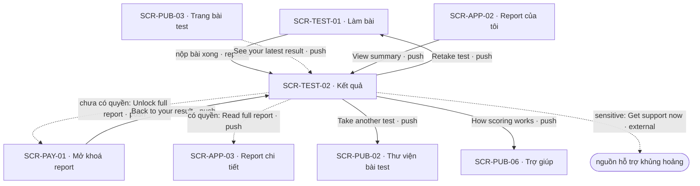
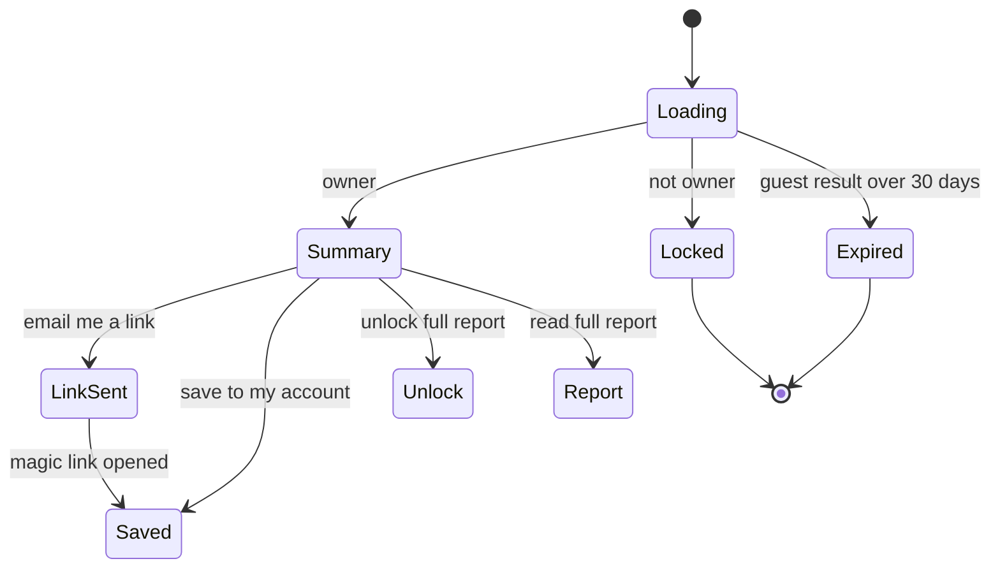

# [SCR-TEST-02] Kết quả — FULL

## 0. General

| id | module | doc level | platforms | route | access | indexable | viewports | related FLOW | status | design | tracking | api | Evidence / visual basis |
|---|---|---|---|---|---|---|---|---|---|---|---|---|---|
| SCR-TEST-02 | TEST | Full | Web | `/results/:resultId` | guest | noindex | 390 · 768 · 1280 | FLOW-lam-bai-mien-phi · FLOW-mo-khoa-report · FLOW-luu-ket-qua-dang-nhap | Draft | (sau design) | `tracking-events.md` → `result` · ft_result | `docs/api/SCR-TEST-02-api.md` | **EV-TLW-079 · EV-TLW-138 · EV-TLW-159 · EV-TLW-108 · SC-TLW-14 · basis RS·F-14 · F-15 · F-17 · F-23 · CS-07 · P-04** |

**Changelog** (mới nhất trước)
- 2026-09-28 · v1.3 · claude-opus-5-5 · quyết định 2026-09-28 (AI · uỷ quyền human): xoá kết quả ở CMP-13 là cách khách tự xoá dữ liệu (Q-28), copy xoá giữ nguyên (khớp SCR-APP-02); tên type / dải theo Q-07; GC-SensitiveNotice theo Q-23; Q-05 · Q-11 đã chốt ở AI Notices. Không đổi hành vi khác.
- 2026-09-28 · v1.2 · claude-opus-5-5 · D-16: guard của NAV-TEST-02-9 gồm cả sau khi xoá; xác nhận xoá thêm câu mất report đã mua lẻ.
- 2026-09-28 · v1.1 · claude-opus-5-5 · AI Notice cũ: `from` của ft_result start đã có test_page · unlock.
- 2026-09-27 · v1 · claude (subagent) · khởi tạo từ blueprint.

## 1. Purpose & context

Màn kết quả tóm tắt miễn phí, hiện ngay sau khi nộp bài. Server chấm điểm thật theo câu trả lời (TD-01), nên tóm tắt có đủ type, điểm của mọi thang và phần "Why you got this result". Không phần nào bị làm mờ hay giấu đi để ép mua (BR-TEST-07). Đối thủ trả về cùng một type và cùng điểm dù người làm chọn toàn "đồng ý", toàn "không đồng ý" hay toàn "trung lập" (RS·F-14 · EV-TLW-138 · EV-TLW-159). Sau đó họ đẩy khách sang bài trả phí (RS·F-15) rồi tới trang offer có đồng hồ đếm ngược và dòng "vừa mua" (RS·F-17 · EV-TLW-108). Màn của mình chỉ có một khối report đầy đủ, liệt kê đúng các chương và số trang thật (BR-TEST-08), và không hiện giá; giá cùng điều khoản gia hạn nằm ở SCR-PAY-01 (BR-APP-02). Khách lưu kết quả bằng email nếu muốn, không bắt buộc (BR-TEST-09). Nếu không lưu, kết quả tự hết hạn sau 30 ngày (BR-TEST-10). Chủ kết quả, kể cả khách, tự xoá kết quả ở cuối trang (CMP-13, Q-28). Bài `sensitive` luôn có GC-SensitiveNotice và không bắn event analytics nào (BR-APP-06). · basis RS·F-14 · P-04 · Q-02 · Q-11 · Q-28

## 2. Điều hướng

### 2.1 Vào

| Vào qua | Từ | Trigger |
|---|---|---|
| NAV-TEST-01-1 | SCR-TEST-01 | hệ thống: nộp bài xong (replace) |
| NAV-PUB-03-3 | SCR-PUB-03 | "See your latest result" |
| NAV-PAY-01-3 | SCR-PAY-01 | "Back to your result" |
| NAV-APP-02-2 | SCR-APP-02 | "View summary" |
| entry ngoài | email "View your results" (API-MAIL-01): magic link → `/login/callback` → `next=/results/:resultId` · URL trực tiếp trên trình duyệt đã làm bài | SYS-NAV §4 |

### 2.2 Ra

| NAV-ID | Tới (SCR-ID · tham số) | Trigger (CMP-ID "nhãn") | Kiểu | URL / history | Animation | Back / đóng → | Guard / điều kiện | Nền tảng | Basis |
|---|---|---|---|---|---|---|---|---|---|
| NAV-TEST-02-1 | SCR-PAY-01 · `resultId` | CMP-05 "Unlock full report" | push | `/unlock/:resultId` (push) | mặc định | back trình duyệt → SCR-TEST-02 | chưa có `report.full` | Web | Q-02 |
| NAV-TEST-02-2 | SCR-APP-03 · `reportId` | CMP-05 "Read full report" | push | `/app/reports/:reportId` (push) | mặc định | back trình duyệt → SCR-TEST-02 | đã có `report.full` (SYS-ENTITLEMENT) | Web | BR-APP-01 |
| NAV-TEST-02-3 | SCR-TEST-01 · `slug` (attempt mới) | CMP-07 "Retake test" | push | `/tests/:slug/take` (push) | mặc định | back trình duyệt → SCR-TEST-02 | — | Web | BR-APP-07 |
| NAV-TEST-02-4 | SCR-PUB-02 | CMP-08 "Take another test" | push | `/tests` (push) | mặc định | back trình duyệt → SCR-TEST-02 | — | Web | in-house |
| NAV-TEST-02-5 | (cùng màn) gửi link lưu kết quả | CMP-06 "Email me a link" | inline | không đổi URL | mặc định | — | khách chưa lưu | Web | Q-11 |
| NAV-TEST-02-6 | SCR-PUB-06 · `#scoring` | CMP-10 "How scoring works" | push | `/help#scoring` (push) | mặc định | back trình duyệt → SCR-TEST-02 | — | Web | RS·F-14 |
| NAV-TEST-02-7 | external: trang nguồn hỗ trợ khủng hoảng | CMP-09 "Get support now" | external | tab mới | mặc định | đóng tab → SCR-TEST-02 | bài `sensitive` | Web | Q-06 |
| NAV-TEST-02-8 | SCR-AUTH-01 · `next=/results/:resultId` | CMP-11 "Sign in" | push | `/login?next=/results/:resultId` (push) | mặc định | back trình duyệt → SCR-TEST-02 | chỉ ở state Error (410) / Locked (403) | Web | SYS-AUTH |
| NAV-TEST-02-9 | SCR-PUB-02 | CMP-12 "Browse all tests" | push | `/tests` (push) | mặc định | back trình duyệt → SCR-TEST-02 | ở state Error (410) / Locked (403), và sau khi xoá kết quả (NAV-TEST-02-10) | Web | in-house |
| NAV-TEST-02-10 | (cùng màn) xoá kết quả | CMP-13 "Delete this result" → xác nhận tại chỗ "Delete this result and your answers? This can't be undone." (+ "You'll also lose the full report you unlocked for this result." nếu đã mua lẻ) · "Delete" / "Cancel" | inline | không đổi URL; xoá xong → thay nội dung bằng "Result deleted." + CMP-12 | mặc định | — | chủ sở hữu kết quả | Web | BR-APP-11 · SYS-CONSENT · Q-28 |

### 2.3 Diagram

## 3. Layout & UI components

- **Design brief @390 (top→bottom):**
  - thanh trên funnel: chỉ logo "TestLib" bên trái, không menu, không footer site;
  - (bài `sensitive`) GC-SensitiveNotice đầy đủ ngay dưới thanh trên, TRƯỚC kết quả;
  - headline "Your result: [Type]", phần [Type] dùng chữ lớn (`type.result`), dưới là 1 câu mô tả;
  - GC-ScoreBars: mọi thang, xếp từ cao xuống thấp, % luôn hiện;
  - "Why you got this result": mỗi thang một đoạn ngắn;
  - thẻ "Full report": danh sách chương → "About [N] pages" → nút chính full width;
  - thẻ lưu kết quả: ô "Email" → nút "Email me a link" → dòng ngày hết hạn;
  - hàng hành động phụ: "Retake test" · "Take another test";
  - chú thích phiên bản chấm điểm + link "How scoring works" ở cuối.
- **Không** có đồng hồ, dòng "vừa mua", giá gạch, testimonial hay giá tiền trên màn này (BR-TEST-08).
- **Delta 1280:** 2 cột trong container `layout.max-width`. Cột trái rộng gồm headline, điểm, giải thích và chú thích. Cột phải hẹp gồm thẻ "Full report" rồi thẻ lưu, dính khi cuộn. GC-SensitiveNotice trải ngang phía trên cả 2 cột.

| CMP-ID | Component | Display condition | Copy verbatim (en-US) | Basis (EV / Q) |
|---|---|---|---|---|
| CMP-01 | Thanh trên funnel | luôn | GC-SiteHeader biến thể `minimal`: chỉ logo "TestLib" (link → `/`), kể cả khi đã đăng nhập | SYS-NAV §4 (layout funnel) |
| CMP-02 | Headline kết quả | Default | "Your result: [Type]" + 1 câu mô tả type (nội dung versioned); bài không có type thì [Type] là tên dải điểm của thang chính. Tên type / dải do mình tự đặt: không nhãn chẩn đoán, không tên thương hiệu bên khác (Q-07) | EV-TLW-079 · TD-02 · Q-07 |
| CMP-03 | Điểm các thang | Default | GC-ScoreBars: mỗi thang một thanh, nhãn thang + "[n]%", xếp giảm dần; kèm bảng chữ cho screen reader | RS·F-14 · BR-TEST-07 |
| CMP-04 | Giải thích | Default | tiêu đề "Why you got this result" + mỗi thang 1 đoạn theo dải điểm (lấy từ `report_blocks` loại tóm tắt, TD-02); nói về thang và dải, không nhắc lại câu trả lời thô | P-04 · BR-APP-07 |
| CMP-05 | Khối report đầy đủ | Default; nội dung theo `report.access` | tiêu đề "Full report" · danh sách chương thật · "About [N] pages" · `none` → nút "Unlock full report" · `full` → nút "Read full report" · `pending` → "Confirming your payment…" (không nút) | RS·F-23 · TD-02 · SYS-ENTITLEMENT |
| CMP-06 | Lưu kết quả | kết quả chưa gắn tài khoản; đã lưu → dòng xác nhận | khách: tiêu đề "Save your result" · ô "Email" · nút "Email me a link" · "Saved on this device until [date]" · đã gửi: "Check your inbox" + "We sent a link to [email]. Open it within 15 minutes to save this result to your account." + "Resend link" (hiện sau 30 s) · đã đăng nhập nhưng kết quả còn của token khách: nút "Save to my account" · đã lưu: "Saved to your account." | Q-11 · BR-APP-08 · SYS-AUTH |
| CMP-07 | Làm lại | Default | "Retake test" (nút phụ) | BR-APP-07 |
| CMP-08 | Bài khác | Default | "Take another test" (link) | in-house |
| CMP-09 | Thông báo bài nhạy cảm | bài `sensitive` | GC-SensitiveNotice biến thể `full`: "This is a self-reflection tool, not a diagnosis." + "Get support now" (phần còn lại theo GC); đặt trước CMP-02 và trước khối mở khoá CMP-05 | Q-06 · Q-23 · BR-APP-06 |
| CMP-11 | Link "Sign in" | state Error (410) / Locked (403) | "Sign in" (NAV-TEST-02-8) | SYS-AUTH |
| CMP-12 | Link "Browse all tests" | state Error / Locked; sau khi xoá kết quả | "Browse all tests" (NAV-TEST-02-9) | in-house |
| CMP-13 | Xoá kết quả | Default, cuối trang, cỡ chữ nhỏ | "Delete this result" → xác nhận tại chỗ (thêm "You'll also lose the full report you unlocked for this result." khi kết quả đã mua lẻ, cùng câu với SCR-APP-02 CMP-05) → API-RES-03; với bài `sensitive` đây là cách rút consent; với khách đây là cách tự xoá dữ liệu (Q-28) | BR-APP-11 · SYS-CONSENT · Q-28 |
| CMP-10 | Chú thích chấm điểm | Default | "Scored with version [v] of this test." + link "How scoring works" | BR-APP-07 · RS·F-14 |

## 4. Screen states

| State | Trigger cụ thể | Frame | EV / basis |
|---|---|---|---|
| Default | API-RES-01 trả kết quả và người xem là chủ (token `tl_guest` đã làm bài, hoặc tài khoản đã gộp kết quả) | CMP-01 · 02 · 03 · 04 · 05 · 06 · 07 · 08 · 10 (+ CMP-09 nếu bài `sensitive`) | EV-TLW-079 |
| Loading | API-RES-01 chạy ≥ 300 ms (điều hướng client, mở từ email) | skeleton headline + đúng số thanh điểm; mọi nút disable | tieu-chuan-chung §3 |
| Empty | N/A — kết quả luôn có ≥ 1 thang; thiếu thang là lỗi dữ liệu → xử lý như Error | — | BR-APP-07 |
| Error | 410 (kết quả khách quá 30 ngày chưa lưu) · mất mạng · 5xx | 410: "This result isn't available on this device. Sign in if you saved it, or take the test again." + link "Sign in" (`/login?next=/results/:resultId`) + link "Browse all tests" · mạng: "You're offline. Check your connection and try again." · 5xx: "Something went wrong on our side. Please try again." | cong-nghe-loi §3 · tieu-chuan-chung §2 |
| Locked | 403: token/phiên không phải chủ kết quả (id lạ cũng hiện y hệt, EC-02) · khoá một phần: report đầy đủ chưa mở | 403: cùng copy và 2 link như 410, KHÔNG hiện tên bài, type hay điểm · khoá một phần: CMP-05 ở dạng `none` với nút "Unlock full report" | cong-nghe-loi §3 · SYS-ENTITLEMENT |

## 5. Interaction & validation

### 5.1 Behavior

| Hành động | Kết quả |
|---|---|
| "Unlock full report" | bắn ft_result unlock_click (chỉ bài thường) → push `/unlock/:resultId` |
| "Read full report" | push `/app/reports/:reportId` |
| "Email me a link" / `Enter` trong ô "Email" | kiểm email → API-RES-02; nút có spinner; thành công → trạng thái "Check your inbox", focus chuyển tới dòng xác nhận (`aria-live="polite"`) |
| "Resend link" | hiện sau 30 s; gọi lại API-RES-02 với `resend = true`; hết lượt trong giờ (429) thì khoá theo `Retry-After` |
| "Save to my account" | API-RES-02 không kèm email → "Saved to your account." |
| "Retake test" | bắn ft_result retake (chỉ bài thường) → push `/tests/:slug/take` với attempt mới |
| "Take another test" | push `/tests` |
| "How scoring works" | push `/help#scoring` |
| "Get support now" | mở trang nguồn hỗ trợ ở tab mới |
| Thanh điểm | không tương tác; % luôn hiện, không phụ thuộc hover |

### 5.2 Validation (verbatim)

| Check | Khi nào | Copy |
|---|---|---|
| Email hợp lệ | khi submit; sau lần submit đầu thì kiểm lại khi blur | "Enter a valid email address." |
| Hạn mức gửi link (3 lần/giờ) | server trả 429 | "Too many requests. Please wait a moment and try again." (tieu-chuan-chung §2); "Resend link" khoá theo `Retry-After` |
| Kết quả đã có chủ (tab khác vừa lưu) | server trả 422 `already_claimed` | "This result is already saved to an account. Sign in to see it." |

## 6. Data & API

### 6.1 Dữ liệu hiển thị
Tên type + mô tả 1 câu, điểm mọi thang (nhãn, %, dải, thứ tự), đoạn giải thích theo dải, cờ `sensitive`, `scoringVersion`, danh sách chương report + số trang thật, trạng thái quyền report (`none` · `pending` · `full`), `reportId`, trạng thái lưu (`claimed`), ngày hết hạn (`expiresAt`, chỉ với kết quả khách chưa lưu), `testSlug`.

### 6.2 Endpoint

| API | Khi nào |
|---|---|
| API-RES-01 | mở màn; tải lại khi CMP-05 đang `pending` (mỗi 2 s, tối đa 30 s) hoặc sau khi lưu |
| API-RES-02 | "Email me a link" · "Resend link" · "Save to my account" |
| API-RES-03 | xác nhận "Delete" ở CMP-13 (NAV-TEST-02-10) |

### 6.3 Chi tiết → `docs/api/SCR-TEST-02-api.md`

## 7. Business rules & permissions

| BR-ID | Rule | Basis | Access |
|---|---|---|---|
| BR-TEST-07 | Tóm tắt free hiện ĐỦ điểm mọi thang + type + giải thích ngắn; không làm mờ/giấu để ép mua (RS·F-14, P-04) | RS·F-14 · P-04 · BR-APP-07 | guest |
| BR-TEST-08 | Khối mở khoá liệt kê đúng chương + số trang thật (TD-02); không đồng hồ, không "X just bought" (RS·F-17 · F-23) | TD-02 · RS·F-17 · F-23 | guest |
| BR-TEST-09 | Lưu bằng email: 1 email → magic link (API-RES-02); không bắt buộc để xem; gửi lại tối đa 3 lần/giờ | Q-11 · SYS-AUTH | guest |
| BR-TEST-10 | Kết quả khách hết hạn sau 30 ngày nếu chưa lưu; hiện ngày hết hạn cạnh form (BR-APP-08) | BR-APP-08 · Q-05 | guest |

## 8. Edge cases & error handling

| EC-xx | Case | Kết quả xác định (kể cả khi fail) | Basis |
|---|---|---|---|
| EC-01 | Mở link kết quả trên trình duyệt khác, chưa đăng nhập | 403 → Locked; không lộ tên bài, type hay điểm (kể cả bài `sensitive`) | cong-nghe-loi §3 · BR-APP-05 |
| EC-02 | `resultId` không tồn tại | cùng giao diện với 403, để không dò được id | in-house |
| EC-03 | Kết quả khách quá 30 ngày chưa lưu | 410 → Error; dữ liệu đã bị API-JOB-02 xoá, không khôi phục | BR-TEST-10 · BR-APP-08 |
| EC-04 | Đã gửi link lưu, mở lại trang trước khi bấm link | CMP-06 vẫn là form, ngày hết hạn không đổi; "Resend link" theo hạn mức BR-TEST-09 | BR-TEST-09 |
| EC-05 | Bấm link lưu trên thiết bị khác | server gộp theo token khách đã gửi yêu cầu (lưu cùng claim), không theo trình duyệt mở link; thiết bị mở link được đăng nhập và mở kết quả | SYS-AUTH · Q-11 |
| EC-06 | Gửi link tới 2 email khác nhau rồi mới bấm | link bấm trước nhận kết quả; link còn lại vẫn đăng nhập được nhưng không lấy kết quả đã có chủ | SYS-AUTH |
| EC-07 | Đã đăng nhập trên trình duyệt từng làm bài khi còn là khách | kết quả của `tl_guest` đã được gộp lúc tạo phiên (SCR-AUTH-01, EC-07) nên CMP-06 chỉ hiện "Saved to your account." · trường hợp hiếm kết quả vẫn thuộc token khách (attempt bắt đầu khi là khách, nộp sau khi đăng nhập ở tab khác): nút "Save to my account", API-RES-02 gộp ngay, không gửi mail | SYS-AUTH · in-house |
| EC-08 | Đã thanh toán nhưng webhook chưa về, user quay lại màn này | `report.access = pending` → CMP-05 hiện "Confirming your payment…", ẩn nút mở khoá để tránh mua trùng; hỏi lại API-RES-01 mỗi 2 s tối đa 30 s, hết hạn thì hiện "Your payment is still processing. We'll email you as soon as your report is unlocked." | SYS-ENTITLEMENT · cong-nghe-loi §3 |
| EC-09 | Tài khoản có Plus | CMP-05 là "Read full report" với mọi kết quả của tài khoản; Plus hết kỳ → quay về "Unlock full report" (trừ kết quả đã mua lẻ) | SYS-ENTITLEMENT |
| EC-10 | "Retake test" | attempt mới, `resultId` mới; kết quả cũ giữ nguyên, SCR-APP-02 hiện cả hai | BR-APP-07 |
| EC-11 | Thang đo lên `scoringVersion` mới sau khi làm bài | kết quả giữ version đã chấm; CMP-10 ghi đúng version đó | BR-APP-07 |
| EC-12 | Hai tab cùng bấm "Email me a link" | idempotent theo `resultId` + email; trong 1 phút trả lại lần gửi trước, không gửi thêm mail (trừ "Resend link") | 00-quy-uoc-api §5 |
| EC-13 | Bài `sensitive` | CMP-09 ở đầu trang; không `screen_active`, không ft_result; route không tải script analytics | BR-APP-06 |

## 9. Responsive deltas

| Aspect | 390 | 768 | 1280 |
|---|---|---|---|
| Bố cục | 1 cột theo design brief | 1 cột, rộng tối đa `layout.reading-width`, căn giữa | 2 cột: trái CMP-02 · 03 · 04 · 10 · phải CMP-05 + CMP-06 dính khi cuộn |
| GC-ScoreBars | nhãn thang ở trên, thanh + % ở dưới | như 390 | nhãn trái, thanh + % cùng hàng |
| Nút | full width, target ≥ 44 px | co theo nội dung | co theo nội dung |
| CMP-09 | đầu trang, full width | như 390 | trải ngang phía trên 2 cột |

## 10. SEO

`noindex` (route `guest`, tieu-chuan-chung §8). Không có row trong `seo-meta.md`. `<title>` là "Your result · TestLib", không chứa type hay điểm để không lộ qua tab/lịch sử trình duyệt. Không có OG preview theo kết quả.

## 11. Tracking

`screen_active` · `result` (không bắn cho bài `sensitive`) · ft_result: start (màn hiện; `test_slug` chỉ với bài thường) · save_email (API-RES-02 trả về) · unlock_click (bấm "Unlock full report") · retake (bấm "Retake test"). Không gửi type, điểm hay email. Bài `sensitive` không bắn event nào (BR-APP-06).

## 12. Non-functional

| Hạng mục | Mục tiêu |
|---|---|
| Nộp bài → màn này hiện | nằm trong ngân sách TD-01: p50 ≤ 800 ms · p95 ≤ 2 s (cong-nghe-loi §2); API-RES-01 là phần đọc của ngân sách đó |
| JS của route | ≤ 200 KB gzip (mức route public, tieu-chuan-chung §9) |
| A11y | GC-ScoreBars có bảng chữ (thang · %) thay biểu đồ; H1 nhận focus khi trang tải xong |
| Riêng tư | phản hồi 403/404/410 không kèm tên bài hay type; route bài `sensitive` không tải script analytics |

## 13. AI Notices
- "Saved on this device until [date]" = `expiresAt` của kết quả khách (30 ngày, Q-05 (e)). Định dạng ngày theo tieu-chuan-chung §4.
- Link "Sign in" / "Browse all tests" ở frame Error/Locked đã có cạnh NAV-TEST-02-8 / NAV-TEST-02-9. Nút xoá kết quả (CMP-13 · API-RES-03) được thêm theo review quyền riêng tư (rút consent bài `sensitive` mà không cần xoá tài khoản) và là cách khách tự xoá dữ liệu (Q-28); khách muốn bản sao dữ liệu thì cần tài khoản miễn phí hoặc gửi "Privacy request" ở `/help` (BR-PUB-15).
- Biến thể đã đăng nhập của CMP-06 ("Save to my account") và dòng "Saved to your account." là copy in-house, theo mô hình tài khoản đã chốt ở Q-11 (lưu bằng email magic link).
- Màn không hiện giá nên không dùng GC-RenewalDisclosure; giá và gia hạn hiện ở SCR-PAY-01 (BR-APP-02).
- ft_result start: `tracking-events.md` đã có `from` = test_page / unlock cho lối vào từ SCR-PUB-03 (NAV-PUB-03-3) và SCR-PAY-01 (NAV-PAY-01-3).
