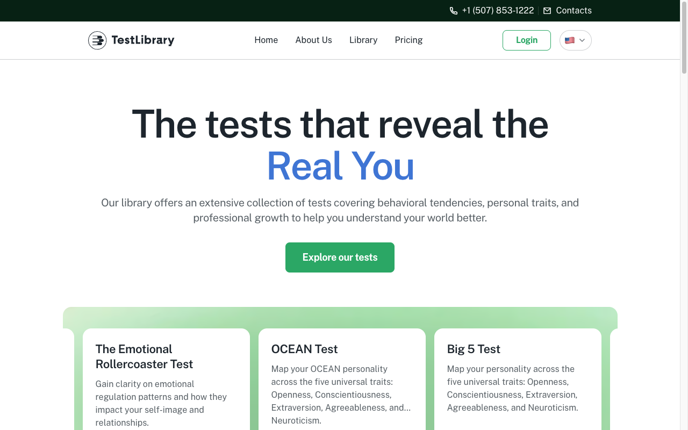
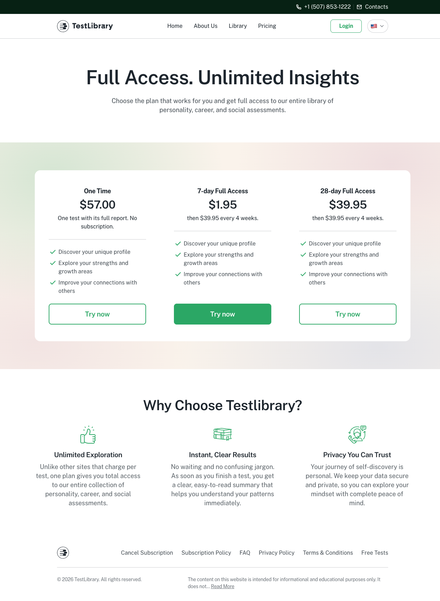
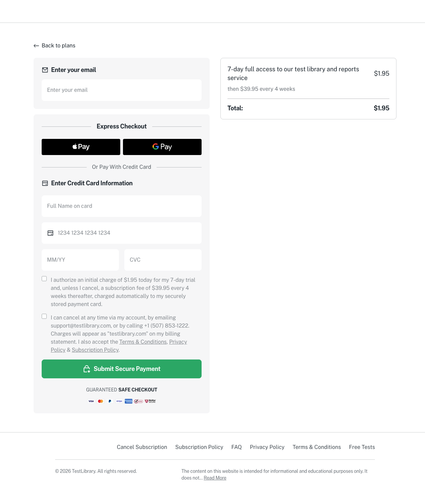
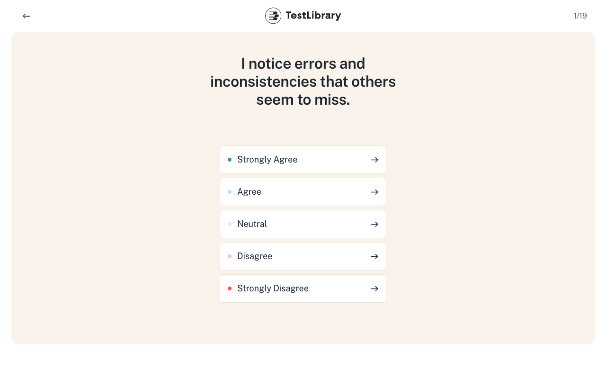
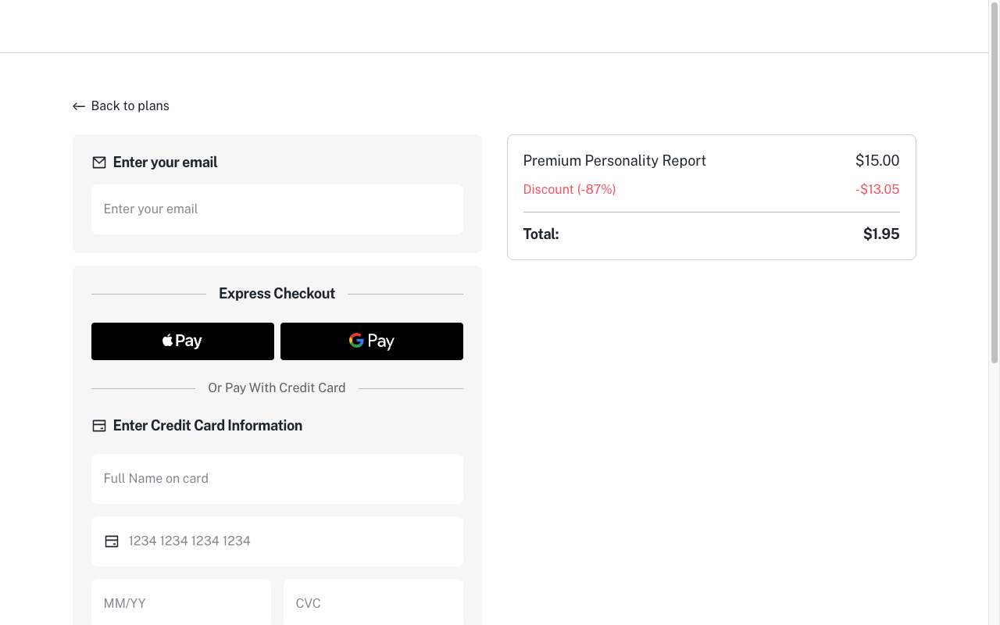
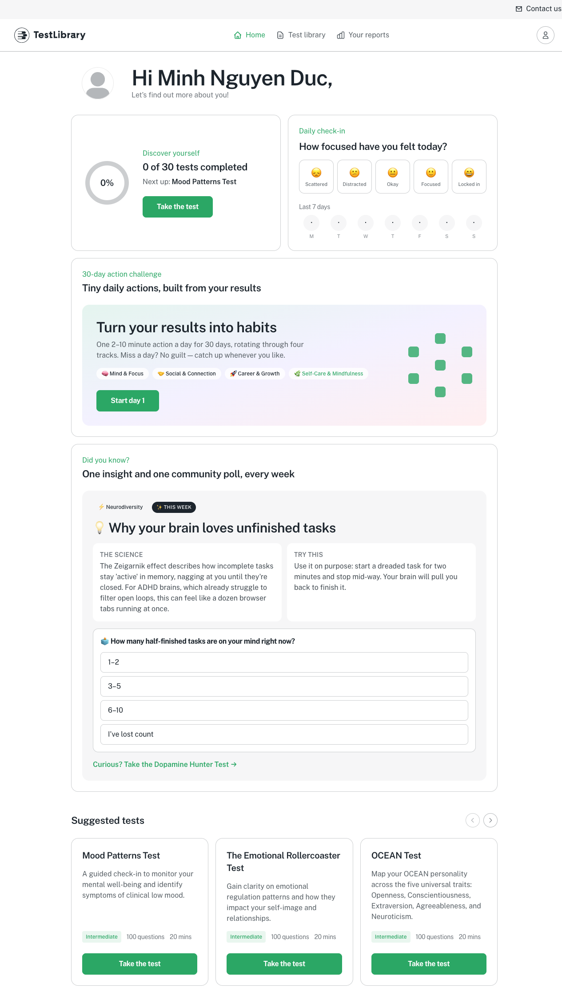
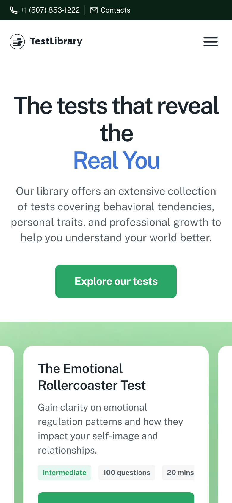
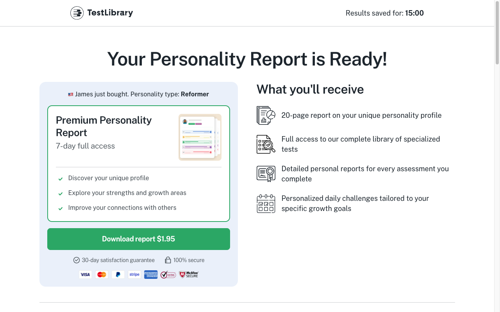
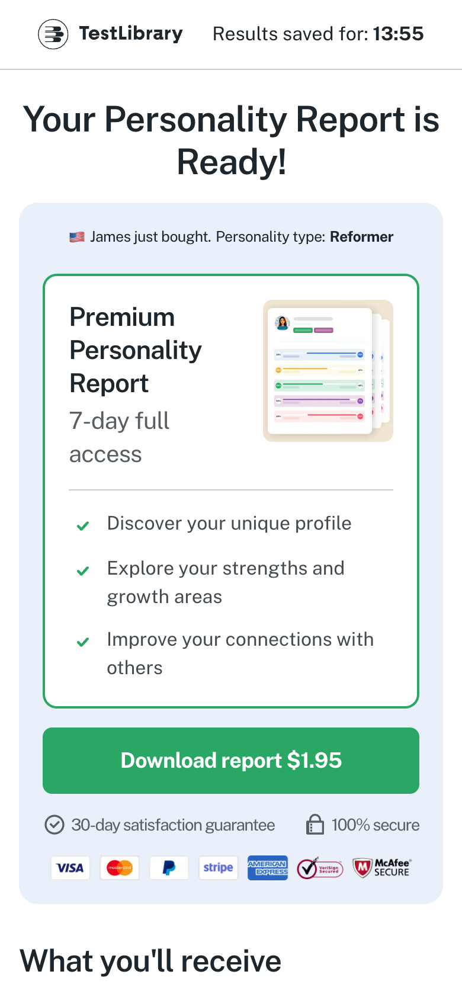

# Testlibrary — Báo cáo cho Design (web)
> Toàn bộ doc là quan sát **[LIVE:browser]** (Chrome research; ẩn danh + tài khoản trial của human) · Ngày: 2026-09-27 · Phạm vi: pre-checkout + member area (post-checkout) · Viewport 1280 + 390.
> Register: **định tính**. KHÔNG hex, KHÔNG px, KHÔNG token, KHÔNG jargon kỹ thuật.
> Ảnh mang phần lớn ý nghĩa. Nhãn UI giữ nguyên tiếng Anh. Tên trang = SC-ID (khớp `teardown.md §4.2`).

**Changelog** (mới nhất trước)
- 2026-09-27 · v1 · claude-opus-5-5 · báo cáo từ ~70 màn đã drive.

## 1. Cảm nhận tổng thể

Sạch, sáng, "wellness app" hơn là "bài kiểm tra". Nền trắng, một màu xanh lá đậm làm màu hành động duy nhất (nút chính, chữ nhấn), xanh dương cho chữ nhấn ở headline ("Real You", "Personality type"). Funnel dùng nền kem ấm bo tròn lớn để tạo cảm giác riêng tư, nhẹ nhàng. Kiểu chữ không chân, tròn, hiện đại; headline rất to, đậm. Minh hoạ theo hai kiểu song song: avatar người thật kiểu "stock 3D" cho kết quả, và doodle nét mảnh cho report. Tổng thể đáng tin trên bề mặt. Cảm giác "vội" và "áp lực" chỉ xuất hiện ở trang offer: đồng hồ, dòng "vừa mua", logo báo chí, đánh giá sao.

## 2. Tính năng chính

| Tính năng | Mô tả ngắn | Vào từ đâu | EV |
|---|---|---|---|
| Thư viện 30 bài test | card có tên, mô tả, độ khó, số câu, thời gian | landing, Library, member Test library | EV-TLW-013 · EV-TLW-215 |
| Bài free (SEO) | 19 câu, mỗi màn một câu, ra kết quả ngay | danh sách "Free Tests" ở footer, tìm kiếm | EV-TLW-054 · EV-TLW-079 |
| Bài đầy đủ 100 câu | 20 trang × 5 câu, vòng tròn to nhỏ theo mức đồng ý | nút upsell ở kết quả free | EV-TLW-083 |
| Trang offer | "Your Personality Report is Ready!" + mua $1.95 | sau khi làm xong bài đầy đủ | EV-TLW-108 |
| Dashboard member | check-in cảm xúc, thử thách 30 ngày, insight + bình chọn tuần, gợi ý bài | sau khi đăng nhập | EV-TLW-209 |
| Report | report dài theo "type", mục lục, tải PDF | Your reports → "Read more" | EV-TLW-244 |

## 3. Giao diện theo trang

### SC-TLW-01 · Home
 <!-- EV-TLW-002 -->
- Trên cùng có thanh tối mỏng chứa số điện thoại và "Contacts". Header trắng: logo bên trái, 4 mục giữa, nút "Login" viền xanh và nút cờ ngôn ngữ bên phải.
- Hero căn giữa, headline hai dòng rất to, chữ "Real You" màu xanh dương. Dưới là một câu mô tả xám và một nút xanh lá đặc "Explore our tests".
- Carousel card trắng nằm trên nền dải xanh lá nhạt chuyển màu. Card gồm tiêu đề đậm, mô tả, ba "chip" (độ khó · số câu · phút) và nút "Try now".
- Phía dưới: lưới chủ đề, "3 easy steps" đánh số, ba khối lợi ích, FAQ dạng accordion, footer nhiều link.

### SC-TLW-04 · Pricing
 <!-- EV-TLW-024 -->
- Headline to "Full Access. Unlimited Insights". Ba gói nằm trong một khung trắng lớn trên nền chuyển màu pastel (xanh lá → hồng nhạt).
- Gói giữa ($1.95) có nút tô đặc, hai gói hai bên chỉ có nút viền. Không có badge "phổ biến".
- Giá rất to. Dòng "then $39.95 every 4 weeks." nhỏ ngay dưới, cùng cỡ với mô tả.
- Mỗi gói có ba dấu tích giống hệt nhau, nên gần như không phân biệt được các gói.

### SC-TLW-05 · Checkout (từ pricing)
 <!-- EV-TLW-033 -->
- Trang không có menu, chỉ có "← Back to plans". Hai cột: form bên trái trong các khối xám nhạt, tóm tắt đơn bên phải trong khung viền mảnh.
- Form theo thứ tự: email → hai nút đen Apple Pay / Google Pay → "Or Pay With Credit Card" → thẻ → **hai ô tích bắt buộc** chứa chữ nhỏ → nút xanh lá to "Submit Secure Payment" → "GUARANTEED SAFE CHECKOUT" → dải logo thẻ và bảo mật.

### SC-TLW-12 · Free test (chọn giới tính)
 <!-- EV-TLW-053 -->
- Chỉ có logo, không menu. Khối kem bo tròn lớn chứa headline hai tông ("Discover your" đen, "Personality type" xanh dương) và hai nút lớn: "Male" xanh lá, "Female" tím.
- Bên phải là minh hoạ **bản report bị làm mờ** (thanh điểm màu, đồng hồ đo), gợi ý "sắp có kết quả".

### SC-TLW-13 · Câu hỏi free
 <!-- EV-TLW-054 -->
- Một câu mỗi màn, chữ to căn giữa. Năm lựa chọn dạng thẻ dọc, mỗi thẻ có một chấm màu bên trái (xanh đậm → nhạt → xám → hồng → đỏ) và mũi tên bên phải. Bấm là sang câu kế ngay, không cần nút "Next".
- Góc trái có mũi tên quay lại, góc phải là bộ đếm "1/19".

### SC-TLW-14 · Kết quả free
 <!-- EV-TLW-079 -->
- Avatar tròn (nhân vật minh hoạ theo giới tính), "Your result" nhỏ màu xanh, tên type rất to.
- "Your Scores": 9 thanh ngang, mỗi thanh một màu pastel, phần trăm nằm trong vòng tròn đầu thanh, xếp từ cao xuống thấp.
- Cuối trang: khối xanh lá nhạt "Ready to see the full picture?" với nút "Start Complete Test — $1.95".

### SC-TLW-18 · Bài đầy đủ (5 câu/trang)
 <!-- EV-TLW-083 -->
- Mỗi câu nằm trong một thẻ trắng trên nền kem. Hàng 5 vòng tròn: hai đầu to nhất (đỏ = Strongly Disagree, xanh = Strongly Agree), nhỏ dần vào giữa (xám = trung lập). Nhãn chữ hai đầu, không có nhãn cho 3 mức giữa.
- Nút "Next" ở cuối trang, bộ đếm "N/20" ở góc phải header.

### SC-TLW-21 · Offer
 <!-- EV-TLW-108 -->
- Header chỉ có logo và "Results saved for: 14:47" (đồng hồ đếm ngược, chữ số đậm).
- Khối trái nền xanh nhạt gồm dòng "🇺🇸 Christopher just bought. Personality type: Challenger" (tên và type đổi liên tục), thẻ gói viền xanh ("Premium Personality Report · 7-day full access", ảnh report thu nhỏ, 3 dấu tích), nút xanh "Download report $1.95", "30-day satisfaction guarantee" · "100% secure", dải logo thanh toán.
- Khối phải "What you'll receive": 4 dòng có icon nét mảnh.
- Tiếp theo: dải logo "Personality tests featured in" (đại học, đài truyền hình), report mờ với nút khoá "Unlock my report", khối "Your Premium Personality Report", 6 thẻ đánh giá có sao và nhãn "VERIFIED", lặp lại khối mua ở cuối trang.

### SC-TLW-22 · Checkout (funnel)
 <!-- EV-TLW-110 -->
- Cùng khung với checkout pricing nhưng **không có ô tích**. Tóm tắt đơn hiện giá gạch "$15.00", dòng giảm giá màu đỏ "Discount (-87%)" và "Total: $1.95". Điều khoản gia hạn nằm trong một đoạn chữ nhỏ ở cuối form.

### SC-TLW-03 · Dashboard (member)
 <!-- EV-TLW-209 -->
- Lời chào tên riêng + avatar mặc định. Lưới thẻ viền mảnh bo tròn:
  - thẻ tiến độ (vòng tròn %, "0 of 30 tests completed", "Next up", nút "Take the test");
  - thẻ check-in: 5 ô emoji và dải 7 ngày dạng chấm;
  - thẻ "30-day action challenge": khối chuyển màu pastel, 4 chip track, nút "Start day 1", hình các ô vuông xanh;
  - thẻ "Did you know?": chip chủ đề và "THIS WEEK" nền đen, tiêu đề có emoji bóng đèn, hai ô "THE SCIENCE" / "TRY THIS", poll dạng 4 dòng lựa chọn, link xanh "Curious? Take the … Test →";
  - carousel "Suggested tests" có nút ‹ ›.

### SC-TLW-25 · Report
 <!-- EV-TLW-243 -->
- Mở đầu: "YOUR RESULT" nhỏ, tên type to, một câu mô tả, nút xanh bo tròn "Download report", minh hoạ doodle nhân vật ngồi bàn viết. Có một đường gợn sóng mảnh làm phân cách.
- Tiếp theo là "Your Scores" (giống kết quả free), mục lục mở sẵn, rồi 9 chương có tiêu đề kiểu văn chương ("The Voice That Never Praises", "Love as Maintenance"…). Cuối report có widget "Did you like our test?".

## 4. Luồng người dùng

### 4.1 Funnel ẩn danh (đường ra tiền chính)
1. [SC-TLW-12 · Free test] bấm "Male" → [SC-TLW-13 · Câu hỏi] (đổi màn, URL giữ nguyên) 
2. [SC-TLW-13] trả lời 19 câu → [SC-TLW-14 · Kết quả free] (trang mới) 
3. [SC-TLW-14] "Start Complete Test — $1.95" → [SC-TLW-15] → "Male" → [SC-TLW-16 · Preparing…] → [SC-TLW-17 · Before you begin] → "Start test" → [SC-TLW-18 · 20 trang] (trang mới mỗi bước)
4. [SC-TLW-18] "Next" ở trang 20 → [SC-TLW-19 · Well done!] → "Get My Results" → [SC-TLW-20 · Analyzing…] → tự sang [SC-TLW-21 · Offer] 
5. [SC-TLW-21] "Download report $1.95" → [SC-TLW-22 · Checkout] . Nếu bấm back từ offer, màn "Analyzing…" chạy lại rồi tự đưa về offer.

### 4.2 Site gốc
[SC-TLW-01 · Home] "Try now" trên bất kỳ card nào → [SC-TLW-04 · Pricing] → "Try now" → [SC-TLW-05 · Checkout]. Không có đường nào để làm bài trước khi trả tiền.

### 4.3 Member
[SC-TLW-03 · Dashboard] → "Test library" → [SC-TLW-23] → "Take the test" → cùng các bước 3–4 của funnel → "Get My Results" → [SC-TLW-24 · Your reports] (bỏ qua offer) → "Read more" → [SC-TLW-25 · Report] → "Download report" (tải PDF).

- Sơ đồ tổng: `flow-mindmap.png` (tên trang = SC-ID).

## 5. Trạng thái

| Trạng thái | Trông thế nào | EV |
|---|---|---|
| Loading | hai màn chờ "Preparing your personality test..." và "Analyzing your profile..." (có danh sách bước + đánh giá khách hàng), không có skeleton | EV-TLW-081 · EV-TLW-106 |
| Empty (member mới) | vòng "0%", "0 of 30 tests completed", avatar trống, dải 7 ngày toàn chấm | EV-TLW-209 |
| Success | check-in: "🔥 1-day streak · Thanks for checking in!" · thử thách: "✓ Done", "1 / 30 done" · poll: phần trăm + "(you)" | EV-TLW-210 · EV-TLW-214 · EV-TLW-212 |
| Locked | ngày 2–30 của thử thách có ổ khoá; report mờ + nút khoá ở offer | EV-TLW-213 · EV-TLW-108 |
| Error | không bắt được (offline trong bài free vẫn chạy, không có thông báo lỗi) | EV-TLW-060 · EV-TLW-061 |

> Khi map sang màn của mình: đủ bộ 5 trạng thái Default · Loading · Empty · Error · Locked/no-access cho mỗi SCR.

## 6. Responsive

| Trang | 1280 | 390 |
|---|---|---|
| Home |  |  |
| Offer |  |  |

- Ở 390: menu gom vào nút hamburger, card test thành carousel một thẻ (thấy mép thẻ kế), các khối hai cột xếp chồng. Đồng hồ ở offer vẫn nằm trên header. Không có thanh điều hướng dưới đáy.

## 7. Micro-interaction & điểm nhấn

- Chọn đáp án là sang câu ngay (không cần "Next") ở bài free, tạo cảm giác nhanh.
- Vòng tròn đáp án có kích thước theo cường độ, dễ hiểu mà không cần nhãn.
- Loader có danh sách bước và đánh giá khách hàng, tạo cảm giác "đang phân tích kỹ".
- Offer: dòng "vừa mua" đổi liên tục, đồng hồ đếm ngược. Đây là điểm nhấn thị giác nhưng tạo áp lực.
- Chỗ chưa mượt: bấm back ở offer bị kéo lại offer; header member xuất hiện cả trên trang kết quả free của khách chưa đăng nhập.
