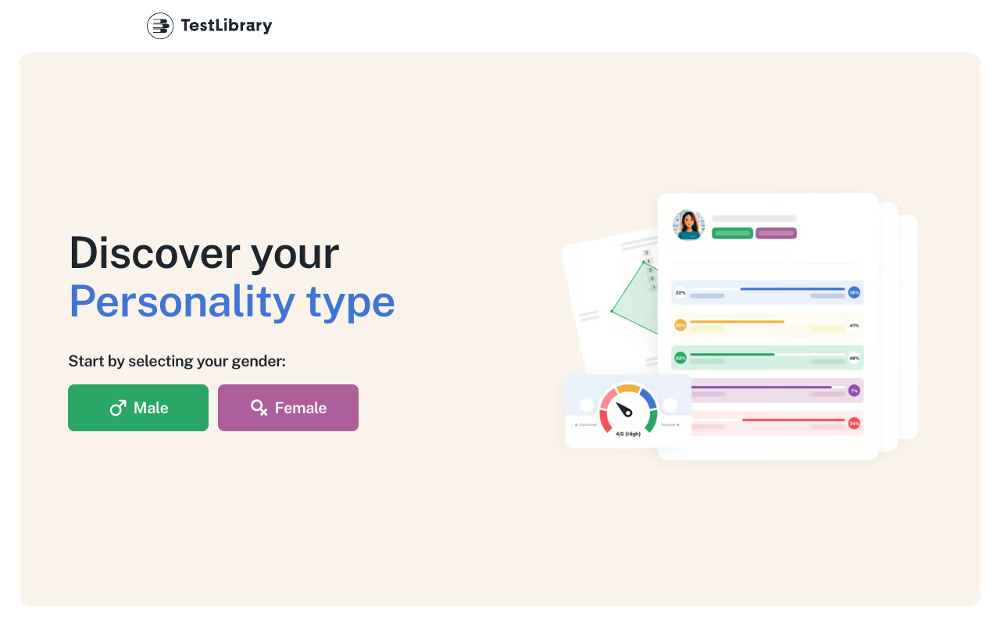
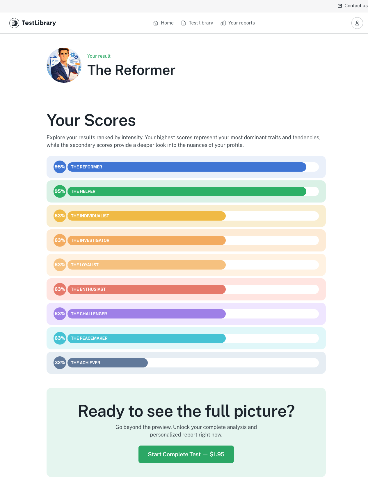
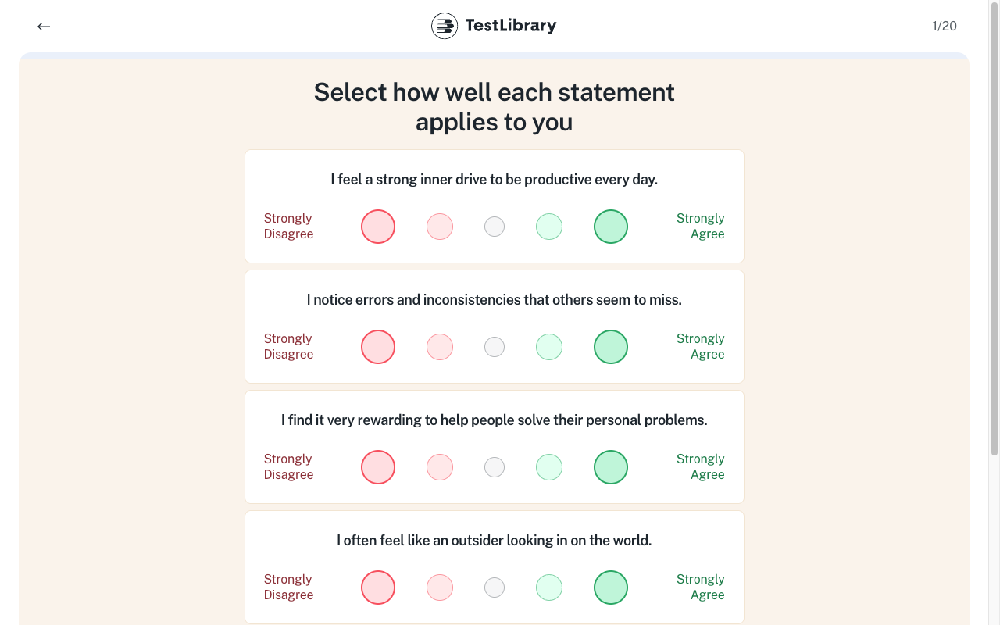
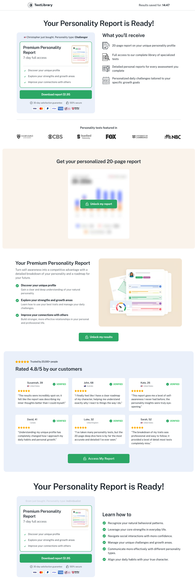
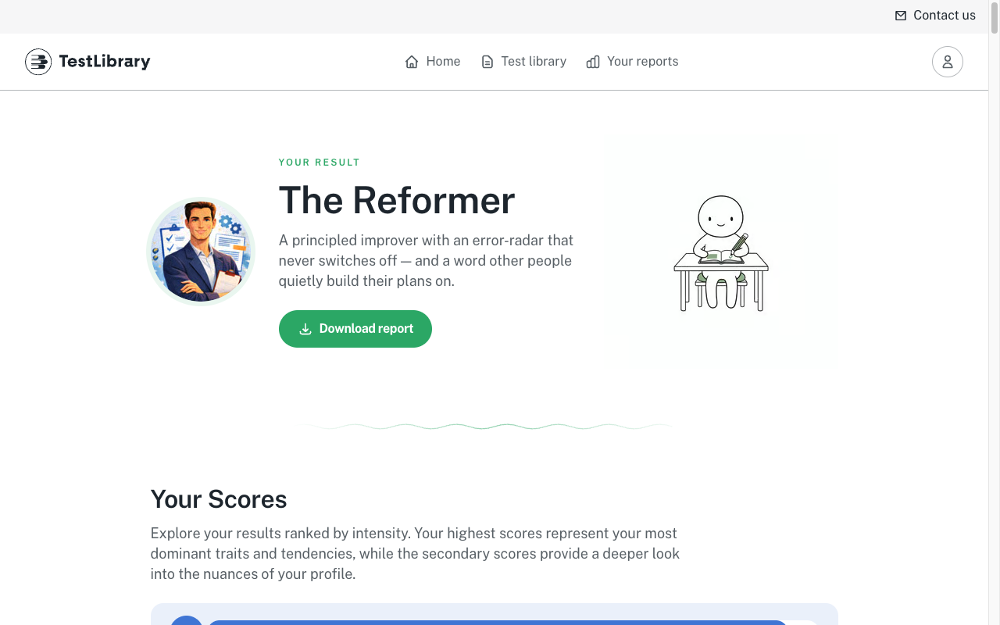

# [RS-testlibrary] Teardown — Testlibrary (web)
**Changelog** (mới nhất trước)
- 2026-09-28 · v1.1 · claude-opus-5-5 · phiên cloud không drive được (egress chặn testlibrary.com); thêm nguồn S15 (`web-evidence.md`, `[LIVE:web]`), finding F-35–F-43 ở đó, ghi chú F-04 · F-06 · F-10 · F-20, cập nhật §9 PARK. Kế hoạch drive tiếp: `next-drive-plan.md`.
- 2026-09-27 · v1 · claude-opus-5-5 · teardown LIVE ~70 màn (ẩn danh + research account trial của human, 1280 + 390), 263 EV `EV-TLW-*` + 6 EV kit `EV-KIT-*`; phụ lục pháp lý `legal-extract.md`.

## 0. Meta

| Field | Value |
|---|---|
| Product / công ty | Testlibrary ("TestLibrary") · pháp nhân: trang Contact ghi **Revuelto Sàrl** (Luxembourg, RCS B303230) `[LIVE:browser · EV-TLW-049]`; văn bản pháp lý ghi Platform Operator là **Aura Health LLC** (Wyoming) hoặc **Testing Solutions LLC** (Delaware), cùng 3 "Payment Processing Entity" (Revuelto S.à r.l., Haur B.V., Haur Media Limited) `[LIVE:browser · EV-TLW-043]` → `legal-extract.md §1` |
| URL (marketing · app · docs) | `https://testlibrary.com/` (marketing + app cùng host) · funnel SEO `/free-tests/<slug>` · funnel trả phí `/personality-test/…` · member `/dashboard…` |
| Loại | công cụ web B2C: thư viện bài test tính cách / quan hệ / nghề nghiệp / "sức khoẻ tinh thần", mô hình quiz-funnel → trial trả phí → subscription |
| Phương pháp | Chrome research (CDP, profile `testlib` riêng) — `[LIVE:browser]`; review bên thứ ba chỉ ở `[LIVE:web]` |
| Browser · viewport | Chrome 153 · 1280×800 (+ 390×844 mobile emulation) |
| Locale · region quan sát · currency hiển thị | en-US · VN (IP; Cloudflare POP `SIN`) · USD |
| Ngày research · re-verify by | 2026-09-27 · 2026-12-27 (web đổi nhanh) |
| Trạng thái tài khoản | anonymous (context `main` + 5 fresh context) → research account của human: đã trả trial $1.95 trước phiên, **Plan = Cancelled** (không có kỳ thu tiếp) `[LIVE:browser · EV-TLW-247]` |
| Phạm vi | Free / pre-checkout đầy đủ + pricing / 4 checkout quan sát (không nhập) + member area **post-checkout (trial, human-paid)** |
| Biến thể A/B thấy được | 2 checkout khác nhau: `/checkout?from=pricing…` (2 checkbox) và `/personality-test/checkout-2-bubbles?…&from=offer` (không checkbox); cookie `_conv_v`/`_conv_s` ở app shell `[LIVE:browser · EV-TLW-254]` → khả năng có A/B framework `[INFERRED]` |
| Status | Draft |

## 1. Research questions

| # | Câu hỏi | Vì sao cần |
|---|---|---|
| Q1 | Người dùng đi từ đâu tới tiền: landing → ? → paywall → checkout | quyết định survival flow + money path của mình |
| Q2 | Giá, trial, chu kỳ gia hạn, điều khoản huỷ/hoàn thật sự là gì (verbatim) | mốc giá + BR-APP tiền |
| Q3 | Engine làm test: flow câu hỏi, lưu tiến độ, chấm điểm client/server, kết quả có phụ thuộc câu trả lời không | khả thi + chất lượng (TC-01) |
| Q4 | Report trả phí gồm gì, export ra sao | giá trị cốt lõi (TC-02) |
| Q5 | Member area giữ chân bằng gì | retention loop |
| Q6 | Rủi ro pháp lý / dark pattern nào cần tránh | legal-consent + positioning "minh bạch" |

## 2. Sources

| # | Trang / nguồn | URL | EV-id | Ngày | Tag |
|---|---|---|---|---|---|
| S1 | L0 public surface (curl) | `https://testlibrary.com` | EV-TLW-001 | 2026-09-27 | `[LIVE:browser]` |
| S2 | Landing (first visit · ẩn danh · đã login) | `/` | EV-TLW-002 · 012–015 · 008–011 | 2026-09-27 | `[LIVE:browser]` |
| S3 | FAQ (landing + `/faq/`) | `/` · `/faq/` | EV-TLW-016–022 · 047 | 2026-09-27 | `[LIVE:browser]` |
| S4 | Pricing (EN + DE) | `/pricing` · `/de/pricing` | EV-TLW-023–029 · 031 | 2026-09-27 | `[LIVE:browser]` |
| S5 | Checkout pricing ×3 | `/checkout?from=pricing&product=<7 · one-time · 3>&sessionId=…` | EV-TLW-030 · 032–039 | 2026-09-27 | `[LIVE:browser]` |
| S6 | Legal ×3 + cancel | `/legal/*` · `/cancel-sub` | EV-TLW-040–046 | 2026-09-27 | `[LIVE:browser]` |
| S7 | About · Contact · Library public + Free Tests | `/about/` · `/contact-us` · `/library/` | EV-TLW-048–052 | 2026-09-27 | `[LIVE:browser]` |
| S8 | Free test funnel + kit | `/free-tests/personality-test[/result]` | EV-TLW-053–079 · 117–202 | 2026-09-27 | `[LIVE:browser]` |
| S9 | Complete-test funnel → offer → checkout | `/personality-test/…` | EV-TLW-080–116 | 2026-09-27 | `[LIVE:browser]` |
| S10 | Responsive 390 | `/` · `/pricing` · offer · checkout · free test · member | EV-TLW-203–207 · 255–258 | 2026-09-27 | `[LIVE:browser]` |
| S11 | Member area (trial, post-checkout) | `/dashboard…` · `/reports/…` · `/profile…` · `/iq-test…` | EV-TLW-208–261 | 2026-09-27 | `[LIVE:browser]` |
| S12 | Perf | `/` · `/free-tests/personality-test` | EV-TLW-262 · 263 | 2026-09-27 | `[LIVE:browser]` |
| S13 | Review / bài viết bên thứ ba (qua web search, KHÔNG drive) | trustpilot.com/review/testlibrary.com · sensorstechforum.com/testlibrary-scam · youtube "Is TestLibrary com Legit…" · facebook group post | — (search summary) | 2026-09-27 | `[LIVE:web]` |
| S14 | Lời kể của human (tạo mật khẩu sau thanh toán) | — | — | 2026-09-27 | `[INFERRED]` (không phải capture) |
| S15 | Bằng chứng ngoài site qua WebSearch: Trustpilot, BBB + Scam Tracker, ProductReview, blog cảnh báo, search index của testlibrary.com, sổ đăng ký pháp nhân (W-01…W-23) | `web-evidence.md` §1 | — (search summary, không mở trang) | 2026-09-28 | `[LIVE:web]` |

## 3. Tổng quan & positioning

Testlibrary bán "tự khám phá bản thân" qua ~30 bài test (tính cách, quan hệ, nghề nghiệp và nhiều bài chạm tới sức khoẻ tinh thần: trầm cảm, bipolar, OCD, ADHD, tự kỷ, trauma…) `[LIVE:browser · EV-TLW-014 · EV-TLW-052]`. Khách từ SEO/quảng cáo vào funnel: làm bài free → thấy "kết quả" → upsell làm bài đầy đủ → trang offer "report sẵn sàng" → checkout **$1.95 cho 7 ngày, sau đó tự gia hạn $39.95 mỗi 4 tuần** `[LIVE:browser · EV-TLW-025 · EV-TLW-112]`. Người đã trả vào member area có dashboard giữ chân (check-in, thử thách 30 ngày, poll tuần) và report dài theo type `[LIVE:browser · EV-TLW-209 · EV-TLW-245]`. Tiền đến từ subscription tự gia hạn; site gốc (header/library) cũng dẫn thẳng về trang pricing `[LIVE:browser · EV-TLW-050]`.

## 4. Teardown

### 4.0 First visit & landing (mặt tiền)

- **(a) First-visit surfaces** (fresh context, trước mọi click):

  | # | Surface | Copy neo (VERBATIM) | Lựa chọn · mặc định (có "Reject"?) | Dark pattern? | Tag | EV |
  |---|---|---|---|---|---|---|
  | 1 | `cookie-consent` | — không có banner/consent wall (từ IP VN, en-US) | n/a | trong khi pixel quảng cáo Meta · Bing · Google Ads chạy ngay (F-02) | `[LIVE:browser]` | EV-TLW-002 · EV-TLW-015 |
  | 2 | `announcement-bar` | "+1 (507) 853-1222" · "Contacts" (thanh tối trên cùng) | link `tel:` · `/contact-us` | không | `[LIVE:browser]` | EV-TLW-002 |
  | 3 | `newsletter/promo` · `chat-auto-open` · `geo/lang-redirect` | — không có | n/a | — | `[LIVE:browser]` | EV-TLW-002 |

- **(b) Landing (top→bottom)** — ẩn danh, 1280:

  | Section | Headline / nội dung VERBATIM | CTA (VERBATIM → đích URL) | Tag | EV |
  |---|---|---|---|---|
  | Hero | "The tests that reveal the Real You" · "Our library offers an extensive collection of tests covering behavioral tendencies, personal traits, and professional growth…" | "Explore our tests" → `/library` | `[LIVE:browser]` | EV-TLW-012 · EV-TLW-014 |
  | Carousel test | 30 card; mỗi card: tên · mô tả · "Intermediate" · "100 questions" · "20 mins" (ngoại lệ IQ Test "0 questions", Spirit Animal 31, Soulmate 16) | **"Try now" → `/pricing`** (mọi card) | `[LIVE:browser]` | EV-TLW-012 · EV-TLW-014 |
  | Chủ đề | "You're a mosaic of traits— explore them all." · Memory · Personality · Archetypes · Mental Health · Career · Autism · ADHD · Love Styles · Spirit Animal | — | `[LIVE:browser]` | EV-TLW-014 |
  | 3 bước | "Find out more about yourself in 3 easy steps": Choose your test → Answer all the questions → **"Unlock your insights"** | "Explore our tests" | `[LIVE:browser]` | EV-TLW-014 |
  | Lợi ích | "Gain a Clearer View of Yourself" · "Connect Better with the World" · "Level Up Your Professional Life" | "Explore our tests" | `[LIVE:browser]` | EV-TLW-014 |
  | FAQ | 6 câu (accordion, mở 1 câu/lần) — verbatim ở §4.5 | — | `[LIVE:browser]` | EV-TLW-016–022 |
  | Footer | "Cancel Subscription" · "Subscription Policy" · "FAQ" · "Privacy Policy" · "Terms & Conditions" · "Free Tests" (nút mở danh sách) · disclaimer "…informational and educational purposes only…" | `/cancel-sub` · `/legal/*` · `/faq` | `[LIVE:browser]` | EV-TLW-014 · EV-TLW-052 |

- **(c) SEO & distribution surface:**

  | Item | Quan sát | Tag | EV |
  |---|---|---|---|
  | title · description (`/`) | "Testlibrary - Discover the Real You" · "Explore our collection of personality, career, and social assessments designed to help you understand yourself better." | `[LIVE:browser]` | EV-TLW-015 |
  | OG · hreflang · JSON-LD · manifest | không có (og:title/og:image = —, hreflang = — dù có `/de/…`, không json-ld, không manifest) | `[LIVE:browser]` | EV-TLW-015 |
  | canonical | có (`https://testlibrary.com/`); checkout canonical chứa cả `sessionId` | `[LIVE:browser]` | EV-TLW-015 · EV-TLW-035 |
  | robots · sitemap | robots.txt `Disallow:` (cho phép hết) · sitemap.xml **403** với GET thường (Cloudflare challenge) | `[LIVE:browser]` | EV-TLW-001 |
  | Trang SEO theo từ khoá | 25 trang `/free-tests/<slug>`; slug nhắm từ khoá lâm sàng (`depression-test`, `bpd-test`, `narcissist-test`, `ocd-test`, `bipolar-test`, `adhd-test`, `sociopath-test`, `trauma-test`, `autism-test`…), tên hiển thị "mềm" (Mood Patterns, Emotional Rollercoaster, Self-Focus…) | `[LIVE:browser]` | EV-TLW-052 |
  | i18n | ≥ 11 ngôn ngữ trong selector; path prefix (`/de/pricing`); lựa chọn lưu cookie `locale` | `[LIVE:browser]` | EV-TLW-026 · EV-TLW-027 · EV-TLW-035 |
  | app store / extension / blog | không thấy | `[LIVE:browser]` | EV-TLW-014 |

### 4.1 Sign-up, sign-in & onboarding (một lần / tài khoản)

- **(a) Auth surface:**

  | Cách đăng ký | Bắt buộc trước giá trị? | Verify email? | Friction | Tag | EV |
  |---|---|---|---|---|---|
  | **Không có trang Sign up**. Tài khoản sinh từ checkout (email nhập ở checkout); theo lời kể human, **đặt mật khẩu ngay sau thanh toán** | không — bài free + "kết quả" + offer đều không cần tài khoản | không quan sát | Login = Email + Password + "Forgot password?"; không social login | `[LIVE:browser]` (login) · `[INFERRED]` (set password — lời kể human) | EV-TLW-006 · EV-TLW-032 |

- **(b) Onboarding sequence** (funnel trả phí chính là onboarding):

  | # | Surface | Copy neo | Loại | Bắt buộc? · skip? | Tag | EV |
  |---|---|---|---|---|---|---|
  | 1 | Chọn giới tính | "Start by selecting your gender:" Male / Female | `questionnaire` | bắt buộc, chỉ 2 lựa chọn | `[LIVE:browser]` | EV-TLW-053 · EV-TLW-080 |
  | 2 | Loader | "Preparing your personality test..." · "Built with the standard of academic excellence" | `tour` (labor illusion) | tự chuyển | `[LIVE:browser]` | EV-TLW-081 |
  | 3 | Hướng dẫn | "Before you begin" · 5 mức Likert · "Start test" | `tour` | bắt buộc | `[LIVE:browser]` | EV-TLW-082 |
  | 4 | Bài test 100 statement | "Select how well each statement applies to you" | `questionnaire` | bắt buộc | `[LIVE:browser]` | EV-TLW-083–103 |
  | 5 | Analyzing | "Analyzing your profile..." + testimonial "VERIFIED" | `tour` (labor illusion) | tự chuyển | `[LIVE:browser]` | EV-TLW-106 |
  | 6 | Offer | "Your Personality Report is Ready!" | `plan-picker` (onboarding paywall) | hard (không có đường xem kết quả nếu không trả) | `[LIVE:browser]` | EV-TLW-107–109 |
  | 7 | Sau thanh toán: đặt mật khẩu / order confirmation | — | — | — | `[BLOCKED · payment]` (không trả trong phiên; lời kể human) | — |
  | 8 | Dashboard lần đầu | "Hi <tên>," · "0 of 30 tests completed · Next up: Mood Patterns Test" | `empty-state` | — | `[LIVE:browser]` (post-checkout) | EV-TLW-007 · EV-TLW-209 |

- **(c) Onboarding axes:**

  | Axis | Quan sát | Tag · EV |
  |---|---|---|
  | gate-order | landing/SEO page → chọn giới tính → test → analyzing → **offer** → checkout (email + thẻ) → (đặt mật khẩu) → dashboard | `[LIVE:browser · EV-TLW-053 → 112]` |
  | account-gate | `required-before-value` cho report thật (tài khoản chỉ sinh sau thanh toán); bài free cho "kết quả" không cần tài khoản | `[LIVE:browser · EV-TLW-076 · EV-TLW-107]` |
  | auth-methods | email + password (không social, không magic link quan sát) | `[LIVE:browser · EV-TLW-006]` |
  | personalization | `light` — chỉ giới tính (đổi avatar); kết quả free không đổi theo câu trả lời (F-14) | `[LIVE:browser · EV-TLW-202]` |
  | time-to-value | bài free: 1 click giới tính + 19 câu → "kết quả" (median câu cuối→kết quả 2,69 s); report thật: 100 câu + trả tiền | `[LIVE:browser · EV-TLW-181]` |
  | monetization-first-seen | `landing-pricing` (mọi "Try now" trên site gốc) · funnel: `post-onboarding` (offer sau khi làm xong 100 câu) | `[LIVE:browser · EV-TLW-012 · EV-TLW-107]` |
  | permission-timing | không có notification soft-ask / browser prompt | `[LIVE:browser · EV-TLW-002 · EV-TLW-209]` |

### 4.2 Điều hướng, routes & chuyển trang

- **(a) Khung** — theo viewport:

  | Vùng (@viewport) | Mục (nhãn verbatim, đúng thứ tự) | Root (SC-ID) | Tag | EV |
  |---|---|---|---|---|
  | Public header @1280 | "Home" · "About Us" · "Library" · "Pricing" · "Login" · chọn ngôn ngữ; top bar "+1 (507) 853-1222" · "Contacts"; footer "Cancel Subscription" · "Subscription Policy" · "FAQ" · "Privacy Policy" · "Terms & Conditions" · "Free Tests" | SC-TLW-01 · SC-TLW-09 · SC-TLW-11 · SC-TLW-04 · SC-TLW-02 | `[LIVE:browser]` | EV-TLW-012 · EV-TLW-013 |
  | Public header @390 | logo · hamburger (menu ẩn); top bar giữ | SC-TLW-01 | `[LIVE:browser]` | EV-TLW-203 |
  | Funnel (free test / complete test / offer) | chỉ logo; trang câu hỏi có nút "←" trái + bộ đếm "N/19" · "N/20"; offer có đồng hồ "Results saved for" (điểm vào: SEO / ads / CTA upsell) | SC-TLW-12 · SC-TLW-15 | `[LIVE:browser]` | EV-TLW-053 · EV-TLW-083 · EV-TLW-107 |
  | Checkout | header trống (không nav) · "Back to plans" | SC-TLW-05 | `[LIVE:browser]` | EV-TLW-033 · EV-TLW-110 |
  | Member header @1280 | "Home" · "Test library" · "Your reports" · icon profile; top bar "Contact us" (tab mới) | SC-TLW-03 · SC-TLW-23 · SC-TLW-24 | `[LIVE:browser]` | EV-TLW-208 |
  | Member header @390 | logo · icon profile · hamburger | SC-TLW-03 | `[LIVE:browser]` | EV-TLW-258 |

- **(b) Danh mục trang:**

  | SC-ID | Tên trang (tiêu đề gốc) | URL pattern (đã redact) | Vùng / tab | Access (public · account · paid) | Hiển thị | Zone (free · paywall · paid · park) | Mở thẳng URL ra đúng state? | EV đại diện | Tag |
  |---|---|---|---|---|---|---|---|---|---|
  | SC-TLW-01 | Home | `/` | Public | public | root | free | có | EV-TLW-012 | `[LIVE:browser]` |
  | SC-TLW-02 | Log in to your account | `/login` | Public | public | push | free | có | EV-TLW-006 | `[LIVE:browser]` |
  | SC-TLW-03 | Hi <tên>, (Dashboard) | `/dashboard` | Member | paid | root | paid | có (khi đã login) | EV-TLW-209 | `[LIVE:browser]` |
  | SC-TLW-04 | Full Access. Unlimited Insights (Pricing) | `/pricing` · `/<lang>/pricing` | Public | public | push | paywall | có | EV-TLW-024 | `[LIVE:browser]` |
  | SC-TLW-05 | Secure Checkout (từ pricing) | `/checkout?from=pricing&product=<7 · one-time · 3>&sessionId=…` | Checkout | public | push | paywall | có (sinh `sessionId` mới) | EV-TLW-033 | `[LIVE:browser]` |
  | SC-TLW-06 | Subscription Policy · Terms & Conditions · Privacy Policy | `/legal/<doc>` | Public | public | push | free | có | EV-TLW-040 | `[LIVE:browser]` |
  | SC-TLW-07 | Cancel Your Subscription | `/cancel-sub` | Public | public | push | free | có | EV-TLW-046 | `[LIVE:browser]` |
  | SC-TLW-08 | Frequently Asked Questions | `/faq/` | Public | public | push | free | có | EV-TLW-047 | `[LIVE:browser]` |
  | SC-TLW-09 | About Testlibrary | `/about/` | Public | public | push | free | có | EV-TLW-048 | `[LIVE:browser]` |
  | SC-TLW-10 | Let's Get You the Answers You Need (Contact) | `/contact-us` | Public | public | push | free | có | EV-TLW-049 | `[LIVE:browser]` |
  | SC-TLW-11 | Find out more about yourself. One test at a time (Library) | `/library/` | Public | public | push | free | có | EV-TLW-050 | `[LIVE:browser]` |
  | SC-TLW-12 | Discover your Personality type (free test — chọn giới tính) | `/free-tests/<slug>` | Funnel | public | root | free | có (nếu còn progress trong localStorage thì mở ở câu dở) | EV-TLW-053 | `[LIVE:browser]` |
  | SC-TLW-13 | Câu hỏi free test "N/19" | `/free-tests/<slug>` (URL không đổi) | Funnel | public | push | free | resume từ localStorage | EV-TLW-054 | `[LIVE:browser]` |
  | SC-TLW-14 | Your result (free) | `/free-tests/<slug>/result` | Funnel | public | push | free | chưa thử ở context khác | EV-TLW-079 | `[LIVE:browser]` |
  | SC-TLW-15 | Discover your Personality type (complete test — chọn giới tính) | `/personality-test/` | Funnel | public | push | free | có | EV-TLW-080 | `[LIVE:browser]` |
  | SC-TLW-16 | Preparing your personality test... (loader) | `/personality-test/loader` | Funnel | public | push | free | chưa thử | EV-TLW-081 | `[LIVE:browser]` |
  | SC-TLW-17 | Before you begin | `/personality-test/instructions` | Funnel | public | push | free | chưa thử | EV-TLW-082 | `[LIVE:browser]` |
  | SC-TLW-18 | Select how well each statement applies to you (trang 5 statement) | `/personality-test/quiz?q=<n>&total=100` | Funnel | public | push | free | chưa thử | EV-TLW-083 | `[LIVE:browser]` |
  | SC-TLW-19 | Well done! | `/personality-test/confirmation?q=96&total=100` | Funnel | public | push | free | chưa thử | EV-TLW-105 | `[LIVE:browser]` |
  | SC-TLW-20 | Analyzing your profile... | `/personality-test/analyzing?…` | Funnel | public | push | free | tự chuyển sang offer | EV-TLW-106 | `[LIVE:browser]` |
  | SC-TLW-21 | Your Personality Report is Ready! (offer) | `/personality-test/offer?q=96&total=100&sid=<uuid>` | Funnel | public | push | paywall | có (cùng context; đồng hồ tiếp tục) | EV-TLW-108 | `[LIVE:browser]` |
  | SC-TLW-22 | Secure Checkout (funnel) | `/personality-test/checkout-2-bubbles?…&sid=<uuid>&from=offer&sessionId=…` | Checkout | public | push | paywall | có | EV-TLW-111 | `[LIVE:browser]` |
  | SC-TLW-23 | Test library (member) | `/dashboard/library` | Member | paid | tab | paid | có | EV-TLW-215 | `[LIVE:browser]` |
  | SC-TLW-24 | Your reports | `/dashboard/reports` | Member | paid | tab | paid | có | EV-TLW-241 | `[LIVE:browser]` |
  | SC-TLW-25 | Your result — report (Personality Test) | `/reports/<test-slug>` | Member | paid | push | paid | có | EV-TLW-244 | `[LIVE:browser]` |
  | SC-TLW-26 | Profile | `/profile` | Member | paid | push | paid | có | EV-TLW-246 | `[LIVE:browser]` |
  | SC-TLW-27 | Plan details | `/profile/plan-details` | Member | paid | push | paid | có | EV-TLW-247 | `[LIVE:browser]` |
  | SC-TLW-28 | Discover Your IQ Score (IQ test) | `/iq-test?access=…` → `/iq-test/quiz?access=…&q=<n>&total=38` | Member | paid | push | paid | chưa thử | EV-TLW-251 | `[LIVE:browser]` |

- **(c) Nhật ký chuyển trang** (agent điều hướng bằng `goto` khi trigger là link — href đã quan sát trong element list, ghi rõ "goto href"):

  | # | Từ (SC-ID) | Trigger (loại control · nhãn verbatim · vị trí) | Tới (SC-ID) | Kiểu (cue ở ảnh đích) | URL / history | Back trình duyệt → | Viewport | Tag | EV (từ → tới) |
  |---|---|---|---|---|---|---|---|---|---|
  | 1 | SC-TLW-01 | nút header "Login" (phải header) — **do human bấm, không phải agent** | SC-TLW-02 | push — trang mới, không nav public | `/` → `/login` · push | back → vẫn `/login` (lịch sử bị xen thao tác human — chưa kết luận) | 1280 | `[INFERRED]` (trigger) | EV-TLW-002 → EV-TLW-003 |
  | 2 | SC-TLW-02 | human đăng nhập (Email + Password · "Log in") | SC-TLW-03 | replace — không thử back | `/login` → `/dashboard` | không thử | 1280 | `[LIVE:browser]` | EV-TLW-006 → EV-TLW-007 |
  | 3 | SC-TLW-01 | card "Try now" (mọi card) — link | SC-TLW-04 | push — goto href `/pricing` | `/` → `/pricing` · push | không thử | 1280 | `[LIVE:browser]` | EV-TLW-012 → EV-TLW-023 |
  | 4 | SC-TLW-01 | nút FAQ accordion (6 câu) | SC-TLW-01 | inline — mở 1 câu, đóng câu khác | không đổi | — | 1280 | `[LIVE:browser]` | EV-TLW-013 → EV-TLW-018 |
  | 5 | SC-TLW-04 | nút "Select language" → "Deutsch" | SC-TLW-04 | inline — cùng trang, đổi locale | `/pricing` → `/de/pricing` · lưu cookie `locale` | không thử | 1280 | `[LIVE:browser]` | EV-TLW-026 → EV-TLW-027 |
  | 6 | SC-TLW-04 | link "Try now" gói 7-day (nút tô đặc, cột giữa) | SC-TLW-05 | push — header trống, "Back to plans" | `/pricing` → `/checkout?from=pricing&product=7&sessionId=…` · goto href | không thử | 1280 | `[LIVE:browser]` | EV-TLW-031 → EV-TLW-032 |
  | 7 | SC-TLW-04 | link "Try now" gói One Time / 28-day | SC-TLW-05 | push — cùng khung checkout | `…product=one-time` · `…product=3` · goto href | không thử | 1280 | `[LIVE:browser]` | EV-TLW-031 → EV-TLW-036 · EV-TLW-038 |
  | 8 | SC-TLW-01 | link footer "Subscription Policy" / "Terms & Conditions" / "Privacy Policy" | SC-TLW-06 | push — trang văn bản | `/` → `/legal/<doc>` · goto href | không thử | 1280 | `[LIVE:browser]` | EV-TLW-014 → EV-TLW-040 |
  | 9 | SC-TLW-01 | link footer "Cancel Subscription" | SC-TLW-07 | push — form email | `/` → `/cancel-sub` · goto href | không thử | 1280 | `[LIVE:browser]` | EV-TLW-014 → EV-TLW-046 |
  | 10 | SC-TLW-01 | link footer "FAQ" · header "About Us" · top bar "Contacts" | SC-TLW-08 | push | `/faq/` · `/about/` · `/contact-us` · goto href | không thử | 1280 | `[LIVE:browser]` | EV-TLW-014 → EV-TLW-047 |
  | 11 | SC-TLW-01 | link header "About Us" | SC-TLW-09 | push | `/` → `/about/` · goto href | không thử | 1280 | `[LIVE:browser]` | EV-TLW-014 → EV-TLW-048 |
  | 12 | SC-TLW-01 | link top bar "Contacts" | SC-TLW-10 | push | `/` → `/contact-us` · goto href | không thử | 1280 | `[LIVE:browser]` | EV-TLW-014 → EV-TLW-049 |
  | 13 | SC-TLW-01 | link header "Library" / "Explore our tests" | SC-TLW-11 | push | `/` → `/library/` · goto href | không thử | 1280 | `[LIVE:browser]` | EV-TLW-014 → EV-TLW-050 |
  | 14 | SC-TLW-11 | nút footer "Free Tests" | SC-TLW-11 | inline — danh sách 25 link hiện dưới footer | không đổi | — | 1280 | `[LIVE:browser]` | EV-TLW-050 → EV-TLW-052 |
  | 15 | SC-TLW-11 | link "Personality Test" (danh sách Free Tests) | SC-TLW-12 | push — trang funnel chỉ có logo | `/library/` → `/free-tests/personality-test` · goto href | không thử | 1280 | `[LIVE:browser]` | EV-TLW-052 → EV-TLW-053 |
  | 16 | SC-TLW-12 | nút "Male" (trái, dưới headline) | SC-TLW-13 | push — màn câu hỏi mới: nút "←" + bộ đếm "1/19" (URL không đổi → browser back không đóng được) | không đổi URL | không thử | 1280 | `[LIVE:browser]` | EV-TLW-053 → EV-TLW-054 |
  | 17 | SC-TLW-13 | nút "Strongly Agree" (hoặc mức khác) — tự sang câu kế | SC-TLW-13 | inline — "N/19" tăng | không đổi URL | — | 1280 | `[LIVE:browser]` | EV-TLW-054 → EV-TLW-055 |
  | 18 | SC-TLW-13 | nút đáp án ở câu 19/19 | SC-TLW-14 | push — trang kết quả, header layout member | `/free-tests/personality-test` → `…/result` · push | không thử | 1280 | `[LIVE:browser]` | EV-TLW-075 → EV-TLW-076 |
  | 19 | SC-TLW-14 | link "Start Complete Test — $1.95" (khối "Ready to see the full picture?") | SC-TLW-15 | push | `…/result` → `/personality-test` · goto href | không thử | 1280 | `[LIVE:browser]` | EV-TLW-079 → EV-TLW-080 |
  | 20 | SC-TLW-15 | nút "Male" | SC-TLW-16 | push — loader toàn màn | `/personality-test` → `/personality-test/loader` | không thử | 1280 | `[LIVE:browser]` | EV-TLW-080 → EV-TLW-081 |
  | 21 | SC-TLW-16 | tự chuyển sau loader | SC-TLW-17 | replace — không thử back, ghi `[INFERRED]` | `/loader` → `/instructions` | không thử | 1280 | `[INFERRED]` (kiểu) | EV-TLW-081 → EV-TLW-082 |
  | 22 | SC-TLW-17 | nút "Start test" | SC-TLW-18 | push — trang 1/20 | `/instructions` → `/quiz?q=1` | không thử | 1280 | `[LIVE:browser]` | EV-TLW-082 → EV-TLW-083 |
  | 23 | SC-TLW-18 | nút "Next" (cuối trang, sau 5 statement) | SC-TLW-18 | inline — trang kế "N/20", cùng khung | `?q=1` → `?q=6&total=100` … (URL đổi mỗi trang) | không thử | 1280 | `[LIVE:browser]` | EV-TLW-083 → EV-TLW-085 |
  | 24 | SC-TLW-18 | nút "Next" ở trang 20/20 | SC-TLW-19 | push — "Well done!" | `?q=96&total=100` → `/confirmation?q=96&total=100` | không thử | 1280 | `[LIVE:browser]` | EV-TLW-103 → EV-TLW-105 |
  | 25 | SC-TLW-19 | nút "Get My Results" | SC-TLW-20 | push — loader + testimonial | `/confirmation` → `/analyzing` | không thử (trang tự chuyển) | 1280 | `[LIVE:browser]` | EV-TLW-105 → EV-TLW-106 |
  | 26 | SC-TLW-20 | tự chuyển (hết "Analyzing your profile...") | SC-TLW-21 | push — offer, đồng hồ "Results saved for: 15:00" | `/analyzing` → `/offer?…&sid=<uuid>` · push | **bẫy back**: back → SC-TLW-20 ("Analyzing…" chạy lại) → tự về SC-TLW-21; không rời funnel được bằng 1 lần back (F-19 · EV-TLW-114 → 115 → 116) | 1280 | `[LIVE:browser]` | EV-TLW-106 → EV-TLW-107 |
  | 27 | SC-TLW-21 | link "Download report $1.95" (và "Unlock my report" · "Unlock my results" · "Access My Report") | SC-TLW-22 | push — header trống, "Back to plans" | `/offer?…` → `/checkout-2-bubbles?…&from=offer` · goto href | back → SC-TLW-21 | 1280 | `[LIVE:browser]` | EV-TLW-108 → EV-TLW-110 · EV-TLW-114 |
  | 29 | SC-TLW-03 | tab header "Test library" | SC-TLW-23 | tab — header member giữ, mục đổi | `/dashboard` → `/dashboard/library` · goto href | không thử | 1280 | `[LIVE:browser]` | EV-TLW-214 → EV-TLW-215 |
  | 30 | SC-TLW-23 | nút "Take the test" (card Personality Test, hàng 8 cột 1) | SC-TLW-15 | push — trang funnel giống ẩn danh | `/dashboard/library` → `/personality-test` | không thử | 1280 | `[LIVE:browser]` | EV-TLW-215 → EV-TLW-216 |
  | 31 | SC-TLW-19 | nút "Get My Results" (member) | SC-TLW-24 | replace — bỏ qua offer, về "Your reports" | `/confirmation` → `/dashboard/reports` | không thử | 1280 | `[LIVE:browser]` | EV-TLW-239 → EV-TLW-241 |
  | 32 | SC-TLW-24 | link "Read more" (card "Recently completed test") | SC-TLW-25 | push — report dài | `/dashboard/reports` → `/reports/personality-test` | không thử | 1280 | `[LIVE:browser]` | EV-TLW-241 → EV-TLW-243 |
  | 33 | SC-TLW-25 | nút "Download report" (dưới headline) | external: tải file PDF | external — tải file PDF (human cho phép 1 file) | không đổi URL | — | 1280 | `[LIVE:browser]` | EV-TLW-259 → EV-TLW-260 |
  | 34 | SC-TLW-03 | icon profile (phải header) | SC-TLW-26 | push | `/dashboard` → `/profile` · goto href | không thử | 1280 | `[LIVE:browser]` | EV-TLW-208 → EV-TLW-246 |
  | 35 | SC-TLW-26 | link "Plan details" | SC-TLW-27 | push — "Back" trên trang | `/profile` → `/profile/plan-details` | không thử | 1280 | `[LIVE:browser]` | EV-TLW-246 → EV-TLW-247 |
  | 36 | SC-TLW-23 | nút "Take the test" (card IQ Test) | SC-TLW-28 | push — funnel IQ (Male/Female → loader → instructions → quiz) | `/dashboard/library` → `/iq-test?access=…` | không thử | 1280 | `[LIVE:browser]` | EV-TLW-215 → EV-TLW-248 |
  | 37 | SC-TLW-03 | widget check-in "🙂 Focused" · poll "3–5" · "Start day 1" · "Mark as done" | SC-TLW-03 | inline — nội dung widget đổi (streak, % poll, card ngày 1) | không đổi | — | 1280 | `[LIVE:browser]` | EV-TLW-209 → EV-TLW-210 · 212 · 213 · 214 |
  | 38 | SC-TLW-03 | link top bar "Contact us" | SC-TLW-10 | external — mở tab mới | tab mới | — | 1280 | `[LIVE:browser]` | EV-TLW-208 |

- **Sơ đồ:** `flow-mindmap.mmd` sinh bằng `navmap.py . app testlibrary-web`, chú thích paywall / PARK → `flow-mindmap.png`.

### 4.3 Features

| Nhóm | Tính năng | Cách họ làm | UX note | Tag | EV |
|---|---|---|---|---|---|
| Catalog | 30 bài test | card: tên · mô tả · độ khó · số câu · thời gian; chủ đề personality, quan hệ, nghề nghiệp, "mental health" (depression, bipolar, OCD, BPD, ADHD, autism, trauma, narcissism, sociopathy), IQ | tên hiển thị "mềm" vs slug lâm sàng | `[LIVE:browser]` | EV-TLW-014 · EV-TLW-052 |
| Funnel SEO | 25 bài free `/free-tests/<slug>` | 1 câu/màn, 19 câu, kết quả tức thì + upsell | chỉ vào được qua nút "Free Tests" ở footer hoặc SEO/ads | `[LIVE:browser]` | EV-TLW-052 · EV-TLW-054 · EV-TLW-079 |
| Engine test | Likert 5 mức (1 câu/màn **và** 5 statement/trang), câu đố nhiều lựa chọn có đồng hồ (IQ) | progress lưu localStorage; resume sau reload; chạy được offline | nút "←" quay lại câu trước; "Edit my answers" ở màn xác nhận | `[LIVE:browser]` | EV-TLW-054 · EV-TLW-065 · EV-TLW-083 · EV-TLW-251 · EV-TLW-252 |
| Kết quả free | type + điểm 9 type (bar) + avatar theo giới tính | **không phụ thuộc câu trả lời** (F-14) | header layout member cả khi ẩn danh | `[LIVE:browser]` | EV-TLW-079 · EV-TLW-138 · EV-TLW-159 |
| Report trả phí | "YOUR RESULT", mô tả 1 câu, Your Scores, mục lục, 9 chương (~3.120 chữ), widget "Did you like our test?" | lưu server; xem lại ở "Your reports" | dài ~14.000 px | `[LIVE:browser]` (post-checkout) | EV-TLW-243 · EV-TLW-244 · EV-TLW-245 |
| Export | "Download report" → PDF 11 trang | render HTML → PDF (Skia/PDF) | offer hứa "20-page report" | `[LIVE:browser]` (post-checkout) | EV-TLW-261 |
| Retention | Daily check-in + streak · 30-day action challenge · insight + community poll tuần · suggested tests · tiến độ "0 of 30 tests completed" | widget trên dashboard, lưu server | "Miss a day? No guilt" | `[LIVE:browser]` (post-checkout) | EV-TLW-209–214 |
| Tài khoản | Name · Email · Change password · Plan details · Logout | trang profile tối giản | không có xoá tài khoản, không export dữ liệu | `[LIVE:browser]` | EV-TLW-246 · EV-TLW-247 |
| Huỷ | `/cancel-sub`: nhập email → link xác minh · "Cancel subscription" trong Plan details | huỷ **có hiệu lực ngay** (theo copy) | — | `[LIVE:browser]` | EV-TLW-046 · EV-TLW-247 |
| i18n | ≥ 11 ngôn ngữ, path prefix | giá + điều khoản gia hạn không dịch | — | `[LIVE:browser]` | EV-TLW-026 · EV-TLW-028 |

### 4.4 Core loop

Funnel ẩn danh (money path):

1. **SEO page** `/free-tests/personality-test` → chọn "Male" `[LIVE:browser · EV-TLW-053]`
    <!-- EV-TLW-053 -->
2. 19 câu Likert, 1 câu/màn, URL không đổi, tự sang câu kế `[LIVE:browser · EV-TLW-054 → 075]`
3. Kết quả free "The Reformer" + 9 thanh điểm + upsell "Start Complete Test — $1.95" `[LIVE:browser · EV-TLW-079]`
    <!-- EV-TLW-079 -->
4. `/personality-test`: giới tính → "Preparing…" → "Before you begin" → 20 trang × 5 statement `[LIVE:browser · EV-TLW-080 → 103]`
    <!-- EV-TLW-083 -->
5. "Well done!" → "Get My Results" → "Analyzing your profile..." `[LIVE:browser · EV-TLW-105 · EV-TLW-106]`
6. **Offer** "Your Personality Report is Ready!" · đồng hồ · ticker "just bought" · "Download report $1.95" `[LIVE:browser · EV-TLW-108]`
    <!-- EV-TLW-108 -->
7. **Checkout** funnel: email + Apple Pay / Google Pay / thẻ · "Premium Personality Report $15.00 · Discount (-87%) · Total: $1.95" `[LIVE:browser · EV-TLW-111]` → dừng (observe-only).

Member (post-checkout, trial):

8. Dashboard → Test library → "Take the test" → **cùng funnel** → "Get My Results" → thẳng "Your reports" → "Read more" → report → "Download report" `[LIVE:browser · EV-TLW-215 → 261]`
    <!-- EV-TLW-243 -->

### 4.5 Monetization (money path — VERBATIM)

- **Pricing profile:**

  | Field | Giá trị | Tag · EV |
  |---|---|---|
  | `product_model` | `subscription` (trial trả phí → tự gia hạn) + `one-time` ("One Time" = 1 bài + report) → `mixed` | `[LIVE:browser · EV-TLW-025]` |
  | `tiers` | `multi` (3 thẻ: One Time · 7-day Full Access · 28-day Full Access) | `[LIVE:browser · EV-TLW-025]` |
  | `billing` | chu kỳ **4 tuần** (không có tháng/năm, không toggle) | `[LIVE:browser · EV-TLW-025]` |
  | `annual_discount` | không có | `[LIVE:browser · EV-TLW-025]` |
  | `trial` | `card-required` · 7 ngày · **có phí $1.95** · tự chuyển sang $39.95/4 tuần | `[LIVE:browser · EV-TLW-034]` |
  | `offer` | `intro` — funnel neo giá "$15.00 · Discount (-87%)" → $1.95 | `[LIVE:browser · EV-TLW-112]` |
  | `free_plan limits` | không có gói free; bài free chỉ cho "kết quả" tóm tắt (không phụ thuộc câu trả lời) | `[LIVE:browser · EV-TLW-079 · EV-TLW-138]` |
  | `enterprise` | `none` | `[LIVE:browser · EV-TLW-025]` |
  | `currency localized?` | **không** — USD ở cả `/de/` | `[LIVE:browser · EV-TLW-028]` |
  | `tax display` | `none` (không dòng thuế ở pricing và checkout) | `[LIVE:browser · EV-TLW-025 · EV-TLW-034]` |

- **Paywall / upgrade surfaces:**

  | Surface | Type | Trigger | Hard / Soft | Tier hiện | Preselected tier + chu kỳ | Tag | EV |
  |---|---|---|---|---|---|---|---|
  | Pricing `/pricing` | `pricing-page` | header "Pricing" · mọi "Try now" trên landing/library | soft (trang, rời được) | One Time · 7-day · 28-day | **7-day** được nhấn (nút tô đặc cột giữa) · chu kỳ 4 tuần | `[LIVE:browser]` | EV-TLW-024 |
  | Kết quả free | `upgrade-cta` | xong bài free | soft | "Start Complete Test — $1.95" | $1.95 | `[LIVE:browser]` | EV-TLW-079 |
  | Offer `/personality-test/offer` | `onboarding-plan-picker` | xong 100 câu + "Get My Results" | **hard** (không có kết quả nếu không mua; back bị đẩy lại) | 1 gói "Premium Personality Report · 7-day full access" | $1.95 (không ghi chu kỳ gia hạn) | `[LIVE:browser]` | EV-TLW-108 · EV-TLW-116 |
  | Checkout từ pricing | `checkout` | "Try now" | hard | gói đã chọn | 2 checkbox bắt buộc, không tick sẵn | `[LIVE:browser]` | EV-TLW-033 |
  | Checkout funnel | `checkout` | CTA offer | hard | "Premium Personality Report" | không checkbox; đoạn "By proceeding…" | `[LIVE:browser]` | EV-TLW-111 |
  | Plan details | `billing-settings` | profile → "Plan details" | — | Type · Member since · Next payment · Payment amount | — | `[LIVE:browser]` (post-checkout) | EV-TLW-247 |
  | `feature-gate` · `usage-limit` · `trial-expiry` trong member | — | không thấy trong phiên (trial, Plan = Cancelled) | — | — | — | `[LIVE:browser]` | EV-TLW-209 · EV-TLW-215 |

- **Bảng giá — VERBATIM** (logged-out, en-US, IP VN, không thấy thuế):

  | Gói | Chu kỳ | Giá (currency · thuế) | Giá hiệu dụng / tháng | Seats · credits · limits | Trial | Badge | Locale / region thấy giá | Tag | EV |
  |---|---|---|---|---|---|---|---|---|---|
  | One Time | một lần | "$57.00" · "One test with its full report. No subscription." | n/a | 1 bài + report | không | không | en-US · VN | `[LIVE:browser]` | EV-TLW-025 |
  | 7-day Full Access | 7 ngày → 4 tuần | "$1.95" · "then $39.95 every 4 weeks." | $39.95 × 13 kỳ/năm ÷ 12 ≈ $43,27 `[INFERRED]` (số học) | toàn thư viện | 7 ngày, trả phí | không (nút tô đặc) | en-US · VN | `[LIVE:browser]` | EV-TLW-025 |
  | 28-day Full Access | 4 tuần | "$39.95" · "then $39.95 every 4 weeks." | ≈ $43,27 `[INFERRED]` | toàn thư viện | không | không | en-US · VN | `[LIVE:browser]` | EV-TLW-025 |
  | Premium Personality Report (funnel) | 7 ngày → 4 tuần | "$15.00" · "Discount (-87%)" · "-$13.05" · "Total: $1.95"; đoạn chữ: "After your 7-day trial ends, you will be charged $39.95 every 4 weeks unless you cancel." | như trên | "20-page report…" + toàn thư viện (theo offer) | 7 ngày, trả phí | "-87%" | en-US · VN | `[LIVE:browser]` | EV-TLW-112 |

- **Checkout (observe-only):**

  | Item | Quan sát | Tag | EV |
  |---|---|---|---|
  | Kiểu | trang first-party (không hosted, không iframe PSP quan sát được); header trống; "Back to plans" | `[LIVE:browser]` | EV-TLW-033 · EV-TLW-110 |
  | Field | "Enter your email" · Express Checkout "Pay with Apple Pay" / "Pay with Google Pay" · "Full Name on card" · số thẻ · "MM/YY" · "CVC" | `[LIVE:browser]` | EV-TLW-032 |
  | Consent (pricing) | 2 checkbox bắt buộc, không tick sẵn: "I authorize an initial charge of $1.95 today for my 7-day trial and, unless I cancel, a subscription fee of $39.95 every 4 weeks thereafter, charged automatically to my securely stored payment card." · "I can cancel at any time via my account, by emailing support@testlibrary.com, or by calling +1 (507) 853-1222. Charges will appear as "testlibrary.com" on my billing statement. I also accept the Terms & Conditions, Privacy Policy & Subscription Policy." | `[LIVE:browser]` | EV-TLW-033 · EV-TLW-034 |
  | Consent (funnel) | không checkbox; 1 đoạn: "By proceeding, you agree to an initial charge of $1.95 and accept our Terms & Conditions, Privacy Policy and Subscription Policy. After your 7-day trial ends, you will be charged $39.95 every 4 weeks unless you cancel…" | `[LIVE:browser]` | EV-TLW-112 |
  | Lỗi copy | 28-day: "initial charge of $39.95 today for my 7-day trial"; One Time: vẫn "I can cancel at any time…" + chấp nhận Subscription Policy | `[LIVE:browser]` | EV-TLW-039 · EV-TLW-037 |
  | Thuế / VAT | không có dòng thuế | `[LIVE:browser]` | EV-TLW-034 |
  | Vendor thanh toán | không có chữ "Powered by"; dải logo: VISA · Mastercard · PayPal · **stripe** · AmEx · VeriSign · McAfee SECURE; script `applepay.cdn-apple.com` + `pay.google.com` trên trang → PSP cụ thể `[INFERRED]` (Q) | `[LIVE:browser]` (logo, host) · `[INFERRED]` (PSP) | EV-TLW-033 · EV-TLW-035 · EV-TLW-113 |
  | Seller | checkout không in tên pháp nhân; văn bản nói seller được báo trong order confirmation sau khi mua | `[LIVE:browser]` | EV-TLW-034 · EV-TLW-041 |

- **Gated vs advertised:** "full access to every test in our library for seven days" (FAQ) `[LIVE:browser · EV-TLW-020]` — member trial thật sự làm được Personality Test + IQ Test và xem full report `[LIVE:browser · EV-TLW-243 · EV-TLW-251]`; văn bản pháp lý lại gọi trial là "limited access" `[LIVE:browser · EV-TLW-041]`. "20-page report" (offer) vs PDF thật 11 trang `[LIVE:browser · EV-TLW-109 · EV-TLW-261]`. "Lifetime plan" (FAQ) không có trên pricing `[LIVE:browser · EV-TLW-021 · EV-TLW-025]`.
- **FAQ (verbatim, rút gọn):** trial = "The trial gives you full access to every test in our library for seven days… before committing to a longer plan." (không nói tự gia hạn) · Lifetime = "a one-time payment that gives you permanent access to all current tests and any new tests we add in the future" · huỷ = "you can cancel your monthly plan at any time through your account settings… support@testlibrary.com" · kết quả = "As soon as you finish a test, your personal report is generated instantly." `[LIVE:browser · EV-TLW-020 · 021 · 022 · 016]`

### 4.6 Retention & lifecycle

| Cơ chế | Cách làm | Note | Tag | EV |
|---|---|---|---|---|
| Daily check-in | 1 câu/ngày ("How focused have you felt today?", 5 emoji) → "🔥 1-day streak · Thanks for checking in! · Come back tomorrow for a new question." + dải "Last 7 days" | lưu server (1 POST first-party) | `[LIVE:browser]` (post-checkout) | EV-TLW-210 · EV-TLW-211 |
| 30-day action challenge | "One 2–10 minute action a day for 30 days, rotating through four tracks." · mở từng ngày (2–30 🔒) · card: track · thời lượng · "TODAY'S ACTION" · "Why it works" · "Mark as done" → "1 / 30 done" | "built from your results" nhưng tài khoản chưa có kết quả vẫn ra nội dung chung | `[LIVE:browser]` (post-checkout) | EV-TLW-213 · EV-TLW-214 |
| Insight + community poll tuần | "One insight and one community poll, every week" · THE SCIENCE · TRY THIS · poll 4 lựa chọn → % + "1129 members voted · New poll every Monday" · cross-sell "Curious? Take the Dopamine Hunter Test →" | nội dung liên quan neurodiversity/ADHD | `[LIVE:browser]` (post-checkout) | EV-TLW-212 |
| Tiến độ thư viện | "0% Discover yourself · 0 of 30 tests completed · Next up: Mood Patterns Test" | gợi ý bài kế | `[LIVE:browser]` (post-checkout) | EV-TLW-209 |
| "Your daily corner" | tóm tắt 3 widget trên trang Your reports | — | `[LIVE:browser]` (post-checkout) | EV-TLW-241 |
| Email (Klaviyo?) | key `__kla_id` / `klaviyoOnsite` trong app shell → có công cụ email marketing `[INFERRED]`; không thấy email nào (không có quyền hộp thư) | — | `[INFERRED]` | EV-TLW-254 |

### 4.7 Responsive & platform

| Trang | 1280 | 390 | Thay đổi | Tag | EV |
|---|---|---|---|---|---|
| Home (SC-TLW-01) | nav ngang 4 mục + Login + ngôn ngữ; carousel card 3 cột | hamburger; top bar giữ; carousel 1 card (thấy mép card kế) | hide nav → drawer; carousel | `[LIVE:browser]` | EV-TLW-012 · EV-TLW-203 |
| Pricing (SC-TLW-04) | 3 thẻ ngang | thẻ xếp chồng | stack | `[LIVE:browser]` | EV-TLW-024 · EV-TLW-204 |
| Offer (SC-TLW-21) | 2 cột (thẻ gói + "What you'll receive") | 1 cột; đồng hồ ở header | stack | `[LIVE:browser]` | EV-TLW-108 · EV-TLW-205 |
| Checkout funnel (SC-TLW-22) | 2 cột (form + summary) | 1 cột | stack | `[LIVE:browser]` | EV-TLW-111 · EV-TLW-206 |
| Free test (SC-TLW-12) | 2 cột (chữ + minh hoạ) | 1 cột | stack | `[LIVE:browser]` | EV-TLW-053 · EV-TLW-207 |
| Dashboard (SC-TLW-03) | header ngang | logo · profile · hamburger; widget 1 cột | hide nav → drawer | `[LIVE:browser]` | EV-TLW-209 · EV-TLW-255 · EV-TLW-258 |
| Report (SC-TLW-25) | cột nội dung + minh hoạ | 1 cột | stack | `[LIVE:browser]` | EV-TLW-243 · EV-TLW-256 |

PWA: không manifest, không service worker `[LIVE:browser · EV-TLW-015]` · không app mobile / extension quan sát · không dark mode quan sát · UI ≥ 11 ngôn ngữ `[LIVE:browser · EV-TLW-026]`. Không tràn ngang ở 390 trên các trang đã chụp `[LIVE:browser · EV-TLW-203–207]`.

### 4.8 Công nghệ cốt lõi (tóm tắt — chi tiết `tech-probe.md`)

| TC-xx | Capability | in-browser / server / hybrid | Offline | Streaming? | Median latency | Giới hạn free | Tag | EV |
|---|---|---|---|---|---|---|---|---|
| TC-01 | Engine làm test + chấm điểm | bài free: flow + chấm điểm **in-browser** `[INFERRED]` (0 request first-party mang câu trả lời); member: lưu kết quả server | free test chạy được offline (TK-05) | không | câu cuối → kết quả 2,69 s (n=3) | kết quả free **không phụ thuộc câu trả lời** | `[LIVE:browser]` (đo) · `[INFERRED]` (kết luận class) | EV-TLW-059 · EV-TLW-061 · EV-TLW-181 · EV-TLW-138 |
| TC-02 | Report dài + export PDF | server (HTML → PDF, `Skia/PDF m128`) `[INFERRED]` | không thử | không | không đo | report chỉ có sau trả phí; PDF 11 trang | `[LIVE:browser]` (post-checkout) | EV-TLW-245 · EV-TLW-261 |

### 4.9 Pháp lý & consent (tóm tắt — chi tiết `legal-extract.md`)

| Chủ đề | Quan sát | Tag | EV |
|---|---|---|---|
| Pháp nhân | Operator: Aura Health LLC (Wyoming) hoặc Testing Solutions LLC (Delaware); 5 thực thể có thể thu tiền; Contact page chỉ ghi Revuelto Sàrl (Luxembourg) | `[LIVE:browser]` | EV-TLW-043 · EV-TLW-049 |
| Luật / tranh chấp | luật Wyoming · trọng tài cá nhân · từ bỏ class action + jury · opt-out 30 ngày qua email | `[LIVE:browser]` | EV-TLW-043 |
| Trial → subscription | 7 ngày, tự chuyển $39.95 mỗi 28 ngày; **không nêu email nhắc trước khi chuyển** | `[LIVE:browser]` | EV-TLW-041 |
| Huỷ | account / email (SP, Terms) + điện thoại (chỉ ở checkout); `/cancel-sub` gửi link xác minh; "take effect immediately" | `[LIVE:browser]` | EV-TLW-041 · EV-TLW-046 |
| Hoàn tiền | "refunds are not guaranteed… case-by-case"; phí trial "generally non-refundable"; chargeback có thể bị coi là vi phạm | `[LIVE:browser]` | EV-TLW-041 |
| "30-day satisfaction guarantee" | chỉ có trên offer + checkout funnel; văn bản pháp lý không có | `[LIVE:browser]` | EV-TLW-109 · EV-TLW-112 · EV-TLW-041 |
| Dữ liệu | câu trả lời test = "sensitive personal information", đồng ý khi gửi câu trả lời; chia sẻ với advertising partners; không nêu thời hạn lưu | `[LIVE:browser]` | EV-TLW-045 |
| Tracking thực tế | mỗi câu trả lời bắn event Meta Pixel (~2/câu) + Bing; 20 conversion Google Ads / bài 100 câu; không cookie banner | `[LIVE:browser]` | EV-TLW-059 · EV-TLW-104 · EV-TLW-002 |
| Disclaimer | "not… a professional medical or clinical diagnosis"; Terms nói "entertainment"; landing dùng ngôn ngữ lâm sàng ("identify symptoms of clinical low mood") | `[LIVE:browser]` | EV-TLW-019 · EV-TLW-014 · EV-TLW-043 |
| Review bên thứ ba | phàn nàn phí $1.95 → gia hạn tự động ~$39–55+/tháng, khó huỷ/hoàn tiền; Trustpilot hiện 4.1 (~30k review) theo search summary | `[LIVE:web]` | — (S13) |

## 5. Findings

| ID | Finding | Bằng chứng (EV / URL) | Tag | Confidence |
|---|---|---|---|---|
| F-01 | Cloudflare chặn client không phải browser (403 `cf-mitigated: challenge`); browser thật qua được im lặng | EV-TLW-001 · EV-TLW-002 | `[LIVE:browser]` | cao |
| F-02 | Không có cookie banner ở first visit (IP VN) trong khi Meta Pixel, Bing UET, Google Ads, GA4 chạy ngay; hành vi với IP EU chưa biết | EV-TLW-002 · EV-TLW-015 | `[LIVE:browser]` (+ geo `[BLOCKED · geo]`) | cao (VN) |
| F-03 | Site gốc "trả trước": mọi "Try now" ở landing + library → `/pricing`; khách không làm được bài nào từ nav chính | EV-TLW-012 · EV-TLW-050 · EV-TLW-051 | `[LIVE:browser]` | cao |
| F-04 | 25 funnel SEO `/free-tests/<slug>` chỉ lộ ở nút footer "Free Tests"; slug nhắm từ khoá lâm sàng, tên hiển thị "mềm" — *2026-09-28: không URL `/free-tests/` nào có trong search index; bề mặt được index là root funnel trả phí từng bài (F-39, `web-evidence.md` §6)* | EV-TLW-052 | `[LIVE:browser]` | cao |
| F-05 | Giá: One Time $57.00 · 7-day $1.95 → $39.95/4 tuần · 28-day $39.95 → $39.95/4 tuần · USD · không thuế · en-US/IP VN · logged-out | EV-TLW-025 | `[LIVE:browser]` | cao |
| F-06 | FAQ hứa "Lifetime plan" (truy cập vĩnh viễn) không tồn tại trên pricing; "One Time" = 1 bài — *2026-09-28: bài blog 2026-06 còn ghi gói Lifetime $99.95 (F-38, `[LIVE:web]`), có thể gói đã bị gỡ* | EV-TLW-021 · EV-TLW-025 | `[LIVE:browser]` | cao |
| F-07 | i18n ≥ 11 ngôn ngữ bằng path prefix, nhưng giá vẫn USD và dòng gia hạn + tên gói "One Time" không dịch (vd `/de/pricing`) | EV-TLW-026 · EV-TLW-027 · EV-TLW-028 | `[LIVE:browser]` | cao |
| F-08 | Checkout từ pricing có 2 checkbox bắt buộc không tick sẵn, nêu rõ $1.95 → $39.95/4 tuần + cách huỷ + descriptor | EV-TLW-033 · EV-TLW-034 | `[LIVE:browser]` | cao |
| F-09 | Lỗi copy consent: 28-day ghi "for my 7-day trial"; One Time mang câu huỷ subscription | EV-TLW-037 · EV-TLW-039 | `[LIVE:browser]` | cao |
| F-10 | Checkout first-party: email + Apple Pay + Google Pay + thẻ; logo "stripe" trong dải trust; không "Powered by" → PSP `[INFERRED]` — *2026-09-28: khiếu nại nêu PayPal, Google Wallet, thẻ; khoản gia hạn hiện tên "NordicaLab" trên sao kê (F-37, `[LIVE:web]`)* | EV-TLW-033 · EV-TLW-035 | `[LIVE:browser]` / `[INFERRED]` | trung bình |
| F-11 | Huỷ qua `/cancel-sub` bằng email + link xác minh; "All cancellations take effect immediately. You will lose access to premium features once cancelled." | EV-TLW-046 | `[LIVE:browser]` | cao |
| F-12 | Pháp nhân phân tán: Contact ghi Revuelto Sàrl (LU); văn bản ghi Aura Health LLC (WY) / Testing Solutions LLC (DE) + 3 PPE; seller chỉ báo sau mua | EV-TLW-049 · EV-TLW-043 · EV-TLW-041 | `[LIVE:browser]` | cao |
| F-13 | Bài free: 19 câu 1/màn, URL không đổi, progress localStorage (resume sau reload), chạy offline, 0 request first-party mang câu trả lời; mỗi câu bắn ~2 event Meta Pixel | EV-TLW-054 · EV-TLW-059 · EV-TLW-061 · EV-TLW-065 · EV-TLW-066 | `[LIVE:browser]` | cao |
| F-14 | **Kết quả free không phụ thuộc câu trả lời**: all-agree, all-disagree, all-neutral, chạy lại, đổi giới tính → cùng "The Reformer 95/95/63×6/32" | EV-TLW-076 · EV-TLW-138 · EV-TLW-159 · EV-TLW-180 · EV-TLW-202 | `[LIVE:browser]` | cao |
| F-15 | Kết quả free dẫn sang funnel trả phí qua "Start Complete Test — $1.95" (bài 100 statement, 20 trang) | EV-TLW-079 · EV-TLW-080 · EV-TLW-083 | `[LIVE:browser]` | cao |
| F-16 | Loader "labor illusion" 2 lần ("Preparing…", "Analyzing your profile..." + testimonial "VERIFIED") | EV-TLW-081 · EV-TLW-106 | `[LIVE:browser]` | cao |
| F-17 | Offer: đồng hồ "Results saved for: 15:00" chỉ chạy khi trang mở và giữ giá trị khi rời trang; ticker "<Tên> just bought. Personality type: <Type>" xoay vòng; logo "featured in" (Harvard, CBS, Stanford, FOX, Cambridge, NBC); "Trusted by 20,000+", "Rated 4.8/5"; **không có chữ nào về gia hạn/subscription/trial** | EV-TLW-107 · EV-TLW-108 · EV-TLW-109 · EV-TLW-114 · EV-TLW-116 · EV-TLW-205 | `[LIVE:browser]` | cao |
| F-18 | Checkout funnel khác checkout pricing: không checkbox; gia hạn chỉ trong 1 đoạn chữ; summary neo "$15.00 · Discount (-87%)" và không có dòng $39.95 | EV-TLW-110 · EV-TLW-111 · EV-TLW-112 | `[LIVE:browser]` | cao |
| F-19 | Bẫy back: back từ offer → "Analyzing…" → tự về offer | EV-TLW-114 · EV-TLW-115 · EV-TLW-116 | `[LIVE:browser]` | cao |
| F-20 | Không có email wall trước offer; email + tài khoản sinh tại/ sau checkout (human: đặt mật khẩu ngay sau thanh toán) — *2026-09-28: phản hồi của công ty trên Trustpilot: "purchasing a test result automatically creates an account" (F-43, `[LIVE:web]`)* | EV-TLW-107 · EV-TLW-110 · S14 | `[LIVE:browser]` / `[INFERRED]` | trung bình |
| F-21 | Member giữ chân bằng daily check-in + streak, 30-day challenge (mở từng ngày), insight + poll tuần (1129 votes), tiến độ 0/30 | EV-TLW-209–214 | `[LIVE:browser]` (post-checkout) | cao |
| F-22 | Member làm test qua cùng funnel; kết quả lưu server; bỏ qua offer → "Your reports" | EV-TLW-239 · EV-TLW-241 · EV-TLW-242 | `[LIVE:browser]` (post-checkout) | cao |
| F-23 | Report trả phí ~3.120 chữ, 9 chương, mục lục; PDF **11 trang** (offer hứa "20-page report"), `/Producer Skia/PDF m128`, `/Creator` UA headless Linux | EV-TLW-245 · EV-TLW-261 · EV-TLW-109 | `[LIVE:browser]` (post-checkout) | cao |
| F-24 | Plan details "Cancelled" nhưng tài khoản vẫn làm test + xem report cùng ngày (trái với "take effect immediately") | EV-TLW-247 · EV-TLW-243 · EV-TLW-046 | `[LIVE:browser]` (post-checkout) | trung bình (không rõ lúc nào mất quyền) |
| F-25 | IQ test 38 câu: trộn Likert tự đánh giá + câu đố nhiều lựa chọn + đồng hồ đếm lên; truy cập bằng `?access=` token | EV-TLW-248–252 | `[LIVE:browser]` (post-checkout) | cao |
| F-26 | Dấu vết stack: Nuxt; Cloudflare; host `*.supabase.co` + cookie `sb-…-auth-token`; `data.testlibrary.com` (tag gateway first-party); Meta · Bing · Google Ads · GA4; key Klaviyo; cookie Convert → vendor đều `[INFERRED]` | EV-TLW-001 · EV-TLW-015 · EV-TLW-254 | `[LIVE:browser]` (dấu vết) / `[INFERRED]` (vendor) | trung bình |
| F-27 | SEO kỹ thuật yếu: không OG, không hreflang (dù có `/de/`), không JSON-LD, sitemap 403 với crawler không-JS | EV-TLW-001 · EV-TLW-015 | `[LIVE:browser]` | cao |
| F-28 | Page weight: landing LCP 492 ms · 1,8 MB · JS 1.021 KB · 88 req; free test LCP 600 ms · 1,1 MB | EV-TLW-262 · EV-TLW-263 | `[LIVE:browser]` | cao |
| F-29 | Văn bản: trial "limited access" vs marketing "Full Access"; không email nhắc trước khi chuyển; hoàn tiền tuỳ ý; câu trả lời = dữ liệu nhạy cảm, đồng ý khi gửi | EV-TLW-041 · EV-TLW-043 · EV-TLW-045 | `[LIVE:browser]` | cao |
| F-30 | "30-day satisfaction guarantee" (offer, checkout funnel) không có trong văn bản; SP §3.1 "refunds are not guaranteed" | EV-TLW-109 · EV-TLW-112 · EV-TLW-041 | `[LIVE:browser]` | cao |

## 6. Evidence index (local — nhóm theo màn; đủ bộ ở `research/evidence-index.md`)

| EV | File | URL | Viewport | Cái gì trong ảnh | Claim / F cite |
|---|---|---|---|---|---|
| EV-TLW-001 | `artifacts/l0-testlibrary.com.txt` | `https://testlibrary.com` | — | 403 Cloudflare, robots, sitemap 403 | F-01 · F-27 |
| EV-TLW-012–015 | `screenshots/07-home-anon.png` · `08-home-anon-full.png` · `artifacts/text-home-anon.txt` · `fp-home-anon.json` | `/` | 1280 | landing ẩn danh | F-02 · F-03 · F-27 |
| EV-TLW-016–022 | `screenshots/09…14-faq-*.png` | `/` | 1280 | FAQ verbatim | F-06 |
| EV-TLW-023–029 · 031 | `screenshots/15…21*.png` · `artifacts/text-pricing*.txt` | `/pricing` · `/de/pricing` | 1280 | pricing EN/DE | F-05 · F-07 |
| EV-TLW-030 · 032–039 | `screenshots/20…25*.png` · `artifacts/text-checkout-*.txt` · `fp-checkout-7day.json` | `/checkout?…` | 1280 | 3 checkout | F-08 · F-09 · F-10 |
| EV-TLW-040–046 | `screenshots/26…29*.png` · `artifacts/text-{subscription-policy,terms,privacy}.txt` | `/legal/*` · `/cancel-sub` | 1280 | văn bản + huỷ | F-11 · F-12 · F-29 |
| EV-TLW-050–052 | `screenshots/33-library.png` · `34-free-tests.png` · `artifacts/text-library.txt` | `/library/` | 1280 | library + Free Tests | F-03 · F-04 |
| EV-TLW-053–079 | `screenshots/35…44*.png` · `artifacts/net-free-*.txt` · `fp-free-*.json` | `/free-tests/personality-test[/result]` | 1280 | bài free + TK-01/04/05 | F-13 · F-14 |
| EV-TLW-118–202 | `screenshots/78-tk02-*` · `79-tk03-*` · `80-tk01b-*` · `81-female-*` · `artifacts/timing.tsv` (EV-TLW-181) | `/free-tests/personality-test/result` | 1280 | TK-02 · TK-03 · TK-01 rerun · Female | F-14 |
| EV-TLW-080–116 | `screenshots/45…77*.png` · `artifacts/net-complete-answers.txt` · `text-offer.txt` · `text-funnel-checkout.txt` · `fp-funnel-checkout.json` | `/personality-test/…` | 1280 | funnel trả phí + back | F-15–F-19 |
| EV-TLW-203–207 · 255–258 | `screenshots/82…86*-m.png` · `109…112*-m.png` | nhiều | 390 | responsive | §4.7 |
| EV-TLW-208–254 | `screenshots/87…108*.png` · `artifacts/net-checkin.txt` · `net-member-results.txt` · `text-member-report.txt` · `fp-dashboard.json` | `/dashboard…` · `/reports/…` · `/profile…` · `/iq-test…` | 1280 | member area | F-21–F-26 |
| EV-TLW-259–263 | `screenshots/113…114*.png` · `artifacts/personality-test-report.pdf` · `perf-*.json` | `/reports/personality-test` · `/` | 1280 | export + perf | F-23 · F-28 |

## 7. Kết luận & bài học

| Q | Trả lời (cite F) |
|---|---|
| Q1 | Hai đường tới tiền: (1) site gốc → pricing → checkout (F-03, F-05, F-08); (2) SEO/ads → bài free → "kết quả" → bài 100 câu → offer → checkout funnel (F-04, F-15, F-17, F-18). Đường (2) là đường chính của funnel. |
| Q2 | $1.95 cho 7 ngày → $39.95 mỗi 4 tuần (13 kỳ/năm); One Time $57; huỷ qua account/email/phone, có hiệu lực ngay; hoàn tiền tuỳ ý (F-05, F-11, F-29, F-30). |
| Q3 | Flow + chấm điểm bài free chạy trong browser, lưu localStorage, chạy offline; kết quả free không phụ thuộc câu trả lời (F-13, F-14). Member lưu kết quả server (F-22). |
| Q4 | Report dài 9 chương theo type, PDF 11 trang render từ HTML (F-23). |
| Q5 | Check-in + streak, thử thách 30 ngày, poll tuần, gợi ý bài kế (F-21). |
| Q6 | Offer giấu điều khoản gia hạn, đồng hồ giả gấp, ticker, logo "featured in", bẫy back, checkout funnel bỏ checkbox, "guarantee" không có trong văn bản, không cookie banner, pixel quảng cáo trên câu trả lời test sức khoẻ tinh thần (F-02, F-17–F-19, F-30). |

**OPINION (3 bullet):**
- **Copy:** funnel ngắn "làm bài → thấy giá trị → mới hỏi tiền"; engine client-side resume được; report dài chia chương + PDF; dashboard giữ chân (check-in, thử thách 30 ngày).
- **Avoid:** kết quả free không phụ thuộc câu trả lời; offer không nói gia hạn; đồng hồ/ticker/logo không kiểm chứng; bẫy back; checkout thiếu consent rõ; pixel quảng cáo bắn trên câu trả lời; lỗi copy consent; pháp nhân mù mờ.
- **Do-differently:** chấm điểm thật và giải thích được; giá + gia hạn + ngày thu tiền hiển thị ở MỌI bề mặt tiền; nhắc trước khi trial chuyển; huỷ 1 bước; consent-first tracking, không gửi câu trả lời cho quảng cáo; report "20 trang" phải đúng 20 trang (hoặc đừng hứa).

## 8. Impact on product docs

| Finding | Doc / Notice bị ảnh hưởng | Action |
|---|---|---|
| F-14 · F-13 | `core-tech.md` TC-01 · `cong-nghe-loi` · `tieu-chuan-chung` | spec chấm điểm thật, deterministic, test được bằng kit |
| F-17 · F-18 · F-19 · F-30 · F-08 · F-09 | `overview §2` · BR-APP tiền · `pricing-page` · `legal-consent` · SCR offer/checkout | mọi bề mặt tiền hiện giá gia hạn + chu kỳ + ngày; consent checkbox; không đồng hồ giả |
| F-02 · F-13 · F-29 | `legal-consent` · `tracking-events` · `cong-nghe-loi §4` | consent-first; không gửi câu trả lời cho pixel; dữ liệu nhạy cảm |
| F-21 | `final-features` · SCR dashboard | retention loop MVP |
| F-23 | TC-02 · SCR report | report + PDF; số trang đúng như hứa |
| F-04 · F-27 | `seo-meta` · SYS-NAV route table | trang SEO mỗi bài test, OG/hreflang/JSON-LD, SSR/prerender public routes |
| F-11 · F-24 | BR-APP huỷ | huỷ giữ quyền tới hết kỳ đã trả; xác nhận huỷ |

## 9. Phần chưa research được (PARK)

| Nhánh | Lý do | Q | Trạng thái 2026-09-28 |
|---|---|---|---|
| Hành vi cookie/consent với IP EU/UK/US | không VPN (geo) | `[BLOCKED · geo]` | chưa có bằng chứng mới · `next-drive-plan` D-13 (cần VPN) |
| Màn sau thanh toán (đặt mật khẩu, order confirmation, upsell sau mua) | không trả tiền trong phiên; chỉ có lời kể human | `[BLOCKED · payment]` | có lời kể bên thứ ba: công ty nói mua kết quả là tự tạo tài khoản (`web-evidence` §4, `[LIVE:web]`); capture vẫn `[BLOCKED · payment]` |
| Email vòng đời (nhắc trial, xác nhận huỷ, winback) | không truy cập hộp thư research | `[BLOCKED · login]` | bên thứ ba: điều khoản gia hạn nằm cuối email xác nhận; khiếu nại nói không có email nhắc trước gia hạn (`web-evidence` §4, `[LIVE:web]`) · `next-drive-plan` D-10 (human) |
| Report trả phí có phụ thuộc câu trả lời không (TK-02/03 trên bài 100 câu) | luật core-tech chỉ probe free tier (`core-tech-web.md §8`) | not-attempted | `next-drive-plan` D-12 (cần human cho phép vượt luật §8) |
| Hết trial / trial-expiry banner / mất quyền sau huỷ | cần chờ 7 ngày | not-attempted | `next-drive-plan` D-09 (xem lại sau 2026-10-04) |
| Bài Soulmate, Spirit Animal, 27 bài member còn lại | ngoài phạm vi (đã thấy 3 dạng engine) | not-attempted | `next-drive-plan` D-02 · D-03 (kit run 2/3 trên bài khác) |
| `/free-tests/<slug>/result` mở ở context khác (link chia sẻ) | chưa thử | not-attempted | `next-drive-plan` D-04 |
| PSP thật sự (Stripe?) | không có "Powered by"; không đọc bundle/payload | `[INFERRED]` | khiếu nại nêu PayPal · Google Wallet · thẻ, khoản gia hạn hiện "NordicaLab" (F-37, `[LIVE:web]`) · `next-drive-plan` D-05 |
| Tên thật trên sao kê ("testlibrary.com" hay "NordicaLab") | cần sao kê của human | `[BLOCKED · payment]` | mới (F-37) · `next-drive-plan` D-10 |
| Giá theo thị trường (GBP · EUR · AUD · HUF…) | chỉ thấy USD vì không VPN | `[BLOCKED · geo]` | mới (F-38, `[LIVE:web]`) · `next-drive-plan` D-13 |
| Số liệu Trustpilot / BBB / ProductReview nguyên văn | phiên cloud không mở được trang | `[BLOCKED · bot]` (egress) | mới (F-41) · `next-drive-plan` D-11 |

## 10. AI Notices
- claude-opus-5-5 drive toàn bộ bằng `wstep.sh`/`wtech.sh`; bước 3–5 (login) do human tự làm → trigger `[INFERRED]`. EV-TLW-003/004/005 đặt tên "landing" nhưng là trang `/login` (URL trong caption ledger). EV-TLW-008–011 là landing khi **đã login**.
- Transition có ghi "goto href": agent điều hướng bằng URL lấy từ href quan sát được, không bấm chuột — kết quả trang đích như nhau.
- Kiểu `replace` ở #2, #21, #31 là suy từ URL, chưa thử back → coi như `[INFERRED]` cho phần history.
- Tên vendor (Stripe, Supabase, Klaviyo, Convert, Nuxt) là suy luận từ dấu vết, không phải site tự công bố.
- Phiên 2026-09-28 không có bước drive nào: container cloud bị egress policy chặn testlibrary.com. Mọi thứ thêm ở phiên này là `[LIVE:web]` (tóm tắt của công cụ search, chưa mở trang), gom ở `web-evidence.md`; các ghi chú in nghiêng ở §5 trỏ về đó.
- Phụ lục `legal-extract.md` do subagent trích, quote đã verify là substring; phần "Ghi chú ngoài văn bản" không dùng làm bằng chứng.
